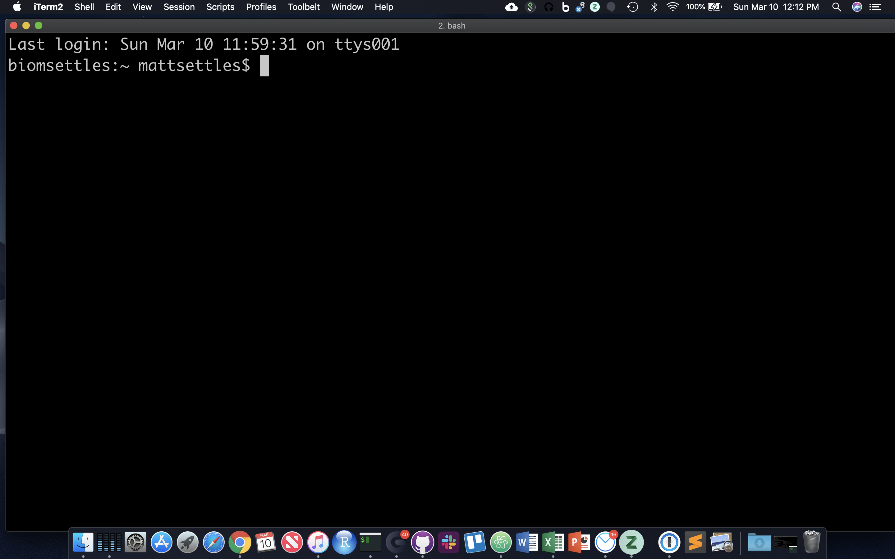
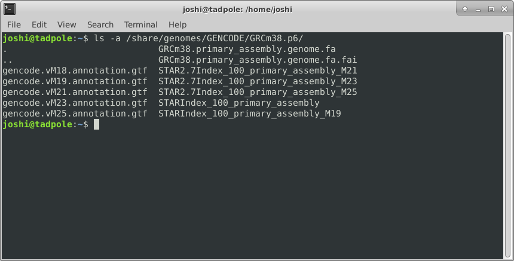
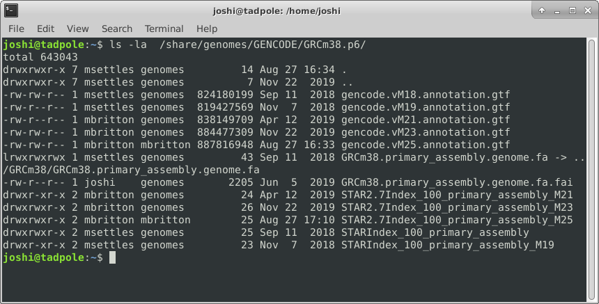
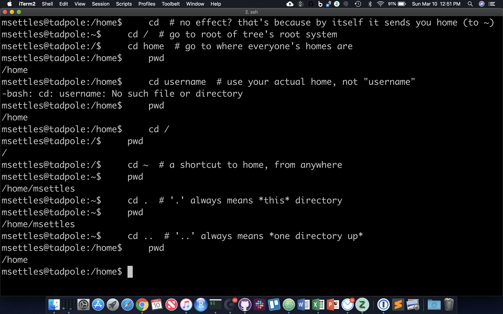
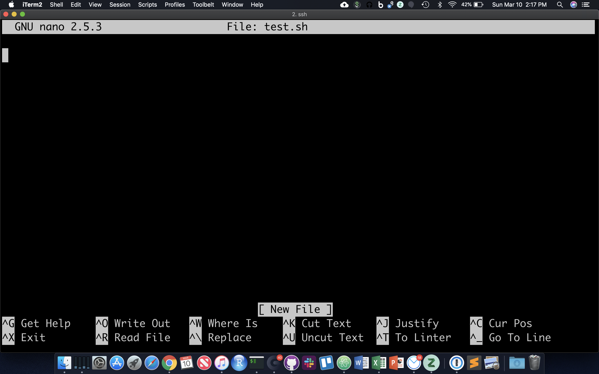

## Command Line Interface

A basic understanding of the command line interface (CLI) is highly recommended for success in this course. We will briefly review the commands necessary for this course on the first morning, but there will not be enough time to provide full instruction in CLI basics. Beginners without any previous knowledge will be able to complete this course, and achieve a more thorough understanding of the techniques and analyses covered, but will probably not be able to conduct an experiment on their own.

If you do not have CLI experience, or it has been a while since you last worked on the command line, please take some time before the workshop to work through the first part of the [Introduction to the Command Line for Bioinformatics](https://ucdavis-bioinformatics-training.github.io/2021-March-Introduction-to-the-Command-Line-for-Bioinformatics/){:target="_blank"} course.

Of course, you are free to continue working through all the materials in Introduction to the Command Line for Bioinformatics! The more confident you are in your command line skills, the more you will be able to explore the content in this course.

# Introduction to Command Line Interface

## Outline:
1. What is the command line?
2. Logging into a remote server with ssh
3. Directory Structure
4. Syntax of a Command
5. Options of a Command
5. Command Line Basics (ls, pwd, Ctrl-C, man, alias, ls -lthra)
6. Getting Around (cd)
7. Absolute and Relative Paths
8. Create and Destroy (echo, cat, rm, rmdir)
9. Symbolic Links (ln -s)
10. Forced Removal (rm -r)
11. Shell Scripts and File Permissions (chmod, nano, ./)

* The CLI is a tool into which one can type commands to perform tasks.
* The user interface that accepts the typed responses and displays the data on the screen is called a shell: bash, tcsh…
* An all-text display (most of the time your mouse doesn't work)

After opening or logging into a terminal, system messages are often displayed, followed by the "prompt".
A prompt is a short text message at the start of the command line and ends with '$' in bash shell, commands are typed after the prompt. The prompt typically follows the form **username@server:current_directory$**.

In the figure above, the user is "mattsettles," the machine is "biomsettles," and the current directory is "~" (short-hand for the home directory). Let's log into tadpole, so that we're all working in the same environment.

### Lets login to the cluster

    ssh username@tadpole.genomecenter.ucdavis.edu

where 'username' is replaced with your username. Press Enter.

If your screen looks like the one below, i.e. your see your a bunch of messages and then your username followed by "@tadpole:~$" at the beginning of the line, then you are successfully logged in.

## Command Line Basics

First some basics - how to look at your surroundings.

    pwd

present working directory ... where am I?

    ls

list files here ... you should see nothing since your homes are empty

    ls /tmp/

list files somewhere else, like /tmp/

Because one of the first things that's good to know is *how to escape once you've started something you don't want*.

    sleep 1000  # wait for 1000 seconds!

Use Ctrl-c (shows as '^C' in the terminal) to exit (kill) a command. In some cases, a different key sequence is required (Ctrl-d). Note that anything including and after a "#" symbol is ignored, i.e. a comment. **So in all the commands below, you do not have to type anything including and past a "#".**

#### Options

Each command can act as a basic tool, or you can add 'options' or 'flags' that modify the default behavior of the tool. These flags come in the form of '-v' ... or, when it's a more descriptive word, two dashes: '\-\-verbose' ... that's a common (but not universal) one that tells a tool that you want it to give you output with more detail. Sometimes, options require specifying amounts or strings, like '-o results.txt' or '\-\-output results.txt' ... or '-n 4' or '\-\-numCPUs 4'. Let's try some, and see what the man page for the 'list files' command 'ls' is like.

    ls -R /

Lists directories and files *recursively*. This will be a very long output, so use Ctrl-C to break out of it. Sometimes you have to press Ctrl-C many times to get the terminal to recognize it. In order to know which options do what, you can use the manual pages. To look up a command in the manual pages type "man" and then the command name. So to look up the options for "ls", type:

    man ls

Navigate this page using the up and down arrow keys, PageUp and PageDown, and then use q to quit out of the manual. In this manual page, find the following options, quit the page, and then try those commands. You could even open another terminal, log in again, and run manual commands in that terminal.

    ls -l /usr/bin/ # long format, gives permission values, owner, group, size, modification time, and name

    ls -a /lib # shows ALL files, including hidden ones

    ls -l -a /usr/bin # does both of the above

    ls -la /usr/bin # option 'smushing' can be done with single letter options

    ls -ltrha /usr/bin # shows all files, long format, in last modified time reverse order, with human readable sizes

And finally adding color (white for regular files, blue for directories, turquoise for links):

    ls -ltrha --color /usr/bin # single letter (smushed) vs word options (Linux)

**OR**

    ls -ltrhaG /usr/bin # (MacOS)

Quick aside: what if I want to use same options repeatedly? and be lazy? You can create a shortcut to another command using 'alias'.

    alias ll='ls -lah'
    ll

## Directory Structure

Absolute path: always starts with ”/” - the root folder

/share/workshop/msettles/mrnaseq_workshop/cli

the folder (or file) "cli" in the folder "msettles" in the folder "mrnaseq_workshop" in the folder "workshop" in the folder "share" from the root folder.

Relative path: always relative to our current location.

_a single dot (.) refers to the current directory_
_two dots (..) refers to the directory one level up_

Usually, /home is where the user accounts reside, ie. users' 'home' directories.
For example, for a user that has a username of “msettles”: their home directory is /home/msettles
It is the directory that a user starts in after starting a new shell or logging into a remote server.

The tilde (~) is a short form of a user’s home directory.

## Syntax of a command

* A command plus the required parameters/arguments
* The separator used in issuing a command is space, number of spaces does not matter

## Quiz 1

<button id="submit1">Submit Quiz</button>

## Getting Around

The filesystem you're working on is like the branching root system of a tree. The top level, right at the root of the tree, is called the 'root' directory, specified by '/' ... which is the divider for directory addresses, or 'paths'. We move around using the 'change directory' command, 'cd'. The command pwd return the present working directory.

    cd  # no effect? that's because by itself it sends you home (to ~)
    cd /  # go to root of tree's root system
    cd home  # go to where everyone's homes are
    pwd
    cd username  # use your actual home, not "username"
    pwd
    cd /
    pwd
    cd ~  # a shortcut to home, from anywhere
    pwd
    cd .  # '.' always means *this* directory
    pwd
    cd ..  # '..' always means *one directory up*
    pwd

**You should also notice the location changes in your prompt.**

## Absolute and Relative Paths

You can think of paths like addresses. You can tell your friend how to go to a particular store *from where they are currently* (a 'relative' path), or *from the main Interstate Highway that everyone uses* (in this case, the root of the filesystem, '/' ... this is an 'absolute' path). Both are valid. But absolute paths can't be confused, because they always start off from the same place, and are unique. Relative paths, on the other hand, could be totally wrong for your friend *if you assume they're somewhere they're not*. With this in mind, let's try a few more:

    cd /usr/bin  # let's start in /usr/bin

**relative** (start here, take one step up, then down through lib and gcc)

    cd ../lib/gcc/
    pwd

**absolute** (start at root, take steps)

    cd /usr/lib/gcc/
    pwd

Now, because it can be a real pain to type out, or remember these long paths, we need to discuss ...

## Quiz 2

<button id="submit2">Submit Quiz</button>

## Create and Destroy

We already learned one command that will create a file, touch.

    cd  # home again
    echo $USER # echo to screen the contents of the variable $USER
    mkdir ~/tmp2
    cd ~/tmp2
    echo 'Hello, world!' > first.txt

echo text then redirect ('>') to a file.

    cat first.txt  # 'cat' means 'concatenate', or just spit the contents of the file to the screen

why 'concatenate'? try this:

    cat first.txt first.txt first.txt > second.txt
    cat second.txt

OK, let's destroy what we just created:

    cd ../
    rmdir tmp2  # 'rmdir' meands 'remove directory', but this shouldn't work!
    rm tmp2/first.txt
    rm tmp2/second.txt  # clear directory first
    rmdir tmp2  # should succeed now

So, 'mkdir' and 'rmdir' are used to create and destroy (empty) directories. 'rm' to remove files. To create a file can be as simple as using 'echo' and the '>' (redirection) character to put text into a file. Even simpler is the 'touch' command.

    mkdir ~/cli
    cd ~/cli
    touch newFile
    ls -ltra  # look at the time listed for the file you just created
    cat newFile  # it's empty!
    sleep 60  # go grab some coffee
    touch newFile
    ls -ltra  # same time?

So 'touch' creates empty files, or updates the 'last modified' time. Note that the options on the 'ls' command you used here give you a Long listing, of All files, in Reverse Time order (l, a, r, t).

## Symbolic Links

Since copying or even moving large files (like sequence data) around your filesystem may be impractical, we can use links to reference 'distant' files without duplicating the data in the files. Symbolic links are disposable pointers that refer to other files, but behave like the referenced files in commands. I.e., they are essentially 'Shortcuts' (to use a Windows term) to a file or directory.

The 'ln' command creates a link. **You should, by default, always create a symbolic link using the -s option.**

    ln -s ~/newFile .
    ls -ltrhaF  # notice the symbolic link pointing at its target

## Forced Removal

When you're on the command line, there's no 'Recycle Bin'. Since we've expanded a whole directory tree, we need to be able to quickly remove a directory without clearing each subdirectory and using 'rmdir'.

    cd
    mkdir -p rmtest/dir1/dir2 # the -p option creates all the directories at once
    rmdir rmtest # gives an error since rmdir can only remove directories that are empty
    rm -rf rmtest # will remove the directory and EVERYTHING in it

Here -r = recursively remove sub-directories, -f means *force*. Obviously, be careful with 'rm -rf', there is no going back, if you delete something with rm, rmdir its gone! **There is no Recycle Bin on the Command-Line!**

## Quiz 3

<button id="submit3">Submit Quiz</button>

## Shell Scripts, File Permissions

Often it's useful to define a whole string of commands to run on some input, so that (1) you can be sure you're running the same commands on all data, and (2) so you don't have to type the same commands in over and over! Let's use the 'nano' text editor program that's pretty reliably installed on most linux systems.

    nano test.sh

nano now occupies the whole screen; see commands at the bottom. Let's type in a few commands. First we need to put the following line at the top of the file:

#!/bin/bash

The "#!" at the beginning of a script tells the shell what language to use to interpret the rest of the script. In our case, we will be writing "bash" commands, so we specify the full path of the bash executable after the "#!". Then, add some commands:

#!/bin/bash

echo "Start script..."
pwd
ls -l
sleep 10
echo "End script."

Hit Cntl-O and then enter to save the file, and then Cntl-X to exit nano.

Though there are ways to run the commands in test.sh right now, it's generally useful to give yourself (and others) 'execute' permissions for test.sh, really making it a shell script. Note the characters in the first (left-most) field of the file listing:

    ls -lh test.sh

-rw-rw-r-- 1 msettles biocore 79 Aug 19 15:05 test.sh

The first '-' becomes a 'd' if the 'file' is actually a directory. The next three characters represent **r**ead, **w**rite, and e**x**ecute permissions for the file owner (you), followed by three characters for users in the owner's group, followed by three characters for all other users. Run the 'chmod' command to change permissions for the 'test.sh' file, adding execute permissions ('+x') for the user (you) and your group ('ug'):

    chmod ug+x test.sh
    ls -lh test.sh

-rwxr-xr-- 1 msettles biocore 79 Aug 19 15:05 test.sh

The first 10 characters of the output represent the file and permissions.
The first character is the file type, the next three sets of three represent the file permissions for the user, group, and everyone respectively.
- r = read
- w = write
- x = execute

So let's run this script. We have to provide a relative reference to the script './' because its not our our "PATH".:

    ./test.sh

And you should see all the commands in the file run in sequential order in the terminal.

# Running jobs on the cluster

In the UC Davis Bioinformatics Core we have a large computational cluster (named lssc0) that we use for our analyses. The job scheduling system we use on this cluster is called [Slurm](https://slurm.schedmd.com/). In this section, we will go through examples of the commands we will be using to interact with the cluster.

For this workshop we will be using a cluster reservation, meaning we've set aside resources for exclusive use by the workshop, so any wait times will be minimal. The reservation is:

|:---      |:---     |:---                 |:---                 |:---         |
|RESV_NAME |  STATE  |         START_TIME  |           END_TIME  | DURATION    |
| workshop | ACTIVE  | 2021-08-09T00:00:00 | 2021-08-01T00:00:00 | 7-00:00:00 |

## First, what is a cluster?

**1\.** The basic architecture of a compute cluster consists of a "head node", which is the computer from which a user submits jobs to run, and "compute nodes", which are a large number of computers on which the jobs can be run. It is also possible to log into a compute node and run jobs directly from there. **In general you should never run a job directly on the head node!**

If you are not logged into tadpole any more, log back in:

    ssh username@tadpole.genomecenter.ucdavis.edu

where 'username' is replaced with your username. Press Enter.

---
**2\.** Now, let's look at a few slurm commands.

The main commands we will be using are srun, sbatch, squeue, scancel, and sacct. First, log into the head node (tadpole.genomecenter.ucdavis.edu) and make a directory for yourself where you will be doing all your work.

    mkdir /share/workshop/mrnaseq_workshop/$USER
    cd /share/workshop/mrnaseq_workshop/$USER

**2a\.** ['srun'](https://slurm.schedmd.com/srun.html) is used to run a job interactively. We most often use it to start an interactive session on a compute node. Take a look at the options to srun:

    srun --help

Our cluster requires that you specify a time limit for your job. If your job exceeds these limits, then it will be killed. So try running the following to create an interactive session on a node:

    srun -t 00:30:00 -c 1 -n 1 --mem 500 --partition production --account workshop --reservation workshop --pty /bin/bash

This command is requesting a compute node with a time limit of 30 minutes (-t), one processor (-c), a max memory of 0.5Gb [500] (--mem), and then finally, specifying a shell to run in a terminal ("--pty" option). Run this command to get to a compute node when you want to run jobs on the command-line directly.

srun: job 29390113 queued and waiting for resources
srun: job 29390113 has been allocated resources
groups: cannot find name for group ID 2020
bash: /home/msettles/.bashrc: Permission denied
msettles@drove-13:~$

You safely ignore the working and error. Notice that we are no longer on tadpole, but are now on drove-13 in this example, one of our compute nodes.

use Exit on the command line to exit the session

    exit

---
**2b\.** ['sbatch'](https://slurm.schedmd.com/sbatch.html) is used to submit jobs to run on the cluster. Typically it is used to run many jobs via the scheduler non-interactively. Look at the options for sbatch:

    sbatch --help

Generally, we do not use any options for sbatch ... we typically give it a script (i.e. a text file with commands inside) to run. Let's take a look at a template script [template.slurm](../software_scripts/scripts/template.slurm):

<pre class="prettyprint"><code class="language-sh" style="background-color:333333">#!/bin/bash
# options for sbatch
#SBATCH --job-name=name # Job name
#SBATCH --nodes=1 # should never be anything other than 1
#SBATCH --ntasks=1 # number of cpus to use
#SBATCH --time=30 # Acceptable time formats include "minutes", "minutes:seconds", "hours:minutes:seconds", "days-hours", "days-hours:minutes" and "days-hours:minutes:seconds".
#SBATCH --mem=500 # Memory pool for all cores (see also --mem-per-cpu)
#SBATCH --partition=production # cluster partition
#SBATCH --account=workshop # cluster account to use for the job
#SBATCH --reservation=workshop # cluster account reservation
##SBATCH --array=1-16 # Task array indexing, see https://slurm.schedmd.com/job_array.html, the double # means this line is commented out
#SBATCH --output=stdout.out # File to which STDOUT will be written
#SBATCH --error=stderr.err # File to which STDERR will be written
#SBATCH --mail-type=ALL
#SBATCH --mail-user=myemail@email.com

# for calculating the amount of time the job takes and echo the hostname
begin=`date +%s`
echo $HOSTNAME

# Sleep for 5 minutes
sleep 300

# getting end time to calculate time elapsed
end=`date +%s`
elapsed=`expr $end - $begin`
echo Time taken: $elapsed
</code></pre>

The first line tells sbatch what scripting language (bash here) the rest of the file is in. Any line that begins with a "#" symbol is ignored by the bash interpreter, those lines that begin with "#SBATCH" are used by the slurm controller. Those lines are for specifying sbatch options without having to type them on the command-line every time. In this script, on the next set of lines, we've put some code for calculating the time elapsed for the job and then we simply wait for 5 minutes (300 seconds) and exit. Lets try running it

    cd /share/workshop/mrnaseq_workshop/$USER
    wget https://raw.githubusercontent.com/ucdavis-bioinformatics-training/2021-August-Single-Cell-RNA-Seq-Analysis/master/software_scripts/scripts/template.slurm template.slurm
    cat template.slurm
    sbatch template.slurm

The non slurm version is the [template.sh](../software_scripts/scripts/template.sh) script. You'll notice it looks the same only missing the #SBATCH commands.

After finishing you will see two new files in the directory stdout.out and stderr.err where stdout and stderr (respectively) were redirected to.

---
**2c\.** ['squeue'](https://slurm.schedmd.com/squeue.html) is to list your currently queued/running jobs. T

    squeue --help

Looking at the help documentation, we see that we can filter the results based on a number of criteria. The most useful option is "-u", which you can use to see just the jobs for a particular user ID. The first column gives you the job ID of the job, the second is the partition (different queues for different types of machines), the name of the job, the user who ran the job, the state of the job (R is for running), the length of time the job has been running, the number of nodes the job is using, and finally, the node name where the job is running or a reason why the job is waiting.

    squeue -u $USER

msettles@tadpole:/share/workshop/intro_scrnaseq/msettles$ squeue -u $USER
             JOBID PARTITION     NAME     USER ST       TIME  NODES NODELIST(REASON)
          29390121 productio     name msettles  R       0:06      1 drove-13

You can see the job has been running (ST=R) for 6 seconds (TIME=0:06) on node drove-12. The jobid (here 29390121) can be used to cancel the job later, or get additional job information.

**2d\.** 'scancel' command is used to cancel jobs (either running or in queue).

You can give it a job ID, or if you use the "-u" option with your username, you can cancel all of your jobs at once.

    scancel 29390121

will cancel the above job if its still running.

**2e\.** 'sacct' command is used to get accounting data for any job that has ever run, using the job ID.

To get statistics on completed jobs by jobID (replace jobid with your jobid):

    sacct -j jobid --format=JobID,JobName,MaxRSS,Elapsed

To view the same information for all jobs of a user (replace username with your username):

    sacct -u username --format=JobID,JobName,MaxRSS,Elapsed

**You can get more information about each command by typing "<command> --help" or by looking at [this summary page](https://slurm.schedmd.com/pdfs/summary.pdf).**
