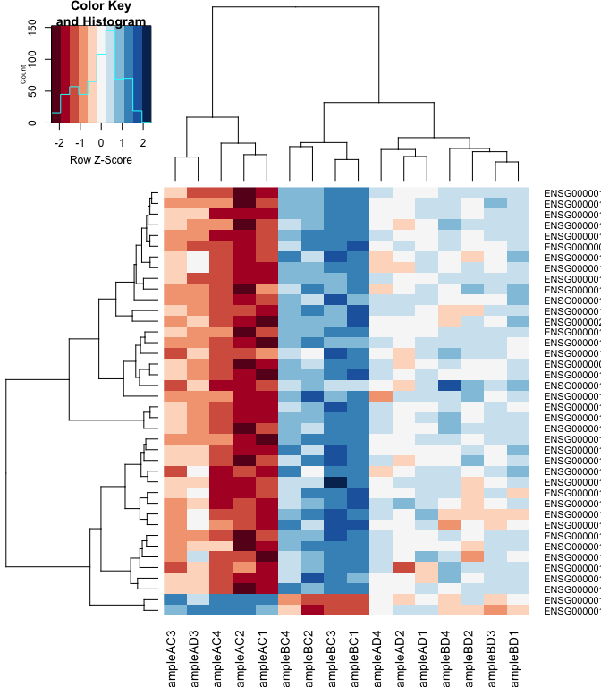

# Differential Gene Expression Analysis in R

* Differential Gene Expression (DGE) between conditions is determined from count data
* Generally speaking differential expression analysis is performed in a very similar manner to DNA microarrays, once normalization and transformations have been performed.

A lot of RNA-seq analysis has been done in R and so there are many packages available to analyze and view this data. Two of the most commonly used are:
* DESeq2, developed by Simon Anders (also created htseq) in Wolfgang Huber’s group at EMBL
* edgeR and Voom (extension to Limma [microarrays] for RNA-seq), developed out of Gordon Smyth’s group from the Walter and Eliza Hall Institute of Medical Research in Australia

xhttp://bioconductor.org/packages/release/BiocViews.html#___RNASeq

## Differential Expression Analysis with Limma-Voom

**limma** is an R package that was originally developed for differential expression (DE) analysis of gene expression microarray data.

**voom** is a function in the limma package that transforms RNA-Seq data for use with limma.

Together they allow fast, flexible, and powerful analyses of RNA-Seq data.  Limma-voom is _our_ tool of choice for DE analyses because it:

* Allows for incredibly flexible model specification (you can include multiple categorical and continuous variables, allowing incorporation of almost any kind of metadata).

* Based on simulation studies, maintains the false discovery rate at or below the nominal rate, unlike some other packages.

* Empirical Bayes smoothing of gene-wise standard deviations provides increased power.  

### Basic Steps of Differential Gene Expression
1. Read count data and annotation into R and preprocessing.
2. Calculate normalization factors (sample-specific adjustments)
3. Filter genes (uninteresting genes, e.g. unexpressed)
4. Account for expression-dependent variability by transformation, weighting, or modeling
5. Fitting a linear model
6. Perform statistical comparisons of interest (using contrasts)
7. Adjust for multiple testing, Benjamini-Hochberg (BH) or q-value
8. Check results for confidence
9. Attach annotation if available and write tables


## 1. Read in the counts table and create our DGEList (EdgeR)

```r
counts <- read.delim("rnaseq_workshop_counts.txt", row.names = 1)
dim(counts) # number of genes
```

```
## [1] 60728    16
```

```r
head(counts)
```

```
##                   SampleAC1 SampleAC2 SampleAC3 SampleAC4 SampleAD1 SampleAD2
## ENSG00000223972.5         3         2         1         1         0         0
## ENSG00000227232.5        21         7        15        10         7         9
## ENSG00000278267.1         1         2         1         1         0         1
## ENSG00000243485.5         0         0         0         0         0         0
## ENSG00000284332.1         0         0         0         0         0         0
## ENSG00000237613.2         0         0         0         0         0         0
##                   SampleAD3 SampleAD4 SampleBC1 SampleBC2 SampleBC3 SampleBC4
## ENSG00000223972.5         0         0         2         0         0         0
## ENSG00000227232.5        15        26         6        10         6         6
## ENSG00000278267.1         2         4         0         0         0         0
## ENSG00000243485.5         0         0         1         0         0         0
## ENSG00000284332.1         0         0         0         0         0         0
## ENSG00000237613.2         0         0         0         0         0         0
##                   SampleBD1 SampleBD2 SampleBD3 SampleBD4
## ENSG00000223972.5         0         5         0         0
## ENSG00000227232.5        14        10         4         4
## ENSG00000278267.1         0         0         1         0
## ENSG00000243485.5         0         0         0         0
## ENSG00000284332.1         0         0         0         0
## ENSG00000237613.2         0         0         0         0
```

Create Differential Gene Expression List Object (DGEList) object


```r
d0 <- DGEList(counts)
```
  
**1a\.** Read in Annotation

```r
anno <- read.delim("ensembl_hg_100.tsv",as.is=T)
dim(anno)
```

```
## [1] 67149    10
```

```r
head(anno)
```

```
##   Gene.stable.ID.version Gene.name
## 1      ENSG00000210049.1     MT-TF
## 2      ENSG00000211459.2   MT-RNR1
## 3      ENSG00000210077.1     MT-TV
## 4      ENSG00000210082.2   MT-RNR2
## 5      ENSG00000209082.1    MT-TL1
## 6      ENSG00000198888.2    MT-ND1
##                                                                                           Gene.description
## 1                              mitochondrially encoded tRNA-Phe (UUU/C) [Source:HGNC Symbol;Acc:HGNC:7481]
## 2                                      mitochondrially encoded 12S rRNA [Source:HGNC Symbol;Acc:HGNC:7470]
## 3                                mitochondrially encoded tRNA-Val (GUN) [Source:HGNC Symbol;Acc:HGNC:7500]
## 4                                      mitochondrially encoded 16S rRNA [Source:HGNC Symbol;Acc:HGNC:7471]
## 5                            mitochondrially encoded tRNA-Leu (UUA/G) 1 [Source:HGNC Symbol;Acc:HGNC:7490]
## 6 mitochondrially encoded NADH:ubiquinone oxidoreductase core subunit 1 [Source:HGNC Symbol;Acc:HGNC:7455]
##        Gene.type Transcript.count Gene...GC.content Chromosome.scaffold.name
## 1        Mt_tRNA                1             40.85                       MT
## 2        Mt_rRNA                1             45.49                       MT
## 3        Mt_tRNA                1             42.03                       MT
## 4        Mt_rRNA                1             42.81                       MT
## 5        Mt_tRNA                1             38.67                       MT
## 6 protein_coding                1             47.70                       MT
##   Gene.start..bp. Gene.end..bp. Strand
## 1             577           647      1
## 2             648          1601      1
## 3            1602          1670      1
## 4            1671          3229      1
## 5            3230          3304      1
## 6            3307          4262      1
```

```r
tail(anno)
```

```
##       Gene.stable.ID.version  Gene.name
## 67144      ENSG00000288396.1 AC213033.2
## 67145      ENSG00000285065.1 AP002364.2
## 67146      ENSG00000284997.1     TUBAP2
## 67147      ENSG00000284805.1  RNU6-823P
## 67148      ENSG00000284869.2     EEFSEC
## 67149      ENSG00000285949.1 AC084784.1
##                                                                                     Gene.description
## 67144                                                                                               
## 67145                                                                               novel transcript
## 67146                                 tubulin alpha pseudogene 2 [Source:HGNC Symbol;Acc:HGNC:14531]
## 67147                      RNA, U6 small nuclear 823, pseudogene [Source:HGNC Symbol;Acc:HGNC:47786]
## 67148 eukaryotic elongation factor, selenocysteine-tRNA specific [Source:HGNC Symbol;Acc:HGNC:24614]
## 67149                                                          Novel transcript, antisense to EEFSEC
##                  Gene.type Transcript.count Gene...GC.content
## 67144       protein_coding                2             53.06
## 67145                  TEC                1             34.97
## 67146 processed_pseudogene                1             51.27
## 67147                snRNA                1             37.86
## 67148       protein_coding                4             47.88
## 67149               lncRNA                1             42.92
##       Chromosome.scaffold.name Gene.start..bp. Gene.end..bp. Strand
## 67144        CHR_HSCHR3_5_CTG1        75425608      75426048     -1
## 67145       CHR_HSCHR11_2_CTG8        90223153      90226538      1
## 67146       CHR_HSCHR11_2_CTG8        90313371      90314983      1
## 67147      CHR_HSCHR3_9_CTG2_1       128148917     128149019     -1
## 67148      CHR_HSCHR3_9_CTG2_1       128160388     128415576      1
## 67149      CHR_HSCHR3_9_CTG2_1       128188319     128201362     -1
```

```r
any(duplicated(anno$Gene.stable.ID))
```

```
## [1] FALSE
```

**1b\.** Derive experiment metadata from the sample names

Our experiment has two factors, factor1 ("A" or "B") and factor2 ("C" or "D")

The sample names are "Sample" followed by the factor1, followed by the factor2, followed by the replicate

```r
snames <- colnames(counts) # Sample names
snames
```

```
##  [1] "SampleAC1" "SampleAC2" "SampleAC3" "SampleAC4" "SampleAD1" "SampleAD2"
##  [7] "SampleAD3" "SampleAD4" "SampleBC1" "SampleBC2" "SampleBC3" "SampleBC4"
## [13] "SampleBD1" "SampleBD2" "SampleBD3" "SampleBD4"
```

```r
factor1 <- substr(snames, 7, 7)
factor2 <- substr(snames, 8, 8)
factor1
```

```
##  [1] "A" "A" "A" "A" "A" "A" "A" "A" "B" "B" "B" "B" "B" "B" "B" "B"
```

```r
factor2
```

```
##  [1] "C" "C" "C" "C" "D" "D" "D" "D" "C" "C" "C" "C" "D" "D" "D" "D"
```

Create a new variable "group" that combines factor1 and factor2

```r
group <- interaction(factor1, factor2)
group
```

```
##  [1] A.C A.C A.C A.C A.D A.D A.D A.D B.C B.C B.C B.C B.D B.D B.D B.D
## Levels: A.C B.C A.D B.D
```

Note: you can also enter group information manually, or read it in from an external file.  If you do this, it is $VERY, VERY, VERY$ important that you make sure the metadata is in the same order as the column names of the counts table.

## 2. Preprocessing and Normalization factors

In differential expression analysis, only sample-specific effects need to be normalized, we are NOT concerned with comparisons and quantification of absolute expression.

* Sequence depth – is a sample specific effect and needs to be adjusted for.
* RNA composition - finding a set of scaling factors for the library sizes that minimize the log-fold changes between the samples for most genes (edgeR uses a trimmed mean of M-values between each pair of sample)
* GC content – is NOT sample-specific (except when it is)
* Gene Length – is NOT sample-specific (except when it is)

In edgeR/limma, you calculate normalization factors to scale the raw library sizes (number of reads) using the function calcNormFactors, which by default uses TMM (weighted trimmed means of M values to the reference). Assumes most genes are not DE.

Proposed by Robinson and Oshlack (2010).


```r
d0 <- calcNormFactors(d0)
d0$samples
```

```
##           group lib.size norm.factors
## SampleAC1     1  2079006    1.2306391
## SampleAC2     1  1048521    1.0922755
## SampleAC3     1  1607414    1.1322638
## SampleAC4     1  1266313    1.1107407
## SampleAD1     1  2277613    1.0615143
## SampleAD2     1  1321827    1.0730637
## SampleAD3     1  2315139    1.2387708
## SampleAD4     1  1675188    1.0605714
## SampleBC1     1  1225180    0.8161279
## SampleBC2     1  1783215    0.9711849
## SampleBC3     1  1301724    0.8263576
## SampleBC4     1  1156421    0.9414606
## SampleBD1     1  1213532    0.8885263
## SampleBD2     1  1408011    0.9269926
## SampleBD3     1  1492511    0.9724509
## SampleBD4     1  1109840    0.8002949
```

**Note:** calcNormFactors doesn't _normalize_ the data, it just calculates normalization factors for use downstream.

## 3. FilteHScoreg out genes

We filter genes based on non-experimental factors to reduce the number of genes/tests being conducted and therefor do not have to be accounted for in our transformation or multiple testing correction. Commonly we try to remove genes that are either a) unexpressed, or b) unchanging (low-variability).

Common filters include:
1. to remove genes with a max value (X) of less then Y.
2. to remove genes that are less than X normalized read counts (cpm) across a certain number of samples. Ex: rowSums(cpms <=1) < 3 , require at least 1 cpm in at least 3 samples to keep.
3. A less used filter is for genes with minimum variance across all samples, so if a gene isn't changing (constant expression) its inherently not interesting therefor no need to test.

Here we will filter low-expressed genes, remove any row (gene) whose max value (for the row) is less tha cutoff (3).

```r
cutoff <- 3
drop <- which(apply(cpm(d0), 1, max) < cutoff)
d <- d0[-drop,]
dim(d) # number of genes left
```

```
## [1] 14615    16
```

"Low-expressed" is subjective and depends on the dataset.

Visualizaing your data with a Multidimensional scaling (MDS) plot

```r
plotMDS(d, col = as.numeric(group), cex=1)
```

<!-- -->

The MDS plot tells you **A LOT** about what to expect from your experiment.

**3a\.** Extracting "normalized" expression table

### RPKM vs. FPKM vs. CPM and Model Based
* RPKM - Reads per kilobase per million mapped reads
* FPKM - Fragments per kilobase per million mapped reads
* logCPM – log Counts per million [ good for producing MDS plots, estimate of normalized values in model based ]
* Model based - original read counts are not themselves transformed, but rather correction factors are used in the DE model itself.

We use the `cpm` function with log=TRUE to obtain log-transformed normalized expression data.  On the log scale, the data has less mean-dependent variability and is more suitable for plotting.

```r
logcpm <- cpm(d, prior.count=2, log=TRUE)
write.table(logcpm,"rnaseq_workshop_normalized_counts.txt",sep="\t",quote=F)
```


## 4. Voom transformation and calculation of variance weights

Specify the model to be fitted.  We do this before using voom since voom uses variances of the model residuals (observed - fitted)

```r
mm <- model.matrix(~0 + group)
mm
```

```
##    groupA.C groupB.C groupA.D groupB.D
## 1         1        0        0        0
## 2         1        0        0        0
## 3         1        0        0        0
## 4         1        0        0        0
## 5         0        0        1        0
## 6         0        0        1        0
## 7         0        0        1        0
## 8         0        0        1        0
## 9         0        1        0        0
## 10        0        1        0        0
## 11        0        1        0        0
## 12        0        1        0        0
## 13        0        0        0        1
## 14        0        0        0        1
## 15        0        0        0        1
## 16        0        0        0        1
## attr(,"assign")
## [1] 1 1 1 1
## attr(,"contrasts")
## attr(,"contrasts")$group
## [1] "contr.treatment"
```

The above specifies a model where each coefficient corresponds to a group mean.

**4a\.** **Voom**

```r
y <- voom(d, mm, plot = T)
```

<!-- -->

What is voom doing?

1. Counts are transformed to log2 counts per million reads (CPM), where "per million reads" is defined based on the normalization factors we calculated earlier.
2. A linear model is fitted to the log2 CPM for each gene, and the residuals are calculated.
3. A smoothed curve is fitted to the sqrt(residual standard deviation) by average expression.
(see red line in plot above)
4. The smoothed curve is used to obtain weights for each gene and sample that are passed into limma along with the log2 CPMs.

More details at "[voom: precision weights unlock linear model analysis tools for RNA-seq read counts](https://genomebiology.biomedcentral.com/articles/10.1186/gb-2014-15-2-r29)"

The above plot is a "good" voom plot.  If your voom plot looks like the below (performed on the raw data), you might want to filter more:

```r
tmp <- voom(d0, mm, plot = T)
```

<!-- -->


## 5. Fitting linear models in limma

lmFit fits a linear model using weighted least squares for each gene:

```r
fit <- lmFit(y, mm)
head(coef(fit))
```

```
##                     groupA.C  groupB.C  groupA.D    groupB.D
## ENSG00000223972.5 0.31700583 -0.760550 -2.043184 -0.32760470
## ENSG00000227232.5 2.97570416  2.615278  2.582719  2.63922278
## ENSG00000238009.6 0.04047712  1.996816  1.419811 -0.07446052
## ENSG00000268903.1 5.02243086  6.656956  5.859838  6.22132489
## ENSG00000269981.1 4.78704868  6.340286  5.535149  6.18894756
## ENSG00000241860.7 1.70096764  3.167428  2.950149  2.73190824
```

Comparisons between groups (log fold-changes) are obtained as _contrasts_ of these fitted linear models:

## 6. Specify which groups to compare using contrasts:

Comparison between factor2s C and D for factor1 A

```r
contr <- makeContrasts(groupA.C - groupA.D, levels = colnames(coef(fit)))
contr
```

```
##           Contrasts
## Levels     groupA.C - groupA.D
##   groupA.C                   1
##   groupB.C                   0
##   groupA.D                  -1
##   groupB.D                   0
```

**6a\.** Estimate contrast for each gene

```r
tmp <- contrasts.fit(fit, contr)
```

The variance characteristics of low expressed genes are different from high expressed genes, if treated the same, the effect is to over represent low expressed genes in the DE list.

Empirical Bayes smoothing of standard errors (shHScoreks standard errors that are much larger or smaller than those from other genes towards the average standard error) (see "[Linear Models and Empirical Bayes Methods for Assessing Differential Expression in Microarray Experiments](https://www.degruyter.com/doi/10.2202/1544-6115.1027)"

**6b\.** Apply EBayes

```r
tmp <- eBayes(tmp)
```

## 7. Multiple Testing Adjustment

The TopTable. Ajust by Benjamini & Hochberg (BH), or its 'alias' fdr. "[Controlling the false discovery rate: a practical and powerful approach to multiple testing](http://www.jstor.org/stable/2346101).

here `n=Inf` says to produce the topTable for **all** genes. 

```r
top.table <- topTable(tmp, adjust.method = "BH", sort.by = "P", n = Inf)
```

### Multiple Testing Correction

\Simply a must! Best choices are:
  * [FDR](http://www.jstor.org/stable/2346101) (false discovery rate), such as Benjamini-Hochberg (1995).
  * [Qvalue](https://rss.onlinelibrary.wiley.com/doi/abs/10.1111/1467-9868.00346) - Storey (2002)

The FDR (or qvalue) is a statement about the list and is no longer about the gene (pvalue). So a FDR of 0.05, says you expect 5% false positives among the list of genes with an FDR of 0.05 or less.

The statement “Statistically significantly different” means FDR of 0.05 or less.

**Matt's opinion** is these genes do not require further validation (e.g. with qrtPCR)
You can dip below the FDR of 0.05 in the list, but in my opinion you then need to validate those genes (e.g. with qrtPCR)

**7a\.** How many DE genes are there (false discovery rate corrected)?

```r
length(which(top.table$adj.P.Val < 0.05))
```

```
## [1] 10
```

## 8. Check your results for confidence.

You've conducted an experiment, you've seen a phenotype. Now check which genes are most deferentially expressed (show the top 50)? Look up these top genes, their description and ensure they relate to your experiment/phenotype. 

```r
head(top.table, 50)
```

```
##                         logFC    AveExpr         t      P.Value   adj.P.Val
## ENSG00000129824.16 -6.0098543  3.8209812 -7.150922 7.217812e-07 0.006597857
## ENSG00000067048.17 -6.3930713  2.9080277 -6.832520 1.378780e-06 0.006597857
## ENSG00000012817.15 -6.3819578  2.9354681 -6.702302 1.803661e-06 0.006597857
## ENSG00000198692.10 -5.1775364  1.8851297 -6.701737 1.805777e-06 0.006597857
## ENSG00000099725.14 -5.8223045  2.9696462 -6.449899 3.055379e-06 0.008930872
## ENSG00000183878.15 -5.0555663  2.4355880 -6.351564 3.760366e-06 0.009159625
## ENSG00000111052.7  -1.6760022  5.5530746 -6.093441 6.523467e-06 0.013620067
## ENSG00000114374.13 -5.3287209  2.1033788 -5.798226 1.237454e-05 0.022606735
## ENSG00000131002.12 -5.3844685  2.3958321 -5.731822 1.431195e-05 0.023241021
## ENSG00000173597.9  -1.3619215  6.5218868 -5.464766 2.581958e-05 0.037735309
## ENSG00000131724.11 -1.1456030  7.2920519 -5.260891 4.072086e-05 0.050385269
## ENSG00000156052.11 -0.9746043  6.9723068 -5.232627 4.339024e-05 0.050385269
## ENSG00000231535.7  -3.0981321 -0.2225216 -5.218233 4.481755e-05 0.050385269
## ENSG00000156273.16 -1.1615800  7.5339308 -5.096521 5.897118e-05 0.057224654
## ENSG00000165178.9  -1.1640169  7.4350862 -5.079670 6.126157e-05 0.057224654
## ENSG00000112303.14 -1.4615524  9.7293715 -5.069781 6.264759e-05 0.057224654
## ENSG00000100504.17 -1.2185609  8.5747432 -5.011186 7.154077e-05 0.058423170
## ENSG00000257335.8  -1.6922645  7.8677108 -5.008643 7.195464e-05 0.058423170
## ENSG00000007237.18 -1.2738520  7.5154427 -4.976109 7.746858e-05 0.059589647
## ENSG00000135842.17 -1.3302659  9.0424534 -4.941254 8.385353e-05 0.061275964
## ENSG00000116741.8  -1.3123731  8.6875725 -4.881498 9.607050e-05 0.063881751
## ENSG00000067646.12 -4.1663192  1.0884175 -4.826484 1.089121e-04 0.063881751
## ENSG00000168461.13 -1.1065102  7.6965232 -4.825437 1.091727e-04 0.063881751
## ENSG00000153317.15 -0.9097829  7.2123564 -4.822003 1.100319e-04 0.063881751
## ENSG00000177575.12 -1.5597132  5.6642437 -4.818844 1.108281e-04 0.063881751
## ENSG00000176597.12 -1.7834072  3.7007381 -4.807852 1.136453e-04 0.063881751
## ENSG00000151948.12 -1.2403504  7.4468804 -4.768212 1.244211e-04 0.067348665
## ENSG00000215580.11 -4.0710643  0.2309995 -4.733247 1.347828e-04 0.069629454
## ENSG00000101916.12 -1.2166195  7.4608794 -4.722428 1.381631e-04 0.069629454
## ENSG00000111261.14 -1.4847520  5.6528380 -4.668011 1.565117e-04 0.076247262
## ENSG00000181045.15  1.0469728  4.2802798  4.635868 1.684896e-04 0.079434680
## ENSG00000100485.12 -0.7422960  6.5263735 -4.619916 1.747738e-04 0.079822459
## ENSG00000105610.6   2.2785210  4.7786641  4.576840 1.929538e-04 0.085455155
## ENSG00000080573.7   2.7883252  1.9071772  4.560683 2.002556e-04 0.085530642
## ENSG00000181274.7  -1.2309322  8.4257837 -4.550864 2.048288e-04 0.085530642
## ENSG00000136040.9  -1.0791182  8.6372445 -4.523924 2.179252e-04 0.086298192
## ENSG00000241399.7  -1.0810065  7.0571807 -4.522826 2.184764e-04 0.086298192
## ENSG00000104974.12 -1.0641617  7.2851286 -4.503644 2.283390e-04 0.087476208
## ENSG00000155744.9  -0.9502308  7.2052752 -4.489699 2.357894e-04 0.087476208
## ENSG00000115828.17 -1.1627057  6.9810916 -4.466874 2.485177e-04 0.087476208
## ENSG00000135083.15 -2.4023041  5.5416240 -4.400846 2.893773e-04 0.087476208
## ENSG00000068305.17 -1.0222001  5.9965399 -4.397330 2.917340e-04 0.087476208
## ENSG00000109466.14 -1.3216753  5.5256195 -4.389902 2.967763e-04 0.087476208
## ENSG00000103569.10 -1.2935396  9.7147483 -4.378738 3.045204e-04 0.087476208
## ENSG00000215114.10 -0.7982809  6.8602611 -4.373873 3.079582e-04 0.087476208
## ENSG00000133961.20 -0.9592730  8.1243097 -4.371886 3.093734e-04 0.087476208
## ENSG00000135049.15 -0.8519533  6.6977927 -4.364468 3.147152e-04 0.087476208
## ENSG00000173281.5  -1.1132800  7.1606305 -4.356098 3.208544e-04 0.087476208
## ENSG00000140563.15 -1.0182427  6.6347866 -4.353394 3.228635e-04 0.087476208
## ENSG00000137177.20 -1.0056262  5.9769034 -4.343567 3.302724e-04 0.087476208
##                              B
## ENSG00000129824.16  4.77975173
## ENSG00000067048.17  3.09617028
## ENSG00000012817.15  3.07720987
## ENSG00000198692.10  2.29101809
## ENSG00000099725.14  3.15792500
## ENSG00000183878.15  2.61687467
## ENSG00000111052.7   3.94774539
## ENSG00000114374.13  1.70966648
## ENSG00000131002.12  1.92067069
## ENSG00000173597.9   2.71897792
## ENSG00000131724.11  2.29288319
## ENSG00000156052.11  2.23325723
## ENSG00000231535.7  -0.24884841
## ENSG00000156273.16  1.94523546
## ENSG00000165178.9   1.90934792
## ENSG00000112303.14  1.89168926
## ENSG00000100504.17  1.76499116
## ENSG00000257335.8   1.75898914
## ENSG00000007237.18  1.68888838
## ENSG00000135842.17  1.61806208
## ENSG00000116741.8   1.48953265
## ENSG00000067646.12  0.03362666
## ENSG00000168461.13  1.36605857
## ENSG00000153317.15  1.35818524
## ENSG00000177575.12  1.36315432
## ENSG00000176597.12  1.17257550
## ENSG00000151948.12  1.24323629
## ENSG00000215580.11 -0.61579908
## ENSG00000101916.12  1.14460580
## ENSG00000111261.14  1.04538556
## ENSG00000181045.15  0.97773738
## ENSG00000100485.12  0.92402767
## ENSG00000105610.6   0.79957179
## ENSG00000080573.7   0.57484945
## ENSG00000181274.7   0.77754745
## ENSG00000136040.9   0.72040050
## ENSG00000241399.7   0.71313621
## ENSG00000104974.12  0.67144297
## ENSG00000155744.9   0.64091685
## ENSG00000115828.17  0.59525103
## ENSG00000135083.15  0.48384797
## ENSG00000068305.17  0.44815283
## ENSG00000109466.14  0.45379155
## ENSG00000103569.10  0.41500778
## ENSG00000215114.10  0.39012699
## ENSG00000133961.20  0.38851271
## ENSG00000135049.15  0.37003958
## ENSG00000173281.5   0.35219233
## ENSG00000140563.15  0.35004093
## ENSG00000137177.20  0.34307254
```
Columns are
* logFC: log2 fold change of A.C/A.D
* AveExpr: Average expression across all samples, in log2 CPM
* t: logFC divided by its standard error
* P.Value: Raw p-value (based on t) from test that logFC differs from 0
* adj.P.Val: Benjamini-Hochberg false discovery rate adjusted p-value
* B: log-odds that gene is DE (arguably less useful than the other columns)

ENSG00000129824.16 has higher expression at factor2 D than at factor2 C (logFC is netative).  ENSG00000181045.15 has higher expression at factor2 C than at factor2 D (logFC is positive).


## 9. Write top.table to a file, adding in cpms and annotation

```r
top.table$Gene <- rownames(top.table)
top.table <- top.table[,c("Gene", names(top.table)[1:6])]

top.table <- data.frame(top.table,anno[match(top.table$Gene,anno$Gene.stable.ID.version),],logcpm[match(top.table$Gene,rownames(logcpm)),])

head(top.table)
```

```
##                                  Gene     logFC  AveExpr         t      P.Value
## ENSG00000129824.16 ENSG00000129824.16 -6.009854 3.820981 -7.150922 7.217812e-07
## ENSG00000067048.17 ENSG00000067048.17 -6.393071 2.908028 -6.832520 1.378780e-06
## ENSG00000012817.15 ENSG00000012817.15 -6.381958 2.935468 -6.702302 1.803661e-06
## ENSG00000198692.10 ENSG00000198692.10 -5.177536 1.885130 -6.701737 1.805777e-06
## ENSG00000099725.14 ENSG00000099725.14 -5.822304 2.969646 -6.449899 3.055379e-06
## ENSG00000183878.15 ENSG00000183878.15 -5.055566 2.435588 -6.351564 3.760366e-06
##                      adj.P.Val        B Gene.stable.ID.version Gene.name
## ENSG00000129824.16 0.006597857 4.779752     ENSG00000129824.16    RPS4Y1
## ENSG00000067048.17 0.006597857 3.096170     ENSG00000067048.17     DDX3Y
## ENSG00000012817.15 0.006597857 3.077210     ENSG00000012817.15     KDM5D
## ENSG00000198692.10 0.006597857 2.291018     ENSG00000198692.10    EIF1AY
## ENSG00000099725.14 0.008930872 3.157925     ENSG00000099725.14      PRKY
## ENSG00000183878.15 0.009159625 2.616875     ENSG00000183878.15       UTY
##                                                                                                              Gene.description
## ENSG00000129824.16                                        ribosomal protein S4 Y-linked 1 [Source:HGNC Symbol;Acc:HGNC:10425]
## ENSG00000067048.17                                            DEAD-box helicase 3 Y-linked [Source:HGNC Symbol;Acc:HGNC:2699]
## ENSG00000012817.15                                                  lysine demethylase 5D [Source:HGNC Symbol;Acc:HGNC:11115]
## ENSG00000198692.10                    eukaryotic translation initiation factor 1A Y-linked [Source:HGNC Symbol;Acc:HGNC:3252]
## ENSG00000099725.14                                    protein kinase Y-linked (pseudogene) [Source:HGNC Symbol;Acc:HGNC:9444]
## ENSG00000183878.15 ubiquitously transcribed tetratricopeptide repeat containing, Y-linked [Source:HGNC Symbol;Acc:HGNC:12638]
##                         Gene.type Transcript.count Gene...GC.content
## ENSG00000129824.16 protein_coding                4             40.56
## ENSG00000067048.17 protein_coding                9             37.70
## ENSG00000012817.15 protein_coding               10             38.66
## ENSG00000198692.10 protein_coding                5             35.59
## ENSG00000099725.14 protein_coding                4             44.30
## ENSG00000183878.15 protein_coding               16             37.47
##                    Chromosome.scaffold.name Gene.start..bp. Gene.end..bp.
## ENSG00000129824.16                        Y         2841602       2932000
## ENSG00000067048.17                        Y        12904108      12920478
## ENSG00000012817.15                        Y        19703865      19744939
## ENSG00000198692.10                        Y        20575776      20593154
## ENSG00000099725.14                        Y         7273972       7381548
## ENSG00000183878.15                        Y        13248379      13480673
##                    Strand SampleAC1 SampleAC2 SampleAC3 SampleAC4 SampleAD1
## ENSG00000129824.16      1 0.7392444 1.1054103 0.8701819  7.551131  7.190246
## ENSG00000067048.17      1 0.3543949 0.3543949 0.3543949  6.104748  6.341729
## ENSG00000012817.15     -1 0.3543949 0.3543949 0.3543949  6.744316  6.289286
## ENSG00000198692.10      1 0.3543949 0.3543949 0.3543949  3.294248  4.561540
## ENSG00000099725.14      1 0.3543949 1.5968169 0.3543949  6.516809  6.084702
## ENSG00000183878.15     -1 0.3543949 1.1054103 0.3543949  5.145862  5.120228
##                    SampleAD2 SampleAD3 SampleAD4 SampleBC1 SampleBC2 SampleBC3
## ENSG00000129824.16  7.511496  7.418587  7.352090  6.558990  6.902676  6.455071
## ENSG00000067048.17  5.849992  6.958420  6.068936  5.913703  6.068339  5.990136
## ENSG00000012817.15  6.136888  6.909046  6.392625  6.431062  6.359618  6.052086
## ENSG00000198692.10  4.531939  4.538879  4.351591  5.295797  5.256763  5.193951
## ENSG00000099725.14  6.234676  6.528020  6.139745  5.623017  5.440628  5.577735
## ENSG00000183878.15  5.162863  5.175794  4.878781  5.056646  5.119726  5.230133
##                    SampleBC4 SampleBD1 SampleBD2 SampleBD3 SampleBD4
## ENSG00000129824.16  6.637470 0.3543949 1.0318215 0.9763199 0.3543949
## ENSG00000067048.17  6.094430 0.3543949 1.0318215 0.3543949 0.3543949
## ENSG00000012817.15  6.074906 0.3543949 0.3543949 0.3543949 0.3543949
## ENSG00000198692.10  3.997699 0.3543949 0.3543949 0.3543949 0.3543949
## ENSG00000099725.14  5.930292 1.1413485 0.3543949 0.3543949 0.3543949
## ENSG00000183878.15  5.532477 0.3543949 0.3543949 0.3543949 1.2656288
```

```r
write.table(top.table, file = "A.C_v_A.D.txt", row.names = F, sep = "\t", quote = F)
```
# Linear models and contrasts

Let's say we want to compare factor1s A and B at factor2 C.  The only thing we have to change is the call to makeContrasts:

```r
contr <- makeContrasts(groupA.C - groupB.C, levels = colnames(coef(fit)))
tmp <- contrasts.fit(fit, contr)
tmp <- eBayes(tmp)
top.table <- topTable(tmp, sort.by = "P", n = Inf)
head(top.table, 20)
```

```
##                        logFC  AveExpr         t      P.Value    adj.P.Val
## ENSG00000100504.17 -2.376030 8.574743 -9.700399 6.563298e-09 0.0000959226
## ENSG00000257335.8  -3.157039 7.867711 -9.240917 1.440806e-08 0.0001052869
## ENSG00000115828.17 -2.331389 6.981092 -8.934374 2.469532e-08 0.0001194763
## ENSG00000111261.14 -2.739360 5.652838 -8.674582 3.934790e-08 0.0001194763
## ENSG00000135636.14 -2.811548 8.692323 -8.602623 4.483478e-08 0.0001194763
## ENSG00000153317.15 -1.551896 7.212356 -8.237134 8.791072e-08 0.0001194763
## ENSG00000151948.12 -2.134516 7.446880 -8.195915 9.494984e-08 0.0001194763
## ENSG00000136040.9  -1.939726 8.637244 -8.119653 1.095578e-07 0.0001194763
## ENSG00000151726.14 -2.618857 9.879813 -8.113990 1.107316e-07 0.0001194763
## ENSG00000106780.9  -1.756544 8.572000 -8.089647 1.159277e-07 0.0001194763
## ENSG00000140563.15 -1.891271 6.634787 -8.086731 1.165668e-07 0.0001194763
## ENSG00000184678.10 -1.962984 5.442053 -8.083643 1.172477e-07 0.0001194763
## ENSG00000173597.9  -2.009081 6.521887 -8.067510 1.208726e-07 0.0001194763
## ENSG00000062282.15 -2.280335 7.534245 -8.010289 1.346943e-07 0.0001194763
## ENSG00000196663.16 -2.171046 6.830903 -7.966175 1.464632e-07 0.0001194763
## ENSG00000115590.14 -2.919127 6.028090 -7.950157 1.509961e-07 0.0001194763
## ENSG00000146094.14 -1.979461 8.643937 -7.932944 1.560295e-07 0.0001194763
## ENSG00000103569.10 -2.348957 9.714748 -7.903338 1.650979e-07 0.0001194763
## ENSG00000059804.16 -2.109103 8.528207 -7.900046 1.661393e-07 0.0001194763
## ENSG00000111052.7  -2.179019 5.553075 -7.894896 1.677826e-07 0.0001194763
##                            B
## ENSG00000100504.17 10.597194
## ENSG00000257335.8   9.861413
## ENSG00000115828.17  9.356190
## ENSG00000111261.14  8.834703
## ENSG00000135636.14  8.786069
## ENSG00000153317.15  8.154608
## ENSG00000151948.12  8.079476
## ENSG00000136040.9   7.938499
## ENSG00000151726.14  7.914525
## ENSG00000106780.9   7.884946
## ENSG00000140563.15  7.880848
## ENSG00000184678.10  7.833621
## ENSG00000173597.9   7.843060
## ENSG00000062282.15  7.744377
## ENSG00000196663.16  7.662078
## ENSG00000115590.14  7.599629
## ENSG00000146094.14  7.600335
## ENSG00000103569.10  7.538131
## ENSG00000059804.16  7.540377
## ENSG00000111052.7   7.489154
```

```r
length(which(top.table$adj.P.Val < 0.05)) # number of DE genes
```

```
## [1] 3293
```

```r
top.table$Gene <- rownames(top.table)
top.table <- top.table[,c("Gene", names(top.table)[1:6])]

top.table <- data.frame(top.table,anno[match(top.table$Gene,anno$Gene.stable.ID.version),],logcpm[match(top.table$Gene,rownames(logcpm)),])

write.table(top.table, file = "A.C_v_B.C.txt", row.names = F, sep = "\t", quote = F)
```

## What if we refit our model as a two-factor model (rather than using the group variable)?

Create new model matrix:

```r
mm <- model.matrix(~factor1*factor2)
mm
```

```
##    (Intercept) factor1B factor2D factor1B:factor2D
## 1            1        0        0                 0
## 2            1        0        0                 0
## 3            1        0        0                 0
## 4            1        0        0                 0
## 5            1        0        1                 0
## 6            1        0        1                 0
## 7            1        0        1                 0
## 8            1        0        1                 0
## 9            1        1        0                 0
## 10           1        1        0                 0
## 11           1        1        0                 0
## 12           1        1        0                 0
## 13           1        1        1                 1
## 14           1        1        1                 1
## 15           1        1        1                 1
## 16           1        1        1                 1
## attr(,"assign")
## [1] 0 1 2 3
## attr(,"contrasts")
## attr(,"contrasts")$factor1
## [1] "contr.treatment"
## 
## attr(,"contrasts")$factor2
## [1] "contr.treatment"
```

We are specifying that model includes effects for factor1, factor2, and the factor1-factor2 interaction (which allows the differences between factor1s to differ across factor2)


```r
colnames(mm)
```

```
## [1] "(Intercept)"       "factor1B"          "factor2D"         
## [4] "factor1B:factor2D"
```

```r
y <- voom(d, mm, plot = F)
fit <- lmFit(y, mm)
head(coef(fit))
```

```
##                   (Intercept)   factor1B   factor2D factor1B:factor2D
## ENSG00000223972.5  0.31700583 -1.0775558 -2.3601897         2.7931350
## ENSG00000227232.5  2.97570416 -0.3604265 -0.3929851         0.4169302
## ENSG00000238009.6  0.04047712  1.9563386  1.3793338        -3.4506101
## ENSG00000268903.1  5.02243086  1.6345248  0.8374073        -1.2730381
## ENSG00000269981.1  4.78704868  1.5532372  0.7481005        -0.8994388
## ENSG00000241860.7  1.70096764  1.4664599  1.2491815        -1.6847008
```
* The coefficient factor1B represents the difference in mean expression between factor1 B and the reference factor1 (factor1 A), _for factor2 C_ (the reference level for factor2)
* The coefficient factor2D represents the difference in mean expression between factor2 D and factor2 C, _for factor1 A_
* The coefficient factor1B:factor2D is the difference between factor2s D and C of the differences between factor1s B and A (the interaction effect).

Let's estimate the difference between factor1s A and B at factor2 C

```r
tmp <- contrasts.fit(fit, coef = 2) # Directly test second coefficient
tmp <- eBayes(tmp)
top.table <- topTable(tmp, sort.by = "P", n = Inf)
head(top.table, 20)
```

```
##                       logFC  AveExpr        t      P.Value    adj.P.Val
## ENSG00000100504.17 2.376030 8.574743 9.700399 6.563298e-09 0.0000959226
## ENSG00000257335.8  3.157039 7.867711 9.240917 1.440806e-08 0.0001052869
## ENSG00000115828.17 2.331389 6.981092 8.934374 2.469532e-08 0.0001194763
## ENSG00000111261.14 2.739360 5.652838 8.674582 3.934790e-08 0.0001194763
## ENSG00000135636.14 2.811548 8.692323 8.602623 4.483478e-08 0.0001194763
## ENSG00000153317.15 1.551896 7.212356 8.237134 8.791072e-08 0.0001194763
## ENSG00000151948.12 2.134516 7.446880 8.195915 9.494984e-08 0.0001194763
## ENSG00000136040.9  1.939726 8.637244 8.119653 1.095578e-07 0.0001194763
## ENSG00000151726.14 2.618857 9.879813 8.113990 1.107316e-07 0.0001194763
## ENSG00000106780.9  1.756544 8.572000 8.089647 1.159277e-07 0.0001194763
## ENSG00000140563.15 1.891271 6.634787 8.086731 1.165668e-07 0.0001194763
## ENSG00000184678.10 1.962984 5.442053 8.083643 1.172477e-07 0.0001194763
## ENSG00000173597.9  2.009081 6.521887 8.067510 1.208726e-07 0.0001194763
## ENSG00000062282.15 2.280335 7.534245 8.010289 1.346943e-07 0.0001194763
## ENSG00000196663.16 2.171046 6.830903 7.966175 1.464632e-07 0.0001194763
## ENSG00000115590.14 2.919127 6.028090 7.950157 1.509961e-07 0.0001194763
## ENSG00000146094.14 1.979461 8.643937 7.932944 1.560295e-07 0.0001194763
## ENSG00000103569.10 2.348957 9.714748 7.903338 1.650979e-07 0.0001194763
## ENSG00000059804.16 2.109103 8.528207 7.900046 1.661393e-07 0.0001194763
## ENSG00000111052.7  2.179019 5.553075 7.894896 1.677826e-07 0.0001194763
##                            B
## ENSG00000100504.17 10.597194
## ENSG00000257335.8   9.861413
## ENSG00000115828.17  9.356190
## ENSG00000111261.14  8.834703
## ENSG00000135636.14  8.786069
## ENSG00000153317.15  8.154608
## ENSG00000151948.12  8.079476
## ENSG00000136040.9   7.938499
## ENSG00000151726.14  7.914525
## ENSG00000106780.9   7.884946
## ENSG00000140563.15  7.880848
## ENSG00000184678.10  7.833621
## ENSG00000173597.9   7.843060
## ENSG00000062282.15  7.744377
## ENSG00000196663.16  7.662078
## ENSG00000115590.14  7.599629
## ENSG00000146094.14  7.600335
## ENSG00000103569.10  7.538131
## ENSG00000059804.16  7.540377
## ENSG00000111052.7   7.489154
```

```r
length(which(top.table$adj.P.Val < 0.05)) # number of DE genes
```

```
## [1] 3293
```
We get the same results as with the model where each coefficient corresponded to a group mean.  In essence, these are the _same_ model, so use whichever is most convenient for what you are estimating.

The interaction effects factor1B:factor2D are easier to estimate and test in this setup

```r
head(coef(fit))
```

```
##                   (Intercept)   factor1B   factor2D factor1B:factor2D
## ENSG00000223972.5  0.31700583 -1.0775558 -2.3601897         2.7931350
## ENSG00000227232.5  2.97570416 -0.3604265 -0.3929851         0.4169302
## ENSG00000238009.6  0.04047712  1.9563386  1.3793338        -3.4506101
## ENSG00000268903.1  5.02243086  1.6345248  0.8374073        -1.2730381
## ENSG00000269981.1  4.78704868  1.5532372  0.7481005        -0.8994388
## ENSG00000241860.7  1.70096764  1.4664599  1.2491815        -1.6847008
```


```r
tmp <- contrasts.fit(fit, coef = 4) # Test factor1B:factor2D
tmp <- eBayes(tmp)
top.table <- topTable(tmp, sort.by = "P", n = Inf)
head(top.table, 20)
```

```
##                         logFC  AveExpr         t      P.Value    adj.P.Val
## ENSG00000198692.10 -11.306321 1.885130 -9.510273 9.059298e-09 0.0001324016
## ENSG00000067048.17 -13.214476 2.908028 -8.649461 4.117942e-08 0.0002369085
## ENSG00000012817.15 -13.813900 2.935468 -8.537532 5.048299e-08 0.0002369085
## ENSG00000183878.15 -11.117260 2.435588 -8.401202 6.483981e-08 0.0002369085
## ENSG00000129824.16 -13.019044 3.820981 -7.934548 1.555534e-07 0.0004546826
## ENSG00000099725.14 -12.288276 2.969646 -7.633462 2.778002e-07 0.0006766750
## ENSG00000114374.13 -11.106199 2.103379 -7.328370 5.062067e-07 0.0010568873
## ENSG00000131002.12 -11.395681 2.395832 -6.956775 1.069291e-06 0.0018985964
## ENSG00000100485.12  -1.570624 6.526374 -6.913011 1.169166e-06 0.0018985964
## ENSG00000111052.7   -2.555203 5.553075 -6.835952 1.369095e-06 0.0020009321
## ENSG00000173597.9   -2.269223 6.521887 -6.529721 2.583915e-06 0.0034330836
## ENSG00000119669.5   -1.533647 6.230880 -6.178062 5.440505e-06 0.0066260821
## ENSG00000111261.14  -2.564050 5.652838 -6.052401 7.126132e-06 0.0075922782
## ENSG00000140563.15  -1.982202 6.634787 -6.042953 7.272795e-06 0.0075922782
## ENSG00000135049.15  -1.625489 6.697793 -5.896883 9.979228e-06 0.0097230944
## ENSG00000067646.12  -7.983434 1.088418 -5.865430 1.068635e-05 0.0097613165
## ENSG00000257335.8   -2.796817 7.867711 -5.827075 1.161865e-05 0.0099877347
## ENSG00000143622.11  -1.435563 5.873398 -5.800952 1.230101e-05 0.0099877347
## ENSG00000151948.12  -2.110410 7.446880 -5.745364 1.389305e-05 0.0106866789
## ENSG00000178904.19  -1.913713 4.645913 -5.668370 1.645386e-05 0.0120236564
##                           B
## ENSG00000198692.10 5.620571
## ENSG00000067048.17 5.437418
## ENSG00000012817.15 5.275291
## ENSG00000183878.15 5.227913
## ENSG00000129824.16 5.430531
## ENSG00000099725.14 4.627079
## ENSG00000114374.13 3.871840
## ENSG00000131002.12 3.599842
## ENSG00000100485.12 5.664334
## ENSG00000111052.7  5.501201
## ENSG00000173597.9  4.903813
## ENSG00000119669.5  4.188436
## ENSG00000111261.14 3.936656
## ENSG00000140563.15 3.907205
## ENSG00000135049.15 3.600745
## ENSG00000067646.12 1.781934
## ENSG00000257335.8  3.456994
## ENSG00000143622.11 3.407622
## ENSG00000151948.12 3.281333
## ENSG00000178904.19 3.140733
```

```r
length(which(top.table$adj.P.Val < 0.05))
```

```
## [1] 248
```

The log fold change here is the difference between factor1 B and factor1 A in the log fold changes between factor2s D and C.

A gene for which this interaction effect is significant is one for which the effect of factor2 differs between factor1s, and for which the effect of factor1 differs between factor2s.

### More complicated models
Specifying a different model is simply a matter of changing the calls to model.matrix (and possibly to contrasts.fit).

Let's say we have information on the RNA extraction batch:

```r
batch <- factor(rep(rep(1:2, each = 2), 4))
batch
```

```
##  [1] 1 1 2 2 1 1 2 2 1 1 2 2 1 1 2 2
## Levels: 1 2
```

To adjust for batch in the analysis, add batch to the end of the call to model matrix.  Everything else about the code stays the same:

```r
mm <- model.matrix(~0 + group + batch)
mm
```

```
##    groupA.C groupB.C groupA.D groupB.D batch2
## 1         1        0        0        0      0
## 2         1        0        0        0      0
## 3         1        0        0        0      1
## 4         1        0        0        0      1
## 5         0        0        1        0      0
## 6         0        0        1        0      0
## 7         0        0        1        0      1
## 8         0        0        1        0      1
## 9         0        1        0        0      0
## 10        0        1        0        0      0
## 11        0        1        0        0      1
## 12        0        1        0        0      1
## 13        0        0        0        1      0
## 14        0        0        0        1      0
## 15        0        0        0        1      1
## 16        0        0        0        1      1
## attr(,"assign")
## [1] 1 1 1 1 2
## attr(,"contrasts")
## attr(,"contrasts")$group
## [1] "contr.treatment"
## 
## attr(,"contrasts")$batch
## [1] "contr.treatment"
```

```r
y <- voom(d, mm, plot = F)
fit <- lmFit(y, mm)
contr <- makeContrasts(groupB.D - groupA.D, levels = colnames(coef(fit)))
tmp <- contrasts.fit(fit, contr)
tmp <- eBayes(tmp)
top.table <- topTable(tmp, sort.by = "P", n = Inf)
head(top.table, 20)
```

```
##                         logFC   AveExpr         t      P.Value  adj.P.Val
## ENSG00000260231.2   2.0082727  4.302115  7.248971 8.094928e-07 0.01183074
## ENSG00000105610.6   3.2682583  4.778664  6.814935 1.888999e-06 0.01380386
## ENSG00000198692.10 -5.6652806  1.885130 -6.346467 4.851035e-06 0.02119305
## ENSG00000206177.7   3.5430601  5.505811  6.024894 9.425500e-06 0.02119305
## ENSG00000067048.17 -7.1873957  2.908028 -5.943279 1.117992e-05 0.02119305
## ENSG00000164068.16  1.7085750  6.453632  5.785741 1.557989e-05 0.02119305
## ENSG00000070614.15  1.4185053  6.428574  5.734501 1.736714e-05 0.02119305
## ENSG00000260592.1   2.5588936  4.417040  5.714162 1.813376e-05 0.02119305
## ENSG00000142784.16  0.9459188  7.786425  5.702837 1.857559e-05 0.02119305
## ENSG00000012817.15 -7.6551802  2.935468 -5.700607 1.866389e-05 0.02119305
## ENSG00000104903.5   1.5327023  7.604161  5.697998 1.876775e-05 0.02119305
## ENSG00000184481.17  1.5076520  7.060156  5.640820 2.119893e-05 0.02119305
## ENSG00000174358.16  3.7654792 -0.158367  5.619430 2.218949e-05 0.02119305
## ENSG00000132819.17  2.4541468  9.184422  5.588927 2.368492e-05 0.02119305
## ENSG00000167992.13  3.2876326  3.984272  5.583117 2.398128e-05 0.02119305
## ENSG00000134779.15  1.8809932  6.322192  5.554067 2.552115e-05 0.02119305
## ENSG00000008441.16  2.5499254  5.922887  5.541362 2.622613e-05 0.02119305
## ENSG00000170271.11  2.7448348  5.937397  5.478629 3.001129e-05 0.02119305
## ENSG00000183878.15 -5.8797895  2.435588 -5.465189 3.089259e-05 0.02119305
## ENSG00000090674.16  1.6390386  5.529207  5.446299 3.217623e-05 0.02119305
##                           B
## ENSG00000260231.2  5.922877
## ENSG00000105610.6  5.110098
## ENSG00000198692.10 2.433320
## ENSG00000206177.7  3.692739
## ENSG00000067048.17 2.093624
## ENSG00000164068.16 3.182372
## ENSG00000070614.15 3.074383
## ENSG00000260592.1  3.052141
## ENSG00000142784.16 3.009280
## ENSG00000012817.15 1.696328
## ENSG00000104903.5  2.998111
## ENSG00000184481.17 2.878052
## ENSG00000174358.16 1.002094
## ENSG00000132819.17 2.786643
## ENSG00000167992.13 2.758481
## ENSG00000134779.15 2.705448
## ENSG00000008441.16 2.701696
## ENSG00000170271.11 2.571340
## ENSG00000183878.15 1.427811
## ENSG00000090674.16 2.498506
```

```r
length(which(top.table$adj.P.Val < 0.05))
```

```
## [1] 187
```

What if we want to adjust for a continuous variable like some health score:

```r
# Generate example health data
set.seed(99)
HScore <- rnorm(n = 16, mean = 7.5, sd = 1)
HScore
```

```
##  [1] 7.713963 7.979658 7.587829 7.943859 7.137162 7.622674 6.636155 7.989624
##  [9] 7.135883 6.205758 6.754231 8.421550 8.250054 4.991446 4.459066 7.500266
```

Model adjusting for HScore score

```r
mm <- model.matrix(~0 + group + HScore)
y <- voom(d, mm, plot = F)
fit <- lmFit(y, mm)
contr <- makeContrasts(groupB.D - groupA.D, levels = colnames(coef(fit)))
tmp <- contrasts.fit(fit, contr)
tmp <- eBayes(tmp)
top.table <- topTable(tmp, sort.by = "P", n = Inf)
head(top.table, 20)
```

```
##                        logFC   AveExpr          t      P.Value    adj.P.Val
## ENSG00000198692.10 -5.999318  1.885130 -10.845608 1.788001e-09 2.613164e-05
## ENSG00000067048.17 -7.290515  2.908028  -9.962284 6.951745e-09 3.950036e-05
## ENSG00000012817.15 -7.758487  2.935468  -9.865538 8.108182e-09 3.950036e-05
## ENSG00000129824.16 -7.730380  3.820981  -8.851367 4.344205e-08 1.587264e-04
## ENSG00000183878.15 -5.729116  2.435588  -8.409193 9.392225e-08 2.745347e-04
## ENSG00000114374.13 -6.490322  2.103379  -8.189687 1.390011e-07 3.110354e-04
## ENSG00000099725.14 -6.784318  2.969646  -8.151250 1.489735e-07 3.110354e-04
## ENSG00000105610.6   3.328311  4.778664   8.000211 1.959578e-07 3.579904e-04
## ENSG00000131002.12 -6.845131  2.395832  -7.928472 2.234424e-07 3.628456e-04
## ENSG00000260231.2   2.006292  4.302115   7.577629 4.287557e-07 5.489962e-04
## ENSG00000167992.13  3.479771  3.984272   7.554212 4.480808e-07 5.489962e-04
## ENSG00000017483.15  2.728673  5.969759   7.551040 4.507666e-07 5.489962e-04
## ENSG00000187244.12  5.597945  1.898056   7.369063 6.365951e-07 7.156798e-04
## ENSG00000174358.16  3.998749 -0.158367   7.105574 1.057711e-06 1.104175e-03
## ENSG00000145423.5   4.801780  1.027891   7.047183 1.185180e-06 1.154761e-03
## ENSG00000205639.11  3.337789  3.586054   6.994373 1.314171e-06 1.200413e-03
## ENSG00000260592.1   2.754172  4.417040   6.847297 1.755785e-06 1.509459e-03
## ENSG00000213088.12  4.110675  1.536888   6.700182 2.352863e-06 1.910394e-03
## ENSG00000102145.15  2.509804  5.085660   6.616731 2.781447e-06 2.060430e-03
## ENSG00000164068.16  1.899643  6.453632   6.609956 2.819610e-06 2.060430e-03
##                           B
## ENSG00000198692.10 9.726911
## ENSG00000067048.17 9.300265
## ENSG00000012817.15 9.124840
## ENSG00000129824.16 8.042612
## ENSG00000183878.15 7.146320
## ENSG00000114374.13 6.645398
## ENSG00000099725.14 6.885164
## ENSG00000105610.6  7.373621
## ENSG00000131002.12 6.384946
## ENSG00000260231.2  6.615374
## ENSG00000167992.13 6.562706
## ENSG00000017483.15 6.609028
## ENSG00000187244.12 5.361087
## ENSG00000174358.16 3.851209
## ENSG00000145423.5  4.427294
## ENSG00000205639.11 5.504586
## ENSG00000260592.1  5.289055
## ENSG00000213088.12 4.261755
## ENSG00000102145.15 4.854683
## ENSG00000164068.16 4.827478
```

```r
length(which(top.table$adj.P.Val < 0.05))
```

```
## [1] 454
```

What if we want to look at the correlation of gene expression with a continuous variable like pH?

```r
# Generate example pH data
set.seed(99)
pH <- rnorm(n = 16, mean = 8, sd = 1.5)
pH
```

```
##  [1] 8.320944 8.719487 8.131743 8.665788 7.455743 8.184011 6.704232 8.734436
##  [9] 7.453825 6.058637 6.881346 9.382326 9.125082 4.237169 3.438599 8.000399
```

Specify model matrix:

```r
mm <- model.matrix(~pH)
head(mm)
```

```
##   (Intercept)       pH
## 1           1 8.320944
## 2           1 8.719487
## 3           1 8.131743
## 4           1 8.665788
## 5           1 7.455743
## 6           1 8.184011
```


```r
y <- voom(d, mm, plot = F)
fit <- lmFit(y, mm)
tmp <- contrasts.fit(fit, coef = 2) # test "pH" coefficient
tmp <- eBayes(tmp)
top.table <- topTable(tmp, sort.by = "P", n = Inf)
head(top.table, 20)
```

```
##                         logFC    AveExpr         t      P.Value adj.P.Val
## ENSG00000265992.1  -1.1264571  0.4032176 -6.011389 6.944920e-06 0.1015000
## ENSG00000099864.18 -0.5939561 -0.2081462 -4.836569 9.910565e-05 0.4342379
## ENSG00000230910.4  -0.5959434  0.2361251 -4.730615 1.267135e-04 0.4342379
## ENSG00000253549.6  -0.6640001  0.9637335 -4.719881 1.299129e-04 0.4342379
## ENSG00000273855.1  -0.3963625  0.9387531 -4.645036 1.546116e-04 0.4342379
## ENSG00000168386.18 -0.5262546 -0.5431017 -4.340479 3.147844e-04 0.4342379
## ENSG00000085871.9  -0.3422846  3.6223585 -4.329885 3.226858e-04 0.4342379
## ENSG00000237541.4  -0.6542911  2.3145273 -4.304994 3.420429e-04 0.4342379
## ENSG00000172322.14 -0.5566683  6.7669209 -4.236072 4.019441e-04 0.4342379
## ENSG00000115919.15 -0.2840490  4.4850949 -4.227198 4.103855e-04 0.4342379
## ENSG00000147804.10 -0.3146599  1.9864314 -4.214027 4.232429e-04 0.4342379
## ENSG00000197632.9  -0.4567027  1.0430963 -4.209839 4.274155e-04 0.4342379
## ENSG00000175866.15 -0.3216714  2.8971377 -4.202505 4.348213e-04 0.4342379
## ENSG00000242498.8  -0.3299276  3.8689239 -4.183366 4.547600e-04 0.4342379
## ENSG00000104918.8  -0.6640057  2.7073869 -4.170616 4.685491e-04 0.4342379
## ENSG00000136205.17 -0.2471557  4.6455870 -4.164430 4.753887e-04 0.4342379
## ENSG00000272839.1  -0.3771331  0.7073680 -4.013550 6.769772e-04 0.5764318
## ENSG00000211749.1   0.5633846  0.6045950  3.993254 7.099400e-04 0.5764318
## ENSG00000186049.8   0.5989763  1.6663199  3.925503 8.320065e-04 0.6115460
## ENSG00000144843.11 -0.2243661  4.2072976 -3.919122 8.445277e-04 0.6115460
##                              B
## ENSG00000265992.1   0.76277448
## ENSG00000099864.18 -1.37784110
## ENSG00000230910.4  -1.04804635
## ENSG00000253549.6  -0.59375703
## ENSG00000273855.1  -1.00027853
## ENSG00000168386.18 -2.04243575
## ENSG00000085871.9  -0.03518378
## ENSG00000237541.4  -0.38774879
## ENSG00000172322.14 -0.01307718
## ENSG00000115919.15 -0.03602628
## ENSG00000147804.10 -0.93310663
## ENSG00000197632.9  -1.27788884
## ENSG00000175866.15 -0.52881832
## ENSG00000242498.8  -0.21045279
## ENSG00000104918.8  -0.44721275
## ENSG00000136205.17 -0.13939909
## ENSG00000272839.1  -1.85085686
## ENSG00000211749.1  -2.67839856
## ENSG00000186049.8  -2.33277530
## ENSG00000144843.11 -0.65948954
```

```r
length(which(top.table$adj.P.Val < 0.05))
```

```
## [1] 0
```

In this case, limma is fitting a linear regression model, which here is a straight line fit, with the slope and intercept defined by the model coefficients:

```r
ENSG00000227232 <- y$E["ENSG00000227232.5",]
plot(ENSG00000227232 ~ pH, ylim = c(0, 3.5))
intercept <- coef(fit)["ENSG00000227232.5", "(Intercept)"]
slope <- coef(fit)["ENSG00000227232.5", "pH"]
abline(a = intercept, b = slope)
```

<!-- -->

```r
slope
```

```
## [1] 0.202119
```

In this example, the log fold change logFC is the slope of the line, or the change in gene expression (on the log2 CPM scale) for each unit increase in pH.

Here, a logFC of 0.20 means a 0.20 log2 CPM increase in gene expression for each unit increase in pH, or a 15% increase on the CPM scale (2^0.20 = 1.15).

### A bit more on linear models

Limma fits a linear model to each gene.

Linear models include analysis of variance (ANOVA) models, linear regression, and any model of the form

$$Y = \beta_0 + \beta_{1}X_{1} + \beta_{2}X_{2} + \dots + \beta_{p}X_{p} + \epsilon$$
The covariates X can be:

* a continuous variable (pH, HScore score, age, weight, temperature, etc.)
* Dummy variables coding a categorical covariate (like factor1, factor2, and group)

The $\beta$'s are unknown parameters to be estimated.

In limma, the $\beta$'s are the log fold changes.  

The error (residual) term $\epsilon$ is assumed to be normally distributed with a variance that is constant across the range of the data.

Normally distributed means the residuals come from a distribution that looks like this:
<!-- -->

The log2 transformation that voom applies to the counts makes the data "normal enough", but doesn't completely stabilize the variance:

```r
tmp <- voom(d, mm, plot = T)
```

<!-- -->

The log2 counts per million are more variable at lower expression levels.  The variance weights calculated by voom address this situation.

### Both edgeR and limma have VERY comprehensive user manuals

The limma users' guide has great details on model specification.

* [Limma voom](https://bioconductor.org/packages/release/bioc/vignettes/limma/inst/doc/usersguide.pdf)

* [edgeR](http://bioconductor.org/packages/release/bioc/vignettes/edgeR/inst/doc/edgeRUsersGuide.pdf)


# Simple plotting


```r
mm <- model.matrix(~factor1*factor2)
colnames(mm) <- make.names(colnames(mm))
y <- voom(d, mm, plot = F)
fit <- lmFit(y, mm)

contrast.matrix <- makeContrasts(factor1B, factor2D, levels=colnames(coef(fit)))
fit2 <- contrasts.fit(fit, contrast.matrix)
fit2 <- eBayes(fit2)
top.table <- topTable(fit2, coef = 1, sort.by = "P", n = 40)
```

## Volcano plot


```r
volcanoplot(fit2,coef=1,highlight=8,names=fit$genes$NAME,main="factor1")
```

<!-- -->

## Heatmap

```r
#using a red and blue colour scheme without traces and scaling each row
heatmap.2(logcpm[rownames(top.table),],col=brewer.pal(11,"RdBu"),scale="row", trace="none")
```

<!-- -->

## 2 factor venn diagram


```r
results <- decideTests(fit2)
vennDiagram(results)
```

<!-- -->

## Download the Enrichment Analysis R Markdown document

```r
download.file("https://raw.githubusercontent.com/ucdavis-bioinformatics-training/2020-mRNA_Seq_Workshop/master/data_analysis/enrichment.Rmd", "enrichment.Rmd")
```


```r
sessionInfo()
```

```
## R version 4.0.0 (2020-04-24)
## Platform: x86_64-apple-darwin17.0 (64-bit)
## Running under: macOS Catalina 10.15.4
## 
## Matrix products: default
## BLAS:   /Library/Frameworks/R.framework/Versions/4.0/Resources/lib/libRblas.dylib
## LAPACK: /Library/Frameworks/R.framework/Versions/4.0/Resources/lib/libRlapack.dylib
## 
## locale:
## [1] en_US.UTF-8/en_US.UTF-8/en_US.UTF-8/C/en_US.UTF-8/en_US.UTF-8
## 
## attached base packages:
## [1] stats     graphics  grDevices datasets  utils     methods   base     
## 
## other attached packages:
## [1] gplots_3.0.3       RColorBrewer_1.1-2 edgeR_3.30.3       limma_3.44.1      
## 
## loaded via a namespace (and not attached):
##  [1] Rcpp_1.0.4.6        knitr_1.28          magrittr_1.5       
##  [4] lattice_0.20-41     rlang_0.4.6         stringr_1.4.0      
##  [7] caTools_1.18.0      tools_4.0.0         grid_4.0.0         
## [10] xfun_0.14           KernSmooth_2.23-17  htmltools_0.4.0    
## [13] gtools_3.8.2        yaml_2.2.1          digest_0.6.25      
## [16] BiocManager_1.30.10 bitops_1.0-6        evaluate_0.14      
## [19] rmarkdown_2.2       gdata_2.18.0        stringi_1.4.6      
## [22] compiler_4.0.0      locfit_1.5-9.4      renv_0.10.0
```
