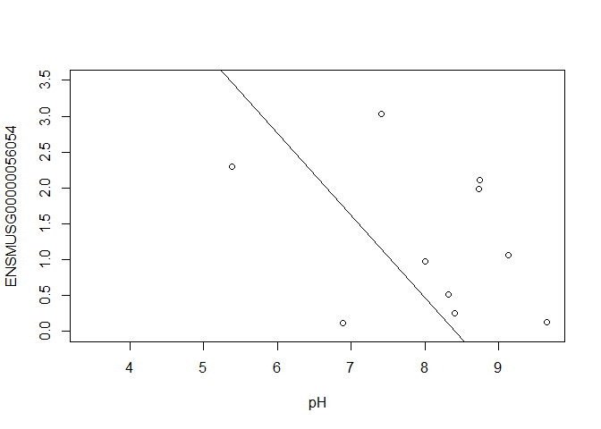
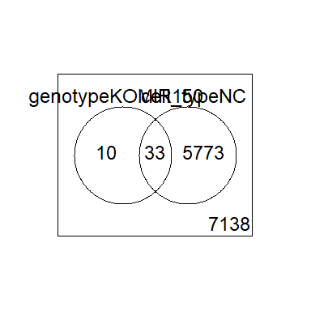

# Differential Gene Expression Analysis in R

* Differential Gene Expression (DGE) between conditions is determined from count data
* Generally speaking differential expression analysis is performed in a very similar manner to DNA microarrays, once normalization and transformations have been performed.

A lot of RNA-seq analysis has been done in R and so there are many packages available to analyze and view this data. Two of the most commonly used are:
* DESeq2, developed by Simon Anders (also created htseq) in Wolfgang Huber’s group at EMBL
* edgeR and Voom (extension to Limma [microarrays] for RNA-seq), developed out of Gordon Smyth’s group from the Walter and Eliza Hall Institute of Medical Research in Australia

xhttp://bioconductor.org/packages/release/BiocViews.html#___RNASeq

## Differential Expression Analysis with Limma-Voom

**limma** is an R package that was originally developed for differential expression (DE) analysis of gene expression microarray data.

**voom** is a function in the limma package that transforms RNA-Seq data for use with limma.

Together they allow fast, flexible, and powerful analyses of RNA-Seq data.  Limma-voom is _our_ tool of choice for DE analyses because it:

* Allows for incredibly flexible model specification (you can include multiple categorical and continuous variables, allowing incorporation of almost any kind of metadata).

* Based on simulation studies, maintains the false discovery rate at or below the nominal rate, unlike some other packages.

* Empirical Bayes smoothing of gene-wise standard deviations provides increased power.  

### Basic Steps of Differential Gene Expression
1. Read count data and annotation into R and preprocessing.
2. Calculate normalization factors (sample-specific adjustments)
3. Filter genes (uninteresting genes, e.g. unexpressed)
4. Account for expression-dependent variability by transformation, weighting, or modeling
5. Fitting a linear model
6. Perform statistical comparisons of interest (using contrasts)
7. Adjust for multiple testing, Benjamini-Hochberg (BH) or q-value
8. Check results for confidence
9. Attach annotation if available and write tables


## 1. Read in the counts table and create our DGEList (EdgeR)

```r
counts <- read.delim("rnaseq_workshop_counts_mm.txt", row.names = 1)
dim(counts) # number of genes
```

```
## [1] 55487    22
```

```r
head(counts)
```

```
##                    mouse_110_WT_C mouse_110_WT_NC mouse_148_WT_C
## ENSMUSG00000102693              0               0              0
## ENSMUSG00000064842              0               0              0
## ENSMUSG00000051951              0               0              0
## ENSMUSG00000102851              0               0              0
## ENSMUSG00000103377              0               0              0
## ENSMUSG00000104017              0               0              0
##                    mouse_148_WT_NC mouse_158_WT_C mouse_158_WT_NC
## ENSMUSG00000102693               0              0               0
## ENSMUSG00000064842               0              0               0
## ENSMUSG00000051951               0              0               0
## ENSMUSG00000102851               0              0               0
## ENSMUSG00000103377               0              0               0
## ENSMUSG00000104017               0              0               0
##                    mouse_183_KOMIR150_C mouse_183_KOMIR150_NC
## ENSMUSG00000102693                    0                     0
## ENSMUSG00000064842                    0                     0
## ENSMUSG00000051951                    0                     0
## ENSMUSG00000102851                    0                     0
## ENSMUSG00000103377                    0                     0
## ENSMUSG00000104017                    0                     0
##                    mouse_198_KOMIR150_C mouse_198_KOMIR150_NC
## ENSMUSG00000102693                    0                     0
## ENSMUSG00000064842                    0                     0
## ENSMUSG00000051951                    0                     0
## ENSMUSG00000102851                    0                     0
## ENSMUSG00000103377                    0                     0
## ENSMUSG00000104017                    0                     0
##                    mouse_206_KOMIR150_C mouse_206_KOMIR150_NC
## ENSMUSG00000102693                    0                     0
## ENSMUSG00000064842                    0                     0
## ENSMUSG00000051951                    0                     0
## ENSMUSG00000102851                    0                     0
## ENSMUSG00000103377                    0                     0
## ENSMUSG00000104017                    0                     0
##                    mouse_2670_KOTet3_C mouse_2670_KOTet3_NC mouse_7530_KOTet3_C
## ENSMUSG00000102693                   0                    0                   0
## ENSMUSG00000064842                   0                    0                   0
## ENSMUSG00000051951                   0                    0                   0
## ENSMUSG00000102851                   0                    0                   0
## ENSMUSG00000103377                   0                    0                   0
## ENSMUSG00000104017                   0                    0                   0
##                    mouse_7530_KOTet3_NC mouse_7531_KOTet3_C mouse_7532_WT_NC
## ENSMUSG00000102693                    0                   0                0
## ENSMUSG00000064842                    0                   0                0
## ENSMUSG00000051951                    0                   0                0
## ENSMUSG00000102851                    0                   0                0
## ENSMUSG00000103377                    0                   0                0
## ENSMUSG00000104017                    0                   0                0
##                    mouse_H510_WT_C mouse_H510_WT_NC mouse_H514_WT_C
## ENSMUSG00000102693               0                0               0
## ENSMUSG00000064842               0                0               0
## ENSMUSG00000051951               0                0               0
## ENSMUSG00000102851               0                0               0
## ENSMUSG00000103377               0                0               0
## ENSMUSG00000104017               0                0               0
##                    mouse_H514_WT_NC
## ENSMUSG00000102693                0
## ENSMUSG00000064842                0
## ENSMUSG00000051951                0
## ENSMUSG00000102851                0
## ENSMUSG00000103377                0
## ENSMUSG00000104017                0
```

Create Differential Gene Expression List Object (DGEList) object


```r
d0 <- DGEList(counts)
```
  
**1a\.** Read in Annotation

```r
anno <- read.delim("ensembl_mm_100.tsv",as.is=T)
dim(anno)
```

```
## [1] 144778     10
```

```r
head(anno)
```

```
##       Gene.stable.ID Gene.stable.ID.version Gene.name
## 1 ENSMUSG00000064372   ENSMUSG00000064372.1     mt-Tp
## 2 ENSMUSG00000064371   ENSMUSG00000064371.1     mt-Tt
## 3 ENSMUSG00000064370   ENSMUSG00000064370.1   mt-Cytb
## 4 ENSMUSG00000064369   ENSMUSG00000064369.1     mt-Te
## 5 ENSMUSG00000064368   ENSMUSG00000064368.1    mt-Nd6
## 6 ENSMUSG00000064367   ENSMUSG00000064367.1    mt-Nd5
##                                                                  Gene.description
## 1         mitochondrially encoded tRNA proline [Source:MGI Symbol;Acc:MGI:102478]
## 2       mitochondrially encoded tRNA threonine [Source:MGI Symbol;Acc:MGI:102473]
## 3         mitochondrially encoded cytochrome b [Source:MGI Symbol;Acc:MGI:102501]
## 4   mitochondrially encoded tRNA glutamic acid [Source:MGI Symbol;Acc:MGI:102488]
## 5 mitochondrially encoded NADH dehydrogenase 6 [Source:MGI Symbol;Acc:MGI:102495]
## 6 mitochondrially encoded NADH dehydrogenase 5 [Source:MGI Symbol;Acc:MGI:102496]
##        Gene.type Transcript.type Chromosome.scaffold.name Gene.start..bp.
## 1        Mt_tRNA         Mt_tRNA                       MT           15356
## 2        Mt_tRNA         Mt_tRNA                       MT           15289
## 3 protein_coding  protein_coding                       MT           14145
## 4        Mt_tRNA         Mt_tRNA                       MT           14071
## 5 protein_coding  protein_coding                       MT           13552
## 6 protein_coding  protein_coding                       MT           11742
##   Gene.end..bp. Strand
## 1         15422     -1
## 2         15355      1
## 3         15288      1
## 4         14139     -1
## 5         14070     -1
## 6         13565      1
```

```r
tail(anno)
```

```
##            Gene.stable.ID Gene.stable.ID.version  Gene.name
## 144773 ENSMUSG00000116328   ENSMUSG00000116328.1 LT629154.4
## 144774 ENSMUSG00000116379   ENSMUSG00000116379.1 LT629154.5
## 144775 ENSMUSG00000116431   ENSMUSG00000116431.1      Slfn3
## 144776 ENSMUSG00000116431   ENSMUSG00000116431.1      Slfn3
## 144777 ENSMUSG00000116431   ENSMUSG00000116431.1      Slfn3
## 144778 ENSMUSG00000116507   ENSMUSG00000116507.1    Gm23444
##                                                 Gene.description      Gene.type
## 144773                                                               pseudogene
## 144774                                                               pseudogene
## 144775            schlafen 3 [Source:MGI Symbol;Acc:MGI:1329005] protein_coding
## 144776            schlafen 3 [Source:MGI Symbol;Acc:MGI:1329005] protein_coding
## 144777            schlafen 3 [Source:MGI Symbol;Acc:MGI:1329005] protein_coding
## 144778 predicted gene, 23444 [Source:MGI Symbol;Acc:MGI:5453221]          snRNA
##             Transcript.type Chromosome.scaffold.name Gene.start..bp.
## 144773           pseudogene CHR_WSB_EIJ_MMCHR11_CTG3        83205141
## 144774           pseudogene CHR_WSB_EIJ_MMCHR11_CTG3        83206643
## 144775       protein_coding CHR_WSB_EIJ_MMCHR11_CTG3        83150467
## 144776       protein_coding CHR_WSB_EIJ_MMCHR11_CTG3        83150467
## 144777 processed_transcript CHR_WSB_EIJ_MMCHR11_CTG3        83150467
## 144778                snRNA CHR_WSB_EIJ_MMCHR11_CTG3        83229738
##        Gene.end..bp. Strand
## 144773      83206056      1
## 144774      83207658      1
## 144775      83174093      1
## 144776      83174093      1
## 144777      83174093      1
## 144778      83229928      1
```

```r
any(duplicated(anno$Gene.stable.ID))
```

```
## [1] TRUE
```

**1b\.** Derive experiment metadata from the sample names

Our experiment has two factors, genotype ("WT", "KOMIR150", or "KOTet3") and cell type ("C" or "NC").

The sample names are "mouse" followed by an animal identifier, followed by the genotype, followed by the cell type.

```r
sample_names <- colnames(counts)
metadata <- as.data.frame(strsplit2(sample_names, c("_"))[,2:4], row.names = sample_names)
colnames(metadata) <- c("mouse", "genotype", "cell_type")
```

Create a new variable "group" that combines genotype and cell type.

```r
metadata$group <- interaction(metadata$genotype, metadata$cell_type)
table(metadata$group)
```

```
## 
##  KOMIR150.C    KOTet3.C        WT.C KOMIR150.NC   KOTet3.NC       WT.NC 
##           3           3           5           3           2           6
```

```r
table(metadata$mouse)
```

```
## 
##  110  148  158  183  198  206 2670 7530 7531 7532 H510 H514 
##    2    2    2    2    2    2    2    2    1    1    2    2
```

Note: you can also enter group information manually, or read it in from an external file.  If you do this, it is $VERY, VERY, VERY$ important that you make sure the metadata is in the same order as the column names of the counts table.

## 2. Preprocessing and Normalization factors

In differential expression analysis, only sample-specific effects need to be normalized, we are NOT concerned with comparisons and quantification of absolute expression.

* Sequence depth – is a sample specific effect and needs to be adjusted for.
* RNA composition - finding a set of scaling factors for the library sizes that minimize the log-fold changes between the samples for most genes (edgeR uses a trimmed mean of M-values between each pair of sample)
* GC content – is NOT sample-specific (except when it is)
* Gene Length – is NOT sample-specific (except when it is)

In edgeR/limma, you calculate normalization factors to scale the raw library sizes (number of reads) using the function calcNormFactors, which by default uses TMM (weighted trimmed means of M values to the reference). Assumes most genes are not DE.

Proposed by Robinson and Oshlack (2010).


```r
d0 <- calcNormFactors(d0)
d0$samples
```

```
##                       group lib.size norm.factors
## mouse_110_WT_C            1  2333947    1.0311936
## mouse_110_WT_NC           1  2832183    0.9890673
## mouse_148_WT_C            1  2808984    1.0223502
## mouse_148_WT_NC           1  2609400    0.9893831
## mouse_158_WT_C            1  2967165    1.0123008
## mouse_158_WT_NC           1  2653006    0.9665824
## mouse_183_KOMIR150_C      1  2530568    1.0254506
## mouse_183_KOMIR150_NC     1  1857925    0.9843995
## mouse_198_KOMIR150_C      1  2834316    1.0205393
## mouse_198_KOMIR150_NC     1  2916206    0.9830185
## mouse_206_KOMIR150_C      1  1386930    0.9952084
## mouse_206_KOMIR150_NC     1   952208    0.9911163
## mouse_2670_KOTet3_C       1  2898456    1.0009311
## mouse_2670_KOTet3_NC      1  2932701    0.9735538
## mouse_7530_KOTet3_C       1  2607047    1.0196309
## mouse_7530_KOTet3_NC      1  2878866    0.9534559
## mouse_7531_KOTet3_C       1  2659776    1.0222318
## mouse_7532_WT_NC          1  2709083    1.0024529
## mouse_H510_WT_C           1  2580303    1.0266600
## mouse_H510_WT_NC          1  2830542    1.0159632
## mouse_H514_WT_C           1  2296076    0.9943003
## mouse_H514_WT_NC          1  2644848    0.9850580
```

**Note:** calcNormFactors doesn't _normalize_ the data, it just calculates normalization factors for use downstream.

## 3. Filtering genes

We filter genes based on non-experimental factors to reduce the number of genes/tests being conducted and therefor do not have to be accounted for in our transformation or multiple testing correction. Commonly we try to remove genes that are either a) unexpressed, or b) unchanging (low-variability).

Common filters include:
1. to remove genes with a max value (X) of less then Y.
2. to remove genes that are less than X normalized read counts (cpm) across a certain number of samples. Ex: rowSums(cpms <=1) < 3 , require at least 1 cpm in at least 3 samples to keep.
3. A less used filter is for genes with minimum variance across all samples, so if a gene isn't changing (constant expression) its inherently not interesting therefor no need to test.

Here we will filter low-expressed genes, remove any row (gene) whose max value (for the row) is less than the cutoff (2).

```r
cutoff <- 2
drop <- which(apply(cpm(d0), 1, max) < cutoff)
d <- d0[-drop,]
dim(d) # number of genes left
```

```
## [1] 12903    22
```

"Low-expressed" is subjective and depends on the dataset.

Visualizaing your data with a Multidimensional scaling (MDS) plot.

```r
plotMDS(d, col = as.numeric(metadata$group), cex=1)
```

<!-- -->

The MDS plot tells you **A LOT** about what to expect from your experiment.

**3a\.** Extracting "normalized" expression table

### RPKM vs. FPKM vs. CPM and Model Based
* RPKM - Reads per kilobase per million mapped reads
* FPKM - Fragments per kilobase per million mapped reads
* logCPM – log Counts per million [ good for producing MDS plots, estimate of normalized values in model based ]
* Model based - original read counts are not themselves transformed, but rather correction factors are used in the DE model itself.

We use the `cpm` function with log=TRUE to obtain log-transformed normalized expression data.  On the log scale, the data has less mean-dependent variability and is more suitable for plotting.

```r
logcpm <- cpm(d, prior.count=2, log=TRUE)
write.table(logcpm,"rnaseq_workshop_normalized_counts.txt",sep="\t",quote=F)
```


## 4. Voom transformation and calculation of variance weights

Specify the model to be fitted.  We do this before using voom since voom uses variances of the model residuals (observed - fitted)

```r
group <- metadata$group
mouse <- metadata$mouse
mm <- model.matrix(~0 + group + mouse)
head(mm)
```

```
##   groupKOMIR150.C groupKOTet3.C groupWT.C groupKOMIR150.NC groupKOTet3.NC
## 1               0             0         1                0              0
## 2               0             0         0                0              0
## 3               0             0         1                0              0
## 4               0             0         0                0              0
## 5               0             0         1                0              0
## 6               0             0         0                0              0
##   groupWT.NC mouse148 mouse158 mouse183 mouse198 mouse206 mouse2670 mouse7530
## 1          0        0        0        0        0        0         0         0
## 2          1        0        0        0        0        0         0         0
## 3          0        1        0        0        0        0         0         0
## 4          1        1        0        0        0        0         0         0
## 5          0        0        1        0        0        0         0         0
## 6          1        0        1        0        0        0         0         0
##   mouse7531 mouse7532 mouseH510 mouseH514
## 1         0         0         0         0
## 2         0         0         0         0
## 3         0         0         0         0
## 4         0         0         0         0
## 5         0         0         0         0
## 6         0         0         0         0
```

The above specifies a model where each coefficient corresponds to a group mean.

**4a\.** **Voom**

```r
y <- voom(d, mm, plot = T)
```

```
## Coefficients not estimable: mouse206 mouse7531
```

```
## Warning: Partial NA coefficients for 12903 probe(s)
```

<!-- -->

What is voom doing?

1. Counts are transformed to log2 counts per million reads (CPM), where "per million reads" is defined based on the normalization factors we calculated earlier.
2. A linear model is fitted to the log2 CPM for each gene, and the residuals are calculated.
3. A smoothed curve is fitted to the sqrt(residual standard deviation) by average expression.
(see red line in plot above)
4. The smoothed curve is used to obtain weights for each gene and sample that are passed into limma along with the log2 CPMs.

More details at "[voom: precision weights unlock linear model analysis tools for RNA-seq read counts](https://genomebiology.biomedcentral.com/articles/10.1186/gb-2014-15-2-r29)"

If your voom plot looks like the below (performed on the raw data), you might want to filter more:

```r
tmp <- voom(d0, mm, plot = T)
```

```
## Coefficients not estimable: mouse206 mouse7531
```

```
## Warning: Partial NA coefficients for 55487 probe(s)
```

<!-- -->


## 5. Fitting linear models in limma

lmFit fits a linear model using weighted least squares for each gene:

```r
fit <- lmFit(y, mm)
```

```
## Coefficients not estimable: mouse206 mouse7531
```

```
## Warning: Partial NA coefficients for 12903 probe(s)
```

```r
head(coef(fit))
```

```
##                    groupKOMIR150.C groupKOTet3.C  groupWT.C groupKOMIR150.NC
## ENSMUSG00000098104       0.4662427    -0.8580651 -0.4259116        0.2820224
## ENSMUSG00000033845       4.8572972     5.0245779  4.7725988        5.1267796
## ENSMUSG00000025903       5.1291731     5.6497295  5.5314598        5.2783467
## ENSMUSG00000033813       5.8815644     5.6602602  5.7853032        5.9574348
## ENSMUSG00000033793       5.2542102     5.3961762  5.4335293        5.0979640
## ENSMUSG00000025907       6.5172739     6.6733163  6.5538298        6.3591963
##                    groupKOTet3.NC groupWT.NC    mouse148    mouse158
## ENSMUSG00000098104      -1.208440 -0.7255327  0.79381658  0.38906849
## ENSMUSG00000033845       4.766611  4.6449032  0.21390163  0.15190756
## ENSMUSG00000025903       5.629550  5.3759170 -0.05528934  0.03390625
## ENSMUSG00000033813       5.840503  5.8000394  0.04111657  0.02805000
## ENSMUSG00000033793       4.886777  5.1702790 -0.18144259 -0.24105529
## ENSMUSG00000025907       6.779933  6.3091940 -0.11906164 -0.03849672
##                       mouse183     mouse198 mouse206   mouse2670   mouse7530
## ENSMUSG00000098104 -1.75326073 -0.421136565       NA  0.81463169  0.56735625
## ENSMUSG00000033845 -0.42404043 -0.100005934       NA -0.04976113 -0.01225107
## ENSMUSG00000025903  0.39676545  0.413103859       NA  0.05410340 -0.11933488
## ENSMUSG00000033813 -0.22516584 -0.007386648       NA  0.16509237  0.19705430
## ENSMUSG00000033793 -0.30366063  0.062504853       NA  0.12107619  0.38870571
## ENSMUSG00000025907 -0.09358699  0.125553921       NA -0.10319509 -0.14021459
##                    mouse7531   mouse7532    mouseH510   mouseH514
## ENSMUSG00000098104        NA -1.71580686  1.261647668  0.45235303
## ENSMUSG00000033845        NA  0.18988172  0.166356741  0.15332106
## ENSMUSG00000025903        NA  0.25420589  0.107042454  0.22553775
## ENSMUSG00000033813        NA  0.05782908  0.044926929 -0.03404709
## ENSMUSG00000033793        NA -0.29873559 -0.042125036 -0.15475120
## ENSMUSG00000025907        NA  0.17724444  0.008860918 -0.13301924
```

Comparisons between groups (log fold-changes) are obtained as _contrasts_ of these fitted linear models:

## 6. Specify which groups to compare using contrasts:

Comparison between cell types for genotype WT.

```r
contr <- makeContrasts(groupWT.C - groupWT.NC, levels = colnames(coef(fit)))
contr
```

```
##                   Contrasts
## Levels             groupWT.C - groupWT.NC
##   groupKOMIR150.C                       0
##   groupKOTet3.C                         0
##   groupWT.C                             1
##   groupKOMIR150.NC                      0
##   groupKOTet3.NC                        0
##   groupWT.NC                           -1
##   mouse148                              0
##   mouse158                              0
##   mouse183                              0
##   mouse198                              0
##   mouse206                              0
##   mouse2670                             0
##   mouse7530                             0
##   mouse7531                             0
##   mouse7532                             0
##   mouseH510                             0
##   mouseH514                             0
```

**6a\.** Estimate contrast for each gene

```r
tmp <- contrasts.fit(fit, contr)
```

The variance characteristics of low expressed genes are different from high expressed genes, if treated the same, the effect is to over represent low expressed genes in the DE list. This is corrected for by voom. However, some genes will have increased variance that is not a result of low expression, but due to other random factors. We are going to run Empirical Bayes to adjust the variance of these genes.

Empirical Bayes smoothing of standard errors (shifts standard errors that are much larger or smaller than those from other genes towards the average standard error) (see "[Linear Models and Empirical Bayes Methods for Assessing Differential Expression in Microarray Experiments](https://www.degruyter.com/doi/10.2202/1544-6115.1027)"

**6b\.** Apply EBayes

```r
tmp <- eBayes(tmp)
```

## 7. Multiple Testing Adjustment

The TopTable. Ajust by Benjamini & Hochberg (BH), or its 'alias' fdr. "[Controlling the false discovery rate: a practical and powerful approach to multiple testing](http://www.jstor.org/stable/2346101).

here `n=Inf` says to produce the topTable for **all** genes. 

```r
top.table <- topTable(tmp, adjust.method = "BH", sort.by = "P", n = Inf)
```

### Multiple Testing Correction

Simply a must! Best choices are:
  * [FDR](http://www.jstor.org/stable/2346101) (false discovery rate), such as Benjamini-Hochberg (1995).
  * [Qvalue](https://rss.onlinelibrary.wiley.com/doi/abs/10.1111/1467-9868.00346) - Storey (2002)

The FDR (or qvalue) is a statement about the list and is no longer about the gene (pvalue). So a FDR of 0.05, says you expect 5% false positives among the list of genes with an FDR of 0.05 or less.

The statement “Statistically significantly different” means FDR of 0.05 or less.

**7a\.** How many DE genes are there (false discovery rate corrected)?

```r
length(which(top.table$adj.P.Val < 0.05))
```

```
## [1] 5697
```

## 8. Check your results for confidence.

You've conducted an experiment, you've seen a phenotype. Now check which genes are most deferentially expressed (show the top 50)? Look up these top genes, their description and ensure they relate to your experiment/phenotype. 

```r
head(top.table, 50)
```

```
##                        logFC   AveExpr         t      P.Value    adj.P.Val
## ENSMUSG00000020608 -2.494152  7.871119 -44.93189 1.633862e-19 2.108172e-15
## ENSMUSG00000052212  4.544592  6.203043  40.16863 1.138575e-18 4.914862e-15
## ENSMUSG00000049103  2.155498  9.892016  40.16019 1.142725e-18 4.914862e-15
## ENSMUSG00000030203 -4.127795  7.005929 -34.51508 1.565016e-17 4.751486e-14
## ENSMUSG00000027508 -1.906200  8.124895 -33.88940 2.145300e-17 4.751486e-14
## ENSMUSG00000021990 -2.682202  8.368960 -33.73316 2.323138e-17 4.751486e-14
## ENSMUSG00000026193  4.798895 10.155926  33.53020 2.577726e-17 4.751486e-14
## ENSMUSG00000037820 -4.173886  7.129001 -32.89600 3.581684e-17 5.776809e-14
## ENSMUSG00000024164  1.793048  9.873524  32.01786 5.706295e-17 8.180925e-14
## ENSMUSG00000038807 -1.569066  9.015470 -31.19041 8.952083e-17 1.155087e-13
## ENSMUSG00000048498 -5.802379  6.502558 -30.24828 1.516342e-16 1.778669e-13
## ENSMUSG00000030342 -3.682075  6.049866 -30.03417 1.713050e-16 1.841957e-13
## ENSMUSG00000039959 -1.490202  8.944064 -29.78974 1.971024e-16 1.956317e-13
## ENSMUSG00000021614  6.003533  5.439467  29.53908 2.278600e-16 2.050571e-13
## ENSMUSG00000028885 -2.359707  7.055040 -29.39287 2.481063e-16 2.050571e-13
## ENSMUSG00000020437 -1.233522 10.317674 -29.35082 2.542753e-16 2.050571e-13
## ENSMUSG00000030413 -2.612734  6.652130 -29.23205 2.725897e-16 2.066818e-13
## ENSMUSG00000027215 -2.577701  6.902097 -29.12193 2.908184e-16 2.066818e-13
## ENSMUSG00000037185 -1.544339  9.491794 -29.03565 3.059971e-16 2.066818e-13
## ENSMUSG00000029254 -2.459886  6.698526 -28.95807 3.203624e-16 2.066818e-13
## ENSMUSG00000051177  3.178175  4.997819  28.77510 3.571341e-16 2.109963e-13
## ENSMUSG00000018168 -3.885143  5.468134 -28.76283 3.597550e-16 2.109963e-13
## ENSMUSG00000020108 -2.055586  6.955183 -28.43969 4.366095e-16 2.449379e-13
## ENSMUSG00000020272 -1.305426 10.455516 -28.34612 4.619687e-16 2.483659e-13
## ENSMUSG00000022584  4.730755  6.747830  28.06137 5.491790e-16 2.834423e-13
## ENSMUSG00000020212 -2.170187  6.785791 -27.77765 6.535364e-16 3.243300e-13
## ENSMUSG00000023827 -2.150577  6.418008 -27.59000 7.339231e-16 3.507337e-13
## ENSMUSG00000008496 -1.492036  9.428877 -27.46895 7.912699e-16 3.646341e-13
## ENSMUSG00000038147  1.682886  7.150369  27.33255 8.616044e-16 3.708116e-13
## ENSMUSG00000020387 -4.948668  4.338596 -27.25825 9.026678e-16 3.708116e-13
## ENSMUSG00000023809 -3.200357  4.835883 -27.24854 9.081805e-16 3.708116e-13
## ENSMUSG00000018001 -2.619645  7.183304 -27.22859 9.196288e-16 3.708116e-13
## ENSMUSG00000035493  1.914100  9.759272  27.00072 1.061741e-15 4.151408e-13
## ENSMUSG00000021728  1.654211  8.398957  26.84929 1.168885e-15 4.435919e-13
## ENSMUSG00000039109  4.730034  8.324842  26.64373 1.332934e-15 4.913957e-13
## ENSMUSG00000044783 -1.677812  7.454587 -26.39584 1.563694e-15 5.604539e-13
## ENSMUSG00000051457 -2.268363  9.825255 -26.32385 1.638347e-15 5.713403e-13
## ENSMUSG00000026923  2.007956  6.635920  25.98181 2.048180e-15 6.954649e-13
## ENSMUSG00000042700 -1.821188  6.096008 -25.42073 2.972240e-15 9.589754e-13
## ENSMUSG00000029287 -3.789468  5.416403 -25.40645 3.000837e-15 9.589754e-13
## ENSMUSG00000043263  1.777861  7.857900  25.38361 3.047198e-15 9.589754e-13
## ENSMUSG00000073409 -3.397055  6.086180 -25.05234 3.811678e-15 1.171002e-12
## ENSMUSG00000025701 -2.760414  5.351247 -24.93557 4.127397e-15 1.225298e-12
## ENSMUSG00000033705  1.690497  7.160762  24.89639 4.239409e-15 1.225298e-12
## ENSMUSG00000050335  1.104437  8.973146  24.86680 4.326152e-15 1.225298e-12
## ENSMUSG00000027435  3.028324  6.730185  24.84682 4.385750e-15 1.225298e-12
## ENSMUSG00000020340 -2.258762  8.657028 -24.82128 4.463227e-15 1.225298e-12
## ENSMUSG00000016496 -3.566470  6.411624 -24.72202 4.778328e-15 1.284474e-12
## ENSMUSG00000005800  5.740457  4.136840  24.58466 5.253641e-15 1.383423e-12
## ENSMUSG00000022818 -1.755043  6.789040 -24.50137 5.565943e-15 1.436347e-12
##                           B
## ENSMUSG00000020608 34.95242
## ENSMUSG00000052212 32.54042
## ENSMUSG00000049103 33.10377
## ENSMUSG00000030203 30.40783
## ENSMUSG00000027508 30.18393
## ENSMUSG00000021990 30.10296
## ENSMUSG00000026193 29.91896
## ENSMUSG00000037820 29.57333
## ENSMUSG00000024164 29.13217
## ENSMUSG00000038807 28.71578
## ENSMUSG00000048498 27.82683
## ENSMUSG00000030342 27.93066
## ENSMUSG00000039959 27.90723
## ENSMUSG00000021614 26.56403
## ENSMUSG00000028885 27.73852
## ENSMUSG00000020437 27.54998
## ENSMUSG00000030413 27.64230
## ENSMUSG00000027215 27.57553
## ENSMUSG00000037185 27.42920
## ENSMUSG00000029254 27.47882
## ENSMUSG00000051177 26.94199
## ENSMUSG00000018168 27.16729
## ENSMUSG00000020108 27.16403
## ENSMUSG00000020272 26.92077
## ENSMUSG00000022584 26.91806
## ENSMUSG00000020212 26.77485
## ENSMUSG00000023827 26.65077
## ENSMUSG00000008496 26.45077
## ENSMUSG00000038147 26.48984
## ENSMUSG00000020387 24.96815
## ENSMUSG00000023809 26.04465
## ENSMUSG00000018001 26.42592
## ENSMUSG00000035493 26.13460
## ENSMUSG00000021728 26.12780
## ENSMUSG00000039109 26.00938
## ENSMUSG00000044783 25.87979
## ENSMUSG00000051457 25.66808
## ENSMUSG00000026923 25.62880
## ENSMUSG00000042700 25.25903
## ENSMUSG00000029287 25.15061
## ENSMUSG00000043263 25.16890
## ENSMUSG00000073409 25.01111
## ENSMUSG00000025701 24.84163
## ENSMUSG00000033705 24.87402
## ENSMUSG00000050335 24.74007
## ENSMUSG00000027435 24.87629
## ENSMUSG00000020340 24.73740
## ENSMUSG00000016496 24.77320
## ENSMUSG00000005800 22.80005
## ENSMUSG00000022818 24.62189
```
Columns are
* logFC: log2 fold change of WT.C/WT.NC
* AveExpr: Average expression across all samples, in log2 CPM
* t: logFC divided by its standard error
* P.Value: Raw p-value (based on t) from test that logFC differs from 0
* adj.P.Val: Benjamini-Hochberg false discovery rate adjusted p-value
* B: log-odds that gene is DE (arguably less useful than the other columns)

ENSMUSG00000030203 has higher expression at WT NC than at WT C (logFC is netative).  ENSMUSG00000026193 has higher expression at WT C than at WT NC (logFC is positive).

In the paper, the authors specify that NC cells were identified by low expression of Ly6C (ENSMUSG00000079018). Is this gene differentially expressed?

```r
top.table["ENSMUSG00000079018",]
```

```
##    logFC AveExpr  t P.Value adj.P.Val  B
## NA    NA      NA NA      NA        NA NA
```

```r
d0$counts["ENSMUSG00000079018",]
```

```
##        mouse_110_WT_C       mouse_110_WT_NC        mouse_148_WT_C 
##                     2                     0                     2 
##       mouse_148_WT_NC        mouse_158_WT_C       mouse_158_WT_NC 
##                     0                     2                     0 
##  mouse_183_KOMIR150_C mouse_183_KOMIR150_NC  mouse_198_KOMIR150_C 
##                     1                     0                     1 
## mouse_198_KOMIR150_NC  mouse_206_KOMIR150_C mouse_206_KOMIR150_NC 
##                     0                     1                     0 
##   mouse_2670_KOTet3_C  mouse_2670_KOTet3_NC   mouse_7530_KOTet3_C 
##                     2                     0                     2 
##  mouse_7530_KOTet3_NC   mouse_7531_KOTet3_C      mouse_7532_WT_NC 
##                     0                     1                     0 
##       mouse_H510_WT_C      mouse_H510_WT_NC       mouse_H514_WT_C 
##                     1                     0                     2 
##      mouse_H514_WT_NC 
##                     0
```

Ly6C was removed from our data by the filtering step, because the maximum counts for the gene did not exceed 2.

## 9. Write top.table to a file, adding in cpms and annotation

```r
top.table$Gene <- rownames(top.table)
top.table <- top.table[,c("Gene", names(top.table)[1:6])]
top.table <- data.frame(top.table,anno[match(top.table$Gene,anno$Gene.stable.ID),],logcpm[match(top.table$Gene,rownames(logcpm)),])

head(top.table)
```

```
##                                  Gene     logFC  AveExpr         t      P.Value
## ENSMUSG00000020608 ENSMUSG00000020608 -2.494152 7.871119 -44.93189 1.633862e-19
## ENSMUSG00000052212 ENSMUSG00000052212  4.544592 6.203043  40.16863 1.138575e-18
## ENSMUSG00000049103 ENSMUSG00000049103  2.155498 9.892016  40.16019 1.142725e-18
## ENSMUSG00000030203 ENSMUSG00000030203 -4.127795 7.005929 -34.51508 1.565016e-17
## ENSMUSG00000027508 ENSMUSG00000027508 -1.906200 8.124895 -33.88940 2.145300e-17
## ENSMUSG00000021990 ENSMUSG00000021990 -2.682202 8.368960 -33.73316 2.323138e-17
##                       adj.P.Val        B     Gene.stable.ID
## ENSMUSG00000020608 2.108172e-15 34.95242 ENSMUSG00000020608
## ENSMUSG00000052212 4.914862e-15 32.54042 ENSMUSG00000052212
## ENSMUSG00000049103 4.914862e-15 33.10377 ENSMUSG00000049103
## ENSMUSG00000030203 4.751486e-14 30.40783 ENSMUSG00000030203
## ENSMUSG00000027508 4.751486e-14 30.18393 ENSMUSG00000027508
## ENSMUSG00000021990 4.751486e-14 30.10296 ENSMUSG00000021990
##                    Gene.stable.ID.version Gene.name
## ENSMUSG00000020608   ENSMUSG00000020608.7      Smc6
## ENSMUSG00000052212   ENSMUSG00000052212.6     Cd177
## ENSMUSG00000049103  ENSMUSG00000049103.14      Ccr2
## ENSMUSG00000030203  ENSMUSG00000030203.17    Dusp16
## ENSMUSG00000027508  ENSMUSG00000027508.15      Pag1
## ENSMUSG00000021990  ENSMUSG00000021990.16   Spata13
##                                                                                                       Gene.description
## ENSMUSG00000020608                         structural maintenance of chromosomes 6 [Source:MGI Symbol;Acc:MGI:1914491]
## ENSMUSG00000052212                                                   CD177 antigen [Source:MGI Symbol;Acc:MGI:1916141]
## ENSMUSG00000049103                                 chemokine (C-C motif) receptor 2 [Source:MGI Symbol;Acc:MGI:106185]
## ENSMUSG00000030203                                 dual specificity phosphatase 16 [Source:MGI Symbol;Acc:MGI:1917936]
## ENSMUSG00000027508 phosphoprotein associated with glycosphingolipid microdomains 1 [Source:MGI Symbol;Acc:MGI:2443160]
## ENSMUSG00000021990                                    spermatogenesis associated 13 [Source:MGI Symbol;Acc:MGI:104838]
##                         Gene.type Transcript.type Chromosome.scaffold.name
## ENSMUSG00000020608 protein_coding  protein_coding                       12
## ENSMUSG00000052212 protein_coding  protein_coding                        7
## ENSMUSG00000049103 protein_coding  protein_coding                        9
## ENSMUSG00000030203 protein_coding  protein_coding                        6
## ENSMUSG00000027508 protein_coding  protein_coding                        3
## ENSMUSG00000021990 protein_coding  protein_coding                       14
##                    Gene.start..bp. Gene.end..bp. Strand mouse_110_WT_C
## ENSMUSG00000020608        11265886      11319785      1       6.645200
## ENSMUSG00000052212        24743983      24760311     -1       8.633626
## ENSMUSG00000049103       124101950     124113557      1      10.919303
## ENSMUSG00000030203       134715468     134792625     -1       5.016457
## ENSMUSG00000027508         9687479       9833679     -1       7.200107
## ENSMUSG00000021990        60634001      60764556      1       6.989826
##                    mouse_110_WT_NC mouse_148_WT_C mouse_148_WT_NC
## ENSMUSG00000020608        9.077340       7.041320        9.419612
## ENSMUSG00000052212        4.163876       8.370249        3.633382
## ENSMUSG00000049103        8.831594      11.256192        8.960396
## ENSMUSG00000030203        8.985832       5.195966        9.079834
## ENSMUSG00000027508        9.030835       7.060265        9.119556
## ENSMUSG00000021990        9.559164       7.352324        9.779543
##                    mouse_158_WT_C mouse_158_WT_NC mouse_183_KOMIR150_C
## ENSMUSG00000020608       6.772457        9.195058             6.809393
## ENSMUSG00000052212       8.116089        3.397580             8.732866
## ENSMUSG00000049103      11.072238        8.731549            11.045830
## ENSMUSG00000030203       5.461716        9.210334             5.239699
## ENSMUSG00000027508       7.394473        9.269873             7.201890
## ENSMUSG00000021990       7.036684        9.740111             7.425335
##                    mouse_183_KOMIR150_NC mouse_198_KOMIR150_C
## ENSMUSG00000020608              9.326751             6.502647
## ENSMUSG00000052212              3.551467             8.649169
## ENSMUSG00000049103              8.753682            10.719231
## ENSMUSG00000030203              8.932223             4.812550
## ENSMUSG00000027508              8.852554             7.042384
## ENSMUSG00000021990              9.600100             6.545993
##                    mouse_198_KOMIR150_NC mouse_206_KOMIR150_C
## ENSMUSG00000020608              8.986687             6.442998
## ENSMUSG00000052212              3.775704             8.754417
## ENSMUSG00000049103              8.525368            10.796004
## ENSMUSG00000030203              9.204500             5.237953
## ENSMUSG00000027508              8.806215             6.945182
## ENSMUSG00000021990              9.324742             6.591285
##                    mouse_206_KOMIR150_NC mouse_2670_KOTet3_C
## ENSMUSG00000020608              8.912437            6.594147
## ENSMUSG00000052212              3.637488            7.825950
## ENSMUSG00000049103              8.517087           11.456537
## ENSMUSG00000030203              9.481721            4.943796
## ENSMUSG00000027508              8.847548            7.733175
## ENSMUSG00000021990              9.159657            7.799408
##                    mouse_2670_KOTet3_NC mouse_7530_KOTet3_C
## ENSMUSG00000020608             9.524842            6.435640
## ENSMUSG00000052212             4.137591            8.247921
## ENSMUSG00000049103             7.539692           11.195499
## ENSMUSG00000030203             9.897021            4.052182
## ENSMUSG00000027508             9.491536            7.447820
## ENSMUSG00000021990            10.639434            7.358043
##                    mouse_7530_KOTet3_NC mouse_7531_KOTet3_C mouse_7532_WT_NC
## ENSMUSG00000020608             9.362773            6.272220         8.847690
## ENSMUSG00000052212             3.307021            9.021666         4.539223
## ENSMUSG00000049103             7.233839           11.329934         9.588045
## ENSMUSG00000030203             9.471160            4.085108         9.011048
## ENSMUSG00000027508             9.437445            7.335528         8.951130
## ENSMUSG00000021990            10.470358            6.919555         9.528149
##                    mouse_H510_WT_C mouse_H510_WT_NC mouse_H514_WT_C
## ENSMUSG00000020608        6.446816         8.997937        6.487160
## ENSMUSG00000052212        8.941113         4.590228        8.745420
## ENSMUSG00000049103       11.431159         9.525423       11.200533
## ENSMUSG00000030203        4.151878         9.019364        4.827041
## ENSMUSG00000027508        6.814108         8.674848        7.148042
## ENSMUSG00000021990        6.519851         9.454260        6.802307
##                    mouse_H514_WT_NC
## ENSMUSG00000020608         9.177007
## ENSMUSG00000052212         4.347989
## ENSMUSG00000049103         9.024797
## ENSMUSG00000030203         9.184640
## ENSMUSG00000027508         9.023734
## ENSMUSG00000021990         9.605126
```

```r
write.table(top.table, file = "WT.C_v_WT.NC.txt", row.names = F, sep = "\t", quote = F)
```
# Linear models and contrasts

Let's say we want to compare genotypes for cell type C.  The only thing we have to change is the call to makeContrasts:

```r
contr <- makeContrasts(groupWT.C - groupKOMIR150.C, levels = colnames(coef(fit)))
tmp <- contrasts.fit(fit, contr)
tmp <- eBayes(tmp)
top.table <- topTable(tmp, sort.by = "P", n = Inf)
head(top.table, 20)
```

```
##                         logFC   AveExpr          t      P.Value    adj.P.Val
## ENSMUSG00000030703 -2.9612686 4.8213395 -15.210110 1.609559e-11 2.076814e-07
## ENSMUSG00000044229 -3.2336467 6.8414089 -11.494031 1.407597e-09 9.081113e-06
## ENSMUSG00000030748  1.7523759 7.0777520   9.124680 4.594655e-08 1.439307e-04
## ENSMUSG00000032012 -5.2224336 5.0162934  -9.015725 5.473753e-08 1.439307e-04
## ENSMUSG00000066687 -2.0654138 4.9362692  -8.908024 6.516976e-08 1.439307e-04
## ENSMUSG00000040152 -2.2364148 6.4556097  -8.891655 6.692893e-08 1.439307e-04
## ENSMUSG00000067017  5.0118693 3.1359638   8.159257 2.279683e-07 4.202108e-04
## ENSMUSG00000008348 -1.1756736 6.3165194  -7.863374 3.813207e-07 6.150226e-04
## ENSMUSG00000096780 -5.6598475 2.3973657  -7.633772 5.729128e-07 8.213659e-04
## ENSMUSG00000028028  0.8818094 7.3031050   7.251605 1.145845e-06 1.462652e-03
## ENSMUSG00000039146  7.4613986 0.1318127   7.171741 1.327744e-06 1.462652e-03
## ENSMUSG00000020893 -1.2134743 7.5461650  -7.153998 1.372085e-06 1.462652e-03
## ENSMUSG00000030365  1.0292451 6.6974869   7.115509 1.473648e-06 1.462652e-03
## ENSMUSG00000028037  5.6604512 2.3573282   7.072331 1.596935e-06 1.471804e-03
## ENSMUSG00000055435 -1.3664084 4.9857011  -6.659830 3.484983e-06 2.997782e-03
## ENSMUSG00000028619  3.1037946 4.6928869   6.572209 4.125581e-06 3.327024e-03
## ENSMUSG00000042105 -0.7083535 7.4793742  -6.215466 8.289258e-06 6.291547e-03
## ENSMUSG00000051495 -0.8526666 7.1529423  -6.114813 1.012407e-05 7.257270e-03
## ENSMUSG00000096768 -1.9715012 3.4377080  -5.962399 1.373914e-05 9.330325e-03
## ENSMUSG00000054008 -0.9563281 6.5747007  -5.872251 1.648206e-05 1.063340e-02
##                            B
## ENSMUSG00000030703 16.366005
## ENSMUSG00000044229 12.285366
## ENSMUSG00000030748  8.859028
## ENSMUSG00000032012  7.937671
## ENSMUSG00000066687  8.479079
## ENSMUSG00000040152  8.309402
## ENSMUSG00000067017  5.847789
## ENSMUSG00000008348  6.637834
## ENSMUSG00000096780  3.894225
## ENSMUSG00000028028  5.424447
## ENSMUSG00000039146  2.555715
## ENSMUSG00000020893  5.188125
## ENSMUSG00000030365  5.341419
## ENSMUSG00000028037  4.165408
## ENSMUSG00000055435  4.539322
## ENSMUSG00000028619  4.195807
## ENSMUSG00000042105  3.364202
## ENSMUSG00000051495  3.204855
## ENSMUSG00000096768  3.351902
## ENSMUSG00000054008  2.780503
```

```r
length(which(top.table$adj.P.Val < 0.05)) # number of DE genes
```

```
## [1] 45
```

```r
top.table$Gene <- rownames(top.table)
top.table <- top.table[,c("Gene", names(top.table)[1:6])]
top.table <- data.frame(top.table,anno[match(top.table$Gene,anno$Gene.stable.ID),],logcpm[match(top.table$Gene,rownames(logcpm)),])

write.table(top.table, file = "WT.C_v_KOMIR150.C.txt", row.names = F, sep = "\t", quote = F)
```

## What if we refit our model as a two-factor model (rather than using the group variable)?

Create new model matrix:

```r
genotype <- factor(metadata$genotype, levels = c("WT", "KOMIR150", "KOTet3"))
cell_type <- factor(metadata$cell_type, levels = c("C", "NC"))
mouse <- factor(metadata$mouse, levels = c("110", "148", "158", "183", "198", "206", "2670", "7530", "7531", "7532", "H510", "H514"))
mm <- model.matrix(~genotype*cell_type + mouse)
```

We are specifying that model includes effects for genotype, cell type, and the genotype-cell type interaction (which allows the differences between genotypes to differ across cell types).


```r
colnames(mm)
```

```
##  [1] "(Intercept)"                  "genotypeKOMIR150"            
##  [3] "genotypeKOTet3"               "cell_typeNC"                 
##  [5] "mouse148"                     "mouse158"                    
##  [7] "mouse183"                     "mouse198"                    
##  [9] "mouse206"                     "mouse2670"                   
## [11] "mouse7530"                    "mouse7531"                   
## [13] "mouse7532"                    "mouseH510"                   
## [15] "mouseH514"                    "genotypeKOMIR150:cell_typeNC"
## [17] "genotypeKOTet3:cell_typeNC"
```

```r
y <- voom(d, mm, plot = F)
```

```
## Coefficients not estimable: mouse206 mouse7531
```

```
## Warning: Partial NA coefficients for 12903 probe(s)
```

```r
fit <- lmFit(y, mm)
```

```
## Coefficients not estimable: mouse206 mouse7531
```

```
## Warning: Partial NA coefficients for 12903 probe(s)
```

```r
head(coef(fit))
```

```
##                    (Intercept) genotypeKOMIR150 genotypeKOTet3 cell_typeNC
## ENSMUSG00000098104  -0.4259116       0.89215432    -0.43215356  -0.2996211
## ENSMUSG00000033845   4.7725988       0.08469836     0.25197908  -0.1276957
## ENSMUSG00000025903   5.5314598      -0.40228671     0.11826970  -0.1555429
## ENSMUSG00000033813   5.7853032       0.09626120    -0.12504304   0.0147362
## ENSMUSG00000033793   5.4335293      -0.17931912    -0.03735315  -0.2632503
## ENSMUSG00000025907   6.5538298      -0.03655589     0.11948655  -0.2446358
##                       mouse148    mouse158    mouse183     mouse198 mouse206
## ENSMUSG00000098104  0.79381658  0.38906849 -1.75326073 -0.421136565       NA
## ENSMUSG00000033845  0.21390163  0.15190756 -0.42404043 -0.100005934       NA
## ENSMUSG00000025903 -0.05528934  0.03390625  0.39676545  0.413103859       NA
## ENSMUSG00000033813  0.04111657  0.02805000 -0.22516584 -0.007386648       NA
## ENSMUSG00000033793 -0.18144259 -0.24105529 -0.30366063  0.062504853       NA
## ENSMUSG00000025907 -0.11906164 -0.03849672 -0.09358699  0.125553921       NA
##                      mouse2670   mouse7530 mouse7531   mouse7532    mouseH510
## ENSMUSG00000098104  0.81463169  0.56735625        NA -1.71580686  1.261647668
## ENSMUSG00000033845 -0.04976113 -0.01225107        NA  0.18988172  0.166356741
## ENSMUSG00000025903  0.05410340 -0.11933488        NA  0.25420589  0.107042454
## ENSMUSG00000033813  0.16509237  0.19705430        NA  0.05782908  0.044926929
## ENSMUSG00000033793  0.12107619  0.38870571        NA -0.29873559 -0.042125036
## ENSMUSG00000025907 -0.10319509 -0.14021459        NA  0.17724444  0.008860918
##                      mouseH514 genotypeKOMIR150:cell_typeNC
## ENSMUSG00000098104  0.45235303                   0.11540072
## ENSMUSG00000033845  0.15332106                   0.39717805
## ENSMUSG00000025903  0.22553775                   0.30471647
## ENSMUSG00000033813 -0.03404709                   0.06113420
## ENSMUSG00000033793 -0.15475120                   0.10700409
## ENSMUSG00000025907 -0.13301924                   0.08655815
##                    genotypeKOTet3:cell_typeNC
## ENSMUSG00000098104                -0.05075329
## ENSMUSG00000033845                -0.13027137
## ENSMUSG00000025903                 0.13536323
## ENSMUSG00000033813                 0.16550699
## ENSMUSG00000033793                -0.24614879
## ENSMUSG00000025907                 0.35125294
```

```r
colnames(coef(fit))
```

```
##  [1] "(Intercept)"                  "genotypeKOMIR150"            
##  [3] "genotypeKOTet3"               "cell_typeNC"                 
##  [5] "mouse148"                     "mouse158"                    
##  [7] "mouse183"                     "mouse198"                    
##  [9] "mouse206"                     "mouse2670"                   
## [11] "mouse7530"                    "mouse7531"                   
## [13] "mouse7532"                    "mouseH510"                   
## [15] "mouseH514"                    "genotypeKOMIR150:cell_typeNC"
## [17] "genotypeKOTet3:cell_typeNC"
```
* The coefficient genotypeKOMIR150 represents the difference in mean expression between KOMIR150 and the reference genotype (WT), _for cell type C_ (the reference level for cell type)
* The coefficient cell_typeNC represents the difference in mean expression between cell type NC and cell type C, _for genotype WT_
* The coefficient genotypeKOMIR150:cell_typeNC is the difference between cell types NC and C of the differences between genotypes KOMIR150 and WT (the interaction effect).

Let's estimate the difference between genotypes WT and KOMIR150 in cell type C.

```r
tmp <- contrasts.fit(fit, coef = 2) # Directly test second coefficient
tmp <- eBayes(tmp)
top.table <- topTable(tmp, sort.by = "P", n = Inf)
head(top.table, 20)
```

```
##                         logFC   AveExpr         t      P.Value    adj.P.Val
## ENSMUSG00000030703  2.9612686 4.8213395 15.210110 1.609559e-11 2.076814e-07
## ENSMUSG00000044229  3.2336467 6.8414089 11.494031 1.407597e-09 9.081113e-06
## ENSMUSG00000030748 -1.7523759 7.0777520 -9.124680 4.594655e-08 1.439307e-04
## ENSMUSG00000032012  5.2224336 5.0162934  9.015725 5.473753e-08 1.439307e-04
## ENSMUSG00000066687  2.0654138 4.9362692  8.908024 6.516976e-08 1.439307e-04
## ENSMUSG00000040152  2.2364148 6.4556097  8.891655 6.692893e-08 1.439307e-04
## ENSMUSG00000067017 -5.0118693 3.1359638 -8.159257 2.279683e-07 4.202108e-04
## ENSMUSG00000008348  1.1756736 6.3165194  7.863374 3.813207e-07 6.150226e-04
## ENSMUSG00000096780  5.6598475 2.3973657  7.633772 5.729128e-07 8.213659e-04
## ENSMUSG00000028028 -0.8818094 7.3031050 -7.251605 1.145845e-06 1.462652e-03
## ENSMUSG00000039146 -7.4613986 0.1318127 -7.171741 1.327744e-06 1.462652e-03
## ENSMUSG00000020893  1.2134743 7.5461650  7.153998 1.372085e-06 1.462652e-03
## ENSMUSG00000030365 -1.0292451 6.6974869 -7.115509 1.473648e-06 1.462652e-03
## ENSMUSG00000028037 -5.6604512 2.3573282 -7.072331 1.596935e-06 1.471804e-03
## ENSMUSG00000055435  1.3664084 4.9857011  6.659830 3.484983e-06 2.997782e-03
## ENSMUSG00000028619 -3.1037946 4.6928869 -6.572209 4.125581e-06 3.327024e-03
## ENSMUSG00000042105  0.7083535 7.4793742  6.215466 8.289258e-06 6.291547e-03
## ENSMUSG00000051495  0.8526666 7.1529423  6.114813 1.012407e-05 7.257270e-03
## ENSMUSG00000096768  1.9715012 3.4377080  5.962399 1.373914e-05 9.330325e-03
## ENSMUSG00000054008  0.9563281 6.5747007  5.872251 1.648206e-05 1.063340e-02
##                            B
## ENSMUSG00000030703 16.366005
## ENSMUSG00000044229 12.285366
## ENSMUSG00000030748  8.859028
## ENSMUSG00000032012  7.937671
## ENSMUSG00000066687  8.479079
## ENSMUSG00000040152  8.309402
## ENSMUSG00000067017  5.847789
## ENSMUSG00000008348  6.637834
## ENSMUSG00000096780  3.894225
## ENSMUSG00000028028  5.424447
## ENSMUSG00000039146  2.555715
## ENSMUSG00000020893  5.188125
## ENSMUSG00000030365  5.341419
## ENSMUSG00000028037  4.165408
## ENSMUSG00000055435  4.539322
## ENSMUSG00000028619  4.195807
## ENSMUSG00000042105  3.364202
## ENSMUSG00000051495  3.204855
## ENSMUSG00000096768  3.351902
## ENSMUSG00000054008  2.780503
```

```r
length(which(top.table$adj.P.Val < 0.05)) # number of DE genes
```

```
## [1] 45
```
We get the same results as with the model where each coefficient corresponded to a group mean.  In essence, these are the _same_ model, so use whichever is most convenient for what you are estimating.

The interaction effects genotypeKOMIR150:cell_typeNC are easier to estimate and test in this setup.

```r
head(coef(fit))
```

```
##                    (Intercept) genotypeKOMIR150 genotypeKOTet3 cell_typeNC
## ENSMUSG00000098104  -0.4259116       0.89215432    -0.43215356  -0.2996211
## ENSMUSG00000033845   4.7725988       0.08469836     0.25197908  -0.1276957
## ENSMUSG00000025903   5.5314598      -0.40228671     0.11826970  -0.1555429
## ENSMUSG00000033813   5.7853032       0.09626120    -0.12504304   0.0147362
## ENSMUSG00000033793   5.4335293      -0.17931912    -0.03735315  -0.2632503
## ENSMUSG00000025907   6.5538298      -0.03655589     0.11948655  -0.2446358
##                       mouse148    mouse158    mouse183     mouse198 mouse206
## ENSMUSG00000098104  0.79381658  0.38906849 -1.75326073 -0.421136565       NA
## ENSMUSG00000033845  0.21390163  0.15190756 -0.42404043 -0.100005934       NA
## ENSMUSG00000025903 -0.05528934  0.03390625  0.39676545  0.413103859       NA
## ENSMUSG00000033813  0.04111657  0.02805000 -0.22516584 -0.007386648       NA
## ENSMUSG00000033793 -0.18144259 -0.24105529 -0.30366063  0.062504853       NA
## ENSMUSG00000025907 -0.11906164 -0.03849672 -0.09358699  0.125553921       NA
##                      mouse2670   mouse7530 mouse7531   mouse7532    mouseH510
## ENSMUSG00000098104  0.81463169  0.56735625        NA -1.71580686  1.261647668
## ENSMUSG00000033845 -0.04976113 -0.01225107        NA  0.18988172  0.166356741
## ENSMUSG00000025903  0.05410340 -0.11933488        NA  0.25420589  0.107042454
## ENSMUSG00000033813  0.16509237  0.19705430        NA  0.05782908  0.044926929
## ENSMUSG00000033793  0.12107619  0.38870571        NA -0.29873559 -0.042125036
## ENSMUSG00000025907 -0.10319509 -0.14021459        NA  0.17724444  0.008860918
##                      mouseH514 genotypeKOMIR150:cell_typeNC
## ENSMUSG00000098104  0.45235303                   0.11540072
## ENSMUSG00000033845  0.15332106                   0.39717805
## ENSMUSG00000025903  0.22553775                   0.30471647
## ENSMUSG00000033813 -0.03404709                   0.06113420
## ENSMUSG00000033793 -0.15475120                   0.10700409
## ENSMUSG00000025907 -0.13301924                   0.08655815
##                    genotypeKOTet3:cell_typeNC
## ENSMUSG00000098104                -0.05075329
## ENSMUSG00000033845                -0.13027137
## ENSMUSG00000025903                 0.13536323
## ENSMUSG00000033813                 0.16550699
## ENSMUSG00000033793                -0.24614879
## ENSMUSG00000025907                 0.35125294
```

```r
colnames(coef(fit))
```

```
##  [1] "(Intercept)"                  "genotypeKOMIR150"            
##  [3] "genotypeKOTet3"               "cell_typeNC"                 
##  [5] "mouse148"                     "mouse158"                    
##  [7] "mouse183"                     "mouse198"                    
##  [9] "mouse206"                     "mouse2670"                   
## [11] "mouse7530"                    "mouse7531"                   
## [13] "mouse7532"                    "mouseH510"                   
## [15] "mouseH514"                    "genotypeKOMIR150:cell_typeNC"
## [17] "genotypeKOTet3:cell_typeNC"
```


```r
tmp <- contrasts.fit(fit, coef = 16) # Test genotypeKOMIR150:cell_typeNC
tmp <- eBayes(tmp)
top.table <- topTable(tmp, sort.by = "P", n = Inf)
head(top.table, 20)
```

```
##                         logFC    AveExpr         t      P.Value adj.P.Val
## ENSMUSG00000030748  0.7345248  7.0777520  4.699168 0.0001923712 0.8174565
## ENSMUSG00000076609 -4.4652977  3.4777895 -4.492111 0.0003011252 0.8174565
## ENSMUSG00000033004 -0.3718704  8.7900835 -4.409369 0.0003604943 0.8174565
## ENSMUSG00000049313  0.3274964  9.7847846  4.301387 0.0004562204 0.8174565
## ENSMUSG00000019761  3.7322843 -0.8522081  4.182678 0.0005914682 0.8174565
## ENSMUSG00000029004 -0.3269918  8.5231578 -4.165340 0.0006143625 0.8174565
## ENSMUSG00000015501 -0.8243208  5.5052727 -4.033058 0.0008211591 0.8174565
## ENSMUSG00000070305  1.6663659  3.4475165  4.025202 0.0008354456 0.8174565
## ENSMUSG00000004952 -0.4349705  7.9045221 -4.011456 0.0008610480 0.8174565
## ENSMUSG00000026357  0.9531612  4.3991958  3.999413 0.0008841276 0.8174565
## ENSMUSG00000004110 -3.5088560  0.6793139 -3.953377 0.0009782270 0.8174565
## ENSMUSG00000030724 -2.8037013  1.0465045 -3.930591 0.0010284603 0.8174565
## ENSMUSG00000054387 -0.3378446  8.0066936 -3.926514 0.0010377191 0.8174565
## ENSMUSG00000039115 -3.5842421 -0.5341793 -3.822575 0.0013041549 0.8174565
## ENSMUSG00000032026 -0.6297399  5.6178528 -3.810706 0.0013386436 0.8174565
## ENSMUSG00000110218 -1.8634339  2.5600938 -3.803576 0.0013598003 0.8174565
## ENSMUSG00000020644  0.6918377  6.7970403  3.739898 0.0015642126 0.8174565
## ENSMUSG00000040174  1.1405223  3.8862303  3.735144 0.0015806491 0.8174565
## ENSMUSG00000005533 -0.8136590  5.6417124 -3.713400 0.0016580663 0.8174565
## ENSMUSG00000004127  1.8626501  1.6638217  3.708690 0.0016753282 0.8174565
##                              B
## ENSMUSG00000030748 -0.56023835
## ENSMUSG00000076609 -3.03615161
## ENSMUSG00000033004  0.03572297
## ENSMUSG00000049313 -0.01815120
## ENSMUSG00000019761 -4.37996865
## ENSMUSG00000029004 -0.39592119
## ENSMUSG00000015501 -1.75982491
## ENSMUSG00000070305 -3.48278396
## ENSMUSG00000004952 -0.77591661
## ENSMUSG00000026357 -2.52743282
## ENSMUSG00000004110 -4.11755631
## ENSMUSG00000030724 -3.99992957
## ENSMUSG00000054387 -0.87179512
## ENSMUSG00000039115 -4.39888794
## ENSMUSG00000032026 -1.89067501
## ENSMUSG00000110218 -3.81474882
## ENSMUSG00000020644 -1.49997601
## ENSMUSG00000040174 -3.10098693
## ENSMUSG00000005533 -1.89204971
## ENSMUSG00000004127 -4.10311668
```

```r
length(which(top.table$adj.P.Val < 0.05))
```

```
## [1] 0
```

The log fold change here is the difference between genotypes KOMIR150 and WT in the log fold changes between cell types NC and C.

A gene for which this interaction effect is significant is one for which the effect of cell type differs between genotypes, and for which the effect of genotypes differs between cell types.

### More complicated models
Specifying a different model is simply a matter of changing the calls to model.matrix (and possibly to contrasts.fit).

What if we want to adjust for a continuous variable like some health score?

```r
# Generate example health data
set.seed(99)
HScore <- rnorm(n = 22, mean = 7.5, sd = 1)
HScore
```

```
##  [1] 7.713963 7.979658 7.587829 7.943859 7.137162 7.622674 6.636155 7.989624
##  [9] 7.135883 6.205758 6.754231 8.421550 8.250054 4.991446 4.459066 7.500266
## [17] 7.105981 5.754972 7.998631 7.770954 8.598922 8.252513
```

Model adjusting for HScore score:

```r
mm <- model.matrix(~0 + group + mouse + HScore)
y <- voom(d, mm, plot = F)
```

```
## Coefficients not estimable: mouse206 mouse7531
```

```
## Warning: Partial NA coefficients for 12903 probe(s)
```

```r
fit <- lmFit(y, mm)
```

```
## Coefficients not estimable: mouse206 mouse7531
```

```
## Warning: Partial NA coefficients for 12903 probe(s)
```

```r
contr <- makeContrasts(groupKOMIR150.NC - groupWT.NC,
                       levels = colnames(coef(fit)))
tmp <- contrasts.fit(fit, contr)
tmp <- eBayes(tmp)
top.table <- topTable(tmp, sort.by = "P", n = Inf)
head(top.table, 20)
```

```
##                         logFC  AveExpr         t      P.Value    adj.P.Val
## ENSMUSG00000044229  3.1975014 6.841409 21.071609 9.197675e-14 1.186776e-09
## ENSMUSG00000032012  5.4961897 5.016293 15.086307 2.216956e-11 1.430269e-07
## ENSMUSG00000030703  3.2483443 4.821340 14.709585 3.330131e-11 1.432289e-07
## ENSMUSG00000096780  5.6382409 2.397366 11.596051 1.412091e-09 4.555052e-06
## ENSMUSG00000040152  3.0170171 6.455610 10.096191 1.153083e-08 2.975647e-05
## ENSMUSG00000008348  1.3175925 6.316519  9.532341 2.695796e-08 5.797308e-05
## ENSMUSG00000028619 -2.8350620 4.692887 -9.264600 4.085268e-08 7.530315e-05
## ENSMUSG00000100801 -2.5362115 5.608699 -8.754285 9.234055e-08 1.489338e-04
## ENSMUSG00000028173 -1.7973054 6.814401 -8.562490 1.264819e-07 1.742726e-04
## ENSMUSG00000070372  0.9102780 7.412905  8.517426 1.362754e-07 1.742726e-04
## ENSMUSG00000020893  1.0969346 7.546165  8.465422 1.485700e-07 1.742726e-04
## ENSMUSG00000042396 -1.0175392 6.751681 -8.402550 1.649988e-07 1.774150e-04
## ENSMUSG00000030365 -1.0464738 6.697487 -8.062419 2.935392e-07 2.913490e-04
## ENSMUSG00000030748 -1.0113120 7.077752 -7.898408 3.895922e-07 3.590649e-04
## ENSMUSG00000067017 -3.9096216 3.135964 -7.469721 8.302268e-07 6.979722e-04
## ENSMUSG00000066687  1.8464004 4.936269  7.446539 8.655007e-07 6.979722e-04
## ENSMUSG00000035212  0.8101069 7.129161  7.240994 1.255644e-06 9.530339e-04
## ENSMUSG00000028037 -5.7999953 2.357328 -7.012355 1.912201e-06 1.370730e-03
## ENSMUSG00000094344 -3.5166927 2.303566 -6.806702 2.808486e-06 1.907257e-03
## ENSMUSG00000028028 -0.8064928 7.303105 -6.762771 3.051110e-06 1.968423e-03
##                            B
## ENSMUSG00000044229 21.258253
## ENSMUSG00000032012 14.431898
## ENSMUSG00000030703 14.804438
## ENSMUSG00000096780  7.852967
## ENSMUSG00000040152 10.168296
## ENSMUSG00000008348  9.384081
## ENSMUSG00000028619  8.227384
## ENSMUSG00000100801  8.101390
## ENSMUSG00000028173  7.863597
## ENSMUSG00000070372  7.685275
## ENSMUSG00000020893  7.600894
## ENSMUSG00000042396  7.577904
## ENSMUSG00000030365  7.048662
## ENSMUSG00000030748  6.697478
## ENSMUSG00000067017  4.072563
## ENSMUSG00000066687  5.880200
## ENSMUSG00000035212  5.503686
## ENSMUSG00000028037  2.661527
## ENSMUSG00000094344  3.614307
## ENSMUSG00000028028  4.615531
```

```r
length(which(top.table$adj.P.Val < 0.05))
```

```
## [1] 105
```

What if we want to look at the correlation of gene expression with a continuous variable like pH?

```r
# Generate example pH data
set.seed(99)
pH <- rnorm(n = 22, mean = 8, sd = 1.5)
pH
```

```
##  [1] 8.320944 8.719487 8.131743 8.665788 7.455743 8.184011 6.704232 8.734436
##  [9] 7.453825 6.058637 6.881346 9.382326 9.125082 4.237169 3.438599 8.000399
## [17] 7.408972 5.382459 8.747947 8.406431 9.648382 9.128770
```

Specify model matrix:

```r
mm <- model.matrix(~pH)
head(mm)
```

```
##   (Intercept)       pH
## 1           1 8.320944
## 2           1 8.719487
## 3           1 8.131743
## 4           1 8.665788
## 5           1 7.455743
## 6           1 8.184011
```


```r
y <- voom(d, mm, plot = F)
fit <- lmFit(y, mm)
tmp <- contrasts.fit(fit, coef = 2) # test "pH" coefficient
tmp <- eBayes(tmp)
top.table <- topTable(tmp, sort.by = "P", n = Inf)
head(top.table, 20)
```

```
##                          logFC     AveExpr         t      P.Value adj.P.Val
## ENSMUSG00000056054 -1.14981868  1.06857912 -4.975190 0.0000488960 0.6309051
## ENSMUSG00000026822 -1.12081883  1.27270019 -4.521273 0.0001517723 0.9013943
## ENSMUSG00000094497 -0.93690422 -0.61870341 -4.392222 0.0002095778 0.9013943
## ENSMUSG00000027111 -0.51858782  2.40389109 -4.100279 0.0004345719 0.9999158
## ENSMUSG00000069049 -1.17769264  1.58296026 -4.076062 0.0004616182 0.9999158
## ENSMUSG00000069045 -1.19782398  2.08868289 -3.746770 0.0010454887 0.9999158
## ENSMUSG00000016356  0.26468567  1.70177109  3.711511 0.0011405547 0.9999158
## ENSMUSG00000031169  0.39672073  0.45435295  3.667707 0.0012705697 0.9999158
## ENSMUSG00000056071 -0.96260133  0.90851678 -3.638377 0.0013656529 0.9999158
## ENSMUSG00000085355  0.46218393 -0.03035176  3.623328 0.0014171139 0.9999158
## ENSMUSG00000036764 -0.32443537  0.30386676 -3.588377 0.0015440904 0.9999158
## ENSMUSG00000091537 -0.09582751  5.42595452 -3.548272 0.0017035641 0.9999158
## ENSMUSG00000046032 -0.07908601  5.17549674 -3.508171 0.0018791085 0.9999158
## ENSMUSG00000035877 -0.16514435  2.75518059 -3.461786 0.0021042761 0.9999158
## ENSMUSG00000015312 -0.13344785  3.29481773 -3.460206 0.0021123915 0.9999158
## ENSMUSG00000040521 -0.17482564  2.88462444 -3.448399 0.0021740197 0.9999158
## ENSMUSG00000090946 -0.10223067  5.81729197 -3.436764 0.0022364667 0.9999158
## ENSMUSG00000027132 -0.15633133  3.37135144 -3.436628 0.0022372078 0.9999158
## ENSMUSG00000062981 -0.11385832  4.78670211 -3.422498 0.0023154244 0.9999158
## ENSMUSG00000056673 -1.06989252  1.13623835 -3.398699 0.0024532293 0.9999158
##                             B
## ENSMUSG00000056054  0.1446661
## ENSMUSG00000026822 -0.4130356
## ENSMUSG00000094497 -1.8365476
## ENSMUSG00000027111 -0.5969832
## ENSMUSG00000069049 -0.7130561
## ENSMUSG00000069045 -1.1273597
## ENSMUSG00000016356 -2.4184660
## ENSMUSG00000031169 -3.0983980
## ENSMUSG00000056071 -1.9187161
## ENSMUSG00000085355 -3.3145738
## ENSMUSG00000036764 -2.6496526
## ENSMUSG00000091537 -1.1331356
## ENSMUSG00000046032 -1.2229053
## ENSMUSG00000035877 -1.7310327
## ENSMUSG00000015312 -1.5649560
## ENSMUSG00000040521 -1.7101938
## ENSMUSG00000090946 -1.3634606
## ENSMUSG00000027132 -1.5839777
## ENSMUSG00000062981 -1.4084909
## ENSMUSG00000056673 -2.0456912
```

```r
length(which(top.table$adj.P.Val < 0.05))
```

```
## [1] 0
```

In this case, limma is fitting a linear regression model, which here is a straight line fit, with the slope and intercept defined by the model coefficients:

```r
ENSMUSG00000056054 <- y$E["ENSMUSG00000056054",]
plot(ENSMUSG00000056054 ~ pH, ylim = c(0, 3.5))
intercept <- coef(fit)["ENSMUSG00000056054", "(Intercept)"]
slope <- coef(fit)["ENSMUSG00000056054", "pH"]
abline(a = intercept, b = slope)
```

<!-- -->

```r
slope
```

```
## [1] -1.149819
```

In this example, the log fold change logFC is the slope of the line, or the change in gene expression (on the log2 CPM scale) for each unit increase in pH.

Here, a logFC of 0.20 means a 0.20 log2 CPM increase in gene expression for each unit increase in pH, or a 15% increase on the CPM scale (2^0.20 = 1.15).

### A bit more on linear models

Limma fits a linear model to each gene.

Linear models include analysis of variance (ANOVA) models, linear regression, and any model of the form

$$Y = \beta_0 + \beta_{1}X_{1} + \beta_{2}X_{2} + \dots + \beta_{p}X_{p} + \epsilon$$
The covariates X can be:

* a continuous variable (pH, HScore score, age, weight, temperature, etc.)
* Dummy variables coding a categorical covariate (like factor1, factor2, and group)

The $\beta$'s are unknown parameters to be estimated.

In limma, the $\beta$'s are the log fold changes.  

The error (residual) term $\epsilon$ is assumed to be normally distributed with a variance that is constant across the range of the data.

Normally distributed means the residuals come from a distribution that looks like this:
<!-- -->

The log2 transformation that voom applies to the counts makes the data "normal enough", but doesn't completely stabilize the variance:

```r
tmp <- voom(d, mm, plot = T)
```

<!-- -->

The log2 counts per million are more variable at lower expression levels.  The variance weights calculated by voom address this situation.

### Both edgeR and limma have VERY comprehensive user manuals

The limma users' guide has great details on model specification.

* [Limma voom](https://bioconductor.org/packages/release/bioc/vignettes/limma/inst/doc/usersguide.pdf)

* [edgeR](http://bioconductor.org/packages/release/bioc/vignettes/edgeR/inst/doc/edgeRUsersGuide.pdf)


# Simple plotting


```r
mm <- model.matrix(~genotype*cell_type + mouse)
colnames(mm) <- make.names(colnames(mm))
y <- voom(d, mm, plot = F)
```

```
## Coefficients not estimable: mouse206 mouse7531
```

```
## Warning: Partial NA coefficients for 12903 probe(s)
```

```r
fit <- lmFit(y, mm)
```

```
## Coefficients not estimable: mouse206 mouse7531
```

```
## Warning: Partial NA coefficients for 12903 probe(s)
```

```r
contrast.matrix <- makeContrasts(genotypeKOMIR150, cell_typeNC, levels=colnames(coef(fit)))
fit2 <- contrasts.fit(fit, contrast.matrix)
fit2 <- eBayes(fit2)
top.table <- topTable(fit2, coef = 1, sort.by = "P", n = 40)
```

## Volcano plot


```r
volcanoplot(fit2, coef=1, highlight=8, names=rownames(fit2), main="genotype")
```

<!-- -->

```r
head(anno[match(rownames(fit2), anno$Gene.stable.ID),
     c("Gene.stable.ID", "Gene.name") ])
```

```
##           Gene.stable.ID Gene.name
## 9997  ENSMUSG00000098104    Gm6085
## 11505 ENSMUSG00000033845    Mrpl15
## 18019 ENSMUSG00000025903    Lypla1
## 17843 ENSMUSG00000033813     Tcea1
## 21774 ENSMUSG00000033793   Atp6v1h
## 31927 ENSMUSG00000025907    Rb1cc1
```

```r
identical(anno[match(rownames(fit2), anno$Gene.stable.ID),
     c("Gene.stable.ID")], rownames(fit2))
```

```
## [1] TRUE
```

```r
volcanoplot(fit2, coef=1, highlight=8, names=anno[match(rownames(fit2), anno$Gene.stable.ID), "Gene.name"], main="genotype")
```

<!-- -->

## Heatmap

```r
#using a red and blue color scheme without traces and scaling each row
heatmap.2(logcpm[rownames(top.table),],col=brewer.pal(11,"RdBu"),scale="row", trace="none")
```

<!-- -->

```r
anno[match(rownames(top.table), anno$Gene.stable.ID),
     c("Gene.stable.ID", "Gene.name")]
```

```
##            Gene.stable.ID     Gene.name
## 85199  ENSMUSG00000030703         Gdpd3
## 24360  ENSMUSG00000044229         Nxpe4
## 23107  ENSMUSG00000030748         Il4ra
## 10501  ENSMUSG00000032012       Nectin1
## 26583  ENSMUSG00000066687        Zbtb16
## 13999  ENSMUSG00000040152         Thbs1
## 3831   ENSMUSG00000067017    Capza1-ps1
## 74977  ENSMUSG00000008348           Ubc
## 142135 ENSMUSG00000096780   Tmem181b-ps
## 34717  ENSMUSG00000028028         Alpk1
## 49908  ENSMUSG00000039146        Ifi44l
## 86635  ENSMUSG00000020893          Per1
## 78484  ENSMUSG00000030365        Clec2i
## 52047  ENSMUSG00000028037         Ifi44
## 122547 ENSMUSG00000055435           Maf
## 53427  ENSMUSG00000028619       Tceanc2
## 93885  ENSMUSG00000042105        Inpp5f
## 138678 ENSMUSG00000051495       Irf2bp2
## 123635 ENSMUSG00000096768       Gm47283
## 125141 ENSMUSG00000054008         Ndst1
## 15934  ENSMUSG00000076937         Iglc2
## 90616  ENSMUSG00000100801       Gm15459
## 29877  ENSMUSG00000055994          Nod2
## 135163 ENSMUSG00000033863          Klf9
## 61641  ENSMUSG00000070372        Capza1
## 36833  ENSMUSG00000028173           Wls
## 103033 ENSMUSG00000003545          Fosb
## 119002 ENSMUSG00000051439          Cd14
## 42223  ENSMUSG00000031431       Tsc22d3
## 24746  ENSMUSG00000034342           Cbl
## 124363 ENSMUSG00000035212        Leprot
## 38546  ENSMUSG00000048534          Jaml
## 73191  ENSMUSG00000040139 9430038I01Rik
## 26247  ENSMUSG00000042396          Rbm7
## 91095  ENSMUSG00000024948        Map4k2
## 80070  ENSMUSG00000020108         Ddit4
## 101461 ENSMUSG00000030577          Cd22
## 122523 ENSMUSG00000035385          Ccl2
## 29953  ENSMUSG00000045382         Cxcr4
## 90249  ENSMUSG00000015501        Hivep2
```

```r
identical(anno[match(rownames(top.table), anno$Gene.stable.ID), "Gene.stable.ID"], rownames(top.table))
```

```
## [1] TRUE
```

```r
heatmap.2(logcpm[rownames(top.table),],col=brewer.pal(11,"RdBu"),scale="row", trace="none", labRow = anno[match(rownames(top.table), anno$Gene.stable.ID), "Gene.name"])
```

<!-- -->

## 2 factor venn diagram


```r
results <- decideTests(fit2)
vennDiagram(results)
```

<!-- -->

## Download the Enrichment Analysis R Markdown document

```r
download.file("https://raw.githubusercontent.com/ucdavis-bioinformatics-training/2020-mRNA_Seq_Workshop/master/data_analysis/enrichment_mm.Rmd", "enrichment_mm.Rmd")
```


```r
sessionInfo()
```

```
## R version 3.6.1 (2019-07-05)
## Platform: x86_64-pc-linux-gnu (64-bit)
## Running under: Ubuntu 19.10
## 
## Matrix products: default
## BLAS:   /usr/lib/x86_64-linux-gnu/blas/libblas.so.3.8.0
## LAPACK: /usr/lib/x86_64-linux-gnu/lapack/liblapack.so.3.8.0
## 
## locale:
##  [1] LC_CTYPE=en_US.UTF-8       LC_NUMERIC=C              
##  [3] LC_TIME=en_US.UTF-8        LC_COLLATE=en_US.UTF-8    
##  [5] LC_MONETARY=en_US.UTF-8    LC_MESSAGES=en_US.UTF-8   
##  [7] LC_PAPER=en_US.UTF-8       LC_NAME=C                 
##  [9] LC_ADDRESS=C               LC_TELEPHONE=C            
## [11] LC_MEASUREMENT=en_US.UTF-8 LC_IDENTIFICATION=C       
## 
## attached base packages:
## [1] stats     graphics  grDevices utils     datasets  methods   base     
## 
## other attached packages:
## [1] gplots_3.0.3       RColorBrewer_1.1-2 edgeR_3.28.1       limma_3.42.2      
## 
## loaded via a namespace (and not attached):
##  [1] Rcpp_1.0.4.6       locfit_1.5-9.4     lattice_0.20-41    gtools_3.8.2      
##  [5] digest_0.6.25      bitops_1.0-6       grid_3.6.1         magrittr_1.5      
##  [9] evaluate_0.14      KernSmooth_2.23-17 rlang_0.4.6        stringi_1.4.6     
## [13] gdata_2.18.0       rmarkdown_2.3      tools_3.6.1        stringr_1.4.0     
## [17] xfun_0.15          yaml_2.2.1         compiler_3.6.1     caTools_1.18.0    
## [21] htmltools_0.5.0    knitr_1.29
```
