<script>
function buildQuiz(myq, qc){
  // variable to store the HTML output
  const output = [];

  // for each question...
  myq.forEach(
    (currentQuestion, questionNumber) => {

      // variable to store the list of possible answers
      const answers = [];

      // and for each available answer...
      for(letter in currentQuestion.answers){

        // ...add an HTML radio button
        answers.push(
          `<label>
            <input type="radio" name="question${questionNumber}" value="${letter}">
            ${letter} :
            ${currentQuestion.answers[letter]}
          </label><br/>`
        );
      }

      // add this question and its answers to the output
      output.push(
        `<div class="question"> ${currentQuestion.question} </div>
        <div class="answers"> ${answers.join('')} </div><br/>`
      );
    }
  );

  // finally combine our output list into one string of HTML and put it on the page
  qc.innerHTML = output.join('');
}

function showResults(myq, qc, rc){

  // gather answer containers from our quiz
  const answerContainers = qc.querySelectorAll('.answers');

  // keep track of user's answers
  let numCorrect = 0;

  // for each question...
  myq.forEach( (currentQuestion, questionNumber) => {

    // find selected answer
    const answerContainer = answerContainers[questionNumber];
    const selector = `input[name=question${questionNumber}]:checked`;
    const userAnswer = (answerContainer.querySelector(selector) || {}).value;

    // if answer is correct
    if(userAnswer === currentQuestion.correctAnswer){
      // add to the number of correct answers
      numCorrect++;

      // color the answers green
      answerContainers[questionNumber].style.color = 'lightgreen';
    }
    // if answer is wrong or blank
    else{
      // color the answers red
      answerContainers[questionNumber].style.color = 'red';
    }
  });

  // show number of correct answers out of total
  rc.innerHTML = `${numCorrect} out of ${myq.length}`;
}
</script>


# Differential Gene Expression Analysis in R

* Differential Gene Expression (DGE) between conditions is determined from count data
* Generally speaking differential expression analysis is performed in a very similar manner to DNA microarrays, once normalization and transformations have been performed.

A lot of RNA-seq analysis has been done in R and so there are many packages available to analyze and view this data. Two of the most commonly used are:
* DESeq2, developed by Simon Anders (also created htseq) in Wolfgang Huber’s group at EMBL
* edgeR and Voom (extension to Limma [microarrays] for RNA-seq), developed out of Gordon Smyth’s group from the Walter and Eliza Hall Institute of Medical Research in Australia

xhttp://bioconductor.org/packages/release/BiocViews.html#___RNASeq

## Differential Expression Analysis with Limma-Voom

**limma** is an R package that was originally developed for differential expression (DE) analysis of gene expression microarray data.

**voom** is a function in the limma package that transforms RNA-Seq data for use with limma.

Together they allow fast, flexible, and powerful analyses of RNA-Seq data.  Limma-voom is _our_ tool of choice for DE analyses because it:

* Allows for incredibly flexible model specification (you can include multiple categorical and continuous variables, allowing incorporation of almost any kind of metadata).

* Based on simulation studies, maintains the false discovery rate at or below the nominal rate, unlike some other packages.

* Empirical Bayes smoothing of gene-wise standard deviations provides increased power.  

### Basic Steps of Differential Gene Expression
1. Read count data and annotation into R and preprocessing.
2. Calculate normalization factors (sample-specific adjustments)
3. Filter genes (uninteresting genes, e.g. unexpressed)
4. Account for expression-dependent variability by transformation, weighting, or modeling
5. Fitting a linear model
6. Perform statistical comparisons of interest (using contrasts)
7. Adjust for multiple testing, Benjamini-Hochberg (BH) or q-value
8. Check results for confidence
9. Attach annotation if available and write tables


## 1. Read in the counts table and create our DGEList


```r
counts <- read.delim("rnaseq_workshop_counts.txt", row.names = 1)
head(counts)
```

```
##                      mouse_110_WT_C mouse_110_WT_NC mouse_148_WT_C
## ENSMUSG00000102693.2              0               0              0
## ENSMUSG00000064842.3              0               0              0
## ENSMUSG00000051951.6              0               0              0
## ENSMUSG00000102851.2              0               0              0
## ENSMUSG00000103377.2              0               0              0
## ENSMUSG00000104017.2              0               0              0
##                      mouse_148_WT_NC mouse_158_WT_C mouse_158_WT_NC
## ENSMUSG00000102693.2               0              0               0
## ENSMUSG00000064842.3               0              0               0
## ENSMUSG00000051951.6               0              0               0
## ENSMUSG00000102851.2               0              0               0
## ENSMUSG00000103377.2               0              0               0
## ENSMUSG00000104017.2               0              0               0
##                      mouse_183_KOMIR150_C mouse_183_KOMIR150_NC
## ENSMUSG00000102693.2                    0                     0
## ENSMUSG00000064842.3                    0                     0
## ENSMUSG00000051951.6                    0                     0
## ENSMUSG00000102851.2                    0                     0
## ENSMUSG00000103377.2                    0                     0
## ENSMUSG00000104017.2                    0                     0
##                      mouse_198_KOMIR150_C mouse_198_KOMIR150_NC
## ENSMUSG00000102693.2                    0                     0
## ENSMUSG00000064842.3                    0                     0
## ENSMUSG00000051951.6                    0                     0
## ENSMUSG00000102851.2                    0                     0
## ENSMUSG00000103377.2                    0                     0
## ENSMUSG00000104017.2                    0                     0
##                      mouse_206_KOMIR150_C mouse_206_KOMIR150_NC
## ENSMUSG00000102693.2                    0                     0
## ENSMUSG00000064842.3                    0                     0
## ENSMUSG00000051951.6                    0                     0
## ENSMUSG00000102851.2                    0                     0
## ENSMUSG00000103377.2                    0                     0
## ENSMUSG00000104017.2                    0                     0
##                      mouse_2670_KOTet3_C mouse_2670_KOTet3_NC
## ENSMUSG00000102693.2                   0                    0
## ENSMUSG00000064842.3                   0                    0
## ENSMUSG00000051951.6                   0                    0
## ENSMUSG00000102851.2                   0                    0
## ENSMUSG00000103377.2                   0                    0
## ENSMUSG00000104017.2                   0                    0
##                      mouse_7530_KOTet3_C mouse_7530_KOTet3_NC
## ENSMUSG00000102693.2                   0                    0
## ENSMUSG00000064842.3                   0                    0
## ENSMUSG00000051951.6                   0                    0
## ENSMUSG00000102851.2                   0                    0
## ENSMUSG00000103377.2                   0                    0
## ENSMUSG00000104017.2                   0                    0
##                      mouse_7531_KOTet3_C mouse_7532_WT_NC mouse_H510_WT_C
## ENSMUSG00000102693.2                   0                0               0
## ENSMUSG00000064842.3                   0                0               0
## ENSMUSG00000051951.6                   0                0               0
## ENSMUSG00000102851.2                   0                0               0
## ENSMUSG00000103377.2                   0                0               0
## ENSMUSG00000104017.2                   0                0               0
##                      mouse_H510_WT_NC mouse_H514_WT_C mouse_H514_WT_NC
## ENSMUSG00000102693.2                0               0                0
## ENSMUSG00000064842.3                0               0                0
## ENSMUSG00000051951.6                0               0                0
## ENSMUSG00000102851.2                0               0                0
## ENSMUSG00000103377.2                0               0                0
## ENSMUSG00000104017.2                0               0                0
```

Create Differential Gene Expression List Object (DGEList) object 

A DGEList is an object in the package edgeR for storing count data, normalization factors, and other information


```r
d0 <- DGEList(counts)
```
  
**1a\.** Read in Annotation

```r
anno <- read.delim("ensembl_mm_104.tsv",as.is=T)
dim(anno)
```

```
## [1] 55416    11
```

```r
head(anno)
```

```
##       Gene.stable.ID Gene.stable.ID.version Gene.name
## 1 ENSMUSG00000064336   ENSMUSG00000064336.1     mt-Tf
## 2 ENSMUSG00000064337   ENSMUSG00000064337.1   mt-Rnr1
## 3 ENSMUSG00000064338   ENSMUSG00000064338.1     mt-Tv
## 4 ENSMUSG00000064339   ENSMUSG00000064339.1   mt-Rnr2
## 5 ENSMUSG00000064340   ENSMUSG00000064340.1    mt-Tl1
## 6 ENSMUSG00000064341   ENSMUSG00000064341.1    mt-Nd1
##                                                                  Gene.description
## 1   mitochondrially encoded tRNA phenylalanine [Source:MGI Symbol;Acc:MGI:102487]
## 2             mitochondrially encoded 12S rRNA [Source:MGI Symbol;Acc:MGI:102493]
## 3          mitochondrially encoded tRNA valine [Source:MGI Symbol;Acc:MGI:102472]
## 4             mitochondrially encoded 16S rRNA [Source:MGI Symbol;Acc:MGI:102492]
## 5       mitochondrially encoded tRNA leucine 1 [Source:MGI Symbol;Acc:MGI:102482]
## 6 mitochondrially encoded NADH dehydrogenase 1 [Source:MGI Symbol;Acc:MGI:101787]
##        Gene.type Transcript.count Gene...GC.content Chromosome.scaffold.name
## 1        Mt_tRNA                1             30.88                       MT
## 2        Mt_rRNA                1             35.81                       MT
## 3        Mt_tRNA                1             39.13                       MT
## 4        Mt_rRNA                1             35.40                       MT
## 5        Mt_tRNA                1             44.00                       MT
## 6 protein_coding                1             37.62                       MT
##   Gene.start..bp. Gene.end..bp. Strand
## 1               1            68      1
## 2              70          1024      1
## 3            1025          1093      1
## 4            1094          2675      1
## 5            2676          2750      1
## 6            2751          3707      1
```

```r
tail(anno)
```

```
##           Gene.stable.ID Gene.stable.ID.version Gene.name
## 55411 ENSMUSG00000065289   ENSMUSG00000065289.3   Gm23650
## 55412 ENSMUSG00000065272   ENSMUSG00000065272.3   Snord57
## 55413 ENSMUSG00000027406  ENSMUSG00000027406.14     Idh3b
## 55414 ENSMUSG00000027593  ENSMUSG00000027593.16      Raly
## 55415 ENSMUSG00000074656  ENSMUSG00000074656.13    Eif2s2
## 55416 ENSMUSG00000098640   ENSMUSG00000098640.3   Gm14214
##                                                                                       Gene.description
## 55411                                        predicted gene, 23650 [Source:MGI Symbol;Acc:MGI:5453427]
## 55412                              small nucleolar RNA, C/D box 57 [Source:MGI Symbol;Acc:MGI:3819544]
## 55413                       isocitrate dehydrogenase 3 (NAD+) beta [Source:MGI Symbol;Acc:MGI:2158650]
## 55414                            hnRNP-associated with lethal yellow [Source:MGI Symbol;Acc:MGI:97850]
## 55415 eukaryotic translation initiation factor 2, subunit 2 (beta) [Source:MGI Symbol;Acc:MGI:1914454]
## 55416                                         predicted gene 14214 [Source:MGI Symbol;Acc:MGI:3649357]
##                  Gene.type Transcript.count Gene...GC.content
## 55411               snoRNA                1             41.43
## 55412               snoRNA                1             44.44
## 55413       protein_coding                5             49.25
## 55414       protein_coding               10             41.51
## 55415       protein_coding                5             38.63
## 55416 processed_pseudogene                1             51.80
##       Chromosome.scaffold.name Gene.start..bp. Gene.end..bp. Strand
## 55411                        2       130119617     130119686      1
## 55412                        2       130119936     130120007      1
## 55413                        2       130121229     130126467     -1
## 55414                        2       154633016     154709181      1
## 55415                        2       154713330     154734855     -1
## 55416                        2       154611175     154611950     -1
```

```r
any(duplicated(anno$Gene.stable.ID))
```

```
## [1] FALSE
```

**1b\.** Derive experiment metadata from the sample names

Our experiment has two factors, genotype ("WT", "KOMIR150", or "KOTet3") and cell type ("C" or "NC").

The sample names are "mouse" followed by an animal identifier, followed by the genotype, followed by the cell type.

```r
sample_names <- colnames(counts)
metadata <- as.data.frame(strsplit2(sample_names, c("_"))[,2:4], row.names = sample_names)
colnames(metadata) <- c("mouse", "genotype", "cell_type")
```

Create a new variable "group" that combines genotype and cell type.

```r
metadata$group <- interaction(metadata$genotype, metadata$cell_type)
table(metadata$group)
```

```
## 
##  KOMIR150.C    KOTet3.C        WT.C KOMIR150.NC   KOTet3.NC       WT.NC 
##           3           3           5           3           2           6
```

```r
table(metadata$mouse)
```

```
## 
##  110  148  158  183  198  206 2670 7530 7531 7532 H510 H514 
##    2    2    2    2    2    2    2    2    1    1    2    2
```

Note: you can also enter group information manually, or read it in from an external file.  If you do this, it is $VERY, VERY, VERY$ important that you make sure the metadata is in the same order as the column names of the counts table.

## Quiz 1

<div id="quiz1" class="quiz"></div>
<button id="submit1">Submit Quiz</button>
<div id="results1" class="output"></div>
<script>
quizContainer1 = document.getElementById('quiz1');
resultsContainer1 = document.getElementById('results1');
submitButton1 = document.getElementById('submit1');

myQuestions1 = [
  {
    question: "How many genes are in the counts table",
    answers: {
      a: "22",
      b: "55,359",
      c: "56,173,982",
    },
    correctAnswer: "b"
  },
  {
    question: "How many samples are in the counts table",
    answers: {
      a: "22",
      b: "55,359",
      c: "56,173,982",
    },
    correctAnswer: "a"
  },
  {
    question: "What is the total count across all genes for sample mouse_110_WT_C",
    answers: {
      a: "10,000",
      b: "2,854,489",
      c: "2,353,648"
    },
    correctAnswer: "c"
  },
  {
    question: "'Extra-credit' question: How many genes have a count of 0 in every sample?",
    answers: {
      a: "22,491",
      b: "32,868",
      c: "55,359"
    },
    correctAnswer: "b"
  }
];

buildQuiz(myQuestions1, quizContainer1);
submitButton1.addEventListener('click', function() {showResults(myQuestions1, quizContainer1, resultsContainer1);});
</script>


## 2. Preprocessing and Normalization factors

In differential expression analysis, only sample-specific effects need to be normalized, we are NOT concerned with comparisons and quantification of absolute expression.

* Sequence depth – is a sample specific effect and needs to be adjusted for.
* RNA composition - finding a set of scaling factors for the library sizes that minimize the log-fold changes between he samples for most genes (edgeR uses a trimmed mean of M-values between each pair of sample)
* GC content – is NOT sample-specific (except when it is)
* Gene Length – is NOT sample-specific (except when it is)

In edgeR/limma, you calculate normalization factors to scale the raw library sizes (number of reads) using the function calcNormFactors, which by default uses TMM (weighted trimmed means of M values to the reference). Assumes most genes are not DE.

Proposed by Robinson and Oshlack (2010).


```r
d0 <- calcNormFactors(d0)
d0$samples
```

```
##                       group lib.size norm.factors
## mouse_110_WT_C            1  2353648    1.0376252
## mouse_110_WT_NC           1  2854489    0.9883546
## mouse_148_WT_C            1  2832497    1.0117285
## mouse_148_WT_NC           1  2628945    0.9817107
## mouse_158_WT_C            1  2992578    1.0016916
## mouse_158_WT_NC           1  2672377    0.9630628
## mouse_183_KOMIR150_C      1  2551617    1.0263015
## mouse_183_KOMIR150_NC     1  1872279    1.0148950
## mouse_198_KOMIR150_C      1  2858850    1.0101615
## mouse_198_KOMIR150_NC     1  2938036    0.9866486
## mouse_206_KOMIR150_C      1  1399337    0.9850666
## mouse_206_KOMIR150_NC     1   959603    0.9917348
## mouse_2670_KOTet3_C       1  2923221    0.9942767
## mouse_2670_KOTet3_NC      1  2955510    0.9782921
## mouse_7530_KOTet3_C       1  2631541    1.0170386
## mouse_7530_KOTet3_NC      1  2902186    0.9617340
## mouse_7531_KOTet3_C       1  2682161    1.0225484
## mouse_7532_WT_NC          1  2730025    1.0055693
## mouse_H510_WT_C           1  2601395    1.0198345
## mouse_H510_WT_NC          1  2851966    1.0257803
## mouse_H514_WT_C           1  2316368    0.9896873
## mouse_H514_WT_NC          1  2665353    0.9907269
```

**Note:** calcNormFactors doesn't _normalize_ the data, it just calculates normalization factors for use downstream.

## 3. Filtering genes

We filter genes based on non-experimental factors to reduce the number of genes/tests being conducted and therefor do not have to be accounted for in our transformation or multiple testing correction. Commonly we try to remove genes that are either a) unexpressed, or b) unchanging (low-variability).

Common filters include:
1. to remove genes with a max value (X) of less then Y.
2. to remove genes that are less than X normalized read counts (cpm) across a certain number of samples. Ex: rowSums(cpms <=1) < 3 , require at least 1 cpm in at least 3 samples to keep.
3. A less used filter is for genes with minimum variance across all samples, so if a gene isn't changing (constant expression) its inherently not interesting therefor no need to test.

Here we will filter low-expressed genes, remove any row (gene) whose max value (for the row) is less than the cutoff (2).

```r
cutoff <- 2
drop <- which(apply(cpm(d0), 1, max) < cutoff)
d <- d0[-drop,]
dim(d) # number of genes left
```

```
## [1] 12954    22
```

"Low-expressed" is subjective and depends on the dataset.

Visualizing your data with a Multidimensional scaling (MDS) plot.

```r
plotMDS(d, col = as.numeric(metadata$group), cex=1)
```

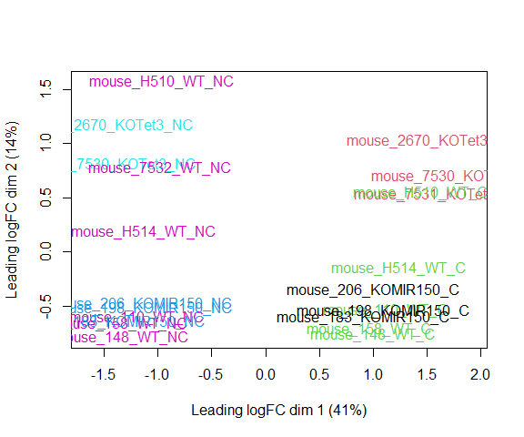<!-- -->

The MDS plot tells you **A LOT** about what to expect from your experiment.

**3a\.** Extracting "normalized" expression table

### RPKM vs. FPKM vs. CPM and Model Based
* RPKM - Reads per kilobase per million mapped reads
* FPKM - Fragments per kilobase per million mapped reads
* logCPM – log Counts per million [ good for producing MDS plots, estimate of normalized values in model based ]
* Model based - original read counts are not themselves transformed, but rather correction factors are used in the DE model itself.

We use the `cpm` function with log=TRUE to obtain log-transformed normalized expression data.  On the log scale, the data has less mean-dependent variability and is more suitable for plotting.

```r
logcpm <- cpm(d, prior.count=2, log=TRUE)
write.table(logcpm,"rnaseq_workshop_normalized_counts.txt",sep="\t",quote=F)
```

## Quiz 2

<div id="quiz2" class="quiz"></div>
<button id="submit2">Submit Quiz</button>
<div id="results2" class="output"></div>
<script>
quizContainer2 = document.getElementById('quiz2');
resultsContainer2 = document.getElementById('results2');
submitButton2 = document.getElementById('submit2');

myQuestions2 = [
  {
    question: "Which sample has the largest normalization factor?",
    answers: {
      a: "mouse_7530_KOTet3_NC",
      b: "mouse_110_WT_C",
      c: "mouse_148_WT_C",
    },
    correctAnswer: "b"
  },
  {
    question: "Is the sample with the largest normalization factor the sample with the smallest total counts?",
    answers: {
      a: "TRUE",
      b: "FALSE"
    },
    correctAnswer: "b"
  },
  {
    question: "Based on the MDS plot, what is the biggest source of between-sample differences?",
    answers: {
      a: "Genotype",
      b: "Mouse",
      c: "Cell type"
    },
    correctAnswer: "c"
  },
  {
    question: "Make an MDS plot of the unfiltered data.  How does it differ from the MDS plot of the filtered data?",
    answers: {
      a: "The axis ranges are larger",
      b: "There is less separation",
      c: "The plots are nearly identical"
    },
    correctAnswer: "c"
  }
];

buildQuiz(myQuestions2, quizContainer2);
submitButton2.addEventListener('click', function() {showResults(myQuestions2, quizContainer2, resultsContainer2);});
</script>

*Note: If you changed the expression cutoff to answer the last quiz question, before proceeding change it back to the original value and rerun the above code using "Run all chunks above" in the Run menu in RStudio.*

## 4. Voom transformation and calculation of variance weights

Specify the model to be fitted.  We do this before using voom since voom uses variances of the model residuals (observed - fitted)

* The model you use will change for every experiment, and this step should be given the most time and attention.*


```r
group <- metadata$group
mouse <- metadata$mouse
mm <- model.matrix(~0 + group + mouse)
head(mm)
```

```
##   groupKOMIR150.C groupKOTet3.C groupWT.C groupKOMIR150.NC groupKOTet3.NC
## 1               0             0         1                0              0
## 2               0             0         0                0              0
## 3               0             0         1                0              0
## 4               0             0         0                0              0
## 5               0             0         1                0              0
## 6               0             0         0                0              0
##   groupWT.NC mouse148 mouse158 mouse183 mouse198 mouse206 mouse2670 mouse7530
## 1          0        0        0        0        0        0         0         0
## 2          1        0        0        0        0        0         0         0
## 3          0        1        0        0        0        0         0         0
## 4          1        1        0        0        0        0         0         0
## 5          0        0        1        0        0        0         0         0
## 6          1        0        1        0        0        0         0         0
##   mouse7531 mouse7532 mouseH510 mouseH514
## 1         0         0         0         0
## 2         0         0         0         0
## 3         0         0         0         0
## 4         0         0         0         0
## 5         0         0         0         0
## 6         0         0         0         0
```


**4a\.** **Voom**

```r
y <- voom(d, mm, plot = T)
```

```
## Coefficients not estimable: mouse206 mouse7531
```

```
## Warning: Partial NA coefficients for 12954 probe(s)
```

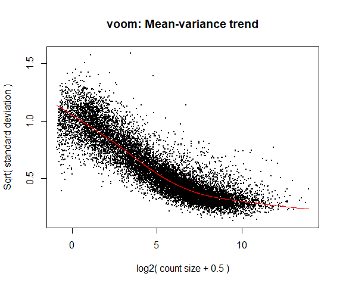<!-- -->

What is voom doing?

1. Counts are transformed to log2 counts per million reads (CPM), where "per million reads" is defined based on the normalization factors we calculated earlier.
2. A linear model is fitted to the log2 CPM for each gene, and the residuals are calculated.
3. A smoothed curve is fitted to the sqrt(residual standard deviation) by average expression.
(see red line in plot above)
4. The smoothed curve is used to obtain weights for each gene and sample that are passed into limma along with the log2 CPMs.

More details at "[voom: precision weights unlock linear model analysis tools for RNA-seq read counts](https://genomebiology.biomedcentral.com/articles/10.1186/gb-2014-15-2-r29)"

If your voom plot looks like the below (performed on the raw data), you might want to filter more:

```r
tmp <- voom(d0, mm, plot = T)
```

```
## Coefficients not estimable: mouse206 mouse7531
```

```
## Warning: Partial NA coefficients for 55359 probe(s)
```

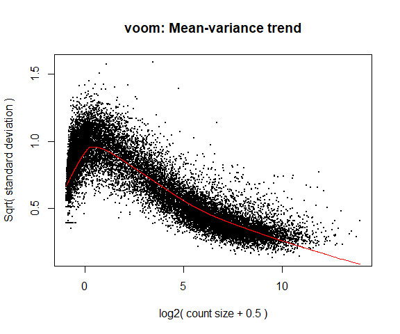<!-- -->


## 5. Fitting linear models in limma

lmFit fits a linear model using weighted least squares for each gene:

```r
fit <- lmFit(y, mm)
```

```
## Coefficients not estimable: mouse206 mouse7531
```

```
## Warning: Partial NA coefficients for 12954 probe(s)
```

```r
head(coef(fit))
```

```
##                       groupKOMIR150.C groupKOTet3.C  groupWT.C groupKOMIR150.NC
## ENSMUSG00000098104.2        0.4720798     -0.870603 -0.4316833        0.2638469
## ENSMUSG00000033845.14       4.8638714      5.012040  4.7598766        5.1087704
## ENSMUSG00000025903.15       5.1366531      5.637192  5.5201340        5.2593887
## ENSMUSG00000033813.16       5.8881295      5.647722  5.7741947        5.9388317
## ENSMUSG00000033793.13       5.2602006      5.383638  5.4209753        5.0792648
## ENSMUSG00000025907.15       6.5237647      6.660778  6.5419298        6.3403233
##                       groupKOTet3.NC groupWT.NC    mouse148    mouse158
## ENSMUSG00000098104.2       -1.235836 -0.7398125  0.80427646  0.39783246
## ENSMUSG00000033845.14       4.739165  4.6245885  0.23188142  0.16714923
## ENSMUSG00000025903.15       5.602049  5.3569676 -0.03870226  0.04787700
## ENSMUSG00000033813.16       5.813070  5.7816498  0.05747635  0.04162350
## ENSMUSG00000033793.13       4.859347  5.1505746 -0.16372359 -0.22602668
## ENSMUSG00000025907.15       6.752538  6.2901305 -0.10201676 -0.02431071
##                         mouse183     mouse198 mouse206   mouse2670    mouse7530
## ENSMUSG00000098104.2  -1.7776673 -0.420725961       NA  0.82418308  0.570412284
## ENSMUSG00000033845.14 -0.4524378 -0.101096491       NA -0.04010506 -0.009189037
## ENSMUSG00000025903.15  0.3692613  0.412042949       NA  0.06371828 -0.116273915
## ENSMUSG00000033813.16 -0.2522189 -0.008124444       NA  0.17466166  0.200066974
## ENSMUSG00000033793.13 -0.3293721  0.061917018       NA  0.13070082  0.391684706
## ENSMUSG00000025907.15 -0.1200980  0.124757191       NA -0.09364496 -0.137254436
##                       mouse7531   mouse7532   mouseH510   mouseH514
## ENSMUSG00000098104.2         NA -1.71711464  1.25795206  0.45053235
## ENSMUSG00000033845.14        NA  0.19460873  0.16938109  0.15717135
## ENSMUSG00000025903.15        NA  0.25756753  0.10915539  0.22798142
## ENSMUSG00000033813.16        NA  0.06063102  0.04585317 -0.03198657
## ENSMUSG00000033793.13        NA -0.29461885 -0.03879688 -0.15134462
## ENSMUSG00000025907.15        NA  0.18072028  0.01131418 -0.12993225
```

Comparisons between groups (log fold-changes) are obtained as _contrasts_ of these fitted linear models:

## 6. Specify which groups to compare using contrasts:

Comparison between cell types for genotype WT.

```r
contr <- makeContrasts(groupWT.C - groupWT.NC, levels = colnames(coef(fit)))
contr
```

```
##                   Contrasts
## Levels             groupWT.C - groupWT.NC
##   groupKOMIR150.C                       0
##   groupKOTet3.C                         0
##   groupWT.C                             1
##   groupKOMIR150.NC                      0
##   groupKOTet3.NC                        0
##   groupWT.NC                           -1
##   mouse148                              0
##   mouse158                              0
##   mouse183                              0
##   mouse198                              0
##   mouse206                              0
##   mouse2670                             0
##   mouse7530                             0
##   mouse7531                             0
##   mouse7532                             0
##   mouseH510                             0
##   mouseH514                             0
```

**6a\.** Estimate contrast for each gene

```r
tmp <- contrasts.fit(fit, contr)
```

The variance characteristics of low expressed genes are different from high expressed genes, if treated the same, the effect is to over represent low expressed genes in the DE list. This is corrected for by the log transformation and voom. However, some genes will have increased or decreased variance that is not a result of low expression, but due to other random factors. We are going to run empirical Bayes to adjust the variance of these genes.

Empirical Bayes smoothing of standard errors (shifts standard errors that are much larger or smaller than those from other genes towards the average standard error) (see "[Linear Models and Empirical Bayes Methods for Assessing Differential Expression in Microarray Experiments](https://www.degruyter.com/doi/10.2202/1544-6115.1027)"

**6b\.** Apply EBayes

```r
tmp <- eBayes(tmp)
```

## 7. Multiple Testing Adjustment

The TopTable. Adjust for multiple testing using method of Benjamini & Hochberg (BH), or its 'alias' fdr. "[Controlling the false discovery rate: a practical and powerful approach to multiple testing](http://www.jstor.org/stable/2346101).

here `n=Inf` says to produce the topTable for **all** genes. 

```r
top.table <- topTable(tmp, adjust.method = "BH", sort.by = "P", n = Inf)
```

### Multiple Testing Correction

Simply a must! Best choices are:
  * [FDR](http://www.jstor.org/stable/2346101) (false discovery rate), such as Benjamini-Hochberg (1995).
  * [Qvalue](https://rss.onlinelibrary.wiley.com/doi/abs/10.1111/1467-9868.00346) - Storey (2002)

The FDR (or qvalue) is a statement about the list and is no longer about the gene (pvalue). So a FDR of 0.05, says you expect 5% false positives among the list of genes with an FDR of 0.05 or less.

The statement “Statistically significantly different” means FDR of 0.05 or less.

**7a\.** How many DE genes are there (false discovery rate corrected)?

```r
length(which(top.table$adj.P.Val < 0.05))
```

```
## [1] 5725
```

## 8. Check your results for confidence.

You've conducted an experiment, you've seen a phenotype. Now check which genes are most differentially expressed (show the top 50)? Look up these top genes, their description and ensure they relate to your experiment/phenotype. 

```r
head(top.table, 50)
```

```
##                           logFC   AveExpr         t      P.Value    adj.P.Val
## ENSMUSG00000020608.8  -2.487303  7.859413 -44.96194 1.162922e-19 1.506450e-15
## ENSMUSG00000049103.15  2.163439  9.880300  40.37803 7.630203e-19 3.576675e-15
## ENSMUSG00000052212.7   4.552604  6.191089  40.18876 8.283175e-19 3.576675e-15
## ENSMUSG00000030203.18 -4.120822  6.994223 -34.50726 1.182848e-17 3.830654e-14
## ENSMUSG00000021990.17 -2.675552  8.357254 -33.50752 1.973093e-17 4.488344e-14
## ENSMUSG00000026193.16  4.806490 10.144216  33.15139 2.376095e-17 4.488344e-14
## ENSMUSG00000027508.16 -1.899075  8.113147 -33.06551 2.485730e-17 4.488344e-14
## ENSMUSG00000024164.16  1.800409  9.861851  32.84297 2.795434e-17 4.488344e-14
## ENSMUSG00000037820.16 -4.166020  7.117346 -32.63710 3.118349e-17 4.488344e-14
## ENSMUSG00000048498.8  -5.796772  6.490853 -30.30744 1.128039e-16 1.408799e-13
## ENSMUSG00000038807.20 -1.561911  9.003764 -30.20493 1.196294e-16 1.408799e-13
## ENSMUSG00000030342.9  -3.675930  6.038229 -29.76804 1.539986e-16 1.500863e-13
## ENSMUSG00000021614.17  6.016099  5.427761  29.74002 1.565324e-16 1.500863e-13
## ENSMUSG00000030413.8  -2.606984  6.640424 -29.67898 1.622054e-16 1.500863e-13
## ENSMUSG00000028885.9  -2.352048  7.043370 -29.51912 1.781152e-16 1.538203e-13
## ENSMUSG00000020437.13 -1.226612 10.305956 -29.30716 2.017951e-16 1.633784e-13
## ENSMUSG00000027215.14 -2.570108  6.890304 -28.99455 2.429700e-16 1.746171e-13
## ENSMUSG00000018168.9  -3.877947  5.456427 -28.97496 2.458286e-16 1.746171e-13
## ENSMUSG00000029254.17 -2.453377  6.686820 -28.76516 2.787785e-16 1.746171e-13
## ENSMUSG00000039959.14 -1.483315  8.932358 -28.72046 2.863830e-16 1.746171e-13
## ENSMUSG00000051177.17  3.186486  4.986113  28.68998 2.916932e-16 1.746171e-13
## ENSMUSG00000037185.10 -1.536981  9.480073 -28.66259 2.965553e-16 1.746171e-13
## ENSMUSG00000022584.15  4.737613  6.736124  28.13190 4.097269e-16 2.298400e-13
## ENSMUSG00000020108.5  -2.051064  6.943477 -28.06926 4.258267e-16 2.298400e-13
## ENSMUSG00000020272.9  -1.298731 10.443857 -27.85991 4.846543e-16 2.511285e-13
## ENSMUSG00000020212.15 -2.163118  6.774248 -27.78875 5.065564e-16 2.523820e-13
## ENSMUSG00000038147.15  1.689977  7.138663  27.66749 5.463224e-16 2.621134e-13
## ENSMUSG00000023827.9  -2.143574  6.406302 -27.42669 6.353764e-16 2.921590e-13
## ENSMUSG00000018001.19 -2.613093  7.171597 -27.38072 6.540536e-16 2.921590e-13
## ENSMUSG00000020387.16 -4.942657  4.326890 -27.18977 7.380655e-16 3.186967e-13
## ENSMUSG00000021728.9   1.661634  8.387251  27.00981 8.277121e-16 3.354909e-13
## ENSMUSG00000023809.11 -3.193245  4.824177 -27.00784 8.287563e-16 3.354909e-13
## ENSMUSG00000008496.20 -1.485223  9.417190 -26.84548 9.196454e-16 3.610026e-13
## ENSMUSG00000039109.18  4.739066  8.315608  26.77182 9.642921e-16 3.673953e-13
## ENSMUSG00000035493.11  1.922015  9.747580  26.70411 1.007353e-15 3.728358e-13
## ENSMUSG00000051457.8  -2.261944  9.813548 -26.28658 1.321924e-15 4.756724e-13
## ENSMUSG00000026923.16  2.014614  6.624214  25.78622 1.840857e-15 6.444991e-13
## ENSMUSG00000029287.15 -3.784250  5.404697 -25.51756 2.204635e-15 7.515484e-13
## ENSMUSG00000043263.14  1.784599  7.846194  25.46720 2.280897e-15 7.576086e-13
## ENSMUSG00000042700.17 -1.813755  6.084302 -25.10440 2.919582e-15 9.383199e-13
## ENSMUSG00000044783.17 -1.728460  7.013402 -25.07950 2.969825e-15 9.383199e-13
## ENSMUSG00000025701.13 -2.754499  5.339541 -24.95884 3.226637e-15 9.951869e-13
## ENSMUSG00000027435.9   3.036282  6.718479  24.91343 3.329268e-15 9.953293e-13
## ENSMUSG00000050335.18  1.111991  8.961475  24.89119 3.380770e-15 9.953293e-13
## ENSMUSG00000033705.18  1.697787  7.149056  24.77195 3.671663e-15 1.056949e-12
## ENSMUSG00000016496.8  -3.558726  6.399878 -24.73266 3.773227e-15 1.062573e-12
## ENSMUSG00000005800.4   5.748643  4.125134  24.61749 4.088308e-15 1.118450e-12
## ENSMUSG00000020340.17 -2.252345  8.645285 -24.59800 4.144326e-15 1.118450e-12
## ENSMUSG00000022818.14 -1.748114  6.777333 -24.47904 4.504253e-15 1.190777e-12
## ENSMUSG00000040809.11  3.884905  7.155146  24.42513 4.678089e-15 1.211999e-12
##                              B
## ENSMUSG00000020608.8  35.28095
## ENSMUSG00000049103.15 33.50073
## ENSMUSG00000052212.7  32.85197
## ENSMUSG00000030203.18 30.67902
## ENSMUSG00000021990.17 30.25682
## ENSMUSG00000026193.16 29.99183
## ENSMUSG00000027508.16 30.02660
## ENSMUSG00000024164.16 29.85071
## ENSMUSG00000037820.16 29.70891
## ENSMUSG00000048498.8  28.11766
## ENSMUSG00000038807.20 28.40817
## ENSMUSG00000030342.9  28.04034
## ENSMUSG00000021614.17 26.92463
## ENSMUSG00000030413.8  28.14937
## ENSMUSG00000028885.9  28.06012
## ENSMUSG00000020437.13 27.77878
## ENSMUSG00000027215.14 27.74709
## ENSMUSG00000018168.9  27.53382
## ENSMUSG00000029254.17 27.61018
## ENSMUSG00000039959.14 27.51272
## ENSMUSG00000051177.17 27.14811
## ENSMUSG00000037185.10 27.44954
## ENSMUSG00000022584.15 27.20102
## ENSMUSG00000020108.5  27.17760
## ENSMUSG00000020272.9  26.86194
## ENSMUSG00000020212.15 27.02030
## ENSMUSG00000038147.15 26.93753
## ENSMUSG00000023827.9  26.78743
## ENSMUSG00000018001.19 26.75808
## ENSMUSG00000020387.16 25.19657
## ENSMUSG00000021728.9  26.46737
## ENSMUSG00000023809.11 26.14980
## ENSMUSG00000008496.20 26.28405
## ENSMUSG00000039109.18 26.32662
## ENSMUSG00000035493.11 26.17735
## ENSMUSG00000051457.8  25.87927
## ENSMUSG00000026923.16 25.72519
## ENSMUSG00000029287.15 25.44939
## ENSMUSG00000043263.14 25.45149
## ENSMUSG00000042700.17 25.27035
## ENSMUSG00000044783.17 25.23768
## ENSMUSG00000025701.13 25.08077
## ENSMUSG00000027435.9  25.14253
## ENSMUSG00000050335.18 24.98141
## ENSMUSG00000033705.18 25.00700
## ENSMUSG00000016496.8  25.00045
## ENSMUSG00000005800.4  23.06283
## ENSMUSG00000020340.17 24.80052
## ENSMUSG00000022818.14 24.82373
## ENSMUSG00000040809.11 24.78761
```
Columns are
* logFC: log2 fold change of WT.C/WT.NC
* AveExpr: Average expression across all samples, in log2 CPM
* t: logFC divided by its standard error
* P.Value: Raw p-value (based on t) from test that logFC differs from 0
* adj.P.Val: Benjamini-Hochberg false discovery rate adjusted p-value
* B: log-odds that gene is DE (arguably less useful than the other columns)

ENSMUSG00000030203.18 has higher expression at WT NC than at WT C (logFC is negative).  ENSMUSG00000026193.16 has higher expression at WT C than at WT NC (logFC is positive).

In the paper, the authors specify that NC cells were identified by low expression of Ly6C (which is now called Ly6c1 or ENSMUSG00000079018.11).  Is this gene differentially expressed?

```r
top.table["ENSMUSG00000079018.11",]
```

```
##    logFC AveExpr  t P.Value adj.P.Val  B
## NA    NA      NA NA      NA        NA NA
```

```r
d0$counts["ENSMUSG00000079018.11",]
```

```
##        mouse_110_WT_C       mouse_110_WT_NC        mouse_148_WT_C 
##                     2                     0                     2 
##       mouse_148_WT_NC        mouse_158_WT_C       mouse_158_WT_NC 
##                     0                     2                     0 
##  mouse_183_KOMIR150_C mouse_183_KOMIR150_NC  mouse_198_KOMIR150_C 
##                     1                     0                     1 
## mouse_198_KOMIR150_NC  mouse_206_KOMIR150_C mouse_206_KOMIR150_NC 
##                     0                     1                     0 
##   mouse_2670_KOTet3_C  mouse_2670_KOTet3_NC   mouse_7530_KOTet3_C 
##                     2                     0                     2 
##  mouse_7530_KOTet3_NC   mouse_7531_KOTet3_C      mouse_7532_WT_NC 
##                     0                     1                     0 
##       mouse_H510_WT_C      mouse_H510_WT_NC       mouse_H514_WT_C 
##                     1                     0                     2 
##      mouse_H514_WT_NC 
##                     0
```

Ly6c1 was removed from our data by the filtering step, because the maximum counts for the gene did not exceed 2.

## 9. Write top.table to a file, adding in cpms and annotation

```r
top.table$Gene <- rownames(top.table)
top.table <- top.table[,c("Gene", names(top.table)[1:6])]
top.table <- data.frame(top.table,anno[match(top.table$Gene,anno$Gene.stable.ID.version),],logcpm[match(top.table$Gene,rownames(logcpm)),])

head(top.table)
```

```
##                                        Gene     logFC   AveExpr         t
## ENSMUSG00000020608.8   ENSMUSG00000020608.8 -2.487303  7.859413 -44.96194
## ENSMUSG00000049103.15 ENSMUSG00000049103.15  2.163439  9.880300  40.37803
## ENSMUSG00000052212.7   ENSMUSG00000052212.7  4.552604  6.191089  40.18876
## ENSMUSG00000030203.18 ENSMUSG00000030203.18 -4.120822  6.994223 -34.50726
## ENSMUSG00000021990.17 ENSMUSG00000021990.17 -2.675552  8.357254 -33.50752
## ENSMUSG00000026193.16 ENSMUSG00000026193.16  4.806490 10.144216  33.15139
##                            P.Value    adj.P.Val        B     Gene.stable.ID
## ENSMUSG00000020608.8  1.162922e-19 1.506450e-15 35.28095 ENSMUSG00000020608
## ENSMUSG00000049103.15 7.630203e-19 3.576675e-15 33.50073 ENSMUSG00000049103
## ENSMUSG00000052212.7  8.283175e-19 3.576675e-15 32.85197 ENSMUSG00000052212
## ENSMUSG00000030203.18 1.182848e-17 3.830654e-14 30.67902 ENSMUSG00000030203
## ENSMUSG00000021990.17 1.973093e-17 4.488344e-14 30.25682 ENSMUSG00000021990
## ENSMUSG00000026193.16 2.376095e-17 4.488344e-14 29.99183 ENSMUSG00000026193
##                       Gene.stable.ID.version Gene.name
## ENSMUSG00000020608.8    ENSMUSG00000020608.8      Smc6
## ENSMUSG00000049103.15  ENSMUSG00000049103.15      Ccr2
## ENSMUSG00000052212.7    ENSMUSG00000052212.7     Cd177
## ENSMUSG00000030203.18  ENSMUSG00000030203.18    Dusp16
## ENSMUSG00000021990.17  ENSMUSG00000021990.17   Spata13
## ENSMUSG00000026193.16  ENSMUSG00000026193.16       Fn1
##                                                                                  Gene.description
## ENSMUSG00000020608.8  structural maintenance of chromosomes 6 [Source:MGI Symbol;Acc:MGI:1914491]
## ENSMUSG00000049103.15         chemokine (C-C motif) receptor 2 [Source:MGI Symbol;Acc:MGI:106185]
## ENSMUSG00000052212.7                            CD177 antigen [Source:MGI Symbol;Acc:MGI:1916141]
## ENSMUSG00000030203.18         dual specificity phosphatase 16 [Source:MGI Symbol;Acc:MGI:1917936]
## ENSMUSG00000021990.17            spermatogenesis associated 13 [Source:MGI Symbol;Acc:MGI:104838]
## ENSMUSG00000026193.16                             fibronectin 1 [Source:MGI Symbol;Acc:MGI:95566]
##                            Gene.type Transcript.count Gene...GC.content
## ENSMUSG00000020608.8  protein_coding               12             38.40
## ENSMUSG00000049103.15 protein_coding                4             38.86
## ENSMUSG00000052212.7  protein_coding                2             52.26
## ENSMUSG00000030203.18 protein_coding                7             41.74
## ENSMUSG00000021990.17 protein_coding                9             47.38
## ENSMUSG00000026193.16 protein_coding               17             43.66
##                       Chromosome.scaffold.name Gene.start..bp. Gene.end..bp.
## ENSMUSG00000020608.8                        12        11315887      11369786
## ENSMUSG00000049103.15                        9       123901987     123913594
## ENSMUSG00000052212.7                         7        24443408      24459736
## ENSMUSG00000030203.18                        6       134692431     134769588
## ENSMUSG00000021990.17                       14        60871450      61002005
## ENSMUSG00000026193.16                        1        71624679      71692359
##                       Strand mouse_110_WT_C mouse_110_WT_NC mouse_148_WT_C
## ENSMUSG00000020608.8       1       6.624180        9.067061       7.044276
## ENSMUSG00000049103.15      1      10.898210        8.821314      11.259023
## ENSMUSG00000052212.7      -1       8.612549        4.153554       8.373256
## ENSMUSG00000030203.18     -1       4.995600        8.975553       5.198700
## ENSMUSG00000021990.17      1       6.968790        9.548885       7.355297
## ENSMUSG00000026193.16     -1      12.915767        7.928271      12.391111
##                       mouse_148_WT_NC mouse_158_WT_C mouse_158_WT_NC
## ENSMUSG00000020608.8         9.420064       6.775251        9.189817
## ENSMUSG00000049103.15        8.960843      11.075129        8.726306
## ENSMUSG00000052212.7         3.633102       8.118945        3.391894
## ENSMUSG00000030203.18        9.080282       5.464359        9.205093
## ENSMUSG00000021990.17        9.779998       7.039495        9.734873
## ENSMUSG00000026193.16        7.987542      12.510277        7.394448
##                       mouse_183_KOMIR150_C mouse_183_KOMIR150_NC
## ENSMUSG00000020608.8              6.796259              9.271688
## ENSMUSG00000049103.15            11.032684              8.698646
## ENSMUSG00000052212.7              8.719722              3.499342
## ENSMUSG00000030203.18             5.226591              8.877177
## ENSMUSG00000021990.17             7.412196              9.545027
## ENSMUSG00000026193.16            12.829169              6.909847
##                       mouse_198_KOMIR150_C mouse_198_KOMIR150_NC
## ENSMUSG00000020608.8              6.504840              8.970617
## ENSMUSG00000049103.15            10.721537              8.509301
## ENSMUSG00000052212.7              8.651454              3.759903
## ENSMUSG00000030203.18             4.814481              9.188429
## ENSMUSG00000021990.17             6.548190              9.308671
## ENSMUSG00000026193.16            12.639374              7.689191
##                       mouse_206_KOMIR150_C mouse_206_KOMIR150_NC
## ENSMUSG00000020608.8              6.444808              8.900377
## ENSMUSG00000049103.15            10.797927              8.505028
## ENSMUSG00000052212.7              8.756322              3.625476
## ENSMUSG00000030203.18             5.239606              9.469661
## ENSMUSG00000021990.17             6.593106              9.147597
## ENSMUSG00000026193.16            12.839469              8.805309
##                       mouse_2670_KOTet3_C mouse_2670_KOTet3_NC
## ENSMUSG00000020608.8             6.591425             9.506668
## ENSMUSG00000049103.15           11.453884             7.521540
## ENSMUSG00000052212.7             7.821076             4.119719
## ENSMUSG00000030203.18            4.940924             9.878845
## ENSMUSG00000021990.17            7.796727            10.621256
## ENSMUSG00000026193.16           12.170910             6.458439
##                       mouse_7530_KOTet3_C mouse_7530_KOTet3_NC
## ENSMUSG00000020608.8             6.425808             9.338677
## ENSMUSG00000049103.15           11.185680             7.209795
## ENSMUSG00000052212.7             8.236312             3.283936
## ENSMUSG00000030203.18            4.042293             9.447064
## ENSMUSG00000021990.17            7.348218            10.446254
## ENSMUSG00000026193.16           13.002444             6.275277
##                       mouse_7531_KOTet3_C mouse_7532_WT_NC mouse_H510_WT_C
## ENSMUSG00000020608.8             6.259694         8.832110        6.444612
## ENSMUSG00000049103.15           11.317396         9.572462       11.429035
## ENSMUSG00000052212.7             9.009130         4.523782        8.938977
## ENSMUSG00000030203.18            4.072628         8.995467        4.149351
## ENSMUSG00000021990.17            6.907025         9.512566        6.517651
## ENSMUSG00000026193.16           13.034729         8.118894       12.935082
##                       mouse_H510_WT_NC mouse_H514_WT_C mouse_H514_WT_NC
## ENSMUSG00000020608.8          8.973205        6.481128         9.157598
## ENSMUSG00000049103.15         9.500685       11.194546         9.005389
## ENSMUSG00000052212.7          4.565919        8.737952         4.328884
## ENSMUSG00000030203.18         8.994633        4.820908         9.165231
## ENSMUSG00000021990.17         9.429523        6.796284         9.585713
## ENSMUSG00000026193.16         8.312858       12.498512         7.582299
```

```r
write.table(top.table, file = "WT.C_v_WT.NC.txt", row.names = F, sep = "\t", quote = F)
```

## Quiz 3

<div id="quiz3" class="quiz"></div>
<button id="submit3">Submit Quiz</button>
<div id="results3" class="output"></div>
<script>
quizContainer3 = document.getElementById('quiz3');
resultsContainer3 = document.getElementById('results3');
submitButton3 = document.getElementById('submit3');

myQuestions3 = [
  {
      question: "Based on the above model, how many genes are significantly differentially expressed between WT C and WT NC? (Significant = adjusted P < 0.05)",
    answers: {
      a: "6,566",
      b: "0",
      c: "5,725",
    },
    correctAnswer: "c"
  },
  {
    question: "Based on the above model, and without taking significance into account, how many genes have higher expression in WT C than in WT NC",
    answers: {
      a: "6,255",
      b: "2,792",
      c: "6,699",
    },
    correctAnswer: "a"
  },
  {
    question: "How many genes have an unadjusted p-value less than 0.05 for the comparison of WT C to WT NC in the above model",
    answers: {
      a: "6,566",
      b: "0",
      c: "5,725",
    },
    correctAnswer: "a"
  },
  {
    question: "What is the adjusted p-value for the last gene with unadjusted P < 0.05?  (This is the proportion of the genes with unadjusted P < 0.05 that, on average, would be expected to be false discoveries.)",
    answers: {
      a: "0.050",
      b: "0.511",
      c: "0.099"
    },
    correctAnswer: "c"
  },
  {
    question: "Change the expression cutoff from 2 to 1.  What does the voom plot look like?",
      answers: {
        a: "The red line curves down on the left",
        b: "The red line does not curve down on the left, but there are more points below the red line on the left.",
        c: "The plot looks identical to that when the cutoff is 2."
      },
      correctAnswer: "b"
  },
  {
    question: "Which of these conditions is LEAST likely to indicate a problem with your analysis code?",
    answers: {
      a: "Every gene is differentially expressed",
      b: "No gene is differentially expressed",
      c: "The top of your gene list is dominated by antisense transcripts"
    },
    correctAnswer: "b"
  },
  {
  question: "'Extra credit' question: Rerun the differential expression analysis using a expression filtering cutoff of 1 instead of 2.  How many significantly DE genes do you get for the comparison of WT C and WT NC?",
    answers: {
      a: "5,675",
      b: "5,725",
      c: "0"
    },
    correctAnswer: "a"
  }
];

buildQuiz(myQuestions3, quizContainer3);
submitButton3.addEventListener('click', function() {showResults(myQuestions3, quizContainer3, resultsContainer3);});
</script>

*Note: If you changed the expression cutoff to answer quiz questions, before proceeding change it back to the original value and rerun the above code using "Run all chunks above" in the Run menu in RStudio.*

# Linear models and contrasts

Let's say we want to compare genotypes for cell type C.  The only thing we have to change is the call to makeContrasts:

```r
contr <- makeContrasts(groupWT.C - groupKOMIR150.C, levels = colnames(coef(fit)))
tmp <- contrasts.fit(fit, contr)
tmp <- eBayes(tmp)
top.table <- topTable(tmp, sort.by = "P", n = Inf)
head(top.table, 20)
```

```
##                            logFC   AveExpr          t      P.Value    adj.P.Val
## ENSMUSG00000030703.9  -2.9797670 4.8096334 -15.320007 1.227322e-11 1.589873e-07
## ENSMUSG00000044229.10 -3.2497085 6.8295076 -11.553745 1.159548e-09 7.510393e-06
## ENSMUSG00000032012.10 -5.2346131 5.0045873  -8.974519 5.394136e-08 1.290840e-04
## ENSMUSG00000030748.10  1.7326877 7.0660459   8.961804 5.507239e-08 1.290840e-04
## ENSMUSG00000040152.9  -2.2564160 6.4434805  -8.915612 5.939444e-08 1.290840e-04
## ENSMUSG00000066687.6  -2.0804192 4.9245631  -8.911574 5.978878e-08 1.290840e-04
## ENSMUSG00000067017.6   4.9881763 3.1242577   8.125642 2.252247e-07 4.167944e-04
## ENSMUSG00000008348.10 -1.1946393 6.3051297  -7.873947 3.501860e-07 5.670387e-04
## ENSMUSG00000096780.8  -5.6777310 2.3856596  -7.574784 5.981805e-07 8.609812e-04
## ENSMUSG00000020893.18 -1.2308836 7.5344588  -7.221692 1.142776e-06 1.480352e-03
## ENSMUSG00000028028.12  0.8592901 7.2921677   7.152000 1.301107e-06 1.509347e-03
## ENSMUSG00000039146.6   7.4351099 0.1201065   7.113499 1.398191e-06 1.509347e-03
## ENSMUSG00000028037.14  5.6377499 2.3456220   7.019584 1.667896e-06 1.661994e-03
## ENSMUSG00000030365.12  1.0085592 6.6857808   6.911812 2.045107e-06 1.892309e-03
## ENSMUSG00000055435.7  -1.3874349 4.9739950  -6.744988 2.812774e-06 2.429111e-03
## ENSMUSG00000028619.16  3.0833446 4.6811807   6.579713 3.871575e-06 3.134524e-03
## ENSMUSG00000024772.10 -1.2968233 6.3307475  -6.463771 4.854945e-06 3.699468e-03
## ENSMUSG00000051495.9  -0.8710340 7.1412361  -6.362568 5.924188e-06 4.263441e-03
## ENSMUSG00000042105.19 -0.7272502 7.4676681  -6.274772 7.048657e-06 4.805700e-03
## ENSMUSG00000054008.10 -0.9751131 6.5631010  -5.978097 1.277750e-05 7.935676e-03
##                               B
## ENSMUSG00000030703.9  16.553755
## ENSMUSG00000044229.10 12.462720
## ENSMUSG00000032012.10  7.865419
## ENSMUSG00000030748.10  8.678626
## ENSMUSG00000040152.9   8.449051
## ENSMUSG00000066687.6   8.537970
## ENSMUSG00000067017.6   5.734503
## ENSMUSG00000008348.10  6.738268
## ENSMUSG00000096780.8   3.704435
## ENSMUSG00000020893.18  5.399071
## ENSMUSG00000028028.12  5.316104
## ENSMUSG00000039146.6   2.354527
## ENSMUSG00000028037.14  4.027195
## ENSMUSG00000030365.12  5.026454
## ENSMUSG00000055435.7   4.766223
## ENSMUSG00000028619.16  4.198940
## ENSMUSG00000024772.10  4.100269
## ENSMUSG00000051495.9   3.775662
## ENSMUSG00000042105.19  3.556041
## ENSMUSG00000054008.10  3.062152
```

```r
length(which(top.table$adj.P.Val < 0.05)) # number of DE genes
```

```
## [1] 43
```

```r
top.table$Gene <- rownames(top.table)
top.table <- top.table[,c("Gene", names(top.table)[1:6])]
top.table <- data.frame(top.table,anno[match(top.table$Gene,anno$Gene.stable.ID),],logcpm[match(top.table$Gene,rownames(logcpm)),])

write.table(top.table, file = "WT.C_v_KOMIR150.C.txt", row.names = F, sep = "\t", quote = F)
```

## What if we refit our model as a two-factor model (rather than using the group variable)?

Create new model matrix:

```r
genotype <- factor(metadata$genotype, levels = c("WT", "KOMIR150", "KOTet3"))
cell_type <- factor(metadata$cell_type, levels = c("C", "NC"))
mouse <- factor(metadata$mouse, levels = c("110", "148", "158", "183", "198", "206", "2670", "7530", "7531", "7532", "H510", "H514"))
mm <- model.matrix(~genotype*cell_type + mouse)
```

We are specifying that model includes effects for genotype, cell type, and the genotype-cell type interaction (which allows the differences between genotypes to differ across cell types).


```r
colnames(mm)
```

```
##  [1] "(Intercept)"                  "genotypeKOMIR150"            
##  [3] "genotypeKOTet3"               "cell_typeNC"                 
##  [5] "mouse148"                     "mouse158"                    
##  [7] "mouse183"                     "mouse198"                    
##  [9] "mouse206"                     "mouse2670"                   
## [11] "mouse7530"                    "mouse7531"                   
## [13] "mouse7532"                    "mouseH510"                   
## [15] "mouseH514"                    "genotypeKOMIR150:cell_typeNC"
## [17] "genotypeKOTet3:cell_typeNC"
```


```r
y <- voom(d, mm, plot = F)
```

```
## Coefficients not estimable: mouse206 mouse7531
```

```
## Warning: Partial NA coefficients for 12954 probe(s)
```

```r
fit <- lmFit(y, mm)
```

```
## Coefficients not estimable: mouse206 mouse7531
```

```
## Warning: Partial NA coefficients for 12954 probe(s)
```

```r
head(coef(fit))
```

```
##                       (Intercept) genotypeKOMIR150 genotypeKOTet3  cell_typeNC
## ENSMUSG00000098104.2   -0.4316833       0.90376316    -0.43891963 -0.308129211
## ENSMUSG00000033845.14   4.7598766       0.10399479     0.25216348 -0.135288112
## ENSMUSG00000025903.15   5.5201340      -0.38348090     0.11705772 -0.163166304
## ENSMUSG00000033813.16   5.7741947       0.11393482    -0.12647239  0.007455091
## ENSMUSG00000033793.13   5.4209753      -0.16077468    -0.03733697 -0.270400666
## ENSMUSG00000025907.15   6.5419298      -0.01816504     0.11884872 -0.251799272
##                          mouse148    mouse158   mouse183     mouse198 mouse206
## ENSMUSG00000098104.2   0.80427646  0.39783246 -1.7776673 -0.420725961       NA
## ENSMUSG00000033845.14  0.23188142  0.16714923 -0.4524378 -0.101096491       NA
## ENSMUSG00000025903.15 -0.03870226  0.04787700  0.3692613  0.412042949       NA
## ENSMUSG00000033813.16  0.05747635  0.04162350 -0.2522189 -0.008124444       NA
## ENSMUSG00000033793.13 -0.16372359 -0.22602668 -0.3293721  0.061917018       NA
## ENSMUSG00000025907.15 -0.10201676 -0.02431071 -0.1200980  0.124757191       NA
##                         mouse2670    mouse7530 mouse7531   mouse7532
## ENSMUSG00000098104.2   0.82418308  0.570412284        NA -1.71711464
## ENSMUSG00000033845.14 -0.04010506 -0.009189037        NA  0.19460873
## ENSMUSG00000025903.15  0.06371828 -0.116273915        NA  0.25756753
## ENSMUSG00000033813.16  0.17466166  0.200066974        NA  0.06063102
## ENSMUSG00000033793.13  0.13070082  0.391684706        NA -0.29461885
## ENSMUSG00000025907.15 -0.09364496 -0.137254436        NA  0.18072028
##                         mouseH510   mouseH514 genotypeKOMIR150:cell_typeNC
## ENSMUSG00000098104.2   1.25795206  0.45053235                   0.09989628
## ENSMUSG00000033845.14  0.16938109  0.15717135                   0.38018710
## ENSMUSG00000025903.15  0.10915539  0.22798142                   0.28590194
## ENSMUSG00000033813.16  0.04585317 -0.03198657                   0.04324708
## ENSMUSG00000033793.13 -0.03879688 -0.15134462                   0.08946483
## ENSMUSG00000025907.15  0.01131418 -0.12993225                   0.06835786
##                       genotypeKOTet3:cell_typeNC
## ENSMUSG00000098104.2                 -0.05710341
## ENSMUSG00000033845.14                -0.13758697
## ENSMUSG00000025903.15                 0.12802409
## ENSMUSG00000033813.16                 0.15789279
## ENSMUSG00000033793.13                -0.25389106
## ENSMUSG00000025907.15                 0.34355915
```

```r
colnames(coef(fit))
```

```
##  [1] "(Intercept)"                  "genotypeKOMIR150"            
##  [3] "genotypeKOTet3"               "cell_typeNC"                 
##  [5] "mouse148"                     "mouse158"                    
##  [7] "mouse183"                     "mouse198"                    
##  [9] "mouse206"                     "mouse2670"                   
## [11] "mouse7530"                    "mouse7531"                   
## [13] "mouse7532"                    "mouseH510"                   
## [15] "mouseH514"                    "genotypeKOMIR150:cell_typeNC"
## [17] "genotypeKOTet3:cell_typeNC"
```
* The coefficient genotypeKOMIR150 represents the difference in mean expression between KOMIR150 and the reference genotype (WT), _for cell type C_ (the reference level for cell type)
* The coefficient cell_typeNC represents the difference in mean expression between cell type NC and cell type C, _for genotype WT_
* The coefficient genotypeKOMIR150:cell_typeNC is the difference between cell types NC and C of the differences between genotypes KOMIR150 and WT (the interaction effect).

Let's estimate the difference between genotypes WT and KOMIR150 in cell type C.

```r
tmp <- contrasts.fit(fit, coef = 2) # Directly test second coefficient
tmp <- eBayes(tmp)
top.table <- topTable(tmp, sort.by = "P", n = Inf)
head(top.table, 20)
```

```
##                            logFC   AveExpr         t      P.Value    adj.P.Val
## ENSMUSG00000030703.9   2.9797670 4.8096334 15.320007 1.227322e-11 1.589873e-07
## ENSMUSG00000044229.10  3.2497085 6.8295076 11.553745 1.159548e-09 7.510393e-06
## ENSMUSG00000032012.10  5.2346131 5.0045873  8.974519 5.394136e-08 1.290840e-04
## ENSMUSG00000030748.10 -1.7326877 7.0660459 -8.961804 5.507239e-08 1.290840e-04
## ENSMUSG00000040152.9   2.2564160 6.4434805  8.915612 5.939444e-08 1.290840e-04
## ENSMUSG00000066687.6   2.0804192 4.9245631  8.911574 5.978878e-08 1.290840e-04
## ENSMUSG00000067017.6  -4.9881763 3.1242577 -8.125642 2.252247e-07 4.167944e-04
## ENSMUSG00000008348.10  1.1946393 6.3051297  7.873947 3.501860e-07 5.670387e-04
## ENSMUSG00000096780.8   5.6777310 2.3856596  7.574784 5.981805e-07 8.609812e-04
## ENSMUSG00000020893.18  1.2308836 7.5344588  7.221692 1.142776e-06 1.480352e-03
## ENSMUSG00000028028.12 -0.8592901 7.2921677 -7.152000 1.301107e-06 1.509347e-03
## ENSMUSG00000039146.6  -7.4351099 0.1201065 -7.113499 1.398191e-06 1.509347e-03
## ENSMUSG00000028037.14 -5.6377499 2.3456220 -7.019584 1.667896e-06 1.661994e-03
## ENSMUSG00000030365.12 -1.0085592 6.6857808 -6.911812 2.045107e-06 1.892309e-03
## ENSMUSG00000055435.7   1.3874349 4.9739950  6.744988 2.812774e-06 2.429111e-03
## ENSMUSG00000028619.16 -3.0833446 4.6811807 -6.579713 3.871575e-06 3.134524e-03
## ENSMUSG00000024772.10  1.2968233 6.3307475  6.463771 4.854945e-06 3.699468e-03
## ENSMUSG00000051495.9   0.8710340 7.1412361  6.362568 5.924188e-06 4.263441e-03
## ENSMUSG00000042105.19  0.7272502 7.4676681  6.274772 7.048657e-06 4.805700e-03
## ENSMUSG00000054008.10  0.9751131 6.5631010  5.978097 1.277750e-05 7.935676e-03
##                               B
## ENSMUSG00000030703.9  16.553755
## ENSMUSG00000044229.10 12.462720
## ENSMUSG00000032012.10  7.865419
## ENSMUSG00000030748.10  8.678626
## ENSMUSG00000040152.9   8.449051
## ENSMUSG00000066687.6   8.537970
## ENSMUSG00000067017.6   5.734503
## ENSMUSG00000008348.10  6.738268
## ENSMUSG00000096780.8   3.704435
## ENSMUSG00000020893.18  5.399071
## ENSMUSG00000028028.12  5.316104
## ENSMUSG00000039146.6   2.354527
## ENSMUSG00000028037.14  4.027195
## ENSMUSG00000030365.12  5.026454
## ENSMUSG00000055435.7   4.766223
## ENSMUSG00000028619.16  4.198940
## ENSMUSG00000024772.10  4.100269
## ENSMUSG00000051495.9   3.775662
## ENSMUSG00000042105.19  3.556041
## ENSMUSG00000054008.10  3.062152
```

```r
length(which(top.table$adj.P.Val < 0.05)) # number of DE genes
```

```
## [1] 43
```
We get the same results as with the model where each coefficient corresponded to a group mean.  In essence, these are the _same_ model, so use whichever is most convenient for what you are estimating.

The interaction effects genotypeKOMIR150:cell_typeNC are easier to estimate and test in this setup.

```r
head(coef(fit))
```

```
##                       (Intercept) genotypeKOMIR150 genotypeKOTet3  cell_typeNC
## ENSMUSG00000098104.2   -0.4316833       0.90376316    -0.43891963 -0.308129211
## ENSMUSG00000033845.14   4.7598766       0.10399479     0.25216348 -0.135288112
## ENSMUSG00000025903.15   5.5201340      -0.38348090     0.11705772 -0.163166304
## ENSMUSG00000033813.16   5.7741947       0.11393482    -0.12647239  0.007455091
## ENSMUSG00000033793.13   5.4209753      -0.16077468    -0.03733697 -0.270400666
## ENSMUSG00000025907.15   6.5419298      -0.01816504     0.11884872 -0.251799272
##                          mouse148    mouse158   mouse183     mouse198 mouse206
## ENSMUSG00000098104.2   0.80427646  0.39783246 -1.7776673 -0.420725961       NA
## ENSMUSG00000033845.14  0.23188142  0.16714923 -0.4524378 -0.101096491       NA
## ENSMUSG00000025903.15 -0.03870226  0.04787700  0.3692613  0.412042949       NA
## ENSMUSG00000033813.16  0.05747635  0.04162350 -0.2522189 -0.008124444       NA
## ENSMUSG00000033793.13 -0.16372359 -0.22602668 -0.3293721  0.061917018       NA
## ENSMUSG00000025907.15 -0.10201676 -0.02431071 -0.1200980  0.124757191       NA
##                         mouse2670    mouse7530 mouse7531   mouse7532
## ENSMUSG00000098104.2   0.82418308  0.570412284        NA -1.71711464
## ENSMUSG00000033845.14 -0.04010506 -0.009189037        NA  0.19460873
## ENSMUSG00000025903.15  0.06371828 -0.116273915        NA  0.25756753
## ENSMUSG00000033813.16  0.17466166  0.200066974        NA  0.06063102
## ENSMUSG00000033793.13  0.13070082  0.391684706        NA -0.29461885
## ENSMUSG00000025907.15 -0.09364496 -0.137254436        NA  0.18072028
##                         mouseH510   mouseH514 genotypeKOMIR150:cell_typeNC
## ENSMUSG00000098104.2   1.25795206  0.45053235                   0.09989628
## ENSMUSG00000033845.14  0.16938109  0.15717135                   0.38018710
## ENSMUSG00000025903.15  0.10915539  0.22798142                   0.28590194
## ENSMUSG00000033813.16  0.04585317 -0.03198657                   0.04324708
## ENSMUSG00000033793.13 -0.03879688 -0.15134462                   0.08946483
## ENSMUSG00000025907.15  0.01131418 -0.12993225                   0.06835786
##                       genotypeKOTet3:cell_typeNC
## ENSMUSG00000098104.2                 -0.05710341
## ENSMUSG00000033845.14                -0.13758697
## ENSMUSG00000025903.15                 0.12802409
## ENSMUSG00000033813.16                 0.15789279
## ENSMUSG00000033793.13                -0.25389106
## ENSMUSG00000025907.15                 0.34355915
```

```r
colnames(coef(fit))
```

```
##  [1] "(Intercept)"                  "genotypeKOMIR150"            
##  [3] "genotypeKOTet3"               "cell_typeNC"                 
##  [5] "mouse148"                     "mouse158"                    
##  [7] "mouse183"                     "mouse198"                    
##  [9] "mouse206"                     "mouse2670"                   
## [11] "mouse7530"                    "mouse7531"                   
## [13] "mouse7532"                    "mouseH510"                   
## [15] "mouseH514"                    "genotypeKOMIR150:cell_typeNC"
## [17] "genotypeKOTet3:cell_typeNC"
```


```r
tmp <- contrasts.fit(fit, coef = 16) # Test genotypeKOMIR150:cell_typeNC
tmp <- eBayes(tmp)
top.table <- topTable(tmp, sort.by = "P", n = Inf)
head(top.table, 20)
```

```
##                            logFC    AveExpr         t      P.Value adj.P.Val
## ENSMUSG00000030748.10  0.7177323  7.0660459  4.557231 0.0002554872  0.752253
## ENSMUSG00000076609.3  -4.4637783  3.4662592 -4.518670 0.0002778949  0.752253
## ENSMUSG00000033004.17 -0.3905878  8.7783261 -4.497904 0.0002907781  0.752253
## ENSMUSG00000029004.16 -0.3452175  8.5118706 -4.272042 0.0004768723  0.752253
## ENSMUSG00000019761.11  3.7126802 -0.8639142  4.147051 0.0006277713  0.752253
## ENSMUSG00000015501.11 -0.8405195  5.4935666 -4.119791 0.0006666220  0.752253
## ENSMUSG00000004952.14 -0.4538479  7.8927502 -4.105685 0.0006876671  0.752253
## ENSMUSG00000054387.14 -0.3568046  7.9949874 -4.097867 0.0006996178  0.752253
## ENSMUSG00000049313.9   0.3097374  9.7730340  4.028431 0.0008153758  0.752253
## ENSMUSG00000070305.11  1.6486709  3.4358103  4.015474 0.0008390193  0.752253
## ENSMUSG00000004110.18 -3.5113056  0.6676078 -3.973949 0.0009195433  0.752253
## ENSMUSG00000030724.8  -2.8044757  1.0347984 -3.955979 0.0009567535  0.752253
## ENSMUSG00000026357.4   0.9338323  4.3874897  3.932417 0.0010078447  0.752253
## ENSMUSG00000032026.8  -0.6472912  5.6061466 -3.911615 0.0010552201  0.752253
## ENSMUSG00000110218.2  -1.8838622  2.5483876 -3.845545 0.0012210127  0.752253
## ENSMUSG00000029647.16 -0.3429068  7.5827393 -3.836288 0.0012462392  0.752253
## ENSMUSG00000024772.10 -0.6795287  6.3307475 -3.831189 0.0012603560  0.752253
## ENSMUSG00000039115.14 -3.6008455 -0.5458855 -3.825240 0.0012770273  0.752253
## ENSMUSG00000005533.11 -0.8340858  5.6300063 -3.794652 0.0013662994  0.752253
## ENSMUSG00000037020.17 -0.9150202  3.9982178 -3.761799 0.0014691453  0.752253
##                                 B
## ENSMUSG00000030748.10  0.49889404
## ENSMUSG00000076609.3  -1.09189870
## ENSMUSG00000033004.17  0.49295200
## ENSMUSG00000029004.16  0.03530396
## ENSMUSG00000019761.11 -3.83546078
## ENSMUSG00000015501.11 -0.42926939
## ENSMUSG00000004952.14 -0.27908591
## ENSMUSG00000054387.14 -0.30212565
## ENSMUSG00000049313.9  -0.53079814
## ENSMUSG00000070305.11 -1.94698557
## ENSMUSG00000004110.18 -3.10923798
## ENSMUSG00000030724.8  -2.84358549
## ENSMUSG00000026357.4  -1.10816474
## ENSMUSG00000032026.8  -0.75365191
## ENSMUSG00000110218.2  -2.50493951
## ENSMUSG00000029647.16 -0.81763098
## ENSMUSG00000024772.10 -0.80967362
## ENSMUSG00000039115.14 -3.89839390
## ENSMUSG00000005533.11 -0.93199028
## ENSMUSG00000037020.17 -1.60813286
```

```r
length(which(top.table$adj.P.Val < 0.05))
```

```
## [1] 0
```

The log fold change here is the difference between genotypes KOMIR150 and WT in the log fold changes between cell types NC and C.

A gene for which this interaction effect is significant is one for which the effect of cell type differs between genotypes, and for which the effect of genotypes differs between cell types.

### More complicated models
Specifying a different model is simply a matter of changing the calls to model.matrix (and possibly to contrasts.fit).

What if we want to adjust for a continuous variable like some health score?
(We are making this data up here, but it would typically be a variable in your metadata.)

```r
# Generate example health data
set.seed(99)
HScore <- rnorm(n = 22, mean = 7.5, sd = 1)
HScore
```

```
##  [1] 7.713963 7.979658 7.587829 7.943859 7.137162 7.622674 6.636155 7.989624
##  [9] 7.135883 6.205758 6.754231 8.421550 8.250054 4.991446 4.459066 7.500266
## [17] 7.105981 5.754972 7.998631 7.770954 8.598922 8.252513
```

Model adjusting for HScore score:

```r
mm <- model.matrix(~0 + group + mouse + HScore)
y <- voom(d, mm, plot = F)
```

```
## Coefficients not estimable: mouse206 mouse7531
```

```
## Warning: Partial NA coefficients for 12954 probe(s)
```

```r
fit <- lmFit(y, mm)
```

```
## Coefficients not estimable: mouse206 mouse7531
```

```
## Warning: Partial NA coefficients for 12954 probe(s)
```

```r
contr <- makeContrasts(groupKOMIR150.NC - groupWT.NC,
                       levels = colnames(coef(fit)))
tmp <- contrasts.fit(fit, contr)
tmp <- eBayes(tmp)
top.table <- topTable(tmp, sort.by = "P", n = Inf)
head(top.table, 20)
```

```
##                            logFC  AveExpr         t      P.Value    adj.P.Val
## ENSMUSG00000044229.10  3.1987995 6.829508 20.779123 8.166437e-14 1.057880e-09
## ENSMUSG00000032012.10  5.5010286 5.004587 15.028445 1.810899e-11 1.172919e-07
## ENSMUSG00000030703.9   3.2463615 4.809633 14.648972 2.750293e-11 1.187576e-07
## ENSMUSG00000096780.8   5.6399635 2.385660 11.472603 1.367125e-09 4.427434e-06
## ENSMUSG00000040152.9   3.0295977 6.443481 10.074846 1.006610e-08 2.607926e-05
## ENSMUSG00000008348.10  1.3189988 6.305130  9.385412 2.905956e-08 5.942725e-05
## ENSMUSG00000028619.16 -2.8352838 4.681181 -9.322188 3.211292e-08 5.942725e-05
## ENSMUSG00000100801.2  -2.5294894 5.601294 -8.638082 9.757368e-08 1.579962e-04
## ENSMUSG00000070372.12  0.9118442 7.401338  8.506451 1.216297e-07 1.582863e-04
## ENSMUSG00000028173.11 -1.7975063 6.802695 -8.503714 1.221910e-07 1.582863e-04
## ENSMUSG00000020893.18  1.1002785 7.534459  8.400447 1.454781e-07 1.713203e-04
## ENSMUSG00000042396.11 -1.0170672 6.740141 -8.327979 1.645544e-07 1.776365e-04
## ENSMUSG00000030365.12 -1.0476802 6.685781 -7.966362 3.073945e-07 3.063068e-04
## ENSMUSG00000030748.10 -1.0082768 7.066046 -7.782130 4.253964e-07 3.936133e-04
## ENSMUSG00000067017.6  -3.9105723 3.124258 -7.469609 7.457612e-07 6.440394e-04
## ENSMUSG00000066687.6   1.8445862 4.924563  7.389341 8.632439e-07 6.989039e-04
## ENSMUSG00000035212.15  0.8121425 7.115871  7.224844 1.168188e-06 8.901590e-04
## ENSMUSG00000028037.14 -5.8022207 2.345622 -6.988465 1.815880e-06 1.306828e-03
## ENSMUSG00000028028.12 -0.8012194 7.292168 -6.806644 2.562649e-06 1.665698e-03
## ENSMUSG00000094344.2  -3.5178028 2.290910 -6.804793 2.571711e-06 1.665698e-03
##                               B
## ENSMUSG00000044229.10 21.352239
## ENSMUSG00000032012.10 14.578435
## ENSMUSG00000030703.9  14.937279
## ENSMUSG00000096780.8   7.847477
## ENSMUSG00000040152.9  10.282960
## ENSMUSG00000008348.10  9.299900
## ENSMUSG00000028619.16  8.407363
## ENSMUSG00000100801.2   8.040057
## ENSMUSG00000070372.12  7.796628
## ENSMUSG00000028173.11  7.889217
## ENSMUSG00000020893.18  7.618497
## ENSMUSG00000042396.11  7.573348
## ENSMUSG00000030365.12  6.994763
## ENSMUSG00000030748.10  6.604236
## ENSMUSG00000067017.6   4.114893
## ENSMUSG00000066687.6   5.869839
## ENSMUSG00000035212.15  5.573721
## ENSMUSG00000028037.14  2.659460
## ENSMUSG00000028028.12  4.789225
## ENSMUSG00000094344.2   3.648720
```

```r
length(which(top.table$adj.P.Val < 0.05))
```

```
## [1] 105
```

What if we want to look at the correlation of gene expression with a continuous variable like pH?

```r
# Generate example pH data
set.seed(99)
pH <- rnorm(n = 22, mean = 8, sd = 1.5)
pH
```

```
##  [1] 8.320944 8.719487 8.131743 8.665788 7.455743 8.184011 6.704232 8.734436
##  [9] 7.453825 6.058637 6.881346 9.382326 9.125082 4.237169 3.438599 8.000399
## [17] 7.408972 5.382459 8.747947 8.406431 9.648382 9.128770
```

Specify model matrix:

```r
mm <- model.matrix(~pH)
head(mm)
```

```
##   (Intercept)       pH
## 1           1 8.320944
## 2           1 8.719487
## 3           1 8.131743
## 4           1 8.665788
## 5           1 7.455743
## 6           1 8.184011
```


```r
y <- voom(d, mm, plot = F)
fit <- lmFit(y, mm)
tmp <- contrasts.fit(fit, coef = 2) # test "pH" coefficient
tmp <- eBayes(tmp)
top.table <- topTable(tmp, sort.by = "P", n = Inf)
head(top.table, 20)
```

```
##                             logFC     AveExpr         t      P.Value adj.P.Val
## ENSMUSG00000056054.10 -1.14842087  1.05687300 -4.975042 4.898963e-05 0.6346116
## ENSMUSG00000026822.15 -1.12095682  1.26099406 -4.517840 1.532675e-04 0.9116602
## ENSMUSG00000094497.2  -0.93628174 -0.63040953 -4.389724 2.111302e-04 0.9116602
## ENSMUSG00000027111.17 -0.51907470  2.39218496 -4.095370 4.403412e-04 0.9997747
## ENSMUSG00000069049.12 -1.17601721  1.57125414 -4.072303 4.663983e-04 0.9997747
## ENSMUSG00000069045.12 -1.19631391  2.07697676 -3.742943 1.056204e-03 0.9997747
## ENSMUSG00000016356.19  0.26469693  1.69006497  3.719233 1.119854e-03 0.9997747
## ENSMUSG00000031169.14  0.39704088  0.44264683  3.662833 1.286808e-03 0.9997747
## ENSMUSG00000085355.3   0.46191526 -0.04205788  3.640092 1.360846e-03 0.9997747
## ENSMUSG00000056071.13 -0.96130484  0.89681065 -3.638298 1.366859e-03 0.9997747
## ENSMUSG00000036764.13 -0.32437971  0.29216063 -3.563286 1.643128e-03 0.9997747
## ENSMUSG00000091537.3  -0.09567479  5.41424839 -3.529924 1.782924e-03 0.9997747
## ENSMUSG00000046032.17 -0.07883002  5.16379061 -3.525376 1.802862e-03 0.9997747
## ENSMUSG00000015312.10 -0.13294451  3.28311160 -3.447404 2.180589e-03 0.9997747
## ENSMUSG00000040521.12 -0.17418858  2.87291831 -3.446616 2.184778e-03 0.9997747
## ENSMUSG00000027132.4  -0.15617432  3.35964531 -3.446501 2.185388e-03 0.9997747
## ENSMUSG00000035877.18 -0.16472058  2.74347447 -3.435552 2.244395e-03 0.9997747
## ENSMUSG00000090946.4  -0.10221759  5.80558585 -3.416833 2.348885e-03 0.9997747
## ENSMUSG00000037316.10 -0.10360521  4.19965492 -3.397744 2.460326e-03 0.9997747
## ENSMUSG00000056673.15 -1.06863653  1.12453223 -3.397444 2.462117e-03 0.9997747
##                                B
## ENSMUSG00000056054.10  0.1448894
## ENSMUSG00000026822.15 -0.4176793
## ENSMUSG00000094497.2  -1.8376937
## ENSMUSG00000027111.17 -0.6056622
## ENSMUSG00000069049.12 -0.7201317
## ENSMUSG00000069045.12 -1.1349454
## ENSMUSG00000016356.19 -2.4108641
## ENSMUSG00000031169.14 -3.0994289
## ENSMUSG00000085355.3  -3.3028052
## ENSMUSG00000056071.13 -1.9188648
## ENSMUSG00000036764.13 -2.6714599
## ENSMUSG00000091537.3  -1.1717994
## ENSMUSG00000046032.17 -1.1882332
## ENSMUSG00000015312.10 -1.5873959
## ENSMUSG00000040521.12 -1.7137923
## ENSMUSG00000027132.4  -1.5672199
## ENSMUSG00000035877.18 -1.7730156
## ENSMUSG00000090946.4  -1.4054647
## ENSMUSG00000037316.10 -1.5070077
## ENSMUSG00000056673.15 -2.0472196
```

```r
length(which(top.table$adj.P.Val < 0.05))
```

```
## [1] 0
```

In this case, limma is fitting a linear regression model, which here is a straight line fit, with the slope and intercept defined by the model coefficients:

```r
ENSMUSG00000056054 <- y$E["ENSMUSG00000056054.10",]
plot(ENSMUSG00000056054 ~ pH, ylim = c(0, 3.5))
intercept <- coef(fit)["ENSMUSG00000056054.10", "(Intercept)"]
slope <- coef(fit)["ENSMUSG00000056054.10", "pH"]
abline(a = intercept, b = slope)
```

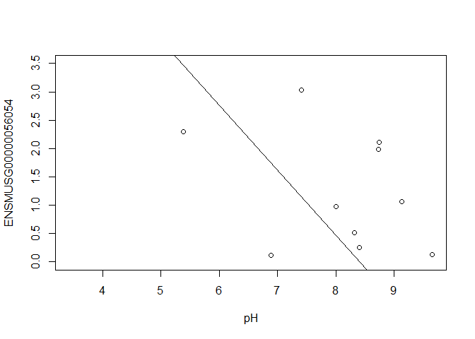<!-- -->

```r
slope
```

```
## [1] -1.148421
```

In this example, the log fold change logFC is the slope of the line, or the change in gene expression (on the log2 CPM scale) for each unit increase in pH.

Here, a logFC of 0.20 means a 0.20 log2 CPM increase in gene expression for each unit increase in pH, or a 15% increase on the CPM scale (2^0.20 = 1.15).

### A bit more on linear models

Limma fits a linear model to each gene.

Linear models include analysis of variance (ANOVA) models, linear regression, and any model of the form

Y = &beta;<sub>0</sub> + &beta;<sub>1</sub>X<sub>1</sub> + &beta;<sub>2</sub>X<sub>2</sub> + ... + &beta;<sub>p</sub>X<sub>p</sub> + &epsilon;

The covariates X can be:

* a continuous variable (pH, HScore score, age, weight, temperature, etc.)
* Dummy variables coding a categorical covariate (like cell type, genotype, and group)

The &beta;'s are unknown parameters to be estimated.

In limma, the &beta;'s are the log fold changes.  

The error (residual) term &epsilon; is assumed to be normally distributed with a variance that is constant across the range of the data.

Normally distributed means the residuals come from a distribution that looks like this:
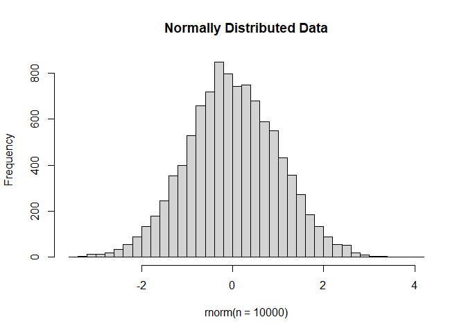<!-- -->

The log2 transformation that voom applies to the counts makes the data "normal enough", but doesn't completely stabilize the variance:

```r
mm <- model.matrix(~0 + group + mouse)
tmp <- voom(d, mm, plot = T)
```

```
## Coefficients not estimable: mouse206 mouse7531
```

```
## Warning: Partial NA coefficients for 12954 probe(s)
```

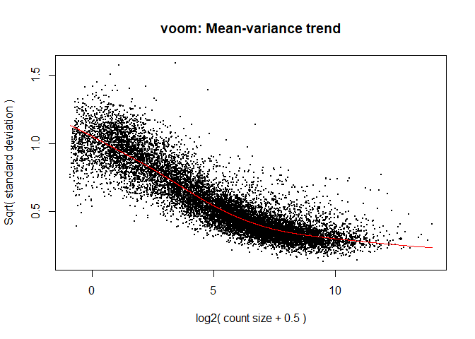<!-- -->

The log2 counts per million are more variable at lower expression levels.  The variance weights calculated by voom address this situation.

### Both edgeR and limma have VERY comprehensive user manuals

The limma users' guide has great details on model specification.

* [Limma voom](https://bioconductor.org/packages/release/bioc/vignettes/limma/inst/doc/usersguide.pdf)

* [edgeR](http://bioconductor.org/packages/release/bioc/vignettes/edgeR/inst/doc/edgeRUsersGuide.pdf)

## Quiz 4

<div id="quiz4" class="quiz"></div>
<button id="submit4">Submit Quiz</button>
<div id="results4" class="output"></div>
<script>
quizContainer4 = document.getElementById('quiz4');
resultsContainer4 = document.getElementById('results4');
submitButton4 = document.getElementById('submit4');

myQuestions4 = [
  {
      question: "For the model ~0 + group + mouse, what coefficients would you use in makeContrasts if you wanted to compare genotypes for the NC cell type",
    answers: {
      a: "groupWT.C - groupKOMIR150.C",
      b: "groupWT.NC + groupKOMIR150.NC",
      c: "groupWT.NC - groupKOMIR150.NC",
    },
    correctAnswer: "c"
  },
  {
    question: "For the model ~0 + group + mouse, how many genes are differentially expressed between WT NC and KOMIR150 NC?",
    answers: {
      a: "34",
      b: "43",
      c: "5,725",
    },
    correctAnswer: "a"
  },
  {
    question: "Suppose you have a variable in your metadata called batch that shows the RNA extraction batch.  How would you change the model ~0 + group + mouse to adjust for batch?",
    answers: {
      a: "Change the formula in model.matrix() to ~0 + group + mouse + batch",
      b: "Change the formula in model.matrix() to ~0 + group*batch + mouse",
      c: "Change the coefficients in makeContrasts() to groupWT.C - groupKOMIR150.C - batch"
    },
    correctAnswer: "a"
  }
];

buildQuiz(myQuestions4, quizContainer4);
submitButton4.addEventListener('click', function() {showResults(myQuestions4, quizContainer4, resultsContainer4);});
</script>

# Simple plotting


```r
mm <- model.matrix(~genotype*cell_type + mouse)
colnames(mm) <- make.names(colnames(mm))
y <- voom(d, mm, plot = F)
```

```
## Coefficients not estimable: mouse206 mouse7531
```

```
## Warning: Partial NA coefficients for 12954 probe(s)
```

```r
fit <- lmFit(y, mm)
```

```
## Coefficients not estimable: mouse206 mouse7531
```

```
## Warning: Partial NA coefficients for 12954 probe(s)
```

```r
contrast.matrix <- makeContrasts(genotypeKOMIR150, levels=colnames(coef(fit)))
fit2 <- contrasts.fit(fit, contrast.matrix)
fit2 <- eBayes(fit2)
top.table <- topTable(fit2, coef = 1, sort.by = "P", n = 40)
```

## Volcano plot


```r
volcanoplot(fit2, coef=1, highlight=8, names=rownames(fit2), main="Genotype KOMIR150 vs. WT for cell type C", cex.main = 0.8)
```

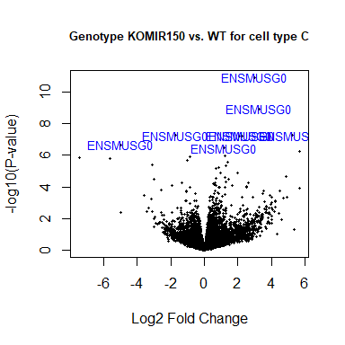<!-- -->

```r
head(anno[match(rownames(fit2), anno$Gene.stable.ID.version),
     c("Gene.stable.ID.version", "Gene.name") ])
```

```
##       Gene.stable.ID.version Gene.name
## 48443   ENSMUSG00000098104.2    Gm6085
## 48521  ENSMUSG00000033845.14    Mrpl15
## 48766  ENSMUSG00000025903.15    Lypla1
## 48915  ENSMUSG00000033813.16     Tcea1
## 49347  ENSMUSG00000033793.13   Atp6v1h
## 49551  ENSMUSG00000025907.15    Rb1cc1
```

```r
identical(anno[match(rownames(fit2), anno$Gene.stable.ID.version),
     c("Gene.stable.ID.version")], rownames(fit2))
```

```
## [1] TRUE
```

```r
volcanoplot(fit2, coef=1, highlight=8, names=anno[match(rownames(fit2), anno$Gene.stable.ID.version), "Gene.name"], main="Genotype KOMIR150 vs. WT for cell type C", cex.main = 0.8)
```

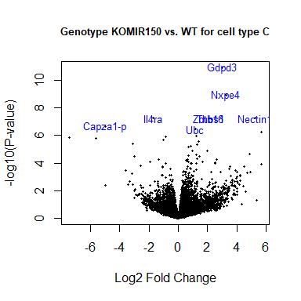<!-- -->

## Heatmap

```r
#using a red and blue color scheme without traces and scaling each row
heatmap.2(logcpm[rownames(top.table),],col=brewer.pal(11,"RdBu"),scale="row", trace="none")
```

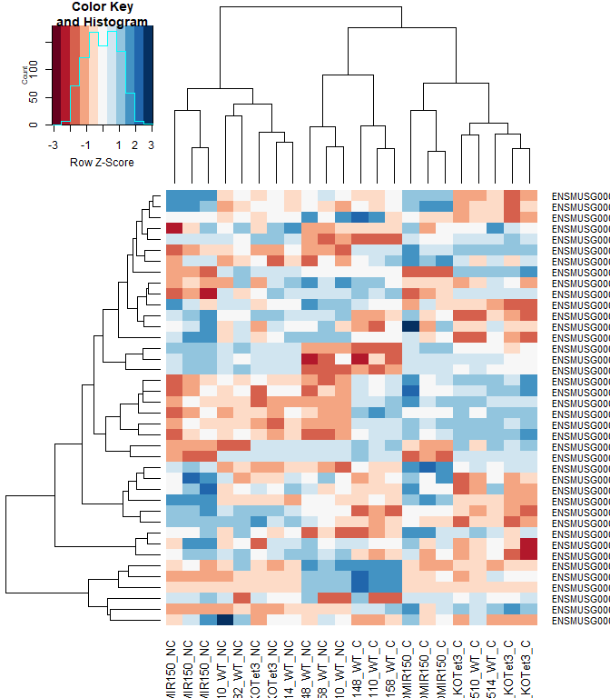<!-- -->

```r
anno[match(rownames(top.table), anno$Gene.stable.ID.version),
     c("Gene.stable.ID.version", "Gene.name")]
```

```
##       Gene.stable.ID.version     Gene.name
## 15527   ENSMUSG00000030703.9         Gdpd3
## 43284  ENSMUSG00000044229.10         Nxpe4
## 25910  ENSMUSG00000032012.10       Nectin1
## 52793  ENSMUSG00000030748.10         Il4ra
## 54841   ENSMUSG00000040152.9         Thbs1
## 4616    ENSMUSG00000066687.6        Zbtb16
## 47835   ENSMUSG00000067017.6    Capza1-ps1
## 39290  ENSMUSG00000008348.10           Ubc
## 27827   ENSMUSG00000096780.8   Tmem181b-ps
## 44187  ENSMUSG00000020893.18          Per1
## 21589  ENSMUSG00000028028.12         Alpk1
## 3187    ENSMUSG00000039146.6        Ifi44l
## 3155   ENSMUSG00000028037.14         Ifi44
## 27579  ENSMUSG00000030365.12        Clec2i
## 19396   ENSMUSG00000055435.7           Maf
## 7979   ENSMUSG00000028619.16       Tceanc2
## 10870  ENSMUSG00000024772.10          Ehd1
## 36587   ENSMUSG00000051495.9       Irf2bp2
## 40438  ENSMUSG00000042105.19        Inpp5f
## 2310   ENSMUSG00000054008.10         Ndst1
## 845     ENSMUSG00000096768.9       Gm47283
## 16280   ENSMUSG00000076937.4         Iglc2
## 24548  ENSMUSG00000055994.16          Nod2
## 38695  ENSMUSG00000070372.12        Capza1
## 13097   ENSMUSG00000100801.2       Gm15459
## 1995    ENSMUSG00000033863.3          Klf9
## 9425    ENSMUSG00000051439.8          Cd14
## 41587  ENSMUSG00000035212.15        Leprot
## 29618   ENSMUSG00000003545.4          Fosb
## 20260  ENSMUSG00000028173.11           Wls
## 29012  ENSMUSG00000034342.10           Cbl
## 24843  ENSMUSG00000031431.14       Tsc22d3
## 51174  ENSMUSG00000040139.15 9430038I01Rik
## 38153   ENSMUSG00000048534.8          Jaml
## 27991   ENSMUSG00000020108.5         Ddit4
## 49768  ENSMUSG00000030577.15          Cd22
## 43260   ENSMUSG00000035385.6          Ccl2
## 27704   ENSMUSG00000045382.7         Cxcr4
## 54994   ENSMUSG00000027435.9          Cd93
## 4482   ENSMUSG00000042396.11          Rbm7
```

```r
identical(anno[match(rownames(top.table), anno$Gene.stable.ID.version), "Gene.stable.ID.version"], rownames(top.table))
```

```
## [1] TRUE
```

```r
heatmap.2(logcpm[rownames(top.table),],col=brewer.pal(11,"RdBu"),scale="row", trace="none", labRow = anno[match(rownames(top.table), anno$Gene.stable.ID.version), "Gene.name"])
```

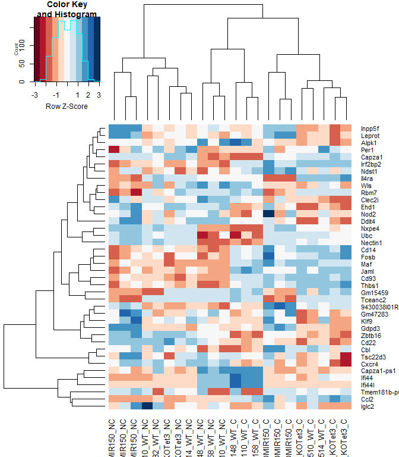<!-- -->

## 2 factor venn diagram


```r
mm <- model.matrix(~genotype*cell_type + mouse)
colnames(mm) <- make.names(colnames(mm))
y <- voom(d, mm, plot = F)
```

```
## Coefficients not estimable: mouse206 mouse7531
```

```
## Warning: Partial NA coefficients for 12954 probe(s)
```

```r
fit <- lmFit(y, mm)
```

```
## Coefficients not estimable: mouse206 mouse7531
```

```
## Warning: Partial NA coefficients for 12954 probe(s)
```

```r
contrast.matrix <- makeContrasts(genotypeKOMIR150, genotypeKOMIR150 + genotypeKOMIR150.cell_typeNC, levels=colnames(coef(fit)))
fit2 <- contrasts.fit(fit, contrast.matrix)
fit2 <- eBayes(fit2)
top.table <- topTable(fit2, coef = 1, sort.by = "P", n = 40)

results <- decideTests(fit2)
vennDiagram(results, names = c("C", "NC"), main = "DE Genes Between KOMIR150 and WT by Cell Type", cex.main = 0.8)
```

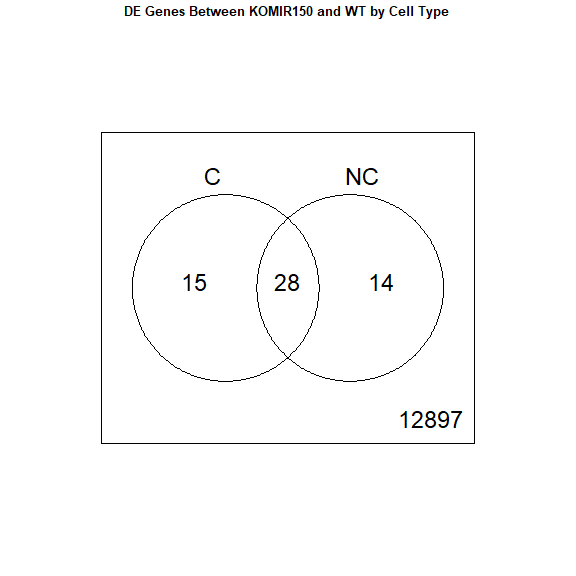<!-- -->

## Download the Enrichment Analysis R Markdown document

```r
download.file("https://raw.githubusercontent.com/ucdavis-bioinformatics-training/2020-mRNA_Seq_Workshop/master/data_analysis/enrichment_mm.Rmd", "enrichment_mm.Rmd")
```


```r
sessionInfo()
```

```
## R version 4.1.1 (2021-08-10)
## Platform: x86_64-w64-mingw32/x64 (64-bit)
## Running under: Windows 10 x64 (build 19042)
## 
## Matrix products: default
## 
## locale:
## [1] LC_COLLATE=English_United States.1252 
## [2] LC_CTYPE=English_United States.1252   
## [3] LC_MONETARY=English_United States.1252
## [4] LC_NUMERIC=C                          
## [5] LC_TIME=English_United States.1252    
## 
## attached base packages:
## [1] stats     graphics  grDevices utils     datasets  methods   base     
## 
## other attached packages:
## [1] gplots_3.1.1       RColorBrewer_1.1-2 edgeR_3.34.0       limma_3.48.0      
## 
## loaded via a namespace (and not attached):
##  [1] Rcpp_1.0.6         locfit_1.5-9.4     lattice_0.20-44    gtools_3.9.2      
##  [5] digest_0.6.27      bitops_1.0-7       grid_4.1.1         magrittr_2.0.1    
##  [9] evaluate_0.14      highr_0.9          KernSmooth_2.23-20 rlang_0.4.11      
## [13] stringi_1.6.2      rmarkdown_2.8      tools_4.1.1        stringr_1.4.0     
## [17] xfun_0.23          yaml_2.2.1         compiler_4.1.1     caTools_1.18.2    
## [21] htmltools_0.5.1.1  knitr_1.33
```
