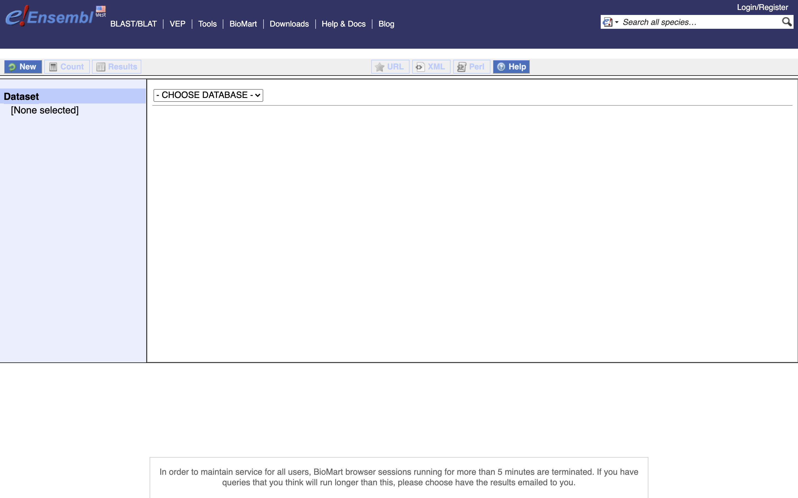
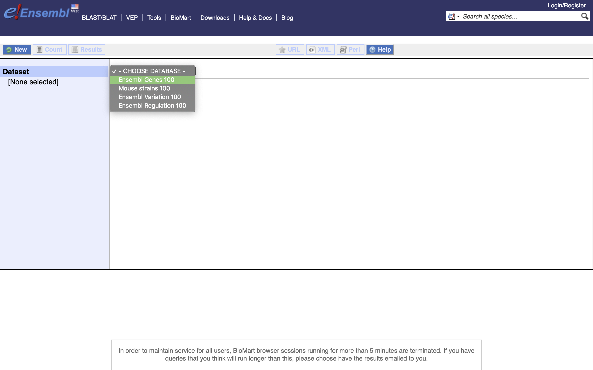
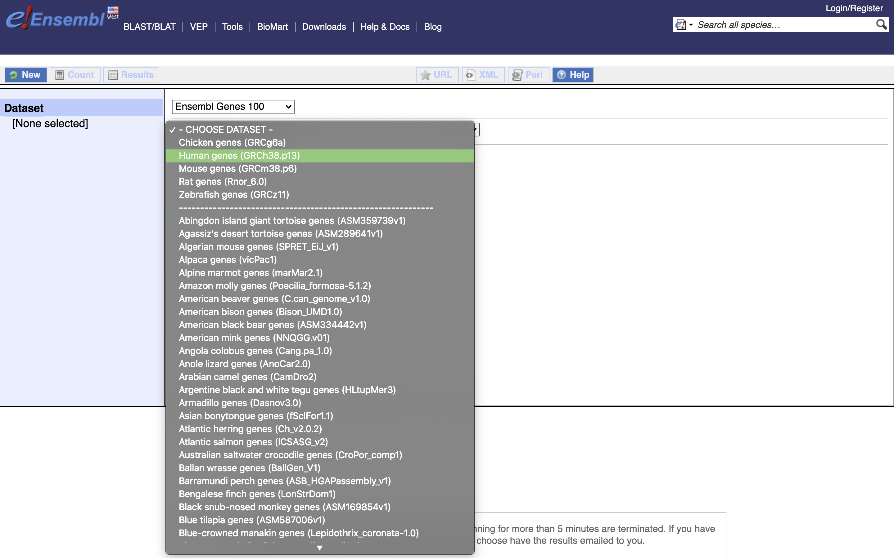
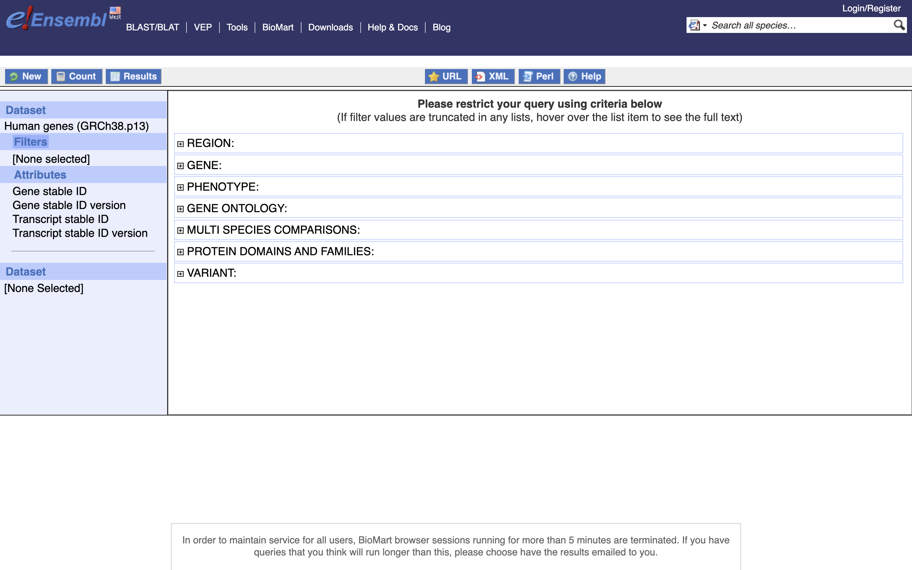
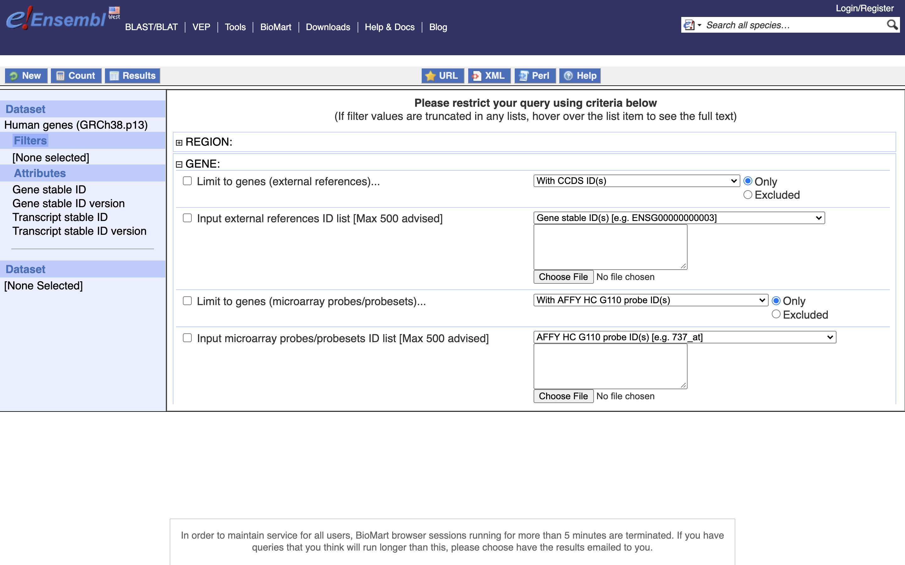
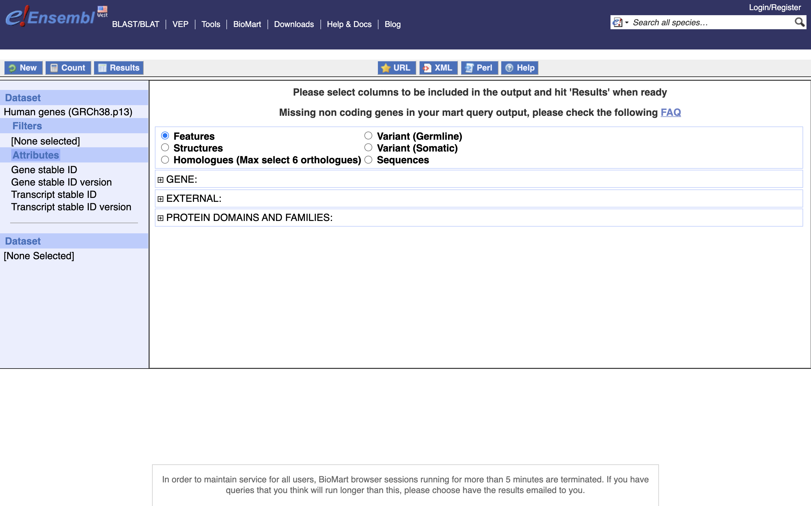
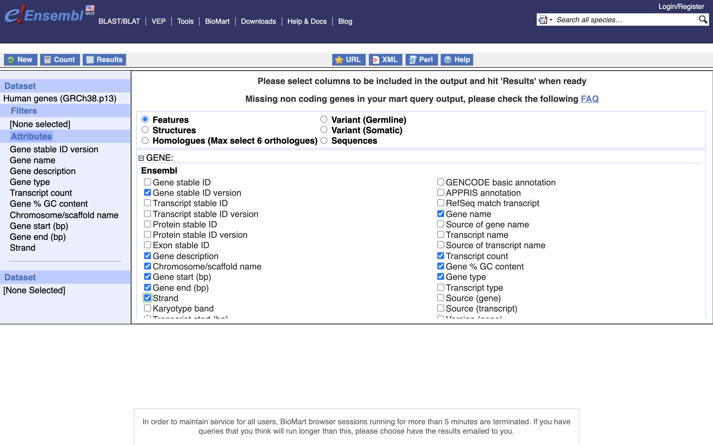
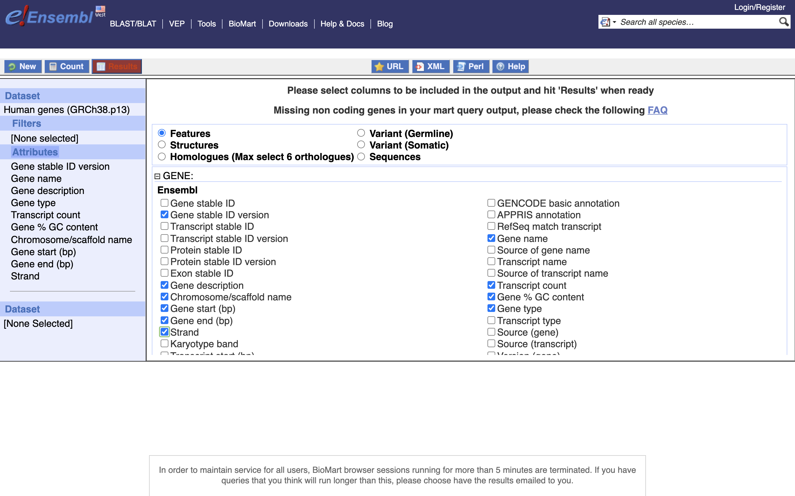
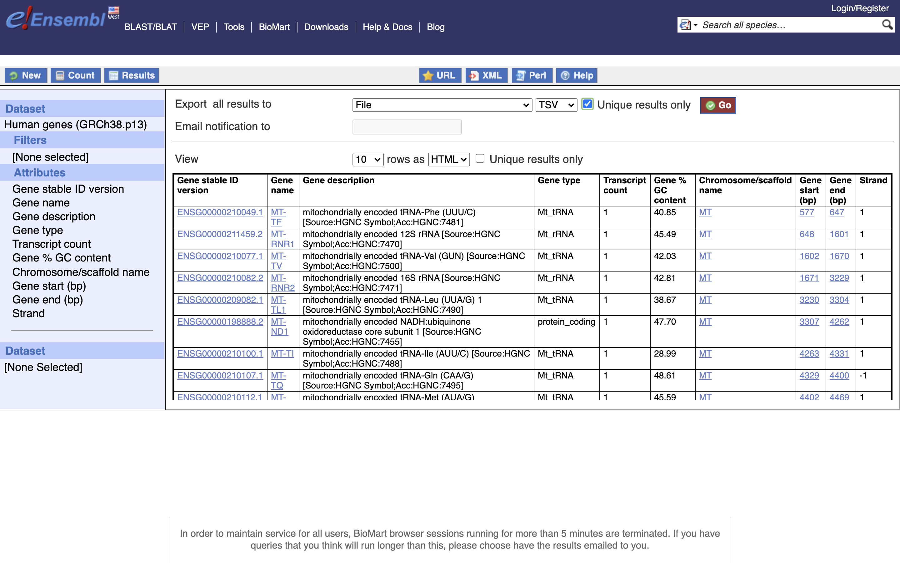

# Retreiving Annotation via biomart

Annotation from [BioMart](https://uswest.ensembl.org/biomart/martview/) with Ensembl names is most flexible way to retrieve tabular annotation for an organism.

1. The [Biomart](https://uswest.ensembl.org/biomart/martview/) start page should look like ...

1. First select the dataset, for gene expression experiment select Ensembl Genes 100 (version 100). The current version as of this workshop.

1. Then the Organism, Here Human genes which is based on the GRC38.p13 genome.

1. You can choose to filter to only a subset of genes. Or a chromosome, or regions. _We won't filter here_. BY default, all genes in the genome are selected.

1. Next select the attributes you want in the table.

1. Expand the 'GENE' tab, and select the attributes you want to retreive. **HERE** recreate the list you see on the left side.

1. Click "Results" (Top left -ish).

1. Select "GO", to download a tab-separated value (tsv) file.

1. The file will save as "mart_export.txt", put the file into our working directory, rename to "ensembl_hg_100.tsv" and open the file in Excel to view the annotation.
