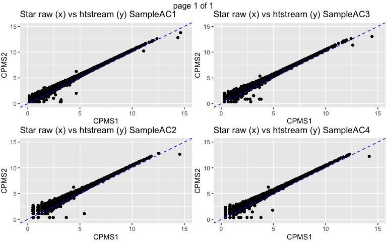
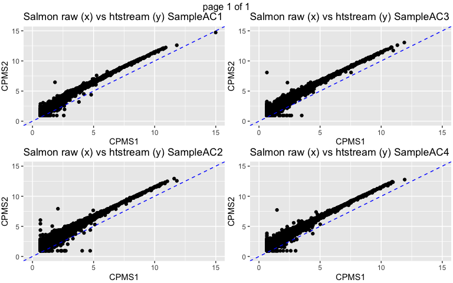
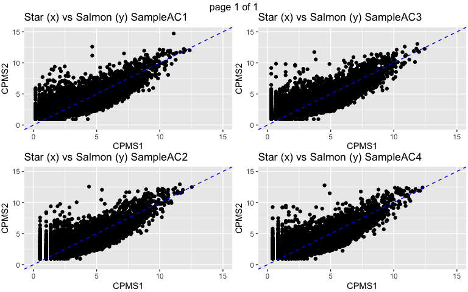
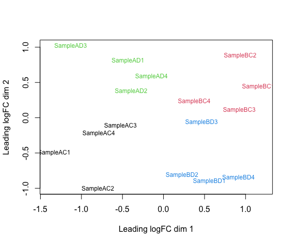
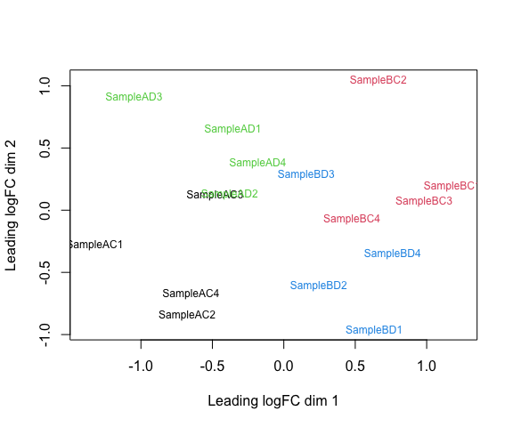

### Pairwise correlations of normalized counts on same sample


<!-- -->

(Figure shows 4 samples, these are representative of pattern on remaining samples.)


<!-- -->


<!-- -->

Note the pattern of genes with low expression with STAR and high expression with Salmon.


### MDS plot, STAR counts:
<!-- -->

### MDS plot, Salmon counts
<!-- -->


### Top 10 genes with STAR

```
##                        logFC  AveExpr   adj.P.Val
## ENSG00000129824.16 -6.009854 3.820981 0.006597857
## ENSG00000067048.17 -6.393071 2.908028 0.006597857
## ENSG00000012817.15 -6.381958 2.935468 0.006597857
## ENSG00000198692.10 -5.177536 1.885130 0.006597857
## ENSG00000099725.14 -5.822304 2.969646 0.008930872
## ENSG00000183878.15 -5.055566 2.435588 0.009159625
## ENSG00000111052.7  -1.676002 5.553075 0.013620067
## ENSG00000114374.13 -5.328721 2.103379 0.022606735
## ENSG00000173597.9  -1.361921 6.521887 0.037735309
## ENSG00000131724.11 -1.145603 7.292052 0.050385269
```

### Top 10 genes with Salmon

```
##                        logFC   AveExpr  adj.P.Val
## ENSG00000198692.10 -4.305244 1.9766385 0.01122673
## ENSG00000048052.21 -1.519736 2.2073946 0.04879622
## ENSG00000067048.17 -4.291526 1.9667359 0.05440991
## ENSG00000099725.14 -3.410669 0.9675698 0.05440991
## ENSG00000129824.16 -5.465947 4.1652318 0.08643336
## ENSG00000156273.16 -1.322831 5.3709277 0.08972628
## ENSG00000012817.15 -3.873948 1.8080091 0.11336849
## ENSG00000105610.6   2.335485 4.3512624 0.11336849
## ENSG00000176597.12 -1.525935 2.0229196 0.11336849
## ENSG00000111052.7  -1.472319 3.2817306 0.11336849
```

9 genes are DE (adjusted P < 0.05) with STAR, and 2 genes are DE with Salmon.


### Conclusions
* STAR and Salmon show differences in quantification of low expressed genes.
* This does not seem to have much impact on the relative distances between samples or differential expression (note that low expressed genes are often filtered out before analysis).
* Pick one approach for a project and go with it.
* Don't run multiple analyses and pick the one that gives you the most DE genes.


