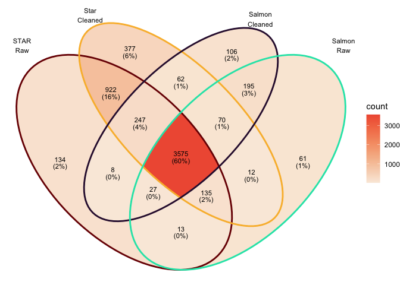

--------

### How had cleaning impacted read counts? 

The following plots compare 4 samples that are representative of the rest of the dataset.

STAR CPMs using raw data on y-axis vs STAR CPMs using cleaned data on x-axis.

<!-- -->


Salmon CPM values using raw data on y-axis vs Salmon using cleaned data on x-axis.

<!-- -->

--------

### How does quantification method impact read counts? 

Salmon CPM values using cleaned reads on y-axis vs STAR CPM values using cleaned reads on x-axis.  


<!-- -->


Note the pattern of genes with low expression with STAR and high expression with Salmon.

------

### MDS plot, STAR raw counts:

<!-- -->

### MDS plot, STAR cleaned counts:
<!-- -->

### MDS plot, Salmon raw counts
<!-- -->

### MDS plot, Salmon cleaned counts
<!-- -->


### Top 10 genes with STAR on cleaned reads

```
##                        logFC   AveExpr    adj.P.Val
## ENSMUSG00000020608 -2.487484  7.859413 2.740380e-10
## ENSMUSG00000049103  2.163930  9.880300 3.953575e-09
## ENSMUSG00000052212  4.552076  6.191089 3.953575e-09
## ENSMUSG00000027508 -1.899053  8.113147 4.914713e-09
## ENSMUSG00000051177  3.186426  4.986113 4.914713e-09
## ENSMUSG00000042700 -1.813750  6.084302 5.114391e-09
## ENSMUSG00000050335  1.112010  8.961475 6.293314e-09
## ENSMUSG00000038147  1.689965  7.138663 6.293314e-09
## ENSMUSG00000038807 -1.562053  9.003764 6.635062e-09
## ENSMUSG00000020437 -1.226829 10.305956 6.635062e-09
```

### Top 10 genes with Salmon

```
##                        logFC  AveExpr    adj.P.Val
## ENSMUSG00000052212  4.544736 5.821098 4.785833e-08
## ENSMUSG00000049103  2.146572 9.265595 5.872193e-08
## ENSMUSG00000020387 -4.533149 3.027947 7.530002e-08
## ENSMUSG00000089929 -3.614906 6.375914 8.599109e-08
## ENSMUSG00000037185 -1.611175 8.943865 8.599109e-08
## ENSMUSG00000037820 -4.186695 6.277701 1.003892e-07
## ENSMUSG00000020437 -1.206067 9.498283 1.003892e-07
## ENSMUSG00000027215 -2.654346 7.216311 1.003892e-07
## ENSMUSG00000021990 -2.666258 6.892383 1.003892e-07
## ENSMUSG00000023827 -2.106487 6.587921 1.003892e-07
```

### Totals genes DE at adj.P.val < 0.05
STAR + without cleaning : 5060.

STAR + with cleaning : 5418.

Salmon + without cleaning: 4074.

Salmon + with cleaning: 4287.

### Overlap in DEGs at adj.P.val < 0.05  

<!-- -->


### Overlap in top 100 DEGs (sorted by P value)  
<!-- -->

### Conclusions
* STAR and Salmon show differences in quantification of low expressed genes.
* This does not seem to have much impact on the relative distances between samples or differential expression (note that low expressed genes are often filtered out before analysis).
* Pick one approach for a project and go with it.
* Don't run multiple analyses and pick the one that gives you the most DE genes.


