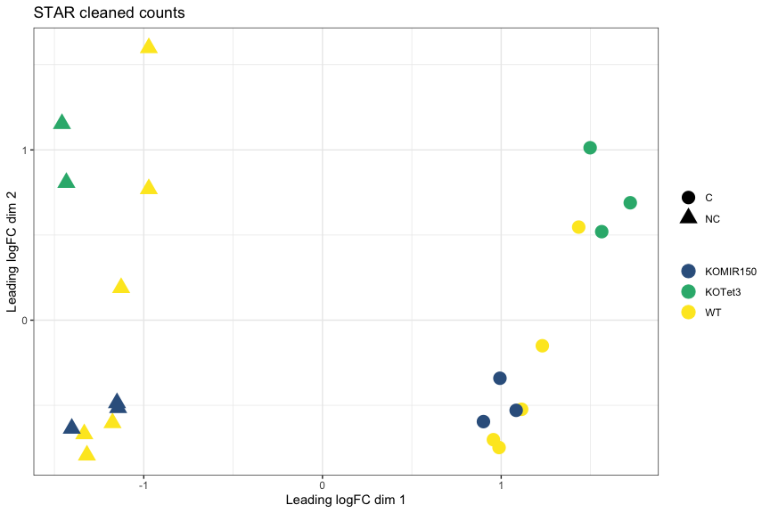
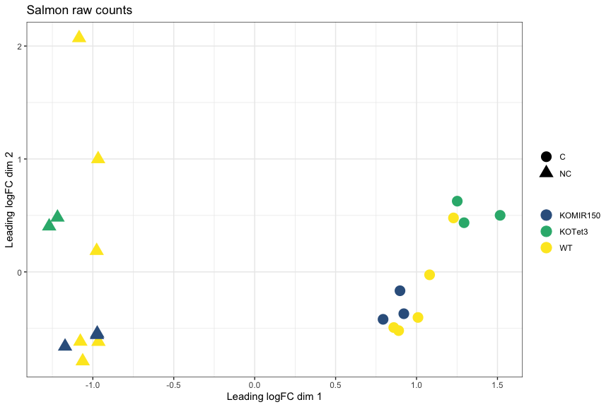
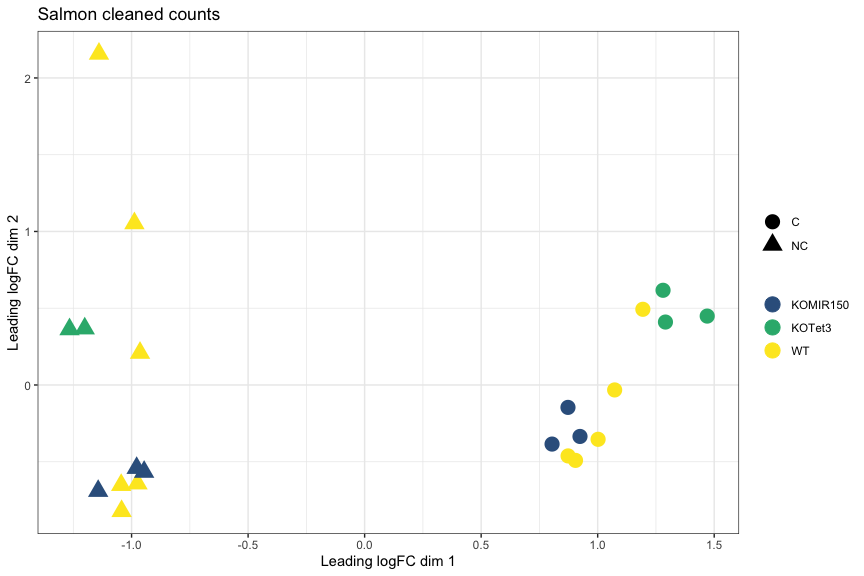
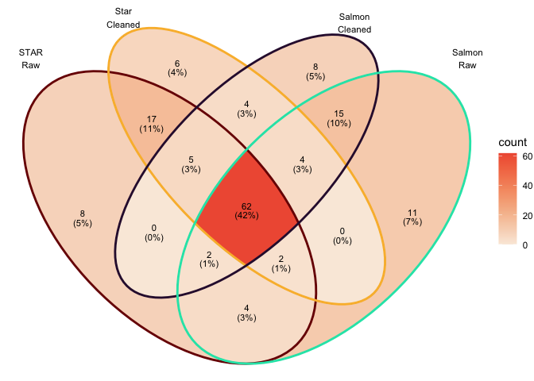

--------

### How had cleaning impacted read counts?

The following plots compare 4 samples that are representative of the rest of the dataset.

<!-- --><!-- -->

--------

### How does quantification method impact read counts?

Salmon CPM values using cleaned reads on y-axis vs STAR CPM values using cleaned reads on x-axis.  


<!-- --><!-- -->


Note the pattern of genes with low expression with STAR and high expression with Salmon.

------

### MDS plot, STAR raw counts:

<!-- -->

### MDS plot, STAR cleaned counts:
<!-- -->

### MDS plot, Salmon raw counts
<!-- -->

### MDS plot, Salmon cleaned counts
<!-- -->


### Top 10 genes with STAR on cleaned reads

```
##                        logFC  AveExpr    adj.P.Val
## ENSMUSG00000020608 -2.494314 7.871119 4.224935e-10
## ENSMUSG00000052212  4.544039 6.203043 4.272074e-09
## ENSMUSG00000049103  2.155963 9.892016 4.272074e-09
## ENSMUSG00000027508 -1.906190 8.124895 4.272074e-09
## ENSMUSG00000051177  3.178095 4.997819 4.822237e-09
## ENSMUSG00000042700 -1.821186 6.096008 4.822237e-09
## ENSMUSG00000038807 -1.569185 9.015470 6.413472e-09
## ENSMUSG00000050335  1.104465 8.973146 7.505315e-09
## ENSMUSG00000023809 -3.199651 4.835883 7.505315e-09
## ENSMUSG00000039959 -1.490317 8.944064 7.505315e-09
```

### Top 10 genes with Salmon

```
##                        logFC  AveExpr    adj.P.Val
## ENSMUSG00000052212  4.546519 5.820690 4.509913e-08
## ENSMUSG00000049103  2.148525 9.267696 5.501825e-08
## ENSMUSG00000020387 -4.531097 3.028156 7.657936e-08
## ENSMUSG00000037185 -1.608605 8.944781 9.367590e-08
## ENSMUSG00000089929 -3.642336 6.367564 9.367590e-08
## ENSMUSG00000037820 -4.186151 6.278420 9.367590e-08
## ENSMUSG00000020437 -1.206179 9.503046 9.367590e-08
## ENSMUSG00000021990 -2.663701 6.893854 9.367590e-08
## ENSMUSG00000027215 -2.643982 7.213996 9.367590e-08
## ENSMUSG00000030342 -3.714279 6.904259 9.367590e-08
```

### Totals genes DE at adj.P.val < 0.05
STAR + without cleaning : 5061.

STAR + with cleaning : 5400.

Salmon + without cleaning: 4088.

Salmon + with cleaning: 4290.

### Overlap in DEGs at adj.P.val < 0.05  

<!-- -->


### Overlap in top 100 DEGs (sorted by P value)  
<!-- -->

### Conclusions
* STAR and Salmon show differences in quantification of low expressed genes.
* This does not seem to have much impact on the relative distances between samples or differential expression (note that low expressed genes are often filtered out before analysis).
* Pick one approach for a project and go with it.
* Don't run multiple analyses and pick the one that gives you the most DE genes.
