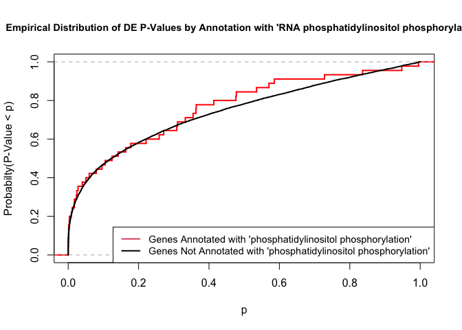
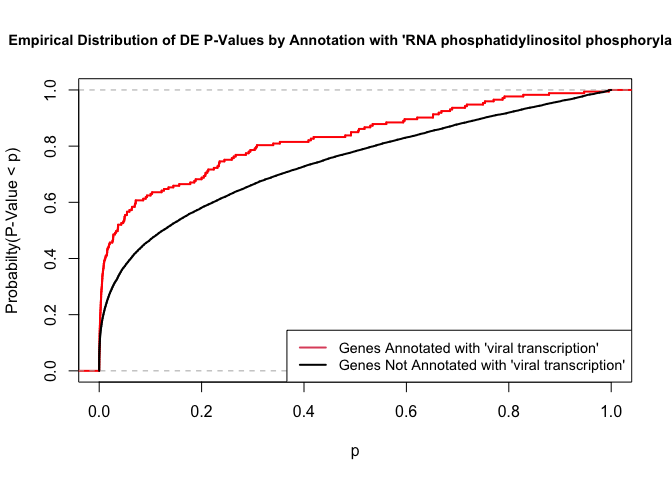
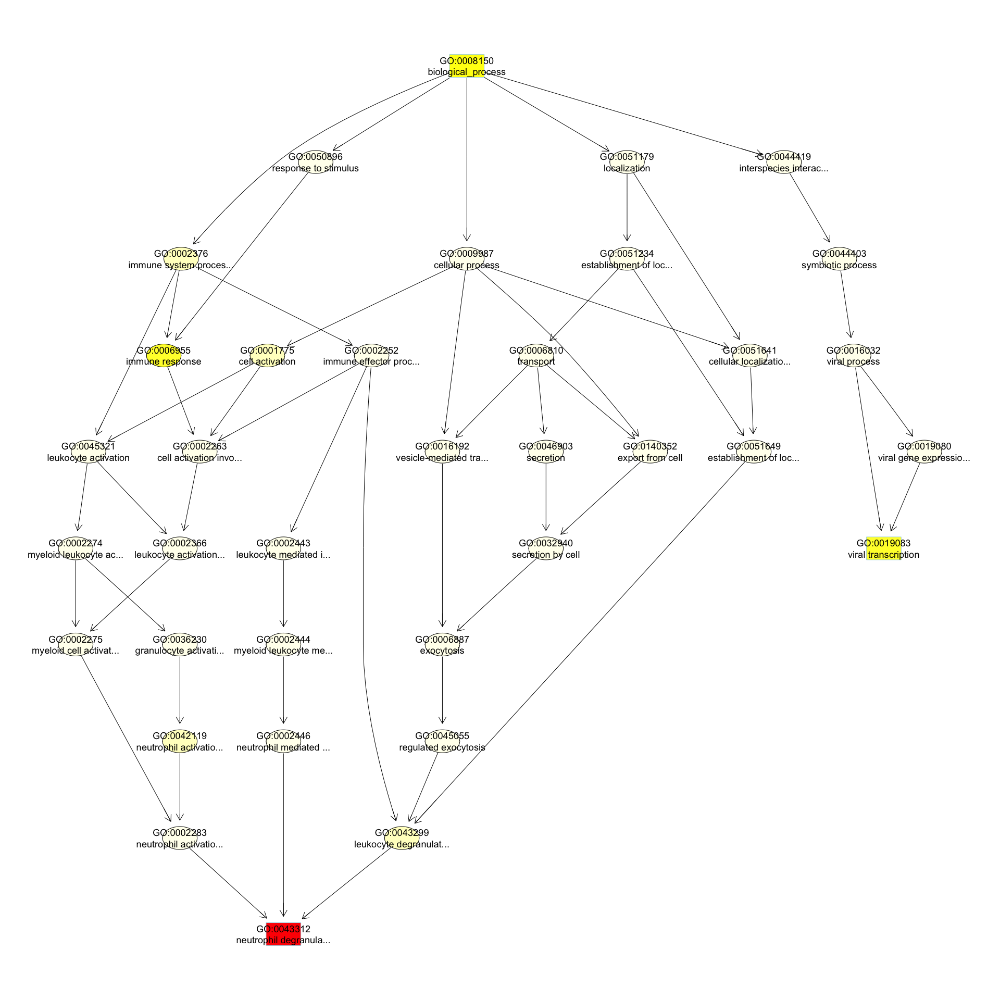

# GO AND KEGG Enrichment Analysis

Load libraries

```r
library(topGO)
```

```
## Loading required package: BiocGenerics
```

```
## Loading required package: parallel
```

```
## 
## Attaching package: 'BiocGenerics'
```

```
## The following objects are masked from 'package:parallel':
## 
##     clusterApply, clusterApplyLB, clusterCall, clusterEvalQ,
##     clusterExport, clusterMap, parApply, parCapply, parLapply,
##     parLapplyLB, parRapply, parSapply, parSapplyLB
```

```
## The following objects are masked from 'package:stats':
## 
##     IQR, mad, sd, var, xtabs
```

```
## The following objects are masked from 'package:base':
## 
##     anyDuplicated, append, as.data.frame, basename, cbind, colnames,
##     dirname, do.call, duplicated, eval, evalq, Filter, Find, get, grep,
##     grepl, intersect, is.unsorted, lapply, Map, mapply, match, mget,
##     order, paste, pmax, pmax.int, pmin, pmin.int, Position, rank,
##     rbind, Reduce, rownames, sapply, setdiff, sort, table, tapply,
##     union, unique, unsplit, which, which.max, which.min
```

```
## Loading required package: graph
```

```
## Loading required package: Biobase
```

```
## Welcome to Bioconductor
## 
##     Vignettes contain introductory material; view with
##     'browseVignettes()'. To cite Bioconductor, see
##     'citation("Biobase")', and for packages 'citation("pkgname")'.
```

```
## Loading required package: GO.db
```

```
## Loading required package: AnnotationDbi
```

```
## Loading required package: stats4
```

```
## Loading required package: IRanges
```

```
## Loading required package: S4Vectors
```

```
## 
## Attaching package: 'S4Vectors'
```

```
## The following object is masked from 'package:base':
## 
##     expand.grid
```

```
## 
```

```
## Loading required package: SparseM
```

```
## 
## Attaching package: 'SparseM'
```

```
## The following object is masked from 'package:base':
## 
##     backsolve
```

```
## 
## groupGOTerms: 	GOBPTerm, GOMFTerm, GOCCTerm environments built.
```

```
## 
## Attaching package: 'topGO'
```

```
## The following object is masked from 'package:IRanges':
## 
##     members
```

```r
library(KEGGREST)
library(org.Hs.eg.db)
```

```
## 
```

Files for examples created in the DE analysis

## Gene Ontology (GO) Enrichment

[Gene ontology](http://www.geneontology.org/) provides a controlled vocabulary for describing biological processes (BP ontology), molecular functions (MF ontology) and cellular components (CC ontology)

The GO ontologies themselves are organism-independent; terms are associated with genes for a specific organism through direct experimentation or through sequence homology with another organism and its GO annotation.

Terms are related to other terms through parent-child relationships in a directed acylic graph.

Enrichment analysis provides one way of drawing conclusions about a set of differential expression results.

**1\.** topGO Example Using Kolmogorov-Smirnov Testing
Our first example uses Kolmogorov-Smirnov Testing for enrichment testing of our human DE results, with GO annotation obtained from the Bioconductor database org.Hs.eg.db.

The first step in each topGO analysis is to create a topGOdata object.  This contains the genes, the score for each gene (here we use the p-value from the DE test), the GO terms associated with each gene, and the ontology to be used (here we use the biological process ontology)

```r
infile <- "A.C_v_B.C.txt"
tmp <- read.delim(infile)

geneList <- tmp$P.Value
xx <- as.list(org.Hs.egENSEMBL2EG)
names(geneList) <- xx[sapply(strsplit(tmp$Gene,split="\\."),"[[", 1L)]
head(geneList)
```

```
##         5836         8972        25797        54682         8291        50807 
## 6.563298e-09 1.440806e-08 2.469532e-08 3.934790e-08 4.483478e-08 8.791072e-08
```

```r
# Create topGOData object
GOdata <- new("topGOdata",
	ontology = "BP",
	allGenes = geneList,
	geneSelectionFun = function(x)x,
	annot = annFUN.org , mapping = "org.Hs.eg.db")
```

```
## 
## Building most specific GOs .....
```

```
## 	( 10574 GO terms found. )
```

```
## 
## Build GO DAG topology ..........
```

```
## 	( 14582 GO terms and 34441 relations. )
```

```
## 
## Annotating nodes ...............
```

```
## 	( 10975 genes annotated to the GO terms. )
```

**2\.** The topGOdata object is then used as input for enrichment testing:

```r
# Kolmogorov-Smirnov testing
resultKS <- runTest(GOdata, algorithm = "weight01", statistic = "ks")
```

```
## 
## 			 -- Weight01 Algorithm -- 
## 
## 		 the algorithm is scoring 14582 nontrivial nodes
## 		 parameters: 
## 			 test statistic: ks
## 			 score order: increasing
```

```
## 
## 	 Level 20:	1 nodes to be scored	(0 eliminated genes)
```

```
## 
## 	 Level 19:	4 nodes to be scored	(0 eliminated genes)
```

```
## 
## 	 Level 18:	16 nodes to be scored	(1 eliminated genes)
```

```
## 
## 	 Level 17:	43 nodes to be scored	(17 eliminated genes)
```

```
## 
## 	 Level 16:	93 nodes to be scored	(52 eliminated genes)
```

```
## 
## 	 Level 15:	196 nodes to be scored	(140 eliminated genes)
```

```
## 
## 	 Level 14:	400 nodes to be scored	(367 eliminated genes)
```

```
## 
## 	 Level 13:	745 nodes to be scored	(844 eliminated genes)
```

```
## 
## 	 Level 12:	1212 nodes to be scored	(1987 eliminated genes)
```

```
## 
## 	 Level 11:	1643 nodes to be scored	(3818 eliminated genes)
```

```
## 
## 	 Level 10:	2033 nodes to be scored	(5696 eliminated genes)
```

```
## 
## 	 Level 9:	2150 nodes to be scored	(7043 eliminated genes)
```

```
## 
## 	 Level 8:	1981 nodes to be scored	(8577 eliminated genes)
```

```
## 
## 	 Level 7:	1707 nodes to be scored	(9456 eliminated genes)
```

```
## 
## 	 Level 6:	1216 nodes to be scored	(10074 eliminated genes)
```

```
## 
## 	 Level 5:	676 nodes to be scored	(10404 eliminated genes)
```

```
## 
## 	 Level 4:	317 nodes to be scored	(10630 eliminated genes)
```

```
## 
## 	 Level 3:	125 nodes to be scored	(10748 eliminated genes)
```

```
## 
## 	 Level 2:	23 nodes to be scored	(10797 eliminated genes)
```

```
## 
## 	 Level 1:	1 nodes to be scored	(10861 eliminated genes)
```

```r
tab <- GenTable(GOdata, raw.p.value = resultKS, topNodes = length(resultKS@score), numChar = 120)
```

topGO preferentially tests more specific terms, utilizing the topology of the GO graph. The algorithms used are described in detail [here](https://academic.oup.com/bioinformatics/article/22/13/1600/193669).


```r
head(tab, 15)
```

```
##         GO.ID                                                             Term
## 1  GO:0043312                                         neutrophil degranulation
## 2  GO:0008150                                               biological_process
## 3  GO:0019083                                              viral transcription
## 4  GO:0006955                                                  immune response
## 5  GO:0032930               positive regulation of superoxide anion generation
## 6  GO:0045087                                           innate immune response
## 7  GO:0042742                                    defense response to bacterium
## 8  GO:0031295                                             T cell costimulation
## 9  GO:0002250                                         adaptive immune response
## 10 GO:0050853                                B cell receptor signaling pathway
## 11 GO:0007169 transmembrane receptor protein tyrosine kinase signaling pathway
## 12 GO:0051897                positive regulation of protein kinase B signaling
## 13 GO:0035722                        interleukin-12-mediated signaling pathway
## 14 GO:0046777                                      protein autophosphorylation
## 15 GO:0001774                                       microglial cell activation
##    Annotated Significant Expected raw.p.value
## 1        447         447      447     1.2e-29
## 2      10975       10975    10975     1.9e-06
## 3        173         173      173     4.9e-06
## 4       1509        1509     1509     5.4e-06
## 5         15          15       15     6.2e-06
## 6        610         610      610     8.4e-06
## 7        129         129      129     8.5e-06
## 8         46          46       46     2.0e-05
## 9        331         331      331     2.0e-05
## 10        55          55       55     4.3e-05
## 11       466         466      466     6.9e-05
## 12        97          97       97     8.2e-05
## 13        41          41       41     0.00011
## 14       184         184      184     0.00011
## 15        35          35       35     0.00015
```

* Annotated: number of genes (in our gene list) that are annotated with the term
* Significant: n/a for this example, same as Annotated here
* Expected: n/a for this example, same as Annotated here
* raw.p.value: P-value from Kolomogorov-Smirnov test that DE p-values annotated with the term are smaller (i.e. more significant) than those not annotated with the term.

The Kolmogorov-Smirnov test directly compares two probability distributions based on their maximum distance.  

To illustrate the KS test, we plot probability distributions of p-values that are and that are not annotated with the term "phosphatidylinositol phosphorylation" p-value 0.62809.  (This won't exactly match what topGO does due to their elimination algorithm):


```r
rna.pp.terms <- genesInTerm(GOdata)[["GO:0046854"]] # get genes associated with term
p.values.in <- geneList[names(geneList) %in% rna.pp.terms]
p.values.out <- geneList[!(names(geneList) %in% rna.pp.terms)]
plot.ecdf(p.values.in, verticals = T, do.points = F, col = "red", lwd = 2, xlim = c(0,1),
          main = "Empirical Distribution of DE P-Values by Annotation with 'RNA phosphatidylinositol phosphorylation'",
          cex.main = 0.9, xlab = "p", ylab = "Probabilty(P-Value < p)")
ecdf.out <- ecdf(p.values.out)
xx <- unique(sort(c(seq(0, 1, length = 201), knots(ecdf.out))))
lines(xx, ecdf.out(xx), col = "black", lwd = 2)
legend("bottomright", legend = c("Genes Annotated with 'phosphatidylinositol phosphorylation'", "Genes Not Annotated with 'phosphatidylinositol phosphorylation'"), lwd = 2, col = 2:1, cex = 0.9)
```

<!-- -->

versus the probability distributions of p-values that are and that are not annotated with the term "viral transcription" p-value 4.9x10-6.

```r
rna.pp.terms <- genesInTerm(GOdata)[["GO:0019083"]] # get genes associated with term
p.values.in <- geneList[names(geneList) %in% rna.pp.terms]
p.values.out <- geneList[!(names(geneList) %in% rna.pp.terms)]
plot.ecdf(p.values.in, verticals = T, do.points = F, col = "red", lwd = 2, xlim = c(0,1),
          main = "Empirical Distribution of DE P-Values by Annotation with 'RNA phosphatidylinositol phosphorylation'",
          cex.main = 0.9, xlab = "p", ylab = "Probabilty(P-Value < p)")
ecdf.out <- ecdf(p.values.out)
xx <- unique(sort(c(seq(0, 1, length = 201), knots(ecdf.out))))
lines(xx, ecdf.out(xx), col = "black", lwd = 2)
legend("bottomright", legend = c("Genes Annotated with 'viral transcription'", "Genes Not Annotated with 'viral transcription'"), lwd = 2, col = 2:1, cex = 0.9)
```

<!-- -->


We can use the function showSigOfNodes to plot the GO graph for the 3 most significant terms and their parents, color coded by enrichment p-value (red is most significant):

```r
par(cex = 0.3)
showSigOfNodes(GOdata, score(resultKS), firstSigNodes = 3, useInfo = "def")
```

```
## Loading required package: Rgraphviz
```

```
## Loading required package: grid
```

```
## 
## Attaching package: 'grid'
```

```
## The following object is masked from 'package:topGO':
## 
##     depth
```

```
## 
## Attaching package: 'Rgraphviz'
```

```
## The following objects are masked from 'package:IRanges':
## 
##     from, to
```

```
## The following objects are masked from 'package:S4Vectors':
## 
##     from, to
```

<!-- -->

```
## $dag
## A graphNEL graph with directed edges
## Number of Nodes = 36 
## Number of Edges = 53 
## 
## $complete.dag
## [1] "A graph with 36 nodes."
```

```r
par(cex = 1)
```

**3\.** topGO Example Using Fisher's Exact Test
Next, we use Fisher's exact test to test for GO enrichment among significantly DE genes.

Create topGOdata object:

```r
# Create topGOData object
GOdata <- new("topGOdata",
	ontology = "BP",
	allGenes = geneList,
	geneSelectionFun = function(x) (x < 0.05),
	annot = annFUN.org , mapping = "org.Hs.eg.db")
```

```
## 
## Building most specific GOs .....
```

```
## 	( 10574 GO terms found. )
```

```
## 
## Build GO DAG topology ..........
```

```
## 	( 14582 GO terms and 34441 relations. )
```

```
## 
## Annotating nodes ...............
```

```
## 	( 10975 genes annotated to the GO terms. )
```

Run Fisher's Exact Test:

```r
resultFisher <- runTest(GOdata, algorithm = "elim", statistic = "fisher")
```

```
## 
## 			 -- Elim Algorithm -- 
## 
## 		 the algorithm is scoring 11922 nontrivial nodes
## 		 parameters: 
## 			 test statistic: fisher
## 			 cutOff: 0.01
```

```
## 
## 	 Level 19:	4 nodes to be scored	(0 eliminated genes)
```

```
## 
## 	 Level 18:	13 nodes to be scored	(0 eliminated genes)
```

```
## 
## 	 Level 17:	27 nodes to be scored	(0 eliminated genes)
```

```
## 
## 	 Level 16:	69 nodes to be scored	(0 eliminated genes)
```

```
## 
## 	 Level 15:	140 nodes to be scored	(25 eliminated genes)
```

```
## 
## 	 Level 14:	286 nodes to be scored	(25 eliminated genes)
```

```
## 
## 	 Level 13:	540 nodes to be scored	(287 eliminated genes)
```

```
## 
## 	 Level 12:	913 nodes to be scored	(714 eliminated genes)
```

```
## 
## 	 Level 11:	1266 nodes to be scored	(916 eliminated genes)
```

```
## 
## 	 Level 10:	1651 nodes to be scored	(1287 eliminated genes)
```

```
## 
## 	 Level 9:	1781 nodes to be scored	(2594 eliminated genes)
```

```
## 
## 	 Level 8:	1659 nodes to be scored	(3189 eliminated genes)
```

```
## 
## 	 Level 7:	1453 nodes to be scored	(4017 eliminated genes)
```

```
## 
## 	 Level 6:	1074 nodes to be scored	(4484 eliminated genes)
```

```
## 
## 	 Level 5:	608 nodes to be scored	(5686 eliminated genes)
```

```
## 
## 	 Level 4:	293 nodes to be scored	(6036 eliminated genes)
```

```
## 
## 	 Level 3:	121 nodes to be scored	(6097 eliminated genes)
```

```
## 
## 	 Level 2:	23 nodes to be scored	(6247 eliminated genes)
```

```
## 
## 	 Level 1:	1 nodes to be scored	(6247 eliminated genes)
```

```r
tab <- GenTable(GOdata, raw.p.value = resultFisher, topNodes = length(resultFisher@score),
				numChar = 120)
head(tab)
```

```
##        GO.ID                                               Term Annotated
## 1 GO:0043312                           neutrophil degranulation       447
## 2 GO:0046777                        protein autophosphorylation       184
## 3 GO:0032930 positive regulation of superoxide anion generation        15
## 4 GO:0070266                                necroptotic process        33
## 5 GO:0009311                  oligosaccharide metabolic process        33
## 6 GO:0071345             cellular response to cytokine stimulus       805
##   Significant Expected raw.p.value
## 1         291   181.90     2.9e-25
## 2         105    74.88     4.4e-06
## 3          14     6.10     3.1e-05
## 4          25    13.43     4.4e-05
## 5          25    13.43     4.4e-05
## 6         392   327.59     4.8e-05
```
* Annotated: number of genes (in our gene list) that are annotated with the term
* Significant: Number of significantly DE genes annotated with that term (i.e. genes where geneList = 1)
* Expected: Under random chance, number of genes that would be expected to be significantly DE and annotated with that term
* raw.p.value: P-value from Fisher's Exact Test, testing for association between significance and pathway membership.

Fisher's Exact Test is applied to the table:

**Significance/Annotation**|**Annotated With GO Term**|**Not Annotated With GO Term**
:-----:|:-----:|:-----:
**Significantly DE**|n1|n3
**Not Significantly DE**|n2|n4

and compares the probability of the observed table, conditional on the row and column sums, to what would be expected under random chance.  

Advantages over KS (or Wilcoxon) Tests:

*Ease of interpretation

Disadvantages:

* Relies on significant/non-significant dichotomy (an interesting gene could have an adjusted p-value of 0.051 and be counted as non-significant)
* Less powerful
* May be less useful if there are very few (or a large number of) significant genes

##. KEGG Pathway Enrichment Testing With KEGGREST
KEGG, the Kyoto Encyclopedia of Genes and Genomes (https://www.genome.jp/kegg/), provides assignment of genes for many organisms into pathways.

We will access KEGG pathway assignments for human through the KEGGREST Bioconductor package, and then use some homebrew code for enrichment testing.

**1\.** Get all human pathways and their genes:

```r
# Pull all pathways for AT
pathways.list <- keggList("pathway", "hsa")
head(pathways.list)
```

```
##                                                     path:hsa00010 
##             "Glycolysis / Gluconeogenesis - Homo sapiens (human)" 
##                                                     path:hsa00020 
##                "Citrate cycle (TCA cycle) - Homo sapiens (human)" 
##                                                     path:hsa00030 
##                "Pentose phosphate pathway - Homo sapiens (human)" 
##                                                     path:hsa00040 
## "Pentose and glucuronate interconversions - Homo sapiens (human)" 
##                                                     path:hsa00051 
##          "Fructose and mannose metabolism - Homo sapiens (human)" 
##                                                     path:hsa00052 
##                     "Galactose metabolism - Homo sapiens (human)"
```

```r
# Pull all genes for each pathway
pathway.codes <- sub("path:", "", names(pathways.list))
genes.by.pathway <- sapply(pathway.codes,
	function(pwid){
		pw <- keggGet(pwid)
		if (is.null(pw[[1]]$GENE)) return(NA)
		pw2 <- pw[[1]]$GENE[c(TRUE,FALSE)] # may need to modify this to c(FALSE, TRUE) for other organisms
		pw2 <- unlist(lapply(strsplit(pw2, split = ";", fixed = T), function(x)x[1]))
		return(pw2)
	}
)
head(genes.by.pathway)
```

```
## $hsa00010
##  [1] "3101"   "3098"   "3099"   "80201"  "2645"   "2821"   "5213"   "5214"  
##  [9] "5211"   "2203"   "8789"   "230"    "226"    "229"    "7167"   "2597"  
## [17] "26330"  "5232"   "5230"   "5223"   "5224"   "441531" "2027"   "2026"  
## [25] "2023"   "387712" "5315"   "5313"   "5161"   "5160"   "5162"   "1737"  
## [33] "1738"   "160287" "92483"  "3939"   "3945"   "3948"   "124"    "125"   
## [41] "126"    "131"    "127"    "128"    "130"    "10327"  "217"    "224"   
## [49] "219"    "501"    "223"    "221"    "222"    "220"    "218"    "84532" 
## [57] "55902"  "130589" "5236"   "55276"  "2538"   "57818"  "92579"  "83440" 
## [65] "669"    "9562"   "5105"   "5106"  
## 
## $hsa00020
##  [1] "1431"  "47"    "50"    "48"    "3417"  "3418"  "3420"  "3421"  "3419" 
## [10] "55753" "4967"  "1743"  "1738"  "8802"  "8801"  "8803"  "6389"  "6390" 
## [19] "6391"  "6392"  "2271"  "4190"  "4191"  "5091"  "5105"  "5106"  "5161" 
## [28] "5160"  "5162"  "1737" 
## 
## $hsa00030
##  [1] "2821"   "2539"   "25796"  "9563"   "5226"   "6120"   "729020" "7086"  
##  [9] "84076"  "8277"   "6888"   "22934"  "51071"  "64080"  "5236"   "55276" 
## [17] "221823" "5634"   "5631"   "9104"   "414328" "132158" "230"    "226"   
## [25] "229"    "2203"   "8789"   "5213"   "5214"   "5211"  
## 
## $hsa00040
##  [1] "2990"   "9365"   "10941"  "79799"  "7367"   "10720"  "54490"  "54578" 
##  [9] "54657"  "54658"  "54659"  "7365"   "54600"  "7364"   "54575"  "54576" 
## [17] "54579"  "7366"   "54577"  "7363"   "574537" "7358"   "7360"   "10327" 
## [25] "51084"  "6120"   "729020" "9942"   "231"    "57016"  "51181"  "6652"  
## [33] "27294"  "729920"
## 
## $hsa00051
##  [1] "4351"   "5373"   "5372"   "29925"  "29926"  "2762"   "7264"   "8790"  
##  [9] "197258" "55556"  "3101"   "3098"   "3099"   "80201"  "5213"   "5214"  
## [17] "5211"   "2203"   "8789"   "5207"   "5208"   "5209"   "5210"   "57103" 
## [25] "3795"   "6652"   "231"    "57016"  "230"    "226"    "229"    "7167"  
## [33] "26007" 
## 
## $hsa00052
##  [1] "130589" "2584"   "2592"   "2582"   "7360"   "5236"   "55276"  "3101"  
##  [9] "3098"   "3099"   "80201"  "2645"   "2538"   "57818"  "92579"  "2720"  
## [17] "3938"   "3906"   "2683"   "8704"   "2717"   "231"    "57016"  "5213"  
## [25] "5214"   "5211"   "8972"   "93432"  "2548"   "2595"   "6476"
```

Read in DE file to be used in enrichment testing:

```r
head(geneList)
```

```
##         5836         8972        25797        54682         8291        50807 
## 6.563298e-09 1.440806e-08 2.469532e-08 3.934790e-08 4.483478e-08 8.791072e-08
```

**2\.** Apply Wilcoxon rank-sum test to each pathway, testing if "in" p-values are smaller than "out" p-values:

```r
# Wilcoxon test for each pathway
pVals.by.pathway <- t(sapply(names(genes.by.pathway),
	function(pathway) {
		pathway.genes <- genes.by.pathway[[pathway]]
		list.genes.in.pathway <- intersect(names(geneList), pathway.genes)
		list.genes.not.in.pathway <- setdiff(names(geneList), list.genes.in.pathway)
		scores.in.pathway <- geneList[list.genes.in.pathway]
		scores.not.in.pathway <- geneList[list.genes.not.in.pathway]
		if (length(scores.in.pathway) > 0){
			p.value <- wilcox.test(scores.in.pathway, scores.not.in.pathway, alternative = "less")$p.value
		} else{
			p.value <- NA
		}
		return(c(p.value = p.value, Annotated = length(list.genes.in.pathway)))
	}
))

# Assemble output table
outdat <- data.frame(pathway.code = rownames(pVals.by.pathway))
outdat$pathway.name <- pathways.list[paste0("path:",outdat$pathway.code)]
outdat$p.value <- pVals.by.pathway[,"p.value"]
outdat$Annotated <- pVals.by.pathway[,"Annotated"]
outdat <- outdat[order(outdat$p.value),]
head(outdat)
```

```
##     pathway.code                                             pathway.name
## 191     hsa04659         Th17 cell differentiation - Homo sapiens (human)
## 190     hsa04658  Th1 and Th2 cell differentiation - Homo sapiens (human)
## 192     hsa04660 T cell receptor signaling pathway - Homo sapiens (human)
## 125     hsa04062       Chemokine signaling pathway - Homo sapiens (human)
## 167     hsa04380        Osteoclast differentiation - Homo sapiens (human)
## 287     hsa05152                      Tuberculosis - Homo sapiens (human)
##          p.value Annotated
## 191 1.982333e-12        89
## 190 1.388193e-10        74
## 192 2.557440e-10        91
## 125 4.357439e-09       132
## 167 5.497315e-09       109
## 287 1.920491e-08       138
```
* p.value: P-value for Wilcoxon rank-sum testing, testing that p-values from DE analysis for genes in the pathway are smaller than those not in the pathway
* Annotated: Number of genes in the pathway (regardless of DE p-value)

The Wilcoxon rank-sum test is the nonparametric analogue of the two-sample t-test.  It compares the ranks of observations in two groups.  It is more powerful than the Kolmogorov-Smirnov test.


```r
sessionInfo()
```

```
## R version 4.0.0 (2020-04-24)
## Platform: x86_64-apple-darwin17.0 (64-bit)
## Running under: macOS Catalina 10.15.4
## 
## Matrix products: default
## BLAS:   /Library/Frameworks/R.framework/Versions/4.0/Resources/lib/libRblas.dylib
## LAPACK: /Library/Frameworks/R.framework/Versions/4.0/Resources/lib/libRlapack.dylib
## 
## locale:
## [1] en_US.UTF-8/en_US.UTF-8/en_US.UTF-8/C/en_US.UTF-8/en_US.UTF-8
## 
## attached base packages:
##  [1] grid      stats4    parallel  stats     graphics  grDevices datasets 
##  [8] utils     methods   base     
## 
## other attached packages:
##  [1] Rgraphviz_2.32.0     org.Hs.eg.db_3.11.4  KEGGREST_1.28.0     
##  [4] topGO_2.40.0         SparseM_1.78         GO.db_3.11.4        
##  [7] AnnotationDbi_1.50.0 IRanges_2.22.2       S4Vectors_0.26.1    
## [10] Biobase_2.48.0       graph_1.66.0         BiocGenerics_0.34.0 
## 
## loaded via a namespace (and not attached):
##  [1] Rcpp_1.0.4.6        XVector_0.28.0      compiler_4.0.0     
##  [4] BiocManager_1.30.10 zlibbioc_1.34.0     tools_4.0.0        
##  [7] digest_0.6.25       bit_1.1-15.2        RSQLite_2.2.0      
## [10] evaluate_0.14       memoise_1.1.0       lattice_0.20-41    
## [13] png_0.1-7           pkgconfig_2.0.3     rlang_0.4.6        
## [16] DBI_1.1.0           curl_4.3            yaml_2.2.1         
## [19] xfun_0.14           stringr_1.4.0       httr_1.4.1         
## [22] knitr_1.28          Biostrings_2.56.0   vctrs_0.3.0        
## [25] bit64_0.9-7         R6_2.4.1            rmarkdown_2.2      
## [28] blob_1.2.1          magrittr_1.5        htmltools_0.4.0    
## [31] matrixStats_0.56.0  renv_0.10.0         stringi_1.4.6      
## [34] crayon_1.3.4
```
