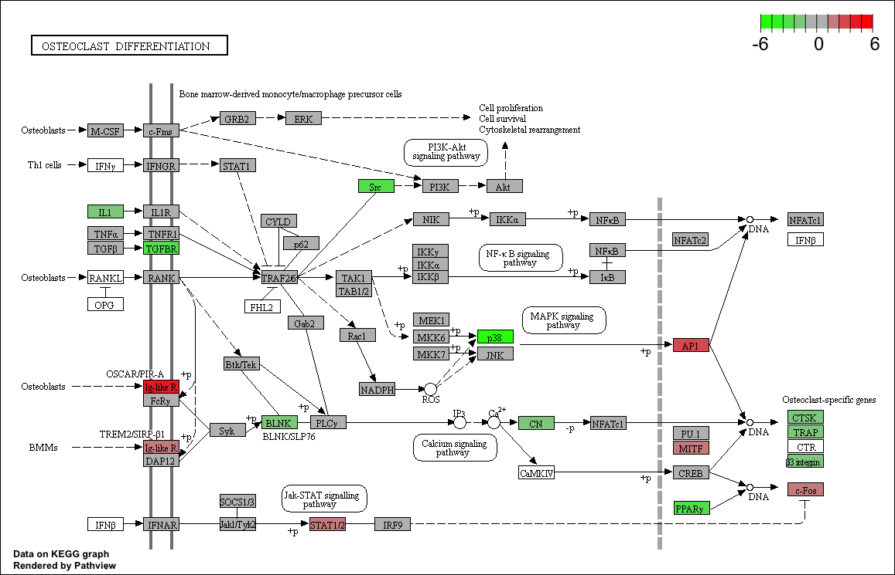

# GO AND KEGG Enrichment Analysis

Load libraries
```{r}
library(topGO)
library(KEGGREST)
library(org.Mm.eg.db)

if (!any(rownames(installed.packages()) == "pathview")){
  if (!requireNamespace("BiocManager", quietly = TRUE))
      install.packages("BiocManager")
  BiocManager::install("pathview")
}
library(pathview)
```

Files for examples created in the DE analysis

## Gene Ontology (GO) Enrichment

[Gene ontology](http://www.geneontology.org/) provides a controlled vocabulary for describing biological processes (BP ontology), molecular functions (MF ontology) and cellular components (CC ontology)

The GO ontologies themselves are organism-independent; terms are associated with genes for a specific organism through direct experimentation or through sequence homology with another organism and its GO annotation.

Terms are related to other terms through parent-child relationships in a directed acylic graph.

Enrichment analysis provides one way of drawing conclusions about a set of differential expression results.

**1\.** topGO Example Using Kolmogorov-Smirnov Testing
Our first example uses Kolmogorov-Smirnov Testing for enrichment testing of our mouse DE results, with GO annotation obtained from the Bioconductor database org.Mm.eg.db.

The first step in each topGO analysis is to create a topGOdata object.  This contains the genes, the score for each gene (here we use the p-value from the DE test), the GO terms associated with each gene, and the ontology to be used (here we use the biological process ontology)
```{r}
infile <- "WT.C_v_WT.NC.txt"
tmp <- read.delim(infile)

geneList <- tmp$P.Value
xx <- as.list(org.Mm.egENSEMBL2EG)
names(geneList) <- xx[sapply(strsplit(tmp$Gene,split="\\."),"[[", 1L)]
head(geneList)

# Create topGOData object
GOdata <- new("topGOdata",
	ontology = "BP",
	allGenes = geneList,
	geneSelectionFun = function(x)x,
	annot = annFUN.org , mapping = "org.Mm.eg.db")
```

**2\.** The topGOdata object is then used as input for enrichment testing:
```{r}
# Kolmogorov-Smirnov testing
resultKS <- runTest(GOdata, algorithm = "weight01", statistic = "ks")
tab <- GenTable(GOdata, raw.p.value = resultKS, topNodes = length(resultKS@score), numChar = 120)
```

topGO preferentially tests more specific terms, utilizing the topology of the GO graph. The algorithms used are described in detail [here](https://academic.oup.com/bioinformatics/article/22/13/1600/193669).

```{r}
head(tab, 15)
```

* Annotated: number of genes (in our gene list) that are annotated with the term
* Significant: n/a for this example, same as Annotated here
* Expected: n/a for this example, same as Annotated here
* raw.p.value: P-value from Kolomogorov-Smirnov test that DE p-values annotated with the term are smaller (i.e. more significant) than those not annotated with the term.

The Kolmogorov-Smirnov test directly compares two probability distributions based on their maximum distance.  

To illustrate the KS test, we plot probability distributions of p-values that are and that are not annotated with the term GO:0046661 "male sex differentiation" (66 genes) p-value 0.6494.  (This won't exactly match what topGO does due to their elimination algorithm):

```{r}
rna.pp.terms <- genesInTerm(GOdata)[["GO:0046661"]] # get genes associated with term
p.values.in <- geneList[names(geneList) %in% rna.pp.terms]
p.values.out <- geneList[!(names(geneList) %in% rna.pp.terms)]
plot.ecdf(p.values.in, verticals = T, do.points = F, col = "red", lwd = 2, xlim = c(0,1),
          main = "Empirical Distribution of DE P-Values by Annotation with 'male sex differentiation'",
          cex.main = 0.9, xlab = "p", ylab = "Probabilty(P-Value < p)")
ecdf.out <- ecdf(p.values.out)
xx <- unique(sort(c(seq(0, 1, length = 201), knots(ecdf.out))))
lines(xx, ecdf.out(xx), col = "black", lwd = 2)
legend("bottomright", legend = c("Genes Annotated with 'male sex differentiation'", "male sex differentiation'"), lwd = 2, col = 2:1, cex = 0.9)
```

versus the probability distributions of p-values that are and that are not annotated with the term GO:0007229 "integrin-mediated signaling pathway" (66 genes) p-value 3.5x10-5.

```{r}
rna.pp.terms <- genesInTerm(GOdata)[["GO:0007229"]] # get genes associated with term
p.values.in <- geneList[names(geneList) %in% rna.pp.terms]
p.values.out <- geneList[!(names(geneList) %in% rna.pp.terms)]
plot.ecdf(p.values.in, verticals = T, do.points = F, col = "red", lwd = 2, xlim = c(0,1),
          main = "Empirical Distribution of DE P-Values by Annotation with 'integrin-mediated signaling pathway'",
          cex.main = 0.9, xlab = "p", ylab = "Probabilty(P-Value < p)")
ecdf.out <- ecdf(p.values.out)
xx <- unique(sort(c(seq(0, 1, length = 201), knots(ecdf.out))))
lines(xx, ecdf.out(xx), col = "black", lwd = 2)
legend("bottomright", legend = c("Genes Annotated with 'integrin-mediated signaling pathway'", "Genes Not Annotated with 'integrin-mediated signaling pathway'"), lwd = 2, col = 2:1, cex = 0.9)
```


We can use the function showSigOfNodes to plot the GO graph for the 3 most significant terms and their parents, color coded by enrichment p-value (red is most significant):
```{r, fig.width = 20, fig.height = 20}
par(cex = 0.3)
showSigOfNodes(GOdata, score(resultKS), firstSigNodes = 2, useInfo = "def")
par(cex = 1)
```

**3\.** topGO Example Using Fisher's Exact Test
Next, we use Fisher's exact test to test for GO enrichment among significantly DE genes.

Create topGOdata object:
```{r}
# Create topGOData object
GOdata <- new("topGOdata",
	ontology = "BP",
	allGenes = geneList,
	geneSelectionFun = function(x) (x < 0.05),
	annot = annFUN.org , mapping = "org.Mm.eg.db")
```

Run Fisher's Exact Test:
```{r}
resultFisher <- runTest(GOdata, algorithm = "elim", statistic = "fisher")
tab <- GenTable(GOdata, raw.p.value = resultFisher, topNodes = length(resultFisher@score),
				numChar = 120)
head(tab)
```
* Annotated: number of genes (in our gene list) that are annotated with the term
* Significant: Number of significantly DE genes annotated with that term (i.e. genes where geneList = 1)
* Expected: Under random chance, number of genes that would be expected to be significantly DE and annotated with that term
* raw.p.value: P-value from Fisher's Exact Test, testing for association between significance and pathway membership.

Fisher's Exact Test is applied to the table:

**Significance/Annotation**|**Annotated With GO Term**|**Not Annotated With GO Term**
:-----:|:-----:|:-----:
**Significantly DE**|n1|n3
**Not Significantly DE**|n2|n4

and compares the probability of the observed table, conditional on the row and column sums, to what would be expected under random chance.  

Advantages over KS (or Wilcoxon) Tests:

*Ease of interpretation

Disadvantages:

* Relies on significant/non-significant dichotomy (an interesting gene could have an adjusted p-value of 0.051 and be counted as non-significant)
* Less powerful
* May be less useful if there are very few (or a large number of) significant genes

##. KEGG Pathway Enrichment Testing With KEGGREST
KEGG, the Kyoto Encyclopedia of Genes and Genomes (https://www.genome.jp/kegg/), provides assignment of genes for many organisms into pathways.

We will access KEGG pathway assignments for mouse through the KEGGREST Bioconductor package, and then use some homebrew code for enrichment testing.

**1\.** Get all mouse pathways and their genes:
```{r}
# Pull all pathways for mmu
pathways.list <- keggList("pathway", "mmu")
head(pathways.list)

# Pull all genes for each pathway
pathway.codes <- sub("path:", "", names(pathways.list))
genes.by.pathway <- sapply(pathway.codes,
	function(pwid){
		pw <- keggGet(pwid)
		if (is.null(pw[[1]]$GENE)) return(NA)
		pw2 <- pw[[1]]$GENE[c(TRUE,FALSE)] # may need to modify this to c(FALSE, TRUE) for other organisms
		pw2 <- unlist(lapply(strsplit(pw2, split = ";", fixed = T), function(x)x[1]))
		return(pw2)
	}
)
head(genes.by.pathway)
```

Read in DE file to be used in enrichment testing:
```{r}
head(geneList)
```

**2\.** Apply Wilcoxon rank-sum test to each pathway, testing if "in" p-values are smaller than "out" p-values:
```{r}
# Wilcoxon test for each pathway
pVals.by.pathway <- t(sapply(names(genes.by.pathway),
	function(pathway) {
		pathway.genes <- genes.by.pathway[[pathway]]
		list.genes.in.pathway <- intersect(names(geneList), pathway.genes)
		list.genes.not.in.pathway <- setdiff(names(geneList), list.genes.in.pathway)
		scores.in.pathway <- geneList[list.genes.in.pathway]
		scores.not.in.pathway <- geneList[list.genes.not.in.pathway]
		if (length(scores.in.pathway) > 0){
			p.value <- wilcox.test(scores.in.pathway, scores.not.in.pathway, alternative = "less")$p.value
		} else{
			p.value <- NA
		}
		return(c(p.value = p.value, Annotated = length(list.genes.in.pathway)))
	}
))

# Assemble output table
outdat <- data.frame(pathway.code = rownames(pVals.by.pathway))
outdat$pathway.name <- pathways.list[paste0("path:",outdat$pathway.code)]
outdat$p.value <- pVals.by.pathway[,"p.value"]
outdat$Annotated <- pVals.by.pathway[,"Annotated"]
outdat <- outdat[order(outdat$p.value),]
head(outdat)
```
* p.value: P-value for Wilcoxon rank-sum testing, testing that p-values from DE analysis for genes in the pathway are smaller than those not in the pathway
* Annotated: Number of genes in the pathway (regardless of DE p-value)

The Wilcoxon rank-sum test is the nonparametric analogue of the two-sample t-test.  It compares the ranks of observations in two groups.  It is more powerful than the Kolmogorov-Smirnov test.

**2\.** Plotting Pathways
```{r}
foldChangeList <- tmp$logFC
xx <- as.list(org.Mm.egENSEMBL2EG)
names(foldChangeList) <- xx[sapply(strsplit(tmp$Gene,split="\\."),"[[", 1L)]
head(foldChangeList)

mmu04380 <- pathview(gene.data  = foldChangeList,
                     pathway.id = "mmu04380",
                     species    = "mmu",
                     limit      = list(gene=max(abs(foldChangeList)), cpd=1))
```




```{r}
sessionInfo()
```
