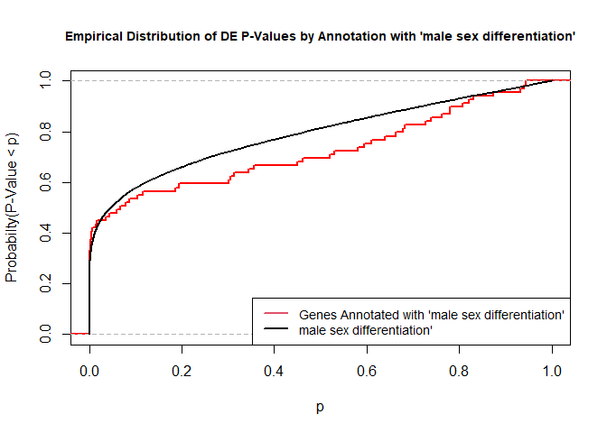
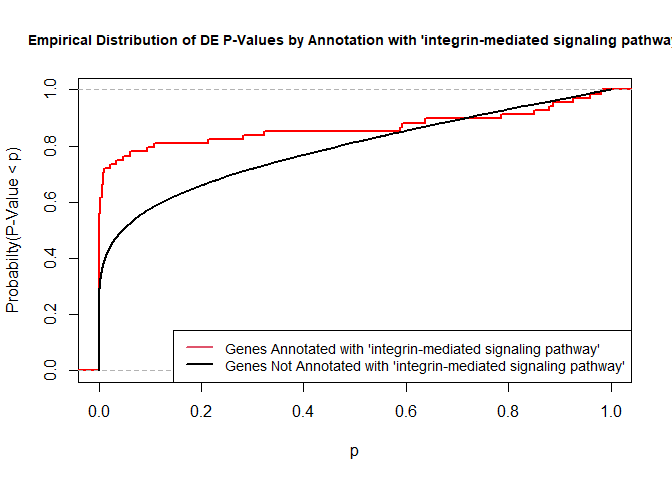

# GO AND KEGG Enrichment Analysis

Load libraries

```r
library(topGO)
```

```
## Loading required package: BiocGenerics
```

```
## Loading required package: parallel
```

```
## 
## Attaching package: 'BiocGenerics'
```

```
## The following objects are masked from 'package:parallel':
## 
##     clusterApply, clusterApplyLB, clusterCall, clusterEvalQ,
##     clusterExport, clusterMap, parApply, parCapply, parLapply,
##     parLapplyLB, parRapply, parSapply, parSapplyLB
```

```
## The following objects are masked from 'package:stats':
## 
##     IQR, mad, sd, var, xtabs
```

```
## The following objects are masked from 'package:base':
## 
##     anyDuplicated, append, as.data.frame, basename, cbind, colnames,
##     dirname, do.call, duplicated, eval, evalq, Filter, Find, get, grep,
##     grepl, intersect, is.unsorted, lapply, Map, mapply, match, mget,
##     order, paste, pmax, pmax.int, pmin, pmin.int, Position, rank,
##     rbind, Reduce, rownames, sapply, setdiff, sort, table, tapply,
##     union, unique, unsplit, which, which.max, which.min
```

```
## Loading required package: graph
```

```
## Loading required package: Biobase
```

```
## Welcome to Bioconductor
## 
##     Vignettes contain introductory material; view with
##     'browseVignettes()'. To cite Bioconductor, see
##     'citation("Biobase")', and for packages 'citation("pkgname")'.
```

```
## Loading required package: GO.db
```

```
## Loading required package: AnnotationDbi
```

```
## Loading required package: stats4
```

```
## Loading required package: IRanges
```

```
## Loading required package: S4Vectors
```

```
## 
## Attaching package: 'S4Vectors'
```

```
## The following object is masked from 'package:base':
## 
##     expand.grid
```

```
## 
```

```
## Loading required package: SparseM
```

```
## 
## Attaching package: 'SparseM'
```

```
## The following object is masked from 'package:base':
## 
##     backsolve
```

```
## 
## groupGOTerms: 	GOBPTerm, GOMFTerm, GOCCTerm environments built.
```

```
## 
## Attaching package: 'topGO'
```

```
## The following object is masked from 'package:IRanges':
## 
##     members
```

```r
library(KEGGREST)
library(org.Mm.eg.db)
```

```
## 
```

```r
if (!any(rownames(installed.packages()) == "pathview")){
  if (!requireNamespace("BiocManager", quietly = TRUE))
      install.packages("BiocManager")
  BiocManager::install("pathview")
}
library(pathview)
```

```
## 
```

```
## ##############################################################################
## Pathview is an open source software package distributed under GNU General
## Public License version 3 (GPLv3). Details of GPLv3 is available at
## http://www.gnu.org/licenses/gpl-3.0.html. Particullary, users are required to
## formally cite the original Pathview paper (not just mention it) in publications
## or products. For details, do citation("pathview") within R.
## 
## The pathview downloads and uses KEGG data. Non-academic uses may require a KEGG
## license agreement (details at http://www.kegg.jp/kegg/legal.html).
## ##############################################################################
```

Files for examples created in the DE analysis

## Gene Ontology (GO) Enrichment

[Gene ontology](http://www.geneontology.org/) provides a controlled vocabulary for describing biological processes (BP ontology), molecular functions (MF ontology) and cellular components (CC ontology)

The GO ontologies themselves are organism-independent; terms are associated with genes for a specific organism through direct experimentation or through sequence homology with another organism and its GO annotation.

Terms are related to other terms through parent-child relationships in a directed acylic graph.

Enrichment analysis provides one way of drawing conclusions about a set of differential expression results.

**1\.** topGO Example Using Kolmogorov-Smirnov Testing
Our first example uses Kolmogorov-Smirnov Testing for enrichment testing of our mouse DE results, with GO annotation obtained from the Bioconductor database org.Mm.eg.db.

The first step in each topGO analysis is to create a topGOdata object.  This contains the genes, the score for each gene (here we use the p-value from the DE test), the GO terms associated with each gene, and the ontology to be used (here we use the biological process ontology)

```r
infile <- "WT.C_v_WT.NC.txt"
tmp <- read.delim(infile)

geneList <- tmp$P.Value
xx <- as.list(org.Mm.egENSEMBL2EG)
names(geneList) <- xx[sapply(strsplit(tmp$Gene,split="\\."),"[[", 1L)]
head(geneList)
```

```
##        74127        70686        14268        20112        67241        66775 
## 9.057118e-18 3.288834e-17 6.570900e-17 6.921801e-17 2.519371e-16 2.746416e-16
```

```r
# Create topGOData object
GOdata <- new("topGOdata",
	ontology = "BP",
	allGenes = geneList,
	geneSelectionFun = function(x)x,
	annot = annFUN.org , mapping = "org.Mm.eg.db")
```

```
## 
## Building most specific GOs .....
```

```
## 	( 10340 GO terms found. )
```

```
## 
## Build GO DAG topology ..........
```

```
## 	( 14256 GO terms and 33631 relations. )
```

```
## 
## Annotating nodes ...............
```

```
## 	( 10801 genes annotated to the GO terms. )
```

**2\.** The topGOdata object is then used as input for enrichment testing:

```r
# Kolmogorov-Smirnov testing
resultKS <- runTest(GOdata, algorithm = "weight01", statistic = "ks")
```

```
## 
## 			 -- Weight01 Algorithm -- 
## 
## 		 the algorithm is scoring 14256 nontrivial nodes
## 		 parameters: 
## 			 test statistic: ks
## 			 score order: increasing
```

```
## 
## 	 Level 19:	2 nodes to be scored	(0 eliminated genes)
```

```
## 
## 	 Level 18:	17 nodes to be scored	(0 eliminated genes)
```

```
## 
## 	 Level 17:	43 nodes to be scored	(6 eliminated genes)
```

```
## 
## 	 Level 16:	93 nodes to be scored	(47 eliminated genes)
```

```
## 
## 	 Level 15:	190 nodes to be scored	(136 eliminated genes)
```

```
## 
## 	 Level 14:	393 nodes to be scored	(361 eliminated genes)
```

```
## 
## 	 Level 13:	728 nodes to be scored	(820 eliminated genes)
```

```
## 
## 	 Level 12:	1197 nodes to be scored	(1767 eliminated genes)
```

```
## 
## 	 Level 11:	1610 nodes to be scored	(3355 eliminated genes)
```

```
## 
## 	 Level 10:	1982 nodes to be scored	(4694 eliminated genes)
```

```
## 
## 	 Level 9:	2084 nodes to be scored	(5936 eliminated genes)
```

```
## 
## 	 Level 8:	1927 nodes to be scored	(7081 eliminated genes)
```

```
## 
## 	 Level 7:	1662 nodes to be scored	(8002 eliminated genes)
```

```
## 
## 	 Level 6:	1201 nodes to be scored	(8740 eliminated genes)
```

```
## 
## 	 Level 5:	666 nodes to be scored	(9091 eliminated genes)
```

```
## 
## 	 Level 4:	313 nodes to be scored	(9334 eliminated genes)
```

```
## 
## 	 Level 3:	124 nodes to be scored	(9467 eliminated genes)
```

```
## 
## 	 Level 2:	23 nodes to be scored	(9520 eliminated genes)
```

```
## 
## 	 Level 1:	1 nodes to be scored	(9596 eliminated genes)
```

```r
tab <- GenTable(GOdata, raw.p.value = resultKS, topNodes = length(resultKS@score), numChar = 120)
```

topGO preferentially tests more specific terms, utilizing the topology of the GO graph. The algorithms used are described in detail [here](https://academic.oup.com/bioinformatics/article/22/13/1600/193669).


```r
head(tab, 15)
```

```
##         GO.ID                                                      Term
## 1  GO:0045087                                    innate immune response
## 2  GO:1904469    positive regulation of tumor necrosis factor secretion
## 3  GO:0007229                       integrin-mediated signaling pathway
## 4  GO:0071285                          cellular response to lithium ion
## 5  GO:0030036                           actin cytoskeleton organization
## 6  GO:0008150                                        biological_process
## 7  GO:0045766                       positive regulation of angiogenesis
## 8  GO:0031623                                  receptor internalization
## 9  GO:0006979                              response to oxidative stress
## 10 GO:0006002                    fructose 6-phosphate metabolic process
## 11 GO:1901224            positive regulation of NIK/NF-kappaB signaling
## 12 GO:0032731      positive regulation of interleukin-1 beta production
## 13 GO:0042742                             defense response to bacterium
## 14 GO:0050861  positive regulation of B cell receptor signaling pathway
## 15 GO:0045944 positive regulation of transcription by RNA polymerase II
##    Annotated Significant Expected raw.p.value
## 1        438         438      438     1.6e-06
## 2         18          18       18     1.8e-05
## 3         66          66       66     3.5e-05
## 4         10          10       10     4.0e-05
## 5        441         441      441     4.7e-05
## 6      10801       10801    10801     4.7e-05
## 7        114         114      114     6.1e-05
## 8         81          81       81     8.4e-05
## 9        308         308      308     0.00010
## 10         7           7        7     0.00014
## 11        56          56       56     0.00015
## 12        40          40       40     0.00016
## 13       127         127      127     0.00018
## 14         7           7        7     0.00020
## 15       760         760      760     0.00022
```

* Annotated: number of genes (in our gene list) that are annotated with the term
* Significant: n/a for this example, same as Annotated here
* Expected: n/a for this example, same as Annotated here
* raw.p.value: P-value from Kolomogorov-Smirnov test that DE p-values annotated with the term are smaller (i.e. more significant) than those not annotated with the term.

The Kolmogorov-Smirnov test directly compares two probability distributions based on their maximum distance.  

To illustrate the KS test, we plot probability distributions of p-values that are and that are not annotated with the term GO:0046661 "male sex differentiation" (66 genes) p-value 0.6494.  (This won't exactly match what topGO does due to their elimination algorithm):


```r
rna.pp.terms <- genesInTerm(GOdata)[["GO:0046661"]] # get genes associated with term
p.values.in <- geneList[names(geneList) %in% rna.pp.terms]
p.values.out <- geneList[!(names(geneList) %in% rna.pp.terms)]
plot.ecdf(p.values.in, verticals = T, do.points = F, col = "red", lwd = 2, xlim = c(0,1),
          main = "Empirical Distribution of DE P-Values by Annotation with 'male sex differentiation'",
          cex.main = 0.9, xlab = "p", ylab = "Probabilty(P-Value < p)")
ecdf.out <- ecdf(p.values.out)
xx <- unique(sort(c(seq(0, 1, length = 201), knots(ecdf.out))))
lines(xx, ecdf.out(xx), col = "black", lwd = 2)
legend("bottomright", legend = c("Genes Annotated with 'male sex differentiation'", "male sex differentiation'"), lwd = 2, col = 2:1, cex = 0.9)
```

<!-- -->

versus the probability distributions of p-values that are and that are not annotated with the term GO:0007229 "integrin-mediated signaling pathway" (66 genes) p-value 3.5x10-5.


```r
rna.pp.terms <- genesInTerm(GOdata)[["GO:0007229"]] # get genes associated with term
p.values.in <- geneList[names(geneList) %in% rna.pp.terms]
p.values.out <- geneList[!(names(geneList) %in% rna.pp.terms)]
plot.ecdf(p.values.in, verticals = T, do.points = F, col = "red", lwd = 2, xlim = c(0,1),
          main = "Empirical Distribution of DE P-Values by Annotation with 'integrin-mediated signaling pathway'",
          cex.main = 0.9, xlab = "p", ylab = "Probabilty(P-Value < p)")
ecdf.out <- ecdf(p.values.out)
xx <- unique(sort(c(seq(0, 1, length = 201), knots(ecdf.out))))
lines(xx, ecdf.out(xx), col = "black", lwd = 2)
legend("bottomright", legend = c("Genes Annotated with 'integrin-mediated signaling pathway'", "Genes Not Annotated with 'integrin-mediated signaling pathway'"), lwd = 2, col = 2:1, cex = 0.9)
```

<!-- -->


We can use the function showSigOfNodes to plot the GO graph for the 3 most significant terms and their parents, color coded by enrichment p-value (red is most significant):

```r
par(cex = 0.3)
showSigOfNodes(GOdata, score(resultKS), firstSigNodes = 2, useInfo = "def")
```

```
## Loading required package: Rgraphviz
```

```
## Loading required package: grid
```

```
## 
## Attaching package: 'grid'
```

```
## The following object is masked from 'package:topGO':
## 
##     depth
```

```
## 
## Attaching package: 'Rgraphviz'
```

```
## The following objects are masked from 'package:IRanges':
## 
##     from, to
```

```
## The following objects are masked from 'package:S4Vectors':
## 
##     from, to
```

<!-- -->

```
## $dag
## A graphNEL graph with directed edges
## Number of Nodes = 90 
## Number of Edges = 191 
## 
## $complete.dag
## [1] "A graph with 90 nodes."
```

```r
par(cex = 1)
```

**3\.** topGO Example Using Fisher's Exact Test
Next, we use Fisher's exact test to test for GO enrichment among significantly DE genes.

Create topGOdata object:

```r
# Create topGOData object
GOdata <- new("topGOdata",
	ontology = "BP",
	allGenes = geneList,
	geneSelectionFun = function(x) (x < 0.05),
	annot = annFUN.org , mapping = "org.Mm.eg.db")
```

```
## 
## Building most specific GOs .....
```

```
## 	( 10340 GO terms found. )
```

```
## 
## Build GO DAG topology ..........
```

```
## 	( 14256 GO terms and 33631 relations. )
```

```
## 
## Annotating nodes ...............
```

```
## 	( 10801 genes annotated to the GO terms. )
```

Run Fisher's Exact Test:

```r
resultFisher <- runTest(GOdata, algorithm = "elim", statistic = "fisher")
```

```
## 
## 			 -- Elim Algorithm -- 
## 
## 		 the algorithm is scoring 12385 nontrivial nodes
## 		 parameters: 
## 			 test statistic: fisher
## 			 cutOff: 0.01
```

```
## 
## 	 Level 19:	2 nodes to be scored	(0 eliminated genes)
```

```
## 
## 	 Level 18:	14 nodes to be scored	(0 eliminated genes)
```

```
## 
## 	 Level 17:	33 nodes to be scored	(0 eliminated genes)
```

```
## 
## 	 Level 16:	76 nodes to be scored	(0 eliminated genes)
```

```
## 
## 	 Level 15:	157 nodes to be scored	(26 eliminated genes)
```

```
## 
## 	 Level 14:	324 nodes to be scored	(26 eliminated genes)
```

```
## 
## 	 Level 13:	585 nodes to be scored	(144 eliminated genes)
```

```
## 
## 	 Level 12:	988 nodes to be scored	(1330 eliminated genes)
```

```
## 
## 	 Level 11:	1348 nodes to be scored	(1422 eliminated genes)
```

```
## 
## 	 Level 10:	1714 nodes to be scored	(1925 eliminated genes)
```

```
## 
## 	 Level 9:	1821 nodes to be scored	(2072 eliminated genes)
```

```
## 
## 	 Level 8:	1706 nodes to be scored	(2527 eliminated genes)
```

```
## 
## 	 Level 7:	1482 nodes to be scored	(3388 eliminated genes)
```

```
## 
## 	 Level 6:	1076 nodes to be scored	(4313 eliminated genes)
```

```
## 
## 	 Level 5:	620 nodes to be scored	(5050 eliminated genes)
```

```
## 
## 	 Level 4:	296 nodes to be scored	(5709 eliminated genes)
```

```
## 
## 	 Level 3:	119 nodes to be scored	(5817 eliminated genes)
```

```
## 
## 	 Level 2:	23 nodes to be scored	(6511 eliminated genes)
```

```
## 
## 	 Level 1:	1 nodes to be scored	(6511 eliminated genes)
```

```r
tab <- GenTable(GOdata, raw.p.value = resultFisher, topNodes = length(resultFisher@score),
				numChar = 120)
head(tab)
```

```
##        GO.ID                                                           Term
## 1 GO:0001525                                                   angiogenesis
## 2 GO:0009967                     positive regulation of signal transduction
## 3 GO:0051607                                      defense response to virus
## 4 GO:0045944      positive regulation of transcription by RNA polymerase II
## 5 GO:0043537 negative regulation of blood vessel endothelial cell migration
## 6 GO:0006954                                          inflammatory response
##   Annotated Significant Expected raw.p.value
## 1       311         197   154.44     2.3e-05
## 2       922         537   457.84     9.2e-05
## 3       183         116    90.87     0.00011
## 4       760         426   377.40     0.00015
## 5        20          18     9.93     0.00018
## 6       426         248   211.54     0.00018
```
* Annotated: number of genes (in our gene list) that are annotated with the term
* Significant: Number of significantly DE genes annotated with that term (i.e. genes where geneList = 1)
* Expected: Under random chance, number of genes that would be expected to be significantly DE and annotated with that term
* raw.p.value: P-value from Fisher's Exact Test, testing for association between significance and pathway membership.

Fisher's Exact Test is applied to the table:

**Significance/Annotation**|**Annotated With GO Term**|**Not Annotated With GO Term**
:-----:|:-----:|:-----:
**Significantly DE**|n1|n3
**Not Significantly DE**|n2|n4

and compares the probability of the observed table, conditional on the row and column sums, to what would be expected under random chance.  

Advantages over KS (or Wilcoxon) Tests:

*Ease of interpretation

Disadvantages:

* Relies on significant/non-significant dichotomy (an interesting gene could have an adjusted p-value of 0.051 and be counted as non-significant)
* Less powerful
* May be less useful if there are very few (or a large number of) significant genes

##. KEGG Pathway Enrichment Testing With KEGGREST
KEGG, the Kyoto Encyclopedia of Genes and Genomes (https://www.genome.jp/kegg/), provides assignment of genes for many organisms into pathways.

We will access KEGG pathway assignments for mouse through the KEGGREST Bioconductor package, and then use some homebrew code for enrichment testing.

**1\.** Get all mouse pathways and their genes:

```r
# Pull all pathways for mmu
pathways.list <- keggList("pathway", "mmu")
head(pathways.list)
```

```
##                                                     path:mmu00010 
##             "Glycolysis / Gluconeogenesis - Mus musculus (mouse)" 
##                                                     path:mmu00020 
##                "Citrate cycle (TCA cycle) - Mus musculus (mouse)" 
##                                                     path:mmu00030 
##                "Pentose phosphate pathway - Mus musculus (mouse)" 
##                                                     path:mmu00040 
## "Pentose and glucuronate interconversions - Mus musculus (mouse)" 
##                                                     path:mmu00051 
##          "Fructose and mannose metabolism - Mus musculus (mouse)" 
##                                                     path:mmu00052 
##                     "Galactose metabolism - Mus musculus (mouse)"
```

```r
# Pull all genes for each pathway
pathway.codes <- sub("path:", "", names(pathways.list))
genes.by.pathway <- sapply(pathway.codes,
	function(pwid){
		pw <- keggGet(pwid)
		if (is.null(pw[[1]]$GENE)) return(NA)
		pw2 <- pw[[1]]$GENE[c(TRUE,FALSE)] # may need to modify this to c(FALSE, TRUE) for other organisms
		pw2 <- unlist(lapply(strsplit(pw2, split = ";", fixed = T), function(x)x[1]))
		return(pw2)
	}
)
head(genes.by.pathway)
```

```
## $mmu00010
##  [1] "15277"  "212032" "15275"  "216019" "103988" "14751"  "18641"  "18642" 
##  [9] "56421"  "14121"  "14120"  "11674"  "230163" "11676"  "353204" "21991" 
## [17] "14433"  "14447"  "18655"  "18663"  "18648"  "56012"  "13806"  "13807" 
## [25] "13808"  "433182" "226265" "18746"  "18770"  "18597"  "18598"  "68263" 
## [33] "235339" "13382"  "16828"  "16832"  "16833"  "106557" "11522"  "11529" 
## [41] "26876"  "11532"  "58810"  "11669"  "11671"  "72535"  "110695" "56752" 
## [49] "11670"  "67689"  "621603" "73458"  "68738"  "60525"  "319625" "72157" 
## [57] "66681"  "14377"  "14378"  "68401"  "72141"  "12183"  "17330"  "18534" 
## [65] "74551" 
## 
## $mmu00020
##  [1] "12974"  "71832"  "104112" "11429"  "11428"  "15926"  "269951" "15929" 
##  [9] "67834"  "170718" "243996" "18293"  "239017" "78920"  "13382"  "56451" 
## [17] "20917"  "20916"  "66945"  "67680"  "66052"  "66925"  "14194"  "17449" 
## [25] "17448"  "18563"  "18534"  "74551"  "18597"  "18598"  "68263"  "235339"
## 
## $mmu00030
##  [1] "14751"  "14380"  "14381"  "66171"  "100198" "110208" "66646"  "21881" 
##  [9] "83553"  "74419"  "21351"  "19895"  "232449" "71336"  "72157"  "66681" 
## [17] "19139"  "110639" "328099" "75456"  "19733"  "75731"  "235582" "11674" 
## [25] "230163" "11676"  "353204" "14121"  "14120"  "18641"  "18642"  "56421" 
## 
## $mmu00040
##  [1] "110006" "16591"  "22238"  "22236"  "94284"  "94215"  "394434" "394430"
##  [9] "394432" "394433" "72094"  "552899" "71773"  "394435" "394436" "100727"
## [17] "231396" "100559" "112417" "243085" "22235"  "216558" "58810"  "68631" 
## [25] "66646"  "102448" "11997"  "14187"  "11677"  "67861"  "67880"  "20322" 
## [33] "71755"  "75847" 
## 
## $mmu00051
##  [1] "110119" "54128"  "29858"  "331026" "69080"  "218138" "22122"  "75540" 
##  [9] "234730" "15277"  "212032" "15275"  "216019" "18641"  "18642"  "56421" 
## [17] "14121"  "14120"  "18639"  "18640"  "170768" "270198" "319801" "16548" 
## [25] "20322"  "11997"  "14187"  "11677"  "67861"  "11674"  "230163" "11676" 
## [33] "353204" "21991"  "225913"
## 
## $mmu00052
##  [1] "319625" "14635"  "14430"  "74246"  "216558" "72157"  "66681"  "15277" 
##  [9] "212032" "15275"  "216019" "103988" "14377"  "14378"  "68401"  "12091" 
## [17] "226413" "16770"  "14595"  "53418"  "11605"  "11997"  "14187"  "11677" 
## [25] "67861"  "18641"  "18642"  "56421"  "232714" "14387"  "76051"  "69983"
```

Read in DE file to be used in enrichment testing:

```r
head(geneList)
```

```
##        74127        70686        14268        20112        67241        66775 
## 9.057118e-18 3.288834e-17 6.570900e-17 6.921801e-17 2.519371e-16 2.746416e-16
```

**2\.** Apply Wilcoxon rank-sum test to each pathway, testing if "in" p-values are smaller than "out" p-values:

```r
# Wilcoxon test for each pathway
pVals.by.pathway <- t(sapply(names(genes.by.pathway),
	function(pathway) {
		pathway.genes <- genes.by.pathway[[pathway]]
		list.genes.in.pathway <- intersect(names(geneList), pathway.genes)
		list.genes.not.in.pathway <- setdiff(names(geneList), list.genes.in.pathway)
		scores.in.pathway <- geneList[list.genes.in.pathway]
		scores.not.in.pathway <- geneList[list.genes.not.in.pathway]
		if (length(scores.in.pathway) > 0){
			p.value <- wilcox.test(scores.in.pathway, scores.not.in.pathway, alternative = "less")$p.value
		} else{
			p.value <- NA
		}
		return(c(p.value = p.value, Annotated = length(list.genes.in.pathway)))
	}
))

# Assemble output table
outdat <- data.frame(pathway.code = rownames(pVals.by.pathway))
outdat$pathway.name <- pathways.list[paste0("path:",outdat$pathway.code)]
outdat$p.value <- pVals.by.pathway[,"p.value"]
outdat$Annotated <- pVals.by.pathway[,"Annotated"]
outdat <- outdat[order(outdat$p.value),]
head(outdat)
```

```
##     pathway.code
## 167     mmu04380
## 193     mmu04662
## 284     mmu05160
## 291     mmu05167
## 182     mmu04621
## 150     mmu04210
##                                                               pathway.name
## 167                      Osteoclast differentiation - Mus musculus (mouse)
## 193               B cell receptor signaling pathway - Mus musculus (mouse)
## 284                                     Hepatitis C - Mus musculus (mouse)
## 291 Kaposi sarcoma-associated herpesvirus infection - Mus musculus (mouse)
## 182             NOD-like receptor signaling pathway - Mus musculus (mouse)
## 150                                       Apoptosis - Mus musculus (mouse)
##          p.value Annotated
## 167 8.157153e-09       109
## 193 2.081783e-07        73
## 284 2.713656e-07       116
## 291 3.089061e-07       152
## 182 5.723044e-07       145
## 150 1.122652e-06       119
```
* p.value: P-value for Wilcoxon rank-sum testing, testing that p-values from DE analysis for genes in the pathway are smaller than those not in the pathway
* Annotated: Number of genes in the pathway (regardless of DE p-value)

The Wilcoxon rank-sum test is the nonparametric analogue of the two-sample t-test.  It compares the ranks of observations in two groups.  It is more powerful than the Kolmogorov-Smirnov test.

**2\.** Plotting Pathways

```r
foldChangeList <- tmp$logFC
xx <- as.list(org.Mm.egENSEMBL2EG)
names(foldChangeList) <- xx[sapply(strsplit(tmp$Gene,split="\\."),"[[", 1L)]
head(foldChangeList)
```

```
##     74127     70686     14268     20112     67241     66775 
## -1.550654 -4.163331  4.755457 -3.190990 -2.440513  1.703374
```

```r
mmu04380 <- pathview(gene.data  = foldChangeList,
                     pathway.id = "mmu04380",
                     species    = "mmu",
                     limit      = list(gene=max(abs(foldChangeList)), cpd=1))
```

```
## 'select()' returned 1:1 mapping between keys and columns
```

```
## Info: Working in directory /Users/mattsettles/projects/src/RStudio/mrnaseq_2020_july
```

```
## Info: Writing image file mmu04380.pathview.png
```


```r
sessionInfo()
```

```
## R version 4.0.2 (2020-06-22)
## Platform: x86_64-apple-darwin17.0 (64-bit)
## Running under: macOS Catalina 10.15.5
## 
## Matrix products: default
## BLAS:   /Library/Frameworks/R.framework/Versions/4.0/Resources/lib/libRblas.dylib
## LAPACK: /Library/Frameworks/R.framework/Versions/4.0/Resources/lib/libRlapack.dylib
## 
## locale:
## [1] en_US.UTF-8/en_US.UTF-8/en_US.UTF-8/C/en_US.UTF-8/en_US.UTF-8
## 
## attached base packages:
##  [1] grid      stats4    parallel  stats     graphics  grDevices utils    
##  [8] datasets  methods   base     
## 
## other attached packages:
##  [1] Rgraphviz_2.32.0     pathview_1.28.1      org.Mm.eg.db_3.11.4 
##  [4] KEGGREST_1.28.0      topGO_2.40.0         SparseM_1.78        
##  [7] GO.db_3.11.4         AnnotationDbi_1.50.3 IRanges_2.22.2      
## [10] S4Vectors_0.26.1     Biobase_2.48.0       graph_1.66.0        
## [13] BiocGenerics_0.34.0 
## 
## loaded via a namespace (and not attached):
##  [1] Rcpp_1.0.5          compiler_4.0.2      XVector_0.28.0     
##  [4] bitops_1.0-6        zlibbioc_1.34.0     tools_4.0.2        
##  [7] digest_0.6.25       bit_4.0.3           RSQLite_2.2.0      
## [10] evaluate_0.14       memoise_1.1.0       lattice_0.20-41    
## [13] pkgconfig_2.0.3     png_0.1-7           rlang_0.4.7        
## [16] KEGGgraph_1.48.0    DBI_1.1.0           curl_4.3           
## [19] yaml_2.2.1          xfun_0.16           stringr_1.4.0      
## [22] httr_1.4.2          knitr_1.29          Biostrings_2.56.0  
## [25] vctrs_0.3.2         bit64_4.0.2         R6_2.4.1           
## [28] XML_3.99-0.5        rmarkdown_2.3       org.Hs.eg.db_3.11.4
## [31] blob_1.2.1          magrittr_1.5        htmltools_0.5.0    
## [34] matrixStats_0.56.0  stringi_1.4.6       RCurl_1.98-1.2     
## [37] crayon_1.3.4
```
