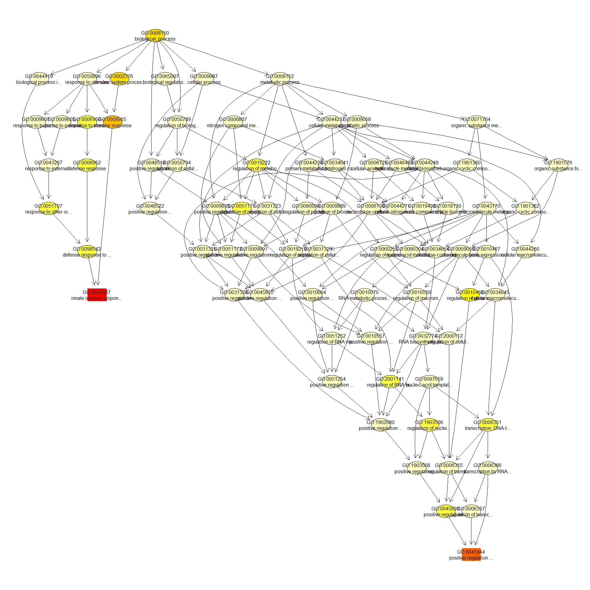
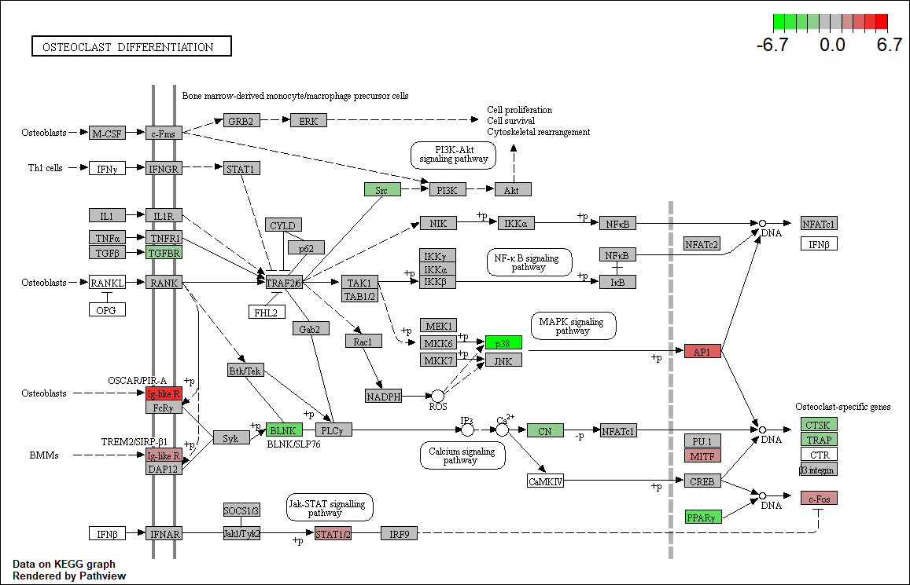

# GO AND KEGG Enrichment Analysis

Load libraries

```r
library(topGO)
```

```
## Loading required package: BiocGenerics
```

```
## Loading required package: parallel
```

```
## 
## Attaching package: 'BiocGenerics'
```

```
## The following objects are masked from 'package:parallel':
## 
##     clusterApply, clusterApplyLB, clusterCall, clusterEvalQ,
##     clusterExport, clusterMap, parApply, parCapply, parLapply,
##     parLapplyLB, parRapply, parSapply, parSapplyLB
```

```
## The following objects are masked from 'package:stats':
## 
##     IQR, mad, sd, var, xtabs
```

```
## The following objects are masked from 'package:base':
## 
##     anyDuplicated, append, as.data.frame, basename, cbind, colnames,
##     dirname, do.call, duplicated, eval, evalq, Filter, Find, get, grep,
##     grepl, intersect, is.unsorted, lapply, Map, mapply, match, mget,
##     order, paste, pmax, pmax.int, pmin, pmin.int, Position, rank,
##     rbind, Reduce, rownames, sapply, setdiff, sort, table, tapply,
##     union, unique, unsplit, which.max, which.min
```

```
## Loading required package: graph
```

```
## Loading required package: Biobase
```

```
## Welcome to Bioconductor
## 
##     Vignettes contain introductory material; view with
##     'browseVignettes()'. To cite Bioconductor, see
##     'citation("Biobase")', and for packages 'citation("pkgname")'.
```

```
## Loading required package: GO.db
```

```
## Loading required package: AnnotationDbi
```

```
## Loading required package: stats4
```

```
## Loading required package: IRanges
```

```
## Loading required package: S4Vectors
```

```
## 
## Attaching package: 'S4Vectors'
```

```
## The following objects are masked from 'package:base':
## 
##     expand.grid, I, unname
```

```
## 
## Attaching package: 'IRanges'
```

```
## The following object is masked from 'package:grDevices':
## 
##     windows
```

```
## 
```

```
## Loading required package: SparseM
```

```
## 
## Attaching package: 'SparseM'
```

```
## The following object is masked from 'package:base':
## 
##     backsolve
```

```
## 
## groupGOTerms: 	GOBPTerm, GOMFTerm, GOCCTerm environments built.
```

```
## 
## Attaching package: 'topGO'
```

```
## The following object is masked from 'package:IRanges':
## 
##     members
```

```r
library(KEGGREST)
library(org.Mm.eg.db)
```

```
## 
```

```r
if (!any(rownames(installed.packages()) == "pathview")){
  if (!requireNamespace("BiocManager", quietly = TRUE))
      install.packages("BiocManager")
  BiocManager::install("pathview")
}
library(pathview)
```

```
## 
```

```
## ##############################################################################
## Pathview is an open source software package distributed under GNU General
## Public License version 3 (GPLv3). Details of GPLv3 is available at
## http://www.gnu.org/licenses/gpl-3.0.html. Particullary, users are required to
## formally cite the original Pathview paper (not just mention it) in publications
## or products. For details, do citation("pathview") within R.
## 
## The pathview downloads and uses KEGG data. Non-academic uses may require a KEGG
## license agreement (details at http://www.kegg.jp/kegg/legal.html).
## ##############################################################################
```

Files for examples created in the DE analysis

## Gene Ontology (GO) Enrichment

[Gene ontology](http://www.geneontology.org/) provides a controlled vocabulary for describing biological processes (BP ontology), molecular functions (MF ontology) and cellular components (CC ontology)

The GO ontologies themselves are organism-independent; terms are associated with genes for a specific organism through direct experimentation or through sequence homology with another organism and its GO annotation.

Terms are related to other terms through parent-child relationships in a directed acylic graph.

Enrichment analysis provides one way of drawing conclusions about a set of differential expression results.

**1\.** topGO Example Using Kolmogorov-Smirnov Testing
Our first example uses Kolmogorov-Smirnov Testing for enrichment testing of our mouse DE results, with GO annotation obtained from the Bioconductor database org.Mm.eg.db.

The first step in each topGO analysis is to create a topGOdata object.  This contains the genes, the score for each gene (here we use the p-value from the DE test), the GO terms associated with each gene, and the ontology to be used (here we use the biological process ontology)

```r
infile <- "WT.C_v_WT.NC.txt"
tmp <- read.delim(infile)

geneList <- tmp$P.Value
xx <- as.list(org.Mm.egENSEMBL2EG)
names(geneList) <- xx[sapply(strsplit(tmp$Gene,split="\\."),"[[", 1L)]
head(geneList)
```

```
##        67241        12772        68891        70686       219140        14268 
## 1.162922e-19 7.630203e-19 8.283175e-19 1.182848e-17 1.973093e-17 2.376095e-17
```

```r
# Create topGOData object
GOdata <- new("topGOdata",
	ontology = "BP",
	allGenes = geneList,
	geneSelectionFun = function(x)x,
	annot = annFUN.org , mapping = "org.Mm.eg.db")
```

```
## 
## Building most specific GOs .....
```

```
## 	( 10598 GO terms found. )
```

```
## 
## Build GO DAG topology ..........
```

```
## 	( 14275 GO terms and 32496 relations. )
```

```
## 
## Annotating nodes ...............
```

```
## 	( 11075 genes annotated to the GO terms. )
```

**2\.** The topGOdata object is then used as input for enrichment testing:

```r
# Kolmogorov-Smirnov testing
resultKS <- runTest(GOdata, algorithm = "weight01", statistic = "ks")
```

```
## 
## 			 -- Weight01 Algorithm -- 
## 
## 		 the algorithm is scoring 14275 nontrivial nodes
## 		 parameters: 
## 			 test statistic: ks
## 			 score order: increasing
```

```
## 
## 	 Level 20:	1 nodes to be scored	(0 eliminated genes)
```

```
## 
## 	 Level 19:	8 nodes to be scored	(0 eliminated genes)
```

```
## 
## 	 Level 18:	17 nodes to be scored	(1 eliminated genes)
```

```
## 
## 	 Level 17:	47 nodes to be scored	(30 eliminated genes)
```

```
## 
## 	 Level 16:	100 nodes to be scored	(62 eliminated genes)
```

```
## 
## 	 Level 15:	213 nodes to be scored	(158 eliminated genes)
```

```
## 
## 	 Level 14:	417 nodes to be scored	(391 eliminated genes)
```

```
## 
## 	 Level 13:	747 nodes to be scored	(947 eliminated genes)
```

```
## 
## 	 Level 12:	1191 nodes to be scored	(1967 eliminated genes)
```

```
## 
## 	 Level 11:	1621 nodes to be scored	(3610 eliminated genes)
```

```
## 
## 	 Level 10:	1969 nodes to be scored	(5233 eliminated genes)
```

```
## 
## 	 Level 9:	2066 nodes to be scored	(6445 eliminated genes)
```

```
## 
## 	 Level 8:	1885 nodes to be scored	(7718 eliminated genes)
```

```
## 
## 	 Level 7:	1641 nodes to be scored	(8599 eliminated genes)
```

```
## 
## 	 Level 6:	1207 nodes to be scored	(9234 eliminated genes)
```

```
## 
## 	 Level 5:	684 nodes to be scored	(9637 eliminated genes)
```

```
## 
## 	 Level 4:	317 nodes to be scored	(9871 eliminated genes)
```

```
## 
## 	 Level 3:	120 nodes to be scored	(9984 eliminated genes)
```

```
## 
## 	 Level 2:	23 nodes to be scored	(10043 eliminated genes)
```

```
## 
## 	 Level 1:	1 nodes to be scored	(10079 eliminated genes)
```

```r
tab <- GenTable(GOdata, raw.p.value = resultKS, topNodes = length(resultKS@score), numChar = 120)
```

topGO by default preferentially tests more specific terms, utilizing the topology of the GO graph. The algorithms used are described in detail [here](https://academic.oup.com/bioinformatics/article/22/13/1600/193669).


```r
head(tab, 15)
```

```
##         GO.ID                                                      Term
## 1  GO:0045087                                    innate immune response
## 2  GO:0045944 positive regulation of transcription by RNA polymerase II
## 3  GO:0051607                                 defense response to virus
## 4  GO:0045766                       positive regulation of angiogenesis
## 5  GO:0031623                                  receptor internalization
## 6  GO:0006002                    fructose 6-phosphate metabolic process
## 7  GO:0042742                             defense response to bacterium
## 8  GO:0045071           negative regulation of viral genome replication
## 9  GO:0006954                                     inflammatory response
## 10 GO:0007229                       integrin-mediated signaling pathway
## 11 GO:0001525                                              angiogenesis
## 12 GO:0051897         positive regulation of protein kinase B signaling
## 13 GO:0070374              positive regulation of ERK1 and ERK2 cascade
## 14 GO:0032731      positive regulation of interleukin-1 beta production
## 15 GO:0008347                                      glial cell migration
##    Annotated Significant Expected raw.p.value
## 1        520         520      520     1.0e-10
## 2        777         777      777     7.7e-08
## 3        200         200      200     1.1e-06
## 4        105         105      105     1.4e-06
## 5         86          86       86     1.6e-06
## 6         10          10       10     2.1e-06
## 7        169         169      169     2.2e-06
## 8         44          44       44     3.7e-06
## 9        460         460      460     4.1e-06
## 10        68          68       68     4.8e-06
## 11       326         326      326     5.1e-06
## 12        69          69       69     6.1e-06
## 13       121         121      121     7.0e-06
## 14        45          45       45     9.9e-06
## 15        44          44       44     1.0e-05
```

* Annotated: number of genes (in our gene list) that are annotated with the term
* Significant: n/a for this example, same as Annotated here
* Expected: n/a for this example, same as Annotated here
* raw.p.value: P-value from Kolomogorov-Smirnov test that DE p-values annotated with the term are smaller (i.e. more significant) than those not annotated with the term.

The Kolmogorov-Smirnov test directly compares two probability distributions based on their maximum distance.  

To illustrate the KS test, we plot probability distributions of p-values that are and that are not annotated with the term GO:0046661 "male sex differentiation" (66 genes) p-value 0.8721.  (This won't exactly match what topGO does due to their elimination algorithm):


```r
rna.pp.terms <- genesInTerm(GOdata)[["GO:0046661"]] # get genes associated with term
p.values.in <- geneList[names(geneList) %in% rna.pp.terms]
p.values.out <- geneList[!(names(geneList) %in% rna.pp.terms)]
plot.ecdf(p.values.in, verticals = T, do.points = F, col = "red", lwd = 2, xlim = c(0,1),
          main = "Empirical Distribution of DE P-Values by Annotation with 'male sex differentiation'",
          cex.main = 0.9, xlab = "p", ylab = "Probabilty(P-Value < p)")
ecdf.out <- ecdf(p.values.out)
xx <- unique(sort(c(seq(0, 1, length = 201), knots(ecdf.out))))
lines(xx, ecdf.out(xx), col = "black", lwd = 2)
legend("bottomright", legend = c("Genes Annotated with 'male sex differentiation'", "male sex differentiation'"), lwd = 2, col = 2:1, cex = 0.9)
```

<!-- -->

versus the probability distributions of p-values that are and that are not annotated with the term GO:0007229 "integrin-mediated signaling pathway" (66 genes) p-value 9.8x10-5.


```r
rna.pp.terms <- genesInTerm(GOdata)[["GO:0007229"]] # get genes associated with term
p.values.in <- geneList[names(geneList) %in% rna.pp.terms]
p.values.out <- geneList[!(names(geneList) %in% rna.pp.terms)]
plot.ecdf(p.values.in, verticals = T, do.points = F, col = "red", lwd = 2, xlim = c(0,1),
          main = "Empirical Distribution of DE P-Values by Annotation with 'integrin-mediated signaling pathway'",
          cex.main = 0.9, xlab = "p", ylab = "Probabilty(P-Value < p)")
ecdf.out <- ecdf(p.values.out)
xx <- unique(sort(c(seq(0, 1, length = 201), knots(ecdf.out))))
lines(xx, ecdf.out(xx), col = "black", lwd = 2)
legend("bottomright", legend = c("Genes Annotated with 'integrin-mediated signaling pathway'", "Genes Not Annotated with 'integrin-mediated signaling pathway'"), lwd = 2, col = 2:1, cex = 0.9)
```

<!-- -->


We can use the function showSigOfNodes to plot the GO graph for the 3 most significant terms and their parents, color coded by enrichment p-value (red is most significant):

```r
par(cex = 0.3)
showSigOfNodes(GOdata, score(resultKS), firstSigNodes = 2, useInfo = "def")
```

```
## Loading required package: Rgraphviz
```

```
## Loading required package: grid
```

```
## 
## Attaching package: 'grid'
```

```
## The following object is masked from 'package:topGO':
## 
##     depth
```

```
## 
## Attaching package: 'Rgraphviz'
```

```
## The following objects are masked from 'package:IRanges':
## 
##     from, to
```

```
## The following objects are masked from 'package:S4Vectors':
## 
##     from, to
```

<!-- -->

```
## $dag
## A graphNEL graph with directed edges
## Number of Nodes = 77 
## Number of Edges = 171 
## 
## $complete.dag
## [1] "A graph with 77 nodes."
```

```r
par(cex = 1)
```

**3\.** topGO Example Using Fisher's Exact Test

Next, we use Fisher's exact test to test for GO enrichment among significantly DE genes.

Create topGOdata object:

```r
# Create topGOData object
GOdata <- new("topGOdata",
	ontology = "BP",
	allGenes = geneList,
	geneSelectionFun = function(x) (x < 0.05),
	annot = annFUN.org , mapping = "org.Mm.eg.db")
```

```
## 
## Building most specific GOs .....
```

```
## 	( 10598 GO terms found. )
```

```
## 
## Build GO DAG topology ..........
```

```
## 	( 14275 GO terms and 32496 relations. )
```

```
## 
## Annotating nodes ...............
```

```
## 	( 11075 genes annotated to the GO terms. )
```

Run Fisher's Exact Test:

```r
resultFisher <- runTest(GOdata, algorithm = "elim", statistic = "fisher")
```

```
## 
## 			 -- Elim Algorithm -- 
## 
## 		 the algorithm is scoring 12751 nontrivial nodes
## 		 parameters: 
## 			 test statistic: fisher
## 			 cutOff: 0.01
```

```
## 
## 	 Level 20:	1 nodes to be scored	(0 eliminated genes)
```

```
## 
## 	 Level 19:	8 nodes to be scored	(0 eliminated genes)
```

```
## 
## 	 Level 18:	16 nodes to be scored	(0 eliminated genes)
```

```
## 
## 	 Level 17:	37 nodes to be scored	(0 eliminated genes)
```

```
## 
## 	 Level 16:	82 nodes to be scored	(19 eliminated genes)
```

```
## 
## 	 Level 15:	182 nodes to be scored	(57 eliminated genes)
```

```
## 
## 	 Level 14:	353 nodes to be scored	(57 eliminated genes)
```

```
## 
## 	 Level 13:	614 nodes to be scored	(204 eliminated genes)
```

```
## 
## 	 Level 12:	1004 nodes to be scored	(1529 eliminated genes)
```

```
## 
## 	 Level 11:	1420 nodes to be scored	(1931 eliminated genes)
```

```
## 
## 	 Level 10:	1767 nodes to be scored	(2217 eliminated genes)
```

```
## 
## 	 Level 9:	1864 nodes to be scored	(2750 eliminated genes)
```

```
## 
## 	 Level 8:	1725 nodes to be scored	(3389 eliminated genes)
```

```
## 
## 	 Level 7:	1498 nodes to be scored	(4400 eliminated genes)
```

```
## 
## 	 Level 6:	1094 nodes to be scored	(5078 eliminated genes)
```

```
## 
## 	 Level 5:	645 nodes to be scored	(5737 eliminated genes)
```

```
## 
## 	 Level 4:	301 nodes to be scored	(6367 eliminated genes)
```

```
## 
## 	 Level 3:	116 nodes to be scored	(6441 eliminated genes)
```

```
## 
## 	 Level 2:	23 nodes to be scored	(6596 eliminated genes)
```

```
## 
## 	 Level 1:	1 nodes to be scored	(6596 eliminated genes)
```

```r
tab <- GenTable(GOdata, raw.p.value = resultFisher, topNodes = length(resultFisher@score),
				numChar = 120)
head(tab)
```

```
##        GO.ID                                                           Term
## 1 GO:0045087                                         innate immune response
## 2 GO:0045944      positive regulation of transcription by RNA polymerase II
## 3 GO:0042742                                  defense response to bacterium
## 4 GO:0051607                                      defense response to virus
## 5 GO:0030335                          positive regulation of cell migration
## 6 GO:0051092 positive regulation of NF-kappaB transcription factor activity
##   Annotated Significant Expected raw.p.value
## 1       520         346   280.35     2.2e-08
## 2       777         492   418.90     6.6e-07
## 3       169         120    91.11     3.4e-06
## 4       200         139   107.83     4.0e-06
## 5       363         236   195.70     8.4e-06
## 6       117          85    63.08     2.3e-05
```
* Annotated: number of genes (in our gene list) that are annotated with the term
* Significant: Number of significantly DE genes annotated with that term (i.e. genes where geneList = 1)
* Expected: Under random chance, number of genes that would be expected to be significantly DE and annotated with that term
* raw.p.value: P-value from Fisher's Exact Test, testing for association between significance and pathway membership.

Fisher's Exact Test is applied to the table:

**Significance/Annotation**|**Annotated With GO Term**|**Not Annotated With GO Term**
:-----:|:-----:|:-----:
**Significantly DE**|n1|n3
**Not Significantly DE**|n2|n4

and compares the probability of the observed table, conditional on the row and column sums, to what would be expected under random chance.  

Advantages over KS (or Wilcoxon) Tests:

* Ease of interpretation

* Easier directional testing

Disadvantages:

* Relies on significant/non-significant dichotomy (an interesting gene could have an adjusted p-value of 0.051 and be counted as non-significant)
* Less powerful
* May be less useful if there are very few (or a large number of) significant genes

##. KEGG Pathway Enrichment Testing With KEGGREST
KEGG, the Kyoto Encyclopedia of Genes and Genomes (https://www.genome.jp/kegg/), provides assignment of genes for many organisms into pathways.

We will access KEGG pathway assignments for mouse through the KEGGREST Bioconductor package, and then use some homebrew code for enrichment testing.

**1\.** Get all mouse pathways and their genes:

```r
# Pull all pathways for mmu
pathways.list <- keggList("pathway", "mmu")
head(pathways.list)
```

```
##                                                     path:mmu00010 
##             "Glycolysis / Gluconeogenesis - Mus musculus (mouse)" 
##                                                     path:mmu00020 
##                "Citrate cycle (TCA cycle) - Mus musculus (mouse)" 
##                                                     path:mmu00030 
##                "Pentose phosphate pathway - Mus musculus (mouse)" 
##                                                     path:mmu00040 
## "Pentose and glucuronate interconversions - Mus musculus (mouse)" 
##                                                     path:mmu00051 
##          "Fructose and mannose metabolism - Mus musculus (mouse)" 
##                                                     path:mmu00052 
##                     "Galactose metabolism - Mus musculus (mouse)"
```

```r
# Pull all genes for each pathway
pathway.codes <- sub("path:", "", names(pathways.list))
genes.by.pathway <- sapply(pathway.codes,
	function(pwid){
		pw <- keggGet(pwid)
		if (is.null(pw[[1]]$GENE)) return(NA)
		pw2 <- pw[[1]]$GENE[c(TRUE,FALSE)] # may need to modify this to c(FALSE, TRUE) for other organisms
		pw2 <- unlist(lapply(strsplit(pw2, split = ";", fixed = T), function(x)x[1]))
		return(pw2)
	}
)
head(genes.by.pathway)
```

```
## $mmu00010
##  [1] "15277"     "212032"    "15275"     "216019"    "103988"    "14751"    
##  [7] "18641"     "18642"     "56421"     "14121"     "14120"     "11674"    
## [13] "230163"    "11676"     "353204"    "79459"     "21991"     "14433"    
## [19] "115487111" "14447"     "18655"     "18663"     "18648"     "56012"    
## [25] "13806"     "13807"     "13808"     "433182"    "226265"    "18746"    
## [31] "18770"     "18597"     "18598"     "68263"     "235339"    "13382"    
## [37] "16828"     "16832"     "16833"     "106557"    "11522"     "11529"    
## [43] "26876"     "11532"     "58810"     "11669"     "11671"     "72535"    
## [49] "110695"    "56752"     "11670"     "67689"     "621603"    "73458"    
## [55] "68738"     "60525"     "319625"    "72157"     "66681"     "14377"    
## [61] "14378"     "68401"     "72141"     "12183"     "17330"     "18534"    
## [67] "74551"    
## 
## $mmu00020
##  [1] "12974"  "71832"  "104112" "11429"  "11428"  "15926"  "269951" "15929" 
##  [9] "67834"  "170718" "243996" "18293"  "239017" "78920"  "13382"  "56451" 
## [17] "20917"  "20916"  "66945"  "67680"  "66052"  "66925"  "14194"  "17449" 
## [25] "17448"  "18563"  "18534"  "74551"  "18597"  "18598"  "68263"  "235339"
## 
## $mmu00030
##  [1] "14751"  "14380"  "14381"  "66171"  "100198" "110208" "66646"  "21881" 
##  [9] "83553"  "74419"  "21351"  "19895"  "232449" "71336"  "72157"  "66681" 
## [17] "19139"  "110639" "328099" "75456"  "19733"  "75731"  "235582" "11674" 
## [25] "230163" "11676"  "353204" "79459"  "14121"  "14120"  "18641"  "18642" 
## [33] "56421" 
## 
## $mmu00040
##  [1] "110006" "16591"  "22238"  "22236"  "94284"  "94215"  "394434" "394430"
##  [9] "394432" "394433" "72094"  "552899" "71773"  "394435" "394436" "100727"
## [17] "231396" "100559" "112417" "243085" "613123" "22235"  "216558" "58810" 
## [25] "68631"  "66646"  "102448" "11997"  "14187"  "11677"  "67861"  "67880" 
## [33] "20322"  "71755"  "75847" 
## 
## $mmu00051
##  [1] "110119" "54128"  "29858"  "331026" "69080"  "218138" "22122"  "75540" 
##  [9] "234730" "15277"  "212032" "15275"  "216019" "18641"  "18642"  "56421" 
## [17] "14121"  "14120"  "18639"  "18640"  "170768" "270198" "319801" "16548" 
## [25] "20322"  "11997"  "14187"  "11677"  "67861"  "11674"  "230163" "11676" 
## [33] "353204" "79459"  "21991"  "225913"
## 
## $mmu00052
##  [1] "319625" "14635"  "14430"  "74246"  "216558" "72157"  "66681"  "15277" 
##  [9] "212032" "15275"  "216019" "103988" "14377"  "14378"  "68401"  "12091" 
## [17] "226413" "16770"  "14595"  "53418"  "11605"  "11997"  "14187"  "11677" 
## [25] "67861"  "18641"  "18642"  "56421"  "232714" "14387"  "76051"  "69983"
```

Read in DE file to be used in enrichment testing:

```r
head(geneList)
```

```
##        67241        12772        68891        70686       219140        14268 
## 1.162922e-19 7.630203e-19 8.283175e-19 1.182848e-17 1.973093e-17 2.376095e-17
```

**2\.** Apply Wilcoxon rank-sum test to each pathway, testing if "in" p-values are smaller than "out" p-values:

```r
# Wilcoxon test for each pathway
pVals.by.pathway <- t(sapply(names(genes.by.pathway),
	function(pathway) {
		pathway.genes <- genes.by.pathway[[pathway]]
		list.genes.in.pathway <- intersect(names(geneList), pathway.genes)
		list.genes.not.in.pathway <- setdiff(names(geneList), list.genes.in.pathway)
		scores.in.pathway <- geneList[list.genes.in.pathway]
		scores.not.in.pathway <- geneList[list.genes.not.in.pathway]
		if (length(scores.in.pathway) > 0){
			p.value <- wilcox.test(scores.in.pathway, scores.not.in.pathway, alternative = "less")$p.value
		} else{
			p.value <- NA
		}
		return(c(p.value = p.value, Annotated = length(list.genes.in.pathway)))
	}
))

# Assemble output table
outdat <- data.frame(pathway.code = rownames(pVals.by.pathway))
outdat$pathway.name <- pathways.list[paste0("path:",outdat$pathway.code)]
outdat$p.value <- pVals.by.pathway[,"p.value"]
outdat$Annotated <- pVals.by.pathway[,"Annotated"]
outdat <- outdat[order(outdat$p.value),]
head(outdat)
```

```
##     pathway.code                                               pathway.name
## 298     mmu05171      Coronavirus disease - COVID-19 - Mus musculus (mouse)
## 168     mmu04380          Osteoclast differentiation - Mus musculus (mouse)
## 184     mmu04621 NOD-like receptor signaling pathway - Mus musculus (mouse)
## 291     mmu05164                         Influenza A - Mus musculus (mouse)
## 287     mmu05160                         Hepatitis C - Mus musculus (mouse)
## 195     mmu04662   B cell receptor signaling pathway - Mus musculus (mouse)
##          p.value Annotated
## 298 9.957675e-12       176
## 168 1.452822e-10       108
## 184 2.557839e-10       147
## 291 8.122958e-10       124
## 287 1.359916e-09       117
## 195 2.880583e-09        71
```
* p.value: P-value for Wilcoxon rank-sum testing, testing that p-values from DE analysis for genes in the pathway are smaller than those not in the pathway
* Annotated: Number of genes in the pathway (regardless of DE p-value)

The Wilcoxon rank-sum test is the nonparametric analogue of the two-sample t-test.  It compares the ranks of observations in two groups.  It is more powerful than the Kolmogorov-Smirnov test.

**2\.** Plotting Pathways

```r
foldChangeList <- tmp$logFC
xx <- as.list(org.Mm.egENSEMBL2EG)
names(foldChangeList) <- xx[sapply(strsplit(tmp$Gene,split="\\."),"[[", 1L)]
head(foldChangeList)
```

```
##     67241     12772     68891     70686    219140     14268 
## -2.487303  2.163439  4.552604 -4.120822 -2.675552  4.806490
```

```r
mmu04380 <- pathview(gene.data  = foldChangeList,
                     pathway.id = "mmu04380",
                     species    = "mmu",
                     limit      = list(gene=max(abs(foldChangeList)), cpd=1))
```

```
## 'select()' returned 1:1 mapping between keys and columns
```

```
## Info: Working in directory C:/Users/bpdurbin/Desktop/2021-June-RNA-Seq-Analysis/data_analysis
```

```
## Info: Writing image file mmu04380.pathview.png
```




```r
sessionInfo()
```

```
## R version 4.1.0 (2021-05-18)
## Platform: x86_64-w64-mingw32/x64 (64-bit)
## Running under: Windows 10 x64 (build 19042)
## 
## Matrix products: default
## 
## locale:
## [1] LC_COLLATE=English_United States.1252 
## [2] LC_CTYPE=English_United States.1252   
## [3] LC_MONETARY=English_United States.1252
## [4] LC_NUMERIC=C                          
## [5] LC_TIME=English_United States.1252    
## 
## attached base packages:
##  [1] grid      stats4    parallel  stats     graphics  grDevices utils    
##  [8] datasets  methods   base     
## 
## other attached packages:
##  [1] Rgraphviz_2.36.0     pathview_1.32.0      org.Mm.eg.db_3.13.0 
##  [4] KEGGREST_1.32.0      topGO_2.44.0         SparseM_1.81        
##  [7] GO.db_3.13.0         AnnotationDbi_1.54.1 IRanges_2.26.0      
## [10] S4Vectors_0.30.0     Biobase_2.52.0       graph_1.70.0        
## [13] BiocGenerics_0.38.0 
## 
## loaded via a namespace (and not attached):
##  [1] xfun_0.23              lattice_0.20-44        vctrs_0.3.8           
##  [4] htmltools_0.5.1.1      yaml_2.2.1             blob_1.2.1            
##  [7] XML_3.99-0.6           rlang_0.4.11           DBI_1.1.1             
## [10] bit64_4.0.5            matrixStats_0.59.0     GenomeInfoDbData_1.2.6
## [13] stringr_1.4.0          zlibbioc_1.38.0        Biostrings_2.60.1     
## [16] memoise_2.0.0          evaluate_0.14          knitr_1.33            
## [19] fastmap_1.1.0          GenomeInfoDb_1.28.0    curl_4.3.1            
## [22] highr_0.9              Rcpp_1.0.6             cachem_1.0.5          
## [25] org.Hs.eg.db_3.13.0    XVector_0.32.0         bit_4.0.4             
## [28] png_0.1-7              digest_0.6.27          stringi_1.6.2         
## [31] tools_4.1.0            bitops_1.0-7           magrittr_2.0.1        
## [34] RCurl_1.98-1.3         RSQLite_2.2.7          crayon_1.4.1          
## [37] pkgconfig_2.0.3        KEGGgraph_1.52.0       rmarkdown_2.8         
## [40] httr_1.4.2             R6_2.5.0               compiler_4.1.0
```
