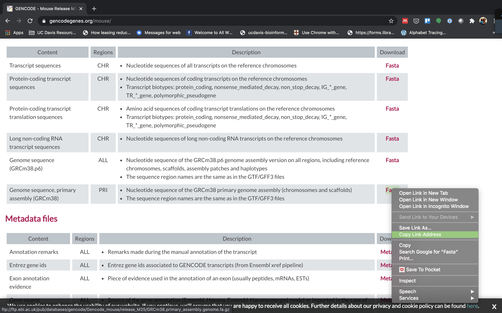
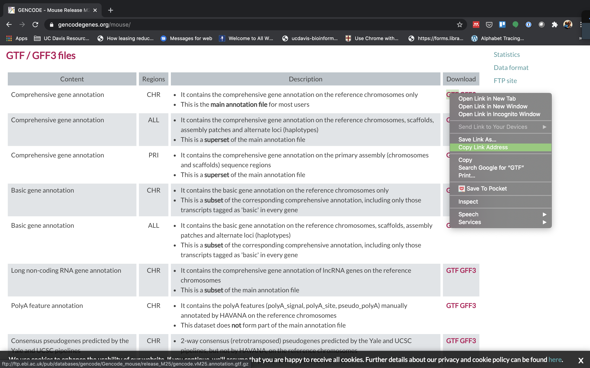

# Indexing a Reference sequence and annotation

1. First lets make sure we are where we are supposed to be and that the References directory is available.

    ```bash
    cd /share/biocore/workshop/mrnaseq_workshop/$USER/rnaseq_example
    mkdir -p slurmout
    ```

1. To align our data we will need the genome (fasta) and annotation (gtf) for mouse. There are many places to find them, but we are going to get them from the [GENCODE](https://www.gencodegenes.org/mouse/).

    We need to first get the url for the genome and annotation gtf. For RNAseq we want to use the primary genome chromosomes and basic gene annotation. At the time of this workshop the current version of GENCODE is *M25* . You will want to update the scripts to use the current version.

    We will need:

    *   Genome sequence, primary assembly (GRCm38)
    *   Basic gene annotation (CHR)

    

    

1. We are going to use an aligner called ['STAR'](https://www.ncbi.nlm.nih.gov/pmc/articles/PMC3530905/) to align the data. Lets take a look at the help docs for star:

    ```bash
    module load star
    STAR -h
    ```

    The basic options to generate genome indices using STAR are as follows:

    --runThreadN: number of threads  
    --runMode: genomeGenerate mode  
    --genomeDir: /path/to/store/genome_indices  
    --genomeFastaFiles: /path/to/FASTA_file  
    --sjdbGTFfile: /path/to/GTF_file  
    --sjdbOverhang: readlength -1  

    *NOTE:* In case of reads of varying length, the ideal value for --sjdbOverhang is max(ReadLength)-1. In most cases, the default value of 100 will work similarly to the ideal value.

1. First we need to index the genome for STAR. Lets pull down a slurm script to index the Ensembl version of the mouse genome.

    ```bash
    wget https://raw.githubusercontent.com/ucdavis-bioinformatics-training/2021-September-RNA-Seq-Analysis/master/software_scripts/scripts/star_index.slurm
    less star_index.slurm
    ```

    <div class="script">#!/bin/bash
    #SBATCH --job-name=star_index # Job name
    #SBATCH --nodes=1
    #SBATCH --ntasks=8
    #SBATCH --time=120
    #SBATCH --mem=40000 # Memory pool for all cores (see also --mem-per-cpu)
    #SBATCH --partition=production
    #SBATCH --reservation=workshop
    #SBATCH --account=workshop
    #SBATCH --output=slurmout/star-index_%A.out # File to which STDOUT will be written
    #SBATCH --error=slurmout/star-index_%A.err # File to which STDERR will be written
    #SBATCH --mail-type=ALL
    #SBATCH --mail-user=myemail@email.com

    start=`date +%s`
    echo $HOSTNAME

    outpath="References"
    mkdir -p ${outpath}

    cd ${outpath}

    wget ftp://ftp.ebi.ac.uk/pub/databases/gencode/Gencode_mouse/release_M25/GRCm38.primary_assembly.genome.fa.gz
    gunzip GRCm38.primary_assembly.genome.fa.gz
    FASTA="../GRCm38.primary_assembly.genome.fa"

    wget ftp://ftp.ebi.ac.uk/pub/databases/gencode/Gencode_mouse/release_M25/gencode.vM25.annotation.gtf.gz
    gunzip gencode.vM25.annotation.gtf.gz
    GTF="../gencode.vM25.annotation.gtf"

    mkdir star.overlap100.gencode.M25
    cd star.overlap100.gencode.M25

    module load star

    call="STAR
        --runThreadN 8 \
        --runMode genomeGenerate \
        --genomeDir . \
        --genomeFastaFiles ${FASTA} \
        --sjdbGTFfile ${GTF} \
        --sjdbOverhang 100"

    echo $call
    eval $call

    end=`date +%s`
    runtime=$((end-start))
    echo $runtime
    </div>

    When you are done, type "q" to exit.

    1. The script uses wget to download the fasta and GTF files from Gencode using the links you found earlier.
    1. Uncompresses them using gunzip.
    1. Creates the star index directory [star.overlap100.gencode.M25].
    1. Change directory into the new star index directory. We run the star indexing command from inside the directory, for some reason star fails if you try to run it outside this directory.
    1. Run star in mode genomeGenerate.


1. Run star indexing when ready.

    ```bash
    sbatch star_index.slurm
    ```

    This step will take a couple hours. You can look at the [STAR documentation](https://github.com/alexdobin/STAR/blob/master/doc/STARmanual.pdf) while you wait. All of the output files will be written to the star index directory **star.overlap100.gencode.M25**.

    **IF** For the sake of time, or for some reason it didn't finish, is corrupted, or you missed the session, you can **link** over a completed copy.

    ```bash
    ln -s /share/biocore/workshops/2020_mRNAseq_July/References/star.overlap100.gencode.M25 /share/biocore/workshop/mrnaseq_workshop/$USER/rnaseq_example/References/.
    ```
