# Alignment to Read Counts & Visualization in IGV

This document assumes [preproc htstream](./preproc_htstream.md) has been completed.

**IF** for some reason it didn't finish, is corrupted or you missed the session, you can copy over a completed copy

```bash
cp -r /share/biocore/workshops/2020_mRNAseq/HTS_testing /share/workshop/mrnaseq_workshop/$USER/rnaseq_example/.
cp -r /share/biocore/workshops/2020_mRNAseq/01-HTS_Preproc /share/workshop/mrnaseq_workshop/$USER/rnaseq_example/.
```

## Alignment vs Assembly

**Given sequence data**,

_Assembly seeks to put together the puzzle without knowing what the picture is._

The focus is on the pieces, how they fit together.

_Mapping tries to put together the puzzle pieces directly onto an image of the picture._

The focus is on the puzzle, regions of the puzzle that contain certain characteristics (ex. what background) that will help you place the piece onto the puzzle.  

In mapping the question is more, given a small chunk of sequence, where in the genome did this sequence most likely come from.

The goal then is to find the match(es) with either the “best” edit distance (smallest difference), or all matches with edit distance less than max edit distance. Main issues are:

* Large search space
* Regions of similarity (aka repeats)
* Gaps (INDELS)
* Complexity (RNA, splicing, transcripts)

#### Considerations
* Placing reads in regions that do not exist in the reference genome (reads extend off the end of linearized fragments) [ mitochondrial, plasmids, structural variants, etc.].
* Sequencing errors and genetic variation: alignment between read and true source in genome may have more differences than alignment with some other copy of repeat.
* What if the closest fully sequenced genome is too divergent?
* Placing reads in repetitive regions: Some algorithms only return 1 mapping; If multiple: map quality = 0
* Algorithms that use paired-end information => might prefer correct distance over correct alignment.

In RNAseq data, you must also consider effect of splice junctions, reads may span an intron.


### Aligners
Many [alignment algorithms](https://en.wikipedia.org/wiki/List_of_sequence_alignment_software
) to choose from. Examples include:
* Spliced Aligners
  * STAR
  * HiSAT2 (formerly Tophat [Bowtie2])
  * GMAP/GSNAP
  * SOAPsplice
  * MapSplice
* Aligners that can ’clip’
  * bwa-mem
  * Bowtie2 in local mode

#### Pseudo-aligners (salmon and kalisto)
* Quasi-mapping
* Probabilistic
* Map to transcripts, not genome
* Does transcript quantifications (or gene)
* Blazing FAST and can run on most laptops
* Experience suggests differences between “traditional” mappers are in the low abundance genes.

### Mapping against the genome vs transcriptome

May seem intuitive to map RNAseq data to transcriptome, but it is not that simple.
  * Transcriptomes are rarely complete.
  * Which transcript of a gene should you map to? canonical transcript (which is that)?
  * Shouldn’t map to all splice variants as these would show up as ‘multi-mappers’.

More so, a aligner will try to map every read, somewhere, provided the alignment meets its minimum requirements.
  * Need to provide a mapper with all possible places the read could have arisen from, which is best represented by the genome. Otherwise, you get mis-mapping because its close enough.

### Genome and Genome Annotation

Genome sequence fasta files and annotation (gff, gtf) files go together! These should be identified at the beginning of analysis.

* Genome fasta files should include all primary chromosomes, unplaced sequences and un-localized sequences, as well as any organelles. Should bet contain any contigs that represent patches, or alternative haplotypes.
* If you expect contamination, or the presence of additional sequence/genome, add the sequence(s) to the genome fasta file.
* Annotation file should be GTF (preferred), and should be the most comprehensive you can find.
  * Chromosome names in the GTF must match those in the fasta file (they don’t always do).
  * Star recommends the Genecode annotations for mouse/human

## Counting reads as a proxy for gene expression

The more you can count (and HTS sequencing systems can count a lot) the better the measure of copy number for even rare transcripts in a population.
* Most RNA-seq techniques deal with count data. Reads are mapped to a reference genome, transcripts are detected, and the number of reads that map to a transcript (or gene) are counted.
* Read counts for a transcript are roughly proportional to the gene’s length and transcript abundance (in whole transcript methods).

Technical artifacts should be considered during counting
* Mapping quality
* Map-ability (uniqueness), the read is not ambiguous

Options are (STAR, HTSEQ, featureCounts)

### The HTSEQ way

* Given a sam/bam file with aligned sequence reads and a list of genomic feature (genes locations), we wish to count the number of reads (fragments) than overlap each feature.
  * Features are defined by intervals, they have a start and stop position on a chromosome.
  * For this workshop and analysis, features are genes which are the union of all its exons. You could consider each exon as a feature, for alternative splicing.
* Htseq-count has three overlapping modes
  * union
  * intersection-strict
  * intersection-nonempty

  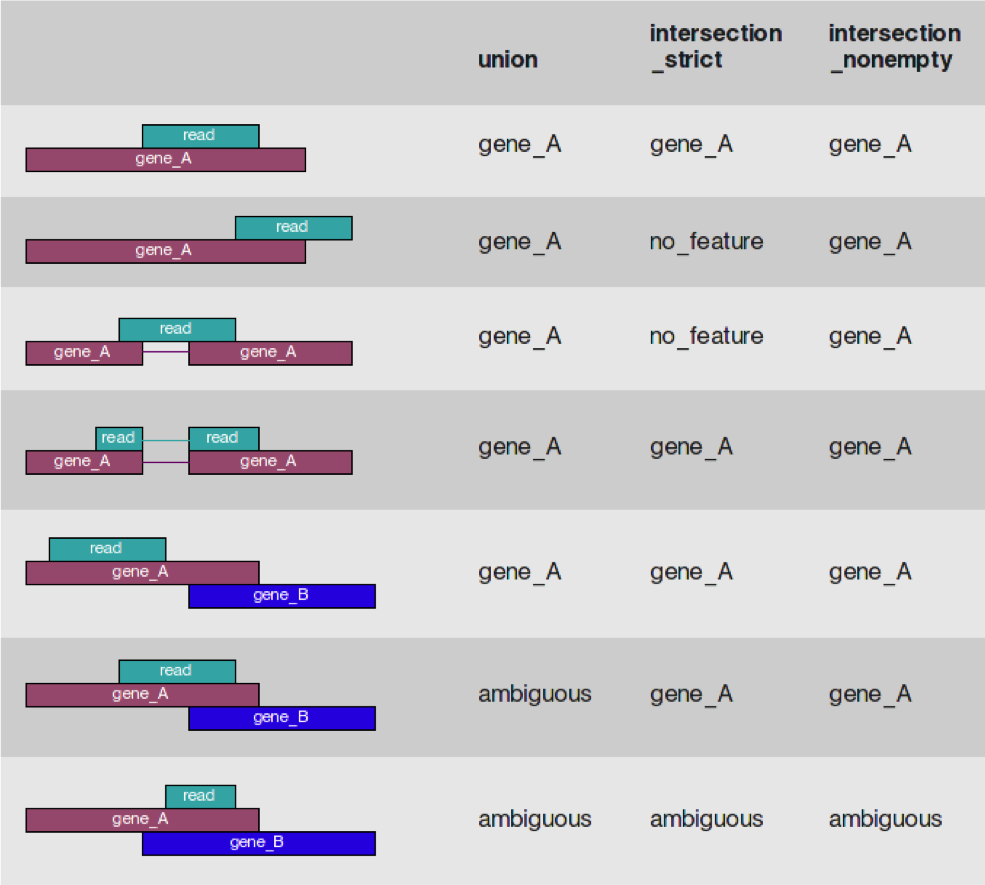
*from the htseq paper*

#### Star Implementation
Counts coincide with Htseq-counts under default parameters (union and tests all orientations). Need to specify GTF file at genome generation step or during mapping.
* Output, 4 columns
  * GeneID
  * Counts for unstranded
  * Counts for first read strand
  * Counts for second read strand

Choose the appropriate column given the library preparation characteristics and generate a matrix expression table, columns are samples, rows are genes.

### Alignment concepts

* Multimappers:
  * Reads that align equally well to more than one reference location.
  * Generally, multimappers are discounted in variant detection, and are often discounted in counting applications (like RNA-Seq ... would “cancel” out anyway).
  * Note: multimapper “rescue” in some algorithms (RSEM, Express?).
* Duplicates:
  * Reads or read pairs arising from the same original library fragment, either during library preparation (PCR duplicates).
  * Generally, duplicates can only be detected reliably with paired-end sequencing. If PE, they’re discounted in variant detection, and discounted in counting applications (like RNA-Seq).
* Clipping vs Splicing  
  
* Inner length, insert size, fragment length  
  
*From https://www.biostars.org/p/106291/*

## Indexing a Reference sequence and annotation

1. First lets make sure we are where we are supposed to be and that the References directory is available.

    ```bash
    cd /share/workshop/mrnaseq_workshop/$USER/rnaseq_example
    ```

1. To align our data we will need the genome (fasta) and annotation (gtf) for human. There are many places to find them, but we are going to get them from the [GENCODE](https://www.gencodegenes.org/human/).

    We need to first get the url for the genome and annotation gtf. For RNAseq we want to use the PRI (primary) genome chromosome and Basic gene annotation. At the time of this workshop the current version of GENCODE is *34*. You will want to update the scripts to use the current version.

    

    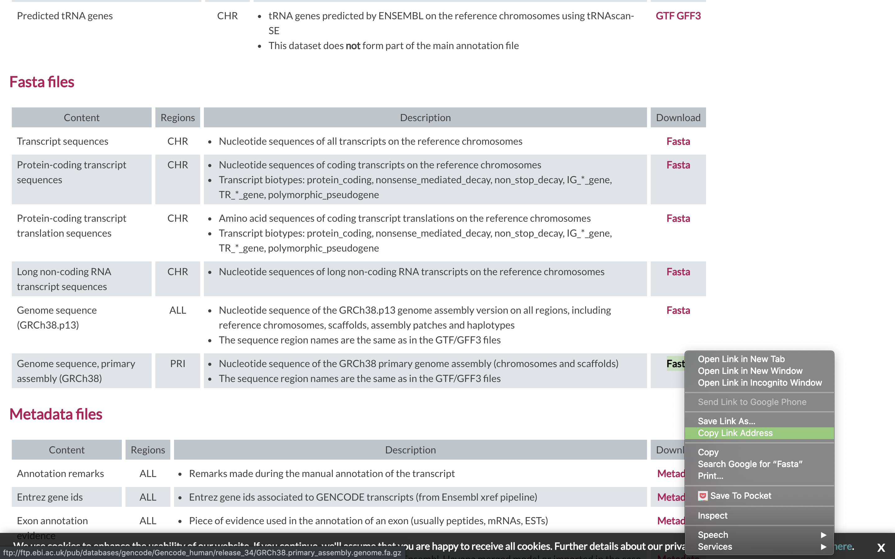

1. Lets take a look at the help docs for salmon and its subcommands as well:

    ```bash
    module load star
    STAR -h
    ```

1. We are going to use an aligner called ['STAR'](https://www.ncbi.nlm.nih.gov/pmc/articles/PMC3530905/) to align the data, but first we need to index the genome for STAR. Lets pull down a slurm script to index the human GENCODE version of the genome.

    ```bash
    wget https://raw.githubusercontent.com/ucdavis-bioinformatics-training/2020-mRNA_Seq_Workshop/master/software_scripts/scripts/star_index.slurm
    less star_index.slurm
    ```

    <div class="script">#!/bin/bash

    #SBATCH --job-name=star_index # Job name
    #SBATCH --nodes=1
    #SBATCH --ntasks=8
    #SBATCH --time=120
    #SBATCH --mem=40000 # Memory pool for all cores (see also --mem-per-cpu)
    #SBATCH --partition=production
    #SBATCH --reservation=mrnaseq_workshop
    #SBATCH --account=mrnaseq_workshop
    #SBATCH --output=slurmout/star-index_%A.out # File to which STDOUT will be written
    #SBATCH --error=slurmout/star-index_%A.err # File to which STDERR will be written
    #SBATCH --mail-type=ALL
    #SBATCH --mail-user=myemail@email.com

    start=`date +%s`
    echo $HOSTNAME

    outpath="References"
    mkdir -p ${outpath}

    cd ${outpath}
    wget ftp://ftp.ebi.ac.uk/pub/databases/gencode/Gencode_human/release_34/GRCh38.primary_assembly.genome.fa.gz
    gunzip GRCh38.primary_assembly.genome.fa.gz
    FASTA="../GRCh38.primary_assembly.genome.fa"

    wget ftp://ftp.ebi.ac.uk/pub/databases/gencode/Gencode_human/release_34/gencode.v34.primary_assembly.annotation.gtf.gz
    gunzip gencode.v34.primary_assembly.annotation.gtf.gz
    GTF="../gencode.v34.primary_assembly.annotation.gtf"

    mkdir star.overlap100.gencode.v34
    cd star.overlap100.gencode.v34

    module load star

    call="STAR
         --runThreadN 8 \
         --runMode genomeGenerate \
         --genomeDir . \
         --sjdbOverhang 100 \
         --sjdbGTFfile ${GTF} \
         --genomeFastaFiles ${FASTA}"

    echo $call
    eval $call

    end=`date +%s`
    runtime=$((end-start))
    echo $runtime
    </div>

    When you are done, type "q" to exit.

    1. The script uses wget to download the fasta and GTF files from GENCODE using the links you found earlier.
    1. Uncompresses them using gunzip.
    1. Creates the star index directory [star.overlap100.gencode.v34].
    1. Change directory into the new star index directory. We run the star indexing command from inside the directory, for some reason star fails if you try to run it outside this directory.
    1. Run star in mode genomeGenerate.

1. Run star indexing when ready.

    ```bash
    sbatch star_index.slurm
    ```

    This step will take a couple hours. You can look at the [STAR documentation](https://github.com/alexdobin/STAR/blob/master/doc/STARmanual.pdf) while you wait. All of the output files will be written to the star index directory _star.overlap100.gencode.v34_.

    **IF** For the sake of time, or for some reason it didn't finish, is corrupted, or you missed the session, you can **link** over a completed copy.

    ```bash
    ln -s /share/biocore/workshops/2020_mRNAseq/References/star.overlap100.gencode.v34 /share/workshop/mrnaseq_workshop/$USER/rnaseq_example/References/.
    ```

## Alignments

1. We are now ready to try an alignment:

    ```bash
    cd /share/workshop/mrnaseq_workshop/$USER/rnaseq_example/HTS_testing
    ```

    and let's run STAR (via srun) on the pair of streamed test files we created earlier:

    ```bash
    srun --time=15:00:00 -n 8 --mem=32g --reservation=mrnaseq_workshop --account=mrnaseq_workshop --pty /bin/bash
    ```

    Once you've been given an interactive session we can run STAR. You can ignore the two warnings/errors and you know your on a cluster node because your server will change. Here you see I'm on tadpole, then after the srun command is successful, I am now on drove-13.

    <div class="output">msettles@tadpole:/share/workshop/msettles/rnaseq_example/> HTS_testing$ srun --time=15:00:00 -n 8 --mem=32g --reservation=mrnaseq_workshop --account=mrnaseq_workshop --pty /bin/bash
    srun: job 29372920 queued and waiting for resources
    srun: job 29372920 has been allocated resources
    groups: cannot find name for group ID 2020
    bash: /home/msettles/.bashrc: Permission denied
    msettles@drove-13:/share/workshop/msettles/rnaseq_example/> HTS_testing$
    </div>

1. Then run the star commands

    ```bash
    module load star
    STAR \
    --runThreadN 8 \
       --genomeDir ../References/star.overlap100.gencode.v34 \
       --outSAMtype BAM SortedByCoordinate \
       --quantMode GeneCounts \
       --outFileNamePrefix SampleAC1.streamed_ \
       --readFilesCommand zcat \
       --readFilesIn SampleAC1.streamed_R1.fastq.gz SampleAC1.streamed_R2.fastq.gz
    ```

    In the command, we are telling star to count reads on a gene level ('--quantMode GeneCounts'), the prefix for all the output files will be SampleAC1.streamed_, the command to unzip the files (zcat), and finally, the input file pair.

    Once finished please 'exit' the srun session. You'll know you were successful when your back on tadpole

    <div class="output">msettles@drove-13:/share/workshop/msettles/rnaseq_example/HTS_testing$ exit
    exit
    msettles@tadpole:/share/workshop/msettles/rnaseq_example/HTS_testing$
    </div>

###  Now let's take a look at an alignment in IGV.

1.  We first need to index the bam file, will use 'samtools' for this step, which is a program to manipulate SAM/BAM files. Take a look at the options for samtools and 'samtools index'.

    ```bash
    module load samtools
    samtools
    samtools index
    ```

    We need to index the BAM file:

    ```bash
    cd /share/workshop/mrnaseq_workshop/$USER/rnaseq_example/HTS_testing
    samtools index SampleAC1.streamed_Aligned.sortedByCoord.out.bam
    ```

    **IF** for some reason it didn't finish, is corrupted or you missed the session, you can copy over a completed copy

    ```bash
    cp -r /share/biocore/workshops/2020_mRNAseq/HTS_testing/SampleAC1.streamed_Aligned.sortedByCoord.out.bam* /share/workshop/mrnaseq_workshop/$USER/rnaseq_example/HTS_testing
    ```

2. Transfer SampleAC1.streamed_Aligned.sortedByCoord.out.bam and SampleAC1.streamed_Aligned.sortedByCoord.out.bam (the index file) to your computer using scp or winSCP, or copy/paste from cat [sometimes doesn't work].

    In Mac/Linux, Windows users use WinSCP. In a new shell session on my laptop. **NOT logged into tadpole**. Replace [your_username] with your username
    ```bash
    mkdir ~/rnaseq_workshop
    cd ~/rnaseq_workshop
    scp [your_username]@tadpole.genomecenter.ucdavis.edu:/share/workshop/mrnaseq_workshop/[your_username]/rnaseq_example/HTS_testing/SampleAC1.streamed_Aligned.sortedByCoord.out.bam* .
    ```

    Its ok of the mkdir command fails ("File exists") because we aleady created the directory earlier.


1. Now we are ready to use IGV.

    Go to the [IGV page at the Broad Institute](http://software.broadinstitute.org/software/igv/).

    

    And then navigate to the download page, [IGV download](http://software.broadinstitute.org/software/igv/download)

    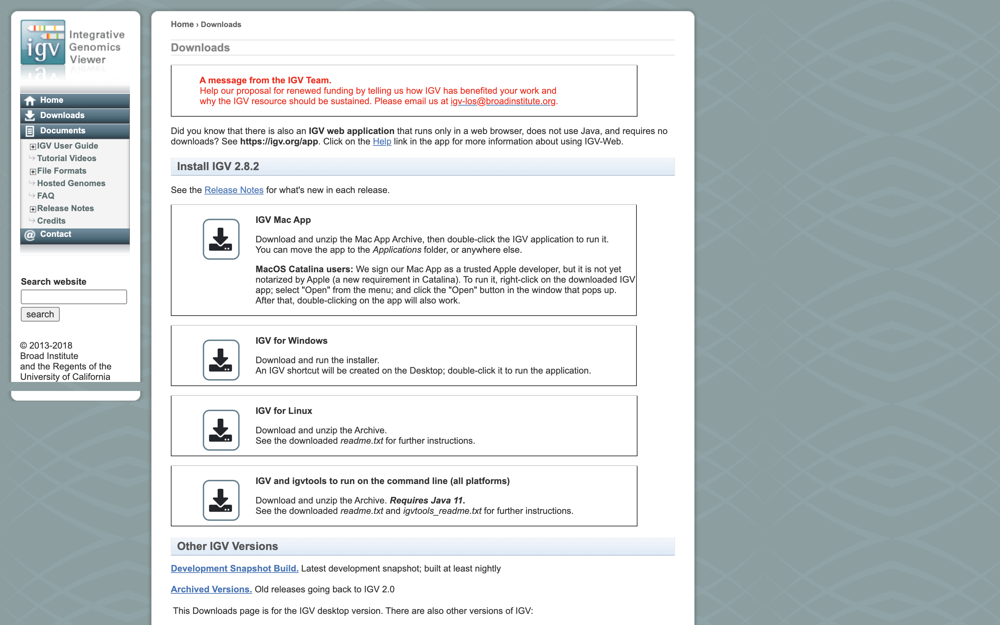

    Here you can download IGV for your respective platform (Window, Mac OSX, Linux), but we are going to use the web application they supply, [IGV web app](https://igv.org/app).

    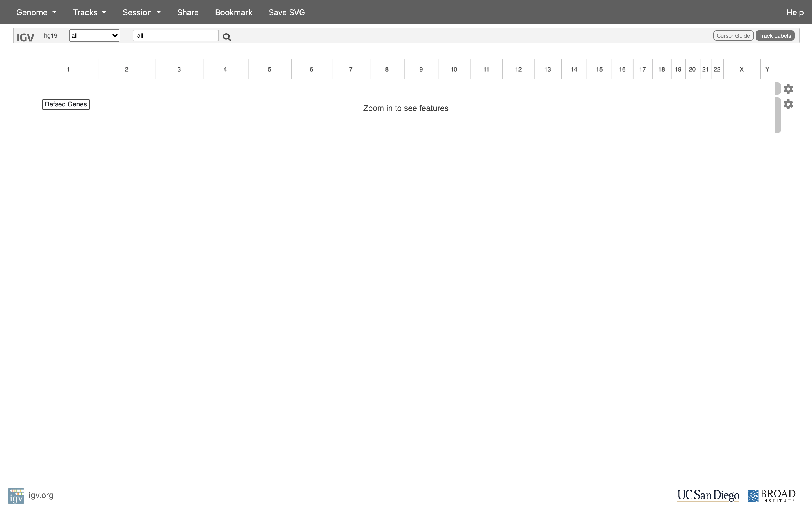

1. The first thing we want to do is load the Human genome. Click on "Genomes" in the menu and choose "Human (GRCh38/hg38)".

    

1. Now let's load the alignment bam and index files. Click on "Tracks" and choose "Local File ...".

    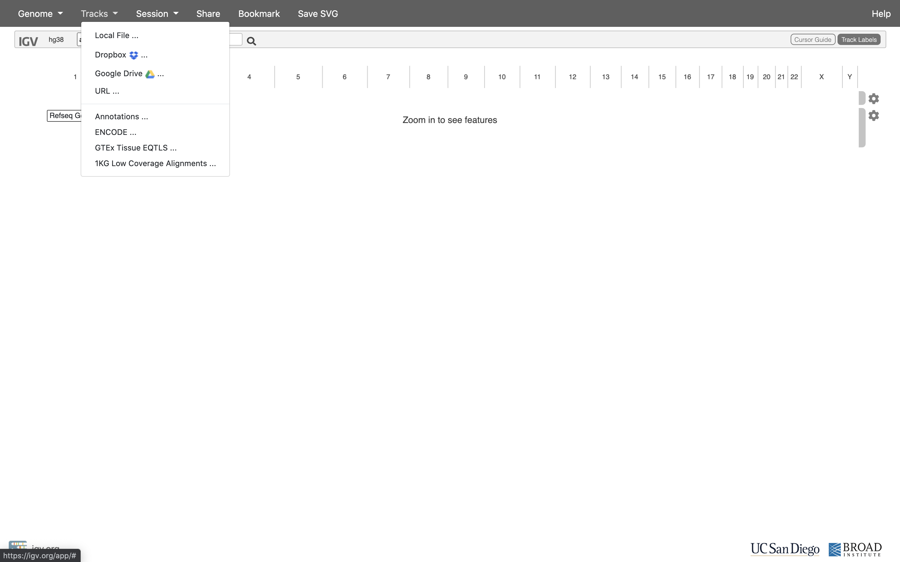

    Navigate to where you transferred the bam and index file and select them **both**.

    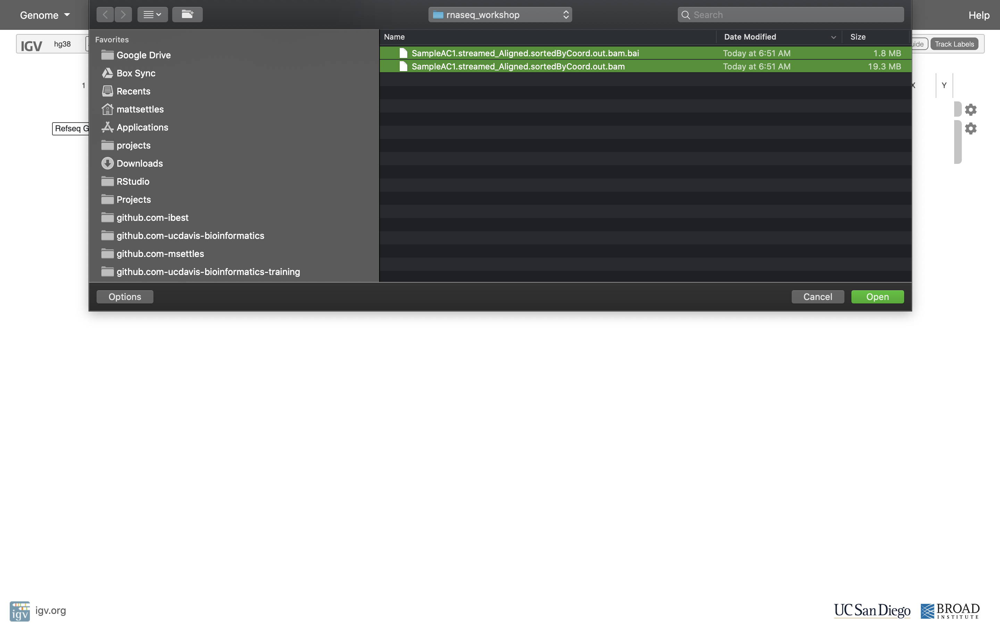

    Now your alignment is loaded. Any loaded bam file aligned to a genome is called a "track".

    

1. Lets take a look at the alignment associated with the gene __HBB__, and if for some reason it doesn't find HBB (web IGV can be fickle) go to position __chr11:5,224,466-5,228,071__. If you don't see any reads, this likely means your in the wrong genome, double check that it says **hg38** in the top left.

    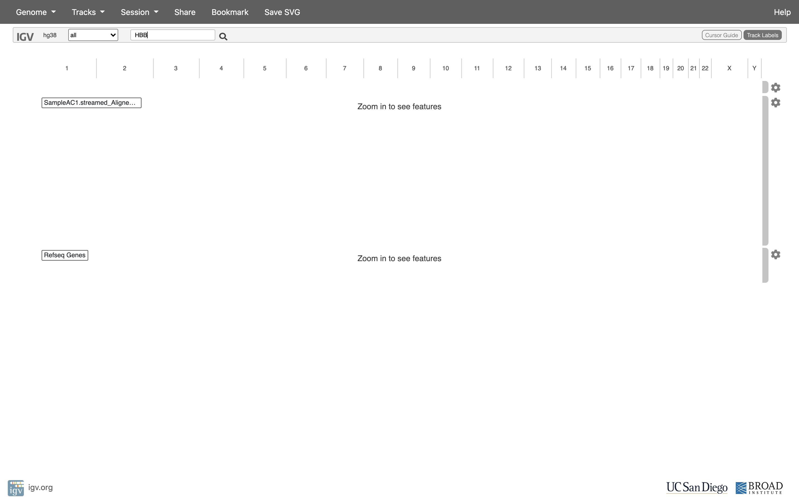

    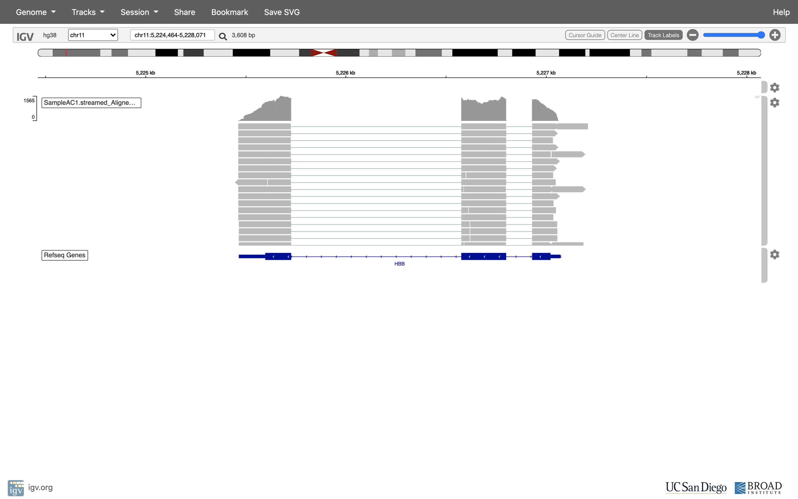

    You can zoom in by clicking on the plus sign (top right) or zoom out by clicking the negative sign. You also may have to move around by clicking and dragging in the BAM track window.

    You can also zoom in by clicking and dragging across the number line at the top. That section will highlight, and when you release the button, it will zoom into that section.

    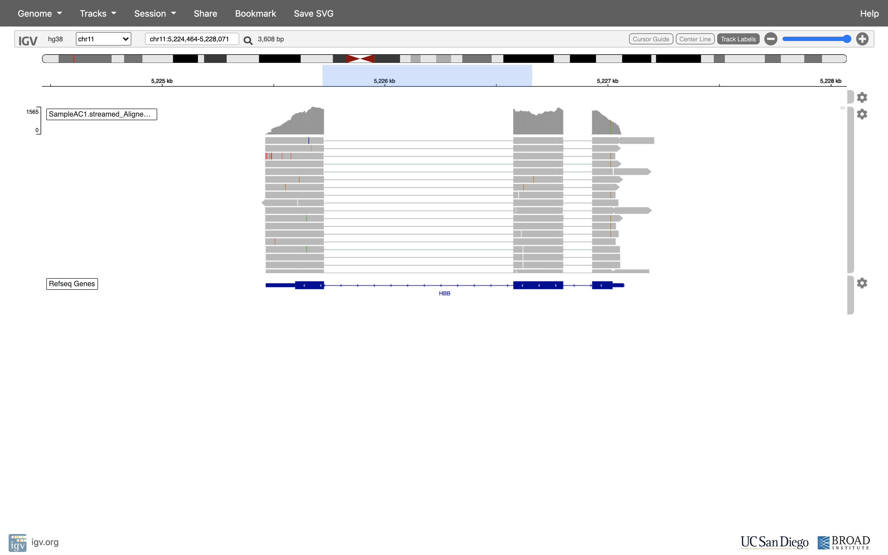

    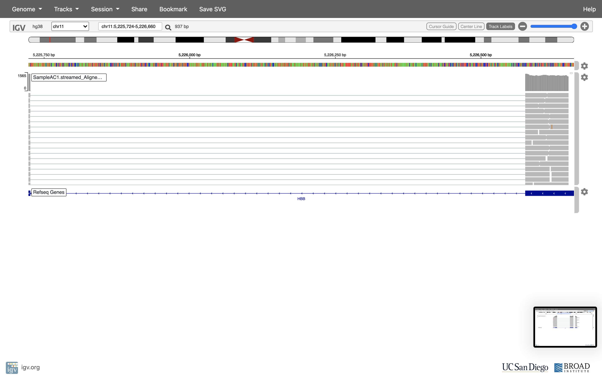

    Reset the window by searching for HBB again, **and** then zoom in 1 step.

    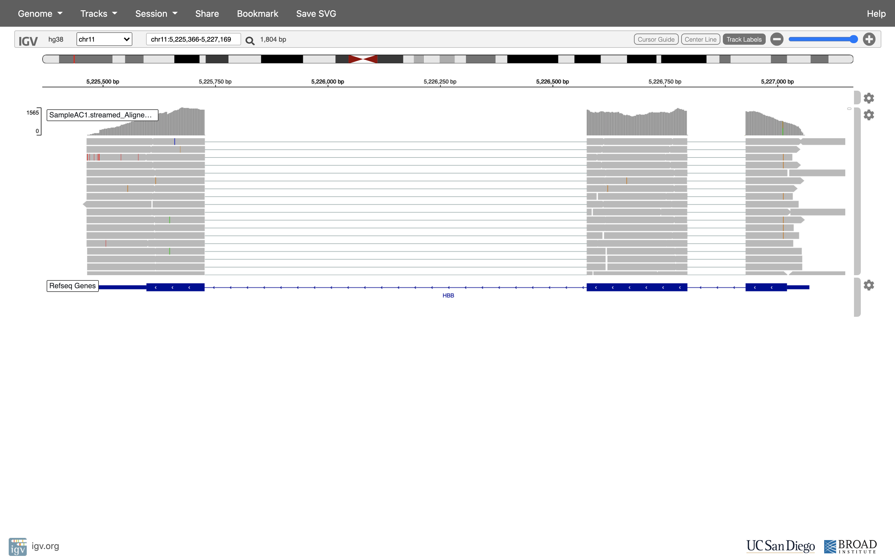

1. See that the reads should be aligning within the exons in the gene. This makes sense, since RNA-Seq reads are from exons. Play with the settings on the right hand side a bit.

    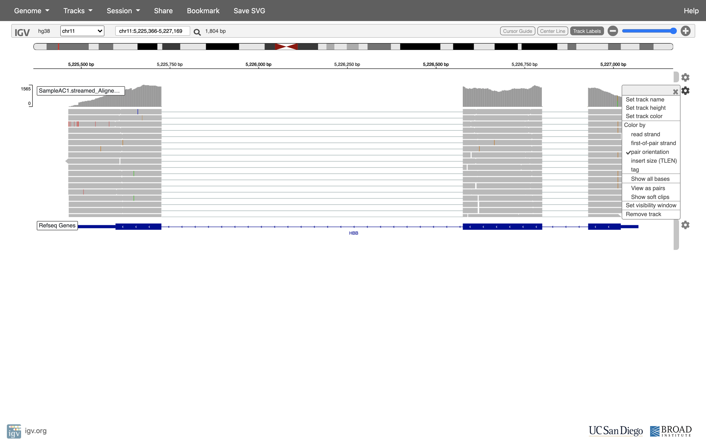

    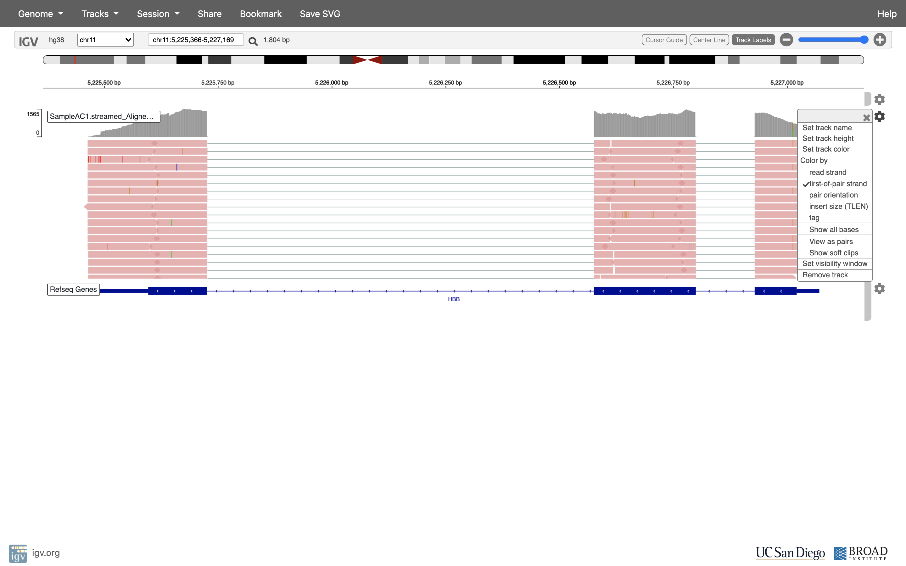

    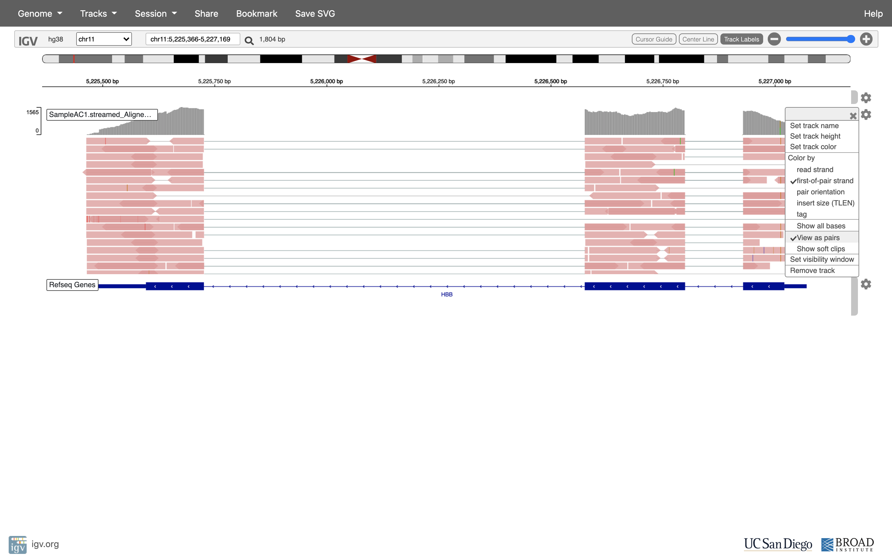

    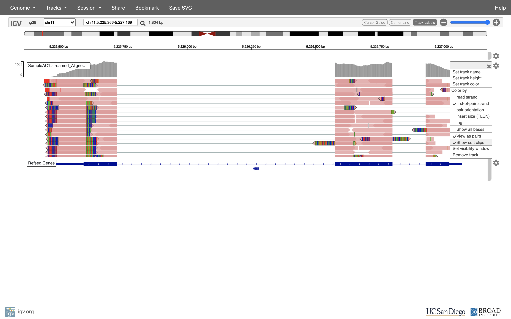

    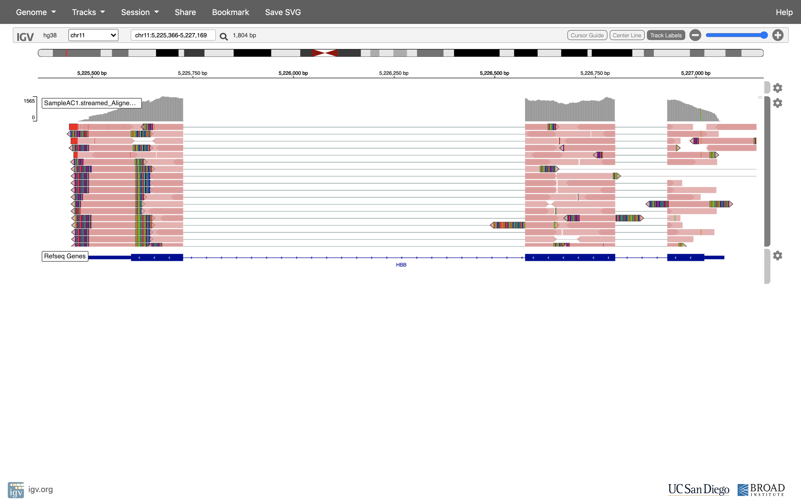


## Running STAR on the experiment

1. We can now run STAR across all samples on the real data using a SLURM script, [star.slurm](../scripts/star.slurm), that we should take a look at now.

    ```bash
    cd /share/workshop/mrnaseq_workshop/$USER/rnaseq_example  # We'll run this from the main directory
    wget https://raw.githubusercontent.com/ucdavis-bioinformatics-training/2020-mRNA_Seq_Workshop/master/software_scripts/scripts/star.slurm
    less star.slurm
    ```

    <div class="script">#!/bin/bash

    #SBATCH --job-name=star # Job name
    #SBATCH --nodes=1
    #SBATCH --ntasks=8
    #SBATCH --time=60
    #SBATCH --mem=32000 # Memory pool for all cores (see also --mem-per-cpu)
    #SBATCH --partition=production
    #SBATCH --reservation=mrnaseq_workshop
    #SBATCH --account=mrnaseq_workshop
    #SBATCH --array=1-16
    #SBATCH --output=slurmout/star_%A_%a.out # File to which STDOUT will be written
    #SBATCH --error=slurmout/star_%A_%a.err # File to which STDERR will be written

    start=`date +%s`
    echo $HOSTNAME
    echo "My SLURM_ARRAY_TASK_ID: " $SLURM_ARRAY_TASK_ID

    sample=`sed "${SLURM_ARRAY_TASK_ID}q;d" samples.txt`
    REF="References/star.overlap100.gencode.v34"

    outpath='02-STAR_alignment'
    [[ -d ${outpath} ]] || mkdir ${outpath}
    [[ -d ${outpath}/${sample} ]] || mkdir ${outpath}/${sample}

    echo "SAMPLE: ${sample}"

    module load star

    call="STAR
         --runThreadN 8 \
         --genomeDir $REF \
         --outSAMtype BAM SortedByCoordinate \
         --readFilesCommand zcat \
         --readFilesIn 01-HTS_Preproc/${sample}/${sample}_R1.fastq.gz 01-HTS_Preproc/${sample}/${sample}_R2.fastq.gz \
         --quantMode GeneCounts \
         --outFileNamePrefix ${outpath}/${sample}/${sample}_ \
         > ${outpath}/${sample}/${sample}-STAR.stdout 2> ${outpath}/${sample}/${sample}-STAR.stderr"

    echo $call
    eval $call

    end=`date +%s`
    runtime=$((end-start))
    echo $runtime
    </div>

    When you are done, type "q" to exit.


2. After looking at the script, lets run it.

    ```bash
    sbatch star.slurm  # moment of truth!
    ```

    We can watch the progress of our task array using the 'squeue' command. Takes about 30 minutes to process each sample.

    ```sbatch
    squeue -u msettles  # use your username
    ```

## Quality Assurance - Mapping statistics as QA/QC.

1. Once your jobs have finished successfully, check the error and out logs like we did in the previous exercise.

    Use a script of ours, [star_stats.sh](../software_scripts/scripts/star_stats.sh) to collect the alignment stats. Don't worry about the script's contents at the moment; you'll use very similar commands to create a counts table in the next section. For now:

    ```bash
    cd /share/workshop/mrnaseq_workshop/$USER/rnaseq_example  # We'll run this from the main directory
    wget https://raw.githubusercontent.com/ucdavis-bioinformatics-training/2020-mRNA_Seq_Workshop/master/software_scripts/scripts/star_stats.sh
    bash star_stats.sh
    ```

2. Transfer summary_star_alignments.txt to your computer using scp or winSCP, or copy/paste from cat [sometimes doesn't work],  

    In Mac/Linux, Windows users use WinSCP. In a new shell session on my laptop. **NOT logged into tadpole**. Replace my [your_username] with your username

    ```bash
    mkdir ~/rnaseq_workshop
    cd ~/rnaseq_workshop
    scp [your_username]@tadpole.genomecenter.ucdavis.edu:/share/workshop/mrnaseq_workshop/[your_username]/rnaseq_example/summary_star_alignments.txt .
    ```

    Its ok of the mkdir command fails ("File exists") because we aleady created the directory earlier.

    Open in excel (or excel like application), and lets review.

    The table that this script creates ("summary_star_alignments.txt") can be pulled to your laptop via 'scp', or WinSCP, etc., and imported into a spreadsheet. Are all samples behaving similarly? Discuss ...
