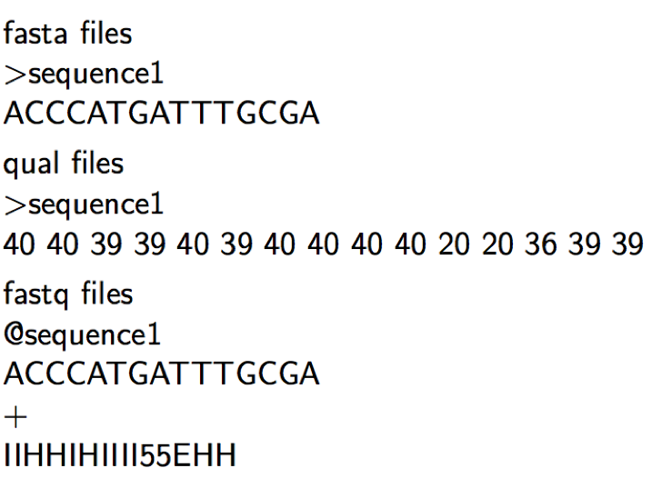
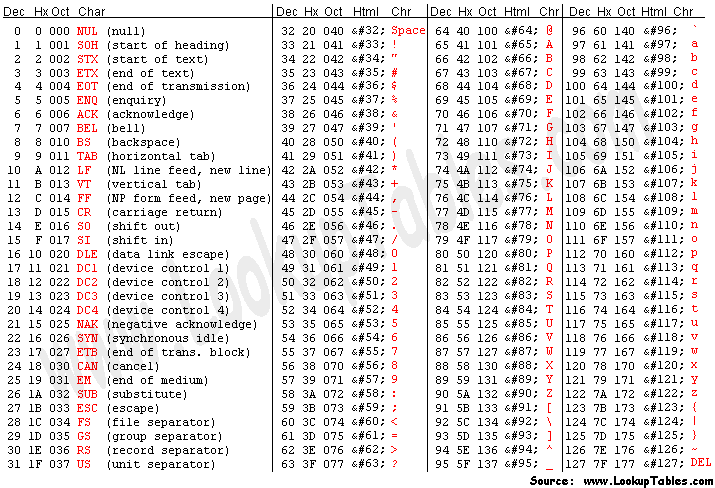
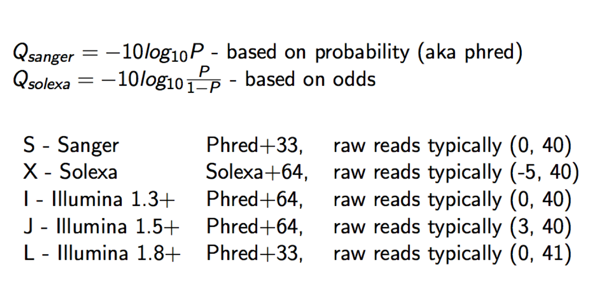
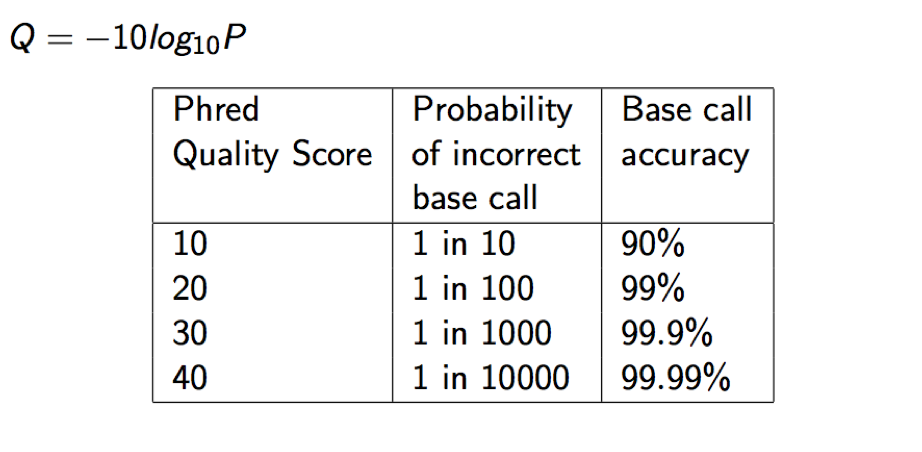
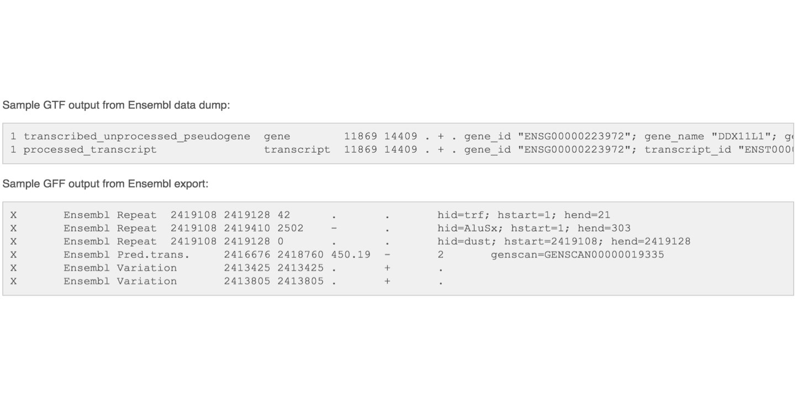
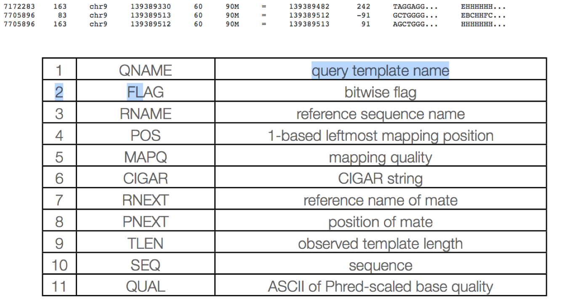
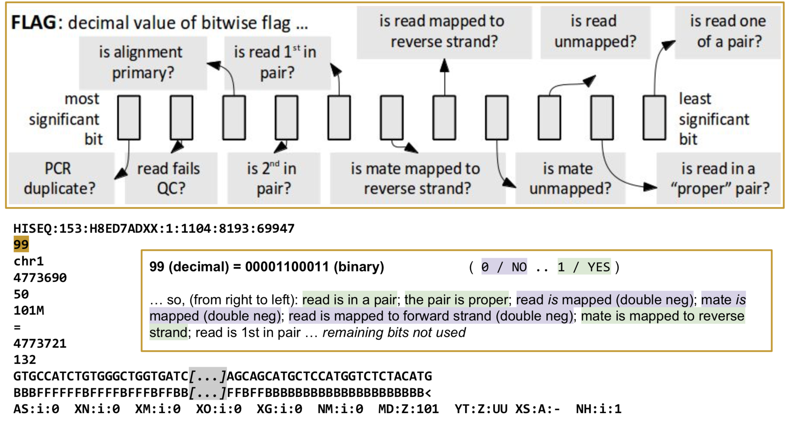
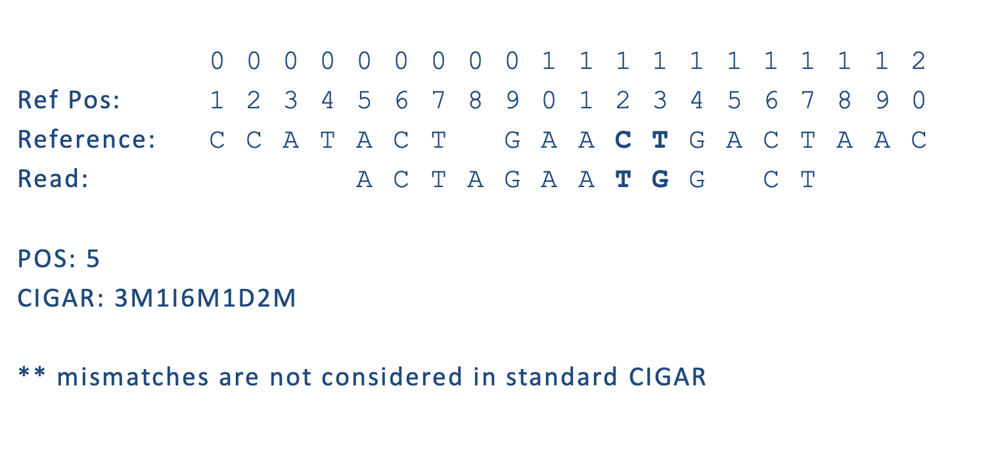
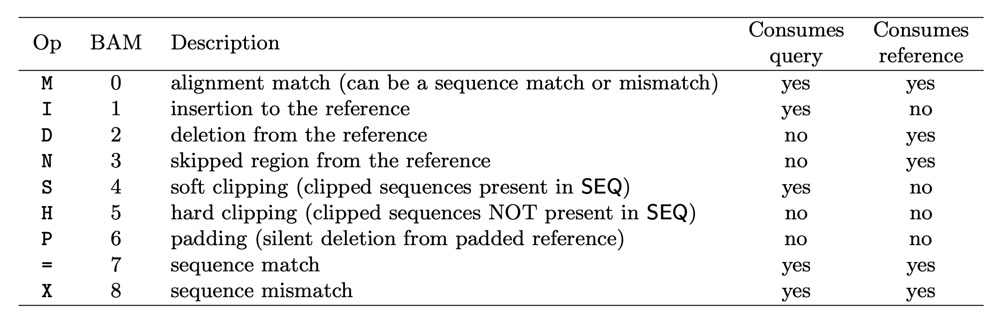

# Files and File Types

The primary file types you'll see related to DNA sequence analysis are:

* [fasta](#fasta)
* [fastq](#fastq)
* [gtf/gff](#Annotation-based-file-types)
* [sam/bam/cram](#Alignment-based-file-types)

## Sequence based file types
Sequence based files first started out as fasta with paired qual files (Sanger and 454), with Illumina and quality scores being used more, the fastq file became the default output from DNA sequencers. These days additional file types are being used, including fast5 by Oxford Nanopore and 'unmapped' bam files by Pacific Biosciences.

### fasta
The fasta format uses the '>' to indicate a new sequence followed by the name of the sequence on the same line. The following line(s) are the DNA sequence and may be split on multiple lines (wrapped), until the next '>' is reached. Genome and transcriptome files are most often in fasta format.

Qual files are so rarely used these days and so are not discussed.

### fastq
fastq files combine the sequence and quality scores into 1 file. Each sequence here has 4 lines (should be enforced strictly), header, sequence, historical '+', and quality.

CASAVA 1.8 Read IDs

@EAS139:136:FC706VJ:2:2104:15343:197393 1:Y:18:ATCACG
* EAS139 the unique instrument name
* 136 the run id
* FC706VJ the flowcell id
* 2 flowcell lane
* 2104 tile number within the flowcell lane
* 15343 ’x’-coordinate of the cluster within the tile
* 197393 ’y’-coordinate of the cluster within the tile
* 1 the member of a pair, 1 or 2 (paired-end or mate-pair reads only)
* Y Y if the read fails filter (read is bad), N otherwise
* 18 0 when none of the control bits are on, otherwise it is an even number
* ATCACG index sequence

### Quality Scores
Quality scores are paired 1 to 1 with sequence characters.

Each quality character has a numerical value associated with it (ASCII value). In Illumina 1.8+ you subtract 33 from the ascii value associated with the quality character to get the quality score.

## Annotation based file types

### Gene Transfer Format (GTF) / Gene Feature Format (GFF)

Describes feature (ex. gene) locations within a sequence file (ex. genome).

The GFF (General Feature Format) format consists of one line per feature, each containing 9 columns of data (fields). The GTF (General Transfer Format) is identical to GFF version 2. The GTF file format tends to have stricter requirements and expectations on how feature descriptions are formated.

Fields must be tab-separated and all fields must contain a value; “empty” fields should be denoted with a ‘.’.

Columns:
* Seqname: Name of the sequence chromosome
* Source: the program, or database, that generated the feature
* Feature: feature type name, (e.g. gene, exon, cds, etc.)
* Start: start position of the feature, sequences begin at 1
* End: stop position of the feature, sequences begin at 1
* Score: a floating point value (e.g. 0.01)
* Strand: Defined as ‘+’ (forward),or ‘-’ (reverse)
* Frame: One of ‘0’, ‘1’, ‘2’, ‘0’ represents the first base of a codon.
* Attribute: A semicolon-separated list of tag-value pairs, providing additional information about each feature.

#### Sources
* Ensembl genomes ( http://ensemblgenomes.org/ ) and annotation at Biomart ( http://www.ensembl.org/biomart/martview/ )
* Human/mouse: GENCODE (uses Ensembl IDs) ( https://www.gencodegenes.org/ ), but may need some manipulation to work with certain software.
* NCBI genomes ( http://www.ncbi.nlm.nih.gov/genome/ )
* Many specialized databases (Phytozome, Patric, VectorBase, FlyBase, WormBase)

## Alignment based file types

### SAM/BAM/CRAM

The project managing the specifications and common software is http://www.htslib.org/.

SAM (Sequence Alignment/Map) format is the unified format for storing read alignments to a reference sequence (consistent since Sept. 2011).
http://samtools.github.io/hts-specs/SAMv1.pdf
http://samtools.github.io/hts-specs/SAMtags.pdf

BAM  are compressed SAMs (binary, not human-readable). They can be indexed to allow rapid extraction of information, so alignment viewers do not need to uncompress the whole BAM file in order to look at information for a particular coordinate range, somewhere in the file.

Indexing your BAM file, mybam.bam, will create an index file, mybam.bam.bai, which is needed (in addition to the BAM file) by viewers and some downstream tools.

CRAM is an even more compressed SAM/BAM file and has the following major objectives:
1. Significantly better lossless compression than BAM
2. Full compatibility with BAM
3. Effortless transition to CRAM from using BAM files
4. Support for controlled loss of BAM data

CRAM files are also indexed and produce .cram.crai index files.

**The SAM format contain two regions:**

The header section -
Each header line begins with character ’@’ followed by a two-letter record type code.

The alignment section -
Each alignment line has 11 mandatory fields. These fields always appear in the same order and must be present, but their values can be '0' or '*', if the corresponding information if unavailable, or not applicable.

#### Header section

Each header line begins with the character ‘@’ followed by one of the two-letter header record type codes. In the header, each line is TAB-delimited and, apart from @CO lines, each data field
follows a format ‘TAG:VALUE’ where TAG is a two-character string that defines the format and content of
VALUE.   

The following tags are required:

* @HD The header line. The first line if present.
  * VN* Format version. Accepted format: /^[0-9]+\.[0-9]+$/.
* @SQ Reference sequence dictionary. The order of @SQ lines defines the alignment sorting order.
  * SN* Reference sequence name. The SN tags and all individual AN names in all @SQ lines must be distinct. The value of this field is used in the alignment records in RNAME and RNEXT fields. Regular expression: [:rname:∧ *=][:rname:]*
  * LN* Reference sequence length. Range: [1, 2
  31 − 1]
* @RG Read group. Unordered multiple @RG lines are allowed.
  * ID* Read group identifier. Each @RG line must have a unique ID. The value of ID is used in the RG tags of alignment records. Must be unique among all read groups in header section. Read group IDs may be modified when merging SAM files in order to handle collisions.

Many more tags are detailed in the specifications.

#### Alignment section

The alignment section consists of 11 tab delimited fields.

**QNAME: Query name**  
Read IDs are truncated at first whitespace (spaces / tabs), which can make them non-unique. Illumina reads with older IDs have trailing “/1” and “/2” stripped (this information is recorded in the next field). Illumina reads with newer IDs have second block stripped (read number is recorded in the next field).

@FCC6889ACXX:5:1101:8446:45501#CGATGTATC/1 ⇒ @FCC6889ACXX:5:1101:8446:45501  
@HISEQ:153:H8ED7ADXX:1:1101:1368:2069 1:N:0:ATCACG ⇒ @HISEQ:153:H8ED7ADXX:1:1101:1368:2069

**FLAG: Alignment flags**

Tool to help explain flags

https://broadinstitute.github.io/picard/explain-flags.html

**RNAME: reference sequence name**  
Reference sequence ID (from fasta header) matches a @SQ field in the header section.

**POS: 1-based leftmost position of (post-clipping) aligned read**  

**MAPQ: mapping quality (phred scaled)**  
MAPQ, contains the "phred-scaled posterior probability that the mapping position" is wrong.   
In a probabilistic view, each read alignment is an estimate of the true alignment and is therefore also a random variable. It can be wrong. The error probability is scaled in the Phred. For example, given 1000 read alignments with mapping quality being 30, one of them will be incorrectly mapped to the wrong location on average.  
A value 255 indicates that the mapping quality is not available.

###### MAPQ explained
The calculation of mapping qualities is simple, but this simple calculation considers many of the factors below:
* The repeat structure of the reference. Reads falling in repetitive regions usually get very low mapping quality.
* The base quality of the read. Low quality means the observed read sequence is possibly wrong, and wrong sequence may lead to a wrong alignment.
* The sensitivity of the alignment algorithm. The true hit is more likely to be missed by an algorithm with low sensitivity, which also causes mapping errors.
* Paired end or not. Reads mapped in proper pairs are more likely to be correct.

When you see a read alignment with a mapping quality of 30 or greater, it usually implies:
* The overall base quality of the read is good.
* The best alignment has few mismatches.
* The read has just one ‘good’ hit on the reference, which means the current alignment is still the best even if one or two bases are actually mutations, or sequencing errors.

_**In practice however, each mapping application seems to compute the MAPQ in their own way.**_

**CIGAR: Compact Idiosyncratic Gapped Alignment Report (CIGAR)**  
The CIGAR string is used to calculate how a sequence aligns to the reference. Format: [0-9][MIDNSHP][0-9][MIDNSHP]... where M = match, I/D = insertion / deletion, N = skipped bases on reference (splicing), S/H = soft / hard clip (hard clipped bases no longer appear in the sequence field), P = padding.

e.g. “100M” means that all 100 bases in the read align to bases in the reference.

* “Consumes query” and “consumes reference” indicate whether the CIGAR operation causes the alignment to step along the query sequence and the reference sequence respectively.
* H can only be present as the first and/or last operation.
* S may only have H operations between them and the ends of the CIGAR string.
* For mRNA-to-genome alignment, an N operation represents an intron. For other types of alignments, the interpretation of N is not defined.
* Sum of lengths of the M/I/S/=/X operations shall equal the length of SEQ.

**RNEXT: reference sequence name of the primary alignment of the next read in the template.**  
For the last read, the next read is the first read in the template. If @SQ header lines are present, RNEXT (if not ‘*’ or ‘=’) must be present in one of the SQ-SN tag. This field is set as ‘*’ when the information is unavailable, and set as ‘=’ if RNEXT is identical RNAME. If not ‘=’ and the next read in the template has one primary mapping (see also bit 0x100 in FLAG), this field is identical to RNAME at the primary line of the next read. If RNEXT is ‘*’, no assumptions can be made on PNEXT and bit 0x20.

**PNEXT: 1-based position of the primary alignment of the next read in the template.**  
This field equals POS at the primary alignment of the next read. If PNEXT is 0, no assumptions can be made on RNEXT and bit 0x20. Set as 0 when the information is unavailable.

**TLEN: The signed observed Template length.**  
If all segments are mapped to the same reference, the unsigned observed template length equals the number of bases from the leftmost mapped base to the rightmost mapped base. The leftmost segment has a plus sign and the rightmost has a minus sign. The sign of segments in the middle is undefined. It is set as 0 for single-segment template or when the information is unavailable.

**SEQ: segment sequence**  
The sequence that was aligned. If hard clipping occurred, only the aligned portion is represented, if soft clipping occurred, the original sequence is present.

**QUAL: segment quality scores**  
The quality scores of the sequence that was aligned. If hard clipping occurred, only the aligned portion is represented, if soft clipping occurred, the original sequence is present.
