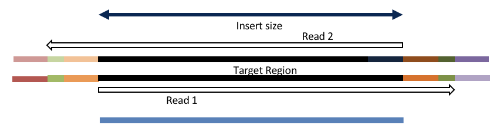

# Sequence Preprocessing

This document assumes [project_setup](./project_setup.md) has been completed.

```bash
cd /share/workshop/mrnaseq_workshop/$USER/rnaseq_example
```

## Why Preprocess Reads

We have found that aggressively “cleaning” and preprocessing of reads can make a large difference to the speed and quality of mapping and assembly results. Preprocessing your reads means:

  * Removing bases of unwanted sequence (Ex. vectors, adapter, primer sequence, polyA tails).
  * Merge/join short overlapping paired-end reads.
  * Remove low quality bases or N characters.
  * Remove reads originating from PCR duplication.
  * Remove reads that are not of primary interest (contamination).
  * Remove too short reads.

Preprocessing also produces a number of statistics about the samples. These can be used to evaluate sample-to-sample consistency.

### Preprocessing Statistics as QA/QC.

Beyond generating "better" data for downstream analysis, preprocessing statistics also give you an idea as to the original quality and complexity of the sample, library generation features, and sequencing quality.

This can help inform you of how you might change your procedures in the future, either sample preparation, or in library preparation.

We’ve found it best to perform __QA/QC__ on both the run as a whole (poor samples can negatively affect other samples) and on the samples themselves as they compare to other samples (**BE CONSISTENT**).

Reports such as Basespace for Illumina, are great ways to evaluate the run as a whole, the sequencing provider usually does this for you.  

PCA/MDS plots of the preprocessing summary are a great way to look for technical bias across your experiment. Poor quality samples often appear as outliers on the MDS plot and can ethically be removed due to identified technical issues. You should **NOT** see a trend on the MDS plot associated with any experimental factors. That scenario should raise concerns about technical sample processing bias.

**Many technical things happen between original sample and data, preprocessing is working backwards through that process to get as close as we can to original sample**


### An RNAseq Preprocessing Workflow

1. Remove contaminants (at least PhiX).
1. Remove PCR duplicates.
1. Count rRNA proportion.
1. Join and potentially extend, overlapping paired end reads
1. If reads completely overlap they will contain adapter, remove adapters
1. Identify and remove any adapter dimers present
1. Trim sequences (5’ and 3’) by quality score (I like Q20)
1. Run a polyA/T trimmer
1. Cleanup
  * Remove any reads that are less then the minimum length parameter
  * Produce preprocessing statistics

## HTStream Streamed Preprocessing of Sequence Data

HTStream is a suite of preprocessing applications for high throughput sequencing data (ex. Illumina). A fast C++ implementation, designed with discreet functionality that can be pipelined together using standard Unix piping.

Benefits Include:
  * No intermediate files, reducing storage footprint.
  * Reduced I/O, files are only read in and written out once to disk.
  * Handles both single end and paired end reads at the same time.
  * Applications process reads at the same time allowing for process parallelization.
  * Built on top of mature C++ Boost libraries to reduce bugs and memory leaks.
  * Designed following the philosophy of [Program Design in the UNIX Environment](https://onlinelibrary.wiley.com/doi/abs/10.1002/j.1538-7305.1984.tb00055.x).
  * Works with native Unix/Linux applications such as grep/sed/awk etc.
  * Can build a custom preprocessing pipeline to fit the specific expectation of the data.
  * A single JSON output per sample detailing the preprocessing statistics from each application.

HTStream achieves these benefits by using a tab delimited intermediate format that allows for streaming from application to application. This streaming creates some awesome efficiencies when preprocessing HTS data and makes it fully interoperable with other standard Linux tools.

### HTStream applications

HTStream includes the following applications:

hts_AdapterTrimmer: Identify and remove adapter sequences.  
hts_CutTrim: Discreet 5' and/or 3' basepair trimming.  
hts_LengthFilter: Remove reads outside of min and/or max length.  
hts_NTrimmer: Extract the longest subsequence with no Ns.    
hts_Overlapper: Overlap paired end reads, removing adapters when present.  
hts_PolyATTrim: Identify and remove polyA/T sequence.  
hts_Primers: Identify and optionally remove 5' and/or 3' primer sequence.  
hts_QWindowTrim: 5' and/or 3' quality score base trimming using windows.  
hts_SeqScreener: Identify and remove/keep/count contaminants (default phiX).  
hts_Stats: Compute read stats.  
hts_SuperDeduper: Identify and remove PCR duplicates.  

The source code and pre-compiled binaries for Linux can be downloaded and installed [from the GitHub repository](https://github.com/s4hts/HTStream).

HTStream is also avaiable on [Bioconda](https://bioconda.github.io/), and there is even an image on [Docker Hub](https://hub.docker.com/r/dzs74/htstream).

HTStream was designed to be extensible. We continue to add new preprocessing routines and welcome contributions from collaborators.

If you encounter any bugs or have suggestions for improvement, please post them to [issues](https://github.com/s4hts/HTStream/issues).

# HTStream Setup for our Project

## Example, running HTStream

Let's run the first step of our HTStream preprocessing pipeline, which is always to gather basic stats on the read files. For now, we're only going to run one sample through the pipeline.

When building a new pipeline, it is almost always a good idea to use a small subset of the data in order to speed up development. A small sample of reads will take seconds to process and help you identify problems that may have only been apparent after hours of waiting for the full data set to process.

1. Let's start by first taking a small subsample of reads, so that our trial run through the pipeline goes really quickly.

    ```bash
    cd /share/workshop/mrnaseq_workshop/$USER/rnaseq_example
    mkdir HTS_testing
    cd HTS_testing
    pwd
    ```

    * *Why run ```pwd``` here?*


    Then create a small dataset.

    ```bash
    zcat ../00-RawData/SampleAC1/SampleAC1_L3_R1.fastq.gz | head -400000 | gzip > SampleAC1.subset_R1.fastq.gz
    zcat ../00-RawData/SampleAC1/SampleAC1_L3_R2.fastq.gz | head -400000 | gzip > SampleAC1.subset_R2.fastq.gz
    ls
    ```

    So we ```zcat``` (uncompress and send to stdout), pipe ```|```  to ```head``` (param -400000) then pipe to ```gzip``` to recompress and name our files subset.

    * *How many reads are we going to analyze in our subset?*

1. Now we'll run our first preprocessing step ```hts_Stats```, first loading the module and then looking at help.

    ```bash
    cd /share/workshop/mrnaseq_workshop/$USER/rnaseq_example/HTS_testing
    module load htstream
    hts_Stats --help
    ```

    * *What version of hts_Stats is loaded?*


1. Now lets run ```hts_Stats``` and look at the output.

    ```bash
    hts_Stats -1 SampleAC1.subset_R1.fastq.gz \
              -2 SampleAC1.subset_R2.fastq.gz \
              -L SampleAC1.stats.json > out.tab
    ```

    * *What happens if you run hts_Stats without piping output to out.tab?*

    * *Can you think of a way to view the output from hts_Stats in less without creating out.tab?*

    By default, all HTS apps output tab formatted files to the stdout.

    Take a look at the output (remember ```q``` quits):
    ```bash
    less out.tab
    ```

    The output was difficult to understand, lets try without line wrapping (note that you can also type ```-S``` from within ```less``` if you forget). Scroll with the arrow keys, left, right, up, and down.
    ```bash
    less -S out.tab
    ```

    And delete out.tab since we are done with it:
    ```bash
    rm out.tab
    ```

    Remember how this output looks, we will revisit it later.

1. Now lets change the command slightly.
    ```bash
    hts_Stats -1 SampleAC1.subset_R1.fastq.gz \
              -2 SampleAC1.subset_R2.fastq.gz \
              -L SampleAC1.stats.json -f SampleAC1.stats
    ```

    * *What parameters did we use, what do they do?*

    Lets take a look at the output of stats

    ```bash
    ls -lah
    ```

    <div class="output">msettles@tadpole:/share/workshop/mrnaseq_workshop/msettles/rnaseq_example/HTS_testing$     ls -lah
    total 29M
    drwxrwsr-x 2 msettles mrnaseq_workshop    7 May 31 12:51 .
    drwxrwsr-x 6 msettles mrnaseq_workshop    7 May 31 12:48 ..
    -rw-rw-r-- 1 msettles mrnaseq_workshop  60K May 31 12:51 SampleAC1.stats.json
    -rw-rw-r-- 1 msettles mrnaseq_workshop 6.8M May 31 12:51 SampleAC1.stats_R1.fastq.gz
    -rw-rw-r-- 1 msettles mrnaseq_workshop 7.5M May 31 12:51 SampleAC1.stats_R2.fastq.gz
    -rw-rw-r-- 1 msettles mrnaseq_workshop 6.8M May 31 12:48 SampleAC1.subset_R1.fastq.gz
    -rw-rw-r-- 1 msettles mrnaseq_workshop 7.5M May 31 12:48 SampleAC1.subset_R2.fastq.gz
    </div>

    * *Which files were generated from hts\_Stats?*

1. Lets look at the file SampleAC1.stats\.json*

    ```bash
    cat SampleAC1.stats.json
    ```

    The logs generated by htstream are in [JSON](https://en.wikipedia.org/wiki/JSON) format, like a database format but meant to be readable.


## Next we are going to screen from ribosomal RNA (rRNA).

Ribosomal RNA can make up 90% or more of a typical _total RNA_ sample. Most library prep methods attempt to reduce the rRNA representation in a sample, oligoDt binds to polyA tails to enrich a sample for mRNA, where Ribo-Depletion binds rRNA sequences to biotinylated oligo probes that are captured with streptavidin-coated magnetic beads to deplete the sample of rRNA. Newer methods use targeted probes to facilitate degradation of specific sequences (e.g. Tecan/Nugen [AnyDeplete](https://www.nugen.com/products/technology#inda), [DASH](https://genomebiology.biomedcentral.com/articles/10.1186/s13059-016-0904-5), etc). No technique is 100% efficient all of the time, and some can fail spectacularly, so knowing the relative proportion of rRNA in each sample can be helpful.


### Before we do so we need to find sequences of ribosomal RNA to screen against.

We will use these sequences to identify rRNA in our reads, which are from human. One way to do that is to go to [NCBI](https://www.ncbi.nlm.nih.gov/) and search for them.

1. First, go to NCBI and in the Search dropdown select "Taxonomy" and search for "human".

    

1. Click on "Homo sapiens".

    

1. Click on "Homo sapiens" again.

    

1. Click on the "Subtree links" for Nucleotide.

    

1. Under Molecule Types, click on "rRNA" (left hand side).

    

1. Click on "Send", choose "File", choose Format "FASTA", and click on "Create File".

    

    

Save this file to your computer, and rename it to 'human_rrna.fasta'.

Upload your human_rrna.fasta file **to the 'References' directory** in your project folder using either **scp** or FileZilla (or equivalent).

Or if you feel like 'cheating', just copy/paste the contents of human_rrna.fa using nano into a file named /share/workshop/mrnaseq_workshop/$USER/rnaseq_example/References/human_rrna.fasta

```bash
nano /share/workshop/mrnaseq_workshop/$USER/rnaseq_example/References/human_rrna.fasta
```

paste contents of human_rrna.fa and save


This is *really* cheating, but if all else fails:
```bash
cd /share/workshop/mrnaseq_workshop/$USER/rnaseq_example/References
wget https://github.com/ucdavis-bioinformatics-training/2020-mRNA_Seq_Workshop/raw/master/data_reduction/human_rrna.fasta
```

### Using HTStream to count ribosomal rna (not remove, but just to count the occurrences).

1. First, view the help documentation for hts_SeqScreener

    ```bash
    cd /share/workshop/mrnaseq_workshop/$USER/rnaseq_example/HTS_testing
    hts_SeqScreener -h
    ```

    * *What parameters are needed to:
        1.  provide a reference to hts_SeqScreener and
        2. count, and not screen occurrences?*

1. Run HTStream on the small test set.

    ```bash
    hts_SeqScreener -1 SampleAC1.subset_R1.fastq.gz \
                    -2 SampleAC1.subset_R2.fastq.gz \
                    -s ../References/human_rrna.fasta -r -L SampleAC1.rrna.json -f SampleAC1.rrna
    ```

    * *Which files were generated from hts\_SeqScreener?*

    * *Lets look at the file SampleAC1.rrna.json?*

    * *What do you notice about the SampleAC1.rrna.json?*

    * *How many reads were identified as rrna?*

### Stream multiple applications together.

The power of HTStream is the ability to stream reads through multiple programs using pipes. By streaming reads through programs, processing will be much quicker because each read is read in only once and written out only once. This approach also uses significantly less storage as there are no intermediate files. HTStream can do this by streaming a tab-delimited format called tab6.

Single end reads are 3 columns:

`read1id  read1seq  read1qual`

Paired end reads are 6 columns:

`read1id  read1seq  read1qual  read2id  read2seq  read2qual`

1. So lets first run hts_Stats and then hts_SeqScreener in a streamed fashion.

    ```bash
    cd /share/workshop/mrnaseq_workshop/$USER/rnaseq_example/HTS_testing

    hts_Stats -1 SampleAC1.subset_R1.fastq.gz \
              -2 SampleAC1.subset_R2.fastq.gz \
              -L SampleAC1.streamed.json |
    hts_SeqScreener -A SampleAC1.streamed.json \
              -r -s ../References/human_rrna.fasta -f SampleAC1.streamed
    ```

    Note the pipe, ```|```, between the two applications!

    **Questions**
    * *What new parameters did we use here?*

    * *What parameter is SeqScreener using that specifies how reads are input?*

    * *Lets look at the file SampleAC1.streamed.json?*


## A RNAseq preprocessing pipeline

1. hts_Stats: get stats on *input* raw reads
1. hts_SeqScreener: screen out (remove) phiX
1. hts_SeqScreener: screen for (count) rRNA
1. hts_SuperDeduper: identify and remove PCR duplicates
1. hts_AdapterTrimmer: identify and remove adapter sequence
1. hts_PolyATTrim: remove polyA/T from the end of reads.
1. hts_NTrimmer: trim to remove any remaining N characters
1. hts_QWindowTrim: remove poor quality bases
1. hts_LengthFilter: use to remove all reads < 50bp
1. hts_Stats: get stats on *output* cleaned reads


### Why screen for phiX?

PhiX is a common control in Illumina runs, and facilities may not tell you if/when PhiX has been spiked in. Since it does not have a barcode, in theory should not be in your data.

However:
* When we know PhiX has been spiked in, we find sequence every time.
    * [update] When dual matched barcodes are used, then almost zero phiX reads can be identified.
* When I know PhiX has not been spiked in, I do not find sequence

For RNAseq and variant analysis (any mapping based technique) it is not critical to remove, but for sequence assembly it is. Unless you are sequencing PhiX, it is noise, so its better safe than sorry to screen for it every time.

### Removing PCR duplicates with hts_SuperDeduper.

Removing PCR duplicates can be **controversial** for RNAseq, but I'm in favor of it for paired-end data. Duplication rate tells you a lot about the original complexity of each sample and potential impact of sequencing depth.

__**However, I would never do PCR duplicate removal on Single-End reads!**__

Many other read de-duplication algorithms rely on mapping position to identify duplicated reads (although some other reference free methods do exist [https://doi.org/10.1186/s12859-016-1192-5](https://doi.org/10.1186/s12859-016-1192-5)). Reads that are mapped to the same position on the genome probably represent the same original fragment sequenced multiple times (think "technical replicates").

However, this approach requires that there be a reference to map reads against and requires that someone maps them!

hts_SuperDeduper does not require a reference or mapped reads. Instead it uses a small portion of each paired read to identify duplicates. If an identical pattern is identified in multiple reads, extra copies are discarded.


We calculated the Youden Index for every combination tested and the point that acquired the highest index value (as compared to Picard MarkDuplicates) occurred at a start position at basepair 5 and a length of 10bp (20bp total over both reads). Though defaults in hts_SuperDeduper are start position at basepair 10 and a length of 10bp.

### Adapter trimming by overlapping reads.

Consider the three scenarios below

**Insert size > length of the number of cycles**


hts_AdapterTrimmer product: original pairs

hts_Overlapper product: original pairs

**Insert size < length of the number of cycles (10bp min)**


hts_AdapterTrimmer product: original pairs

hts_Overlapper product: extended, single

**Insert size < length of the read length**



hts_AdapterTrimmer product: adapter trimmed, pairs

hts_Overlapper product: adapter trimmed, single

Both hts_AdapterTrimmer and hts_Overlapper employ this principle to identify and remove adapters for paired-end reads. For paired-end reads the difference between the two are the output, as overlapper produces single-end reads when the pairs overlap and adapter trimmer keeps the paired end format. For single-end reads, adapter trimmer identifies and removes adapters by looking for the adapter sequence, where overlapper just ignores single-end reads (nothing to overlap).


### Now lets see if we can find evidence of Illumina sequencing adapters in our subset.
Remember that Illumina reads must have P5 and P7 adapters and generally look like this (in R1 orientation):

P5---Read1primer---INSERT---IndexReadprimer--index--P7(rc)

This sequence is P7(rc): ATCTCGTATGCCGTCTTCTGCTTG. It should be at the end of any R1 that contains a full-length adapter sequence.

```bash
cd /share/workshop/mrnaseq_workshop/$USER/rnaseq_example/HTS_testing
zcat SampleAC1.subset_R1.fastq.gz | grep TCTCGTATGCCGTCTTCTGCTTG
```

* *What did you find?*
* *Do you remember how to count the number of instances?*
* *Roughly, what percentage of this data has adapters?*


### Q-window trimming.

As a sequencing run progresses the quality scores tend to get worse. Quality scores are essentially a guess about the accuracy of a base call, so it is common to trim of the worst quality bases.


This is how reads commonly look, they start at "good" quality, increase to "excellent" and degrade to "poor", with R2 always looking worse (except when they don't) than R1 and get worse as the number of cycles increases.

hts_QWindowTrim trims 5' and/or 3' end of the sequence using a windowing (average quality in window) approach.

### What does all this preprocessing get you

Comparing STAR mapping count with raw and preprocessed reads


### Lets put it all together

```bash
cd /share/workshop/mrnaseq_workshop/$USER/rnaseq_example/HTS_testing

hts_Stats -L SampleAC1_htsStats.json -N "initial stats" \
    -1 SampleAC1.subset_R1.fastq.gz \
    -2 SampleAC1.subset_R2.fastq.gz | \
hts_SeqScreener -A SampleAC1_htsStats.json -N "screen phix" | \
hts_SeqScreener -A SampleAC1_htsStats.json -N "count the number of rRNA reads"\
     -r -s ../References/human_rrna.fasta | \
hts_SuperDeduper -A SampleAC1_htsStats.json -N "remove PCR duplicates" | \
hts_AdapterTrimmer -A SampleAC1_htsStats.json -N "trim adapters" | \
hts_PolyATTrim  -A SampleAC1_htsStats.json -N "trim adapters" | \
hts_NTrimmer -A SampleAC1_htsStats.json -N "remove any remaining 'N' characters" | \
hts_QWindowTrim -A SampleAC1_htsStats.json -N "quality trim the ends of reads" | \
hts_LengthFilter -A SampleAC1_htsStats.json -N "remove reads < 50bp" \
    -n -m 50 | \
hts_Stats -A SampleAC1_htsStats.json -N "final stats" \
    -f SampleAC1.htstream
```

Note the patterns:
* In the first routine we use -1 and -2 to specify the original reads.
* In the final routine -f fastq prefix to write out new preprocessed reads.
* For the log, we specify -L in the first app to write out to a new log, and then use -A for the second routine onward to append log output, generating a single log file at the end.
* All other parameters are algorithm specific, can review using --help

**Questions**
* *Review the final json output, how many reads do we have left?*

* *Confirm that number by counting the number of reads in the final output files.*

* *How many adapters did we detect, cut off?*

* *How many PCR duplicates were there?*

* *Anything else interesting?*

## Run HTStream on the Project.

We can now run the preprocessing routine across all samples on the real data using a SLURM script, [hts_preproc.slurm](../software_scripts/scripts/hts_preproc.slurm), that we should take a look at now.

```bash
cd /share/workshop/mrnaseq_workshop/$USER/rnaseq_example  # We'll run this from the main directory
wget https://ucdavis-bioinformatics-training.github.io/2020-mRNA_Seq_Workshop/software_scripts/scripts/hts_preproc.slurm
less hts_preproc.slurm
```

When you are done, type "q" to exit.

<div class="script">#!/bin/bash

#SBATCH --job-name=htstream # Job name
#SBATCH --nodes=1
#SBATCH --ntasks=9
#SBATCH --time=60
#SBATCH --mem=3000 # Memory pool for all cores (see also --mem-per-cpu)
#SBATCH --partition=production
#SBATCH --reservation=mrnaseq_workshop
#SBATCH --account=mrnaseq_workshop
#SBATCH --array=1-16
#SBATCH --output=slurmout/htstream_%A_%a.out # File to which STDOUT will be written
#SBATCH --error=slurmout/htstream_%A_%a.err # File to which STDERR will be written
#SBATCH --mail-type=ALL
#SBATCH --mail-user=myemail@email.com

start=`date +%s`
echo $HOSTNAME
echo "My SLURM_ARRAY_TASK_ID: " $SLURM_ARRAY_TASK_ID

sample=`sed "${SLURM_ARRAY_TASK_ID}q;d" samples.txt`

inpath="00-RawData"
outpath="01-HTS_Preproc"
[[ -d ${outpath} ]] || mkdir ${outpath}
[[ -d ${outpath}/${sample} ]] || mkdir ${outpath}/${sample}

echo "SAMPLE: ${sample}"

module load htstream

call="hts_Stats -L ${outpath}/${sample}/${sample}.json -N 'initial stats' \
          -1 ${inpath}/${sample}/*R1*.fastq.gz \
          -2 ${inpath}/${sample}/*R2*.fastq.gz | \
      hts_SeqScreener -A ${outpath}/${sample}/${sample}.json -N 'screen phix' | \
      hts_SeqScreener -A ${outpath}/${sample}/${sample}.json -N 'count the number of rRNA reads'\
          -r -s References/human_rrna.fasta | \
      hts_SuperDeduper -A ${outpath}/${sample}/${sample}.json -N 'remove PCR duplicates' | \
      hts_AdapterTrimmer -A ${outpath}/${sample}/${sample}.json -N 'trim adapters' | \
      hts_PolyATTrim  -A ${outpath}/${sample}/${sample}.json -N 'remove polyAT tails' | \
      hts_NTrimmer -A ${outpath}/${sample}/${sample}.json -N 'remove any remaining N characters' | \
      hts_QWindowTrim -A ${outpath}/${sample}/${sample}.json -N 'quality trim the ends of reads' | \
      hts_LengthFilter -A ${outpath}/${sample}/${sample}.json -N 'remove reads < 50bp' \
          -n -m 50 | \
      hts_Stats -A ${outpath}/${sample}/${sample}.json -N 'final stats' \
          -f ${outpath}/${sample}/${sample}"

echo $call
eval $call

end=`date +%s`
runtime=$((end-start))
echo $runtime
</div>


Double check to make sure that slurmout and 01-HTS_Preproc directories have been created for output, then after looking at the script, let's run it.

```bash
cd /share/workshop/mrnaseq_workshop/$USER/rnaseq_example
mkdir -p slurmout  # -p tells mkdir not to complain if the directory already exists
mkdir -p 01-HTS_Preproc
sbatch hts_preproc.slurm  # moment of truth!
```

We can watch the progress of our task array using the 'squeue' command. Takes about 30 minutes to process each sample.

```bash
squeue -u msettles  # use your username
```

## Quality Assurance - Preprocessing statistics as QA/QC.

Beyond generating "better" data for downstream analysis, cleaning statistics also give you an idea as to the original quality and complexity of the sample, library generation, and sequencing quality.

This can help inform you of how you might change your protocol/procedures in the future, either sample preparation, or in library preparation.

I’ve found it best to perform QA/QC on both the run as a whole (poor samples can affect other samples) and on the samples themselves as they compare to other samples **(BE CONSISTENT!)**.

Reports such as Basespace for Illumina, are great ways to evaluate the run as a whole, the sequencing provider usually does this for you. PCA/MDS plots of the preprocessing summary are a great way to look for technical bias across your experiment. Poor quality samples often appear as outliers on the MDS plot and can ethically be removed due to identified technical issues.

1. Let's make sure that all jobs completed successfully.

    Lets first check all the "htstream_%\*.out" and "htstream_%\*.err" files:

    ```bash
    cd /share/workshop/mrnaseq_workshop/$USER/rnaseq_example
    cat slurmout/htstream_*.out
    ```

    Look through the output and make sure you don't see any errors. Now do the same for the err files:

    ```bash
    cat slurmout/htstream_*.err
    ```

    Also, check the output files. First check the number of forward and reverse output files (should be 16 each):

    ```bash
    cd 01-HTS_Preproc
    ls */*R1* | wc -l
    ls */*R2* | wc -l
    ```

    Check the sizes of the files as well. Make sure there are no zero or near-zero size files and also make sure that the size of the files are in the same ballpark as each other:

    ```bash
    ls -lh *
    ```

    **IF** for some reason it didn't finish, is corrupted or you missed the session, please let one of us know and we will help, and you can copy over a completed copy

    ```bash
    cp -r /share/biocore/workshops/2020_mRNAseq/HTS_testing /share/workshop/mrnaseq_workshop/$USER/rnaseq_example/.
    cp -r /share/biocore/workshops/2020_mRNAseq/01-HTS_Preproc /share/workshop/mrnaseq_workshop/$USER/rnaseq_example/.
    ```

1. Let's take a look at the differences in adapter content between the input and output files. First look at the input file:

    ```bash
    cd /share/workshop/mrnaseq_workshop/$USER/rnaseq_example
    zless 00-RawData/SampleAC1/SampleAC1_L3_R1.fastq.gz
    ```

    Let's search for the adapter sequence. Type '/' (a forward slash), and then type **AGATCGGAAGAGCACACGTCTGAACTCCAGTCAC** (the first part of the forward adapter). Press Enter. This will search for the sequence in the file and highlight each time it is found. You can now type "n" to cycle through the places where it is found. When you are done, type "q" to exit. Alternatively, you can use zcat and grep like we did earlier.

    Now look at the output file:

    ```bash
    zless 01-HTS_Preproc/SampleAC1/SampleAC1_R1.fastq.gz
    ```

    If you scroll through the data (using the spacebar), you will see that some of the sequences have been trimmed. Now, try searching for **AGATCGGAAGAGCACACGTCTGAACTCCAGTCAC** again. You shouldn't find it (adapters were trimmed remember), but rarely is anything perfect. You may need to use Control-C to get out of the search and then "q" to exit the 'less' screen.

    Lets grep for the sequence and count occurrences

    ```bash
    zcat  00-RawData/SampleAC1/SampleAC1_L3_R1.fastq.gz | grep  AGATCGGAAGAGCACACGTCTGAACTCCAGTCAC | wc -l
    zcat  01-HTS_Preproc/SampleAC1/SampleAC1_R1.fastq.gz | grep  AGATCGGAAGAGCACACGTCTGAACTCCAGTCAC | wc -l
    ```

    * *What is the reduction in adapters found?*

1. QA/QC Summary of the json files.

Finally lets use [MultiQC](https://multiqc.info/) to generate a summary of our output. Currently MultiQC support for HTStream is in development by Bradley Jenner, and has not been included in the official MultiQC package. If you'd like to try it on your own data, you can find a copy here [https://github.com/bnjenner/MultiQC](https://github.com/bnjenner/MultiQC).

```bash
## Run multiqc to collect statistics and create a report:
cd /share/workshop/mrnaseq_workshop/$USER/rnaseq_example
source /share/workshop/shunter/rnaseq_example/multiqc/bin/activate # setup a python virtual environment
mkdir -p 01-HTS-multiqc-report
multiqc -i HTSMultiQC-cleaning-report -o 01-HTS-multiqc-report ./01-HTS_Preproc
deactivate  # turn off python virtual environment
```

Transfer HTSMultiQC-cleaning-report_multiqc_report.html to your computer and open it in a web browser.


Or in case of emergency, download this copy: [HTSMultiQC-cleaning-report_multiqc_report.html](HTSMultiQC-cleaning-report_multiqc_report.html)


<!--
    I've created a small R script to read in each json file, pull out some relevant stats and write out a table for all samples.

    ```/bash
    cd /share/workshop/mrnaseq_workshop/$USER/rnaseq_example  # We'll run this from the main directory
    wget https://raw.githubusercontent.com/ucdavis-bioinformatics-training/2020-mRNA_Seq_Workshop/master/software_scripts/scripts/summarize_stats.R

    module load R
    R CMD BATCH summarize_stats.R
    cat summary_hts.txt
    ```

    Transfer summarize_stats.txt to your computer using scp or winSCP, or copy/paste from cat [sometimes doesn't work],  

    For scp try, In a new shell session on your laptop. **NOT logged into tadpole**.

    ```bash
    mkdir ~/rnaseq_workshop
    cd ~/rnaseq_workshop
    scp your_username@tadpole.genomecenter.ucdavis.edu:/share/workshop/your_username/rnaseq_example/summary_hts.txt .
    ```

    Open in excel (or excel like application), you may have to move the header column 1 cell to the right, and lets review.

-->
**Questions**
* *Any problematic samples?*

* *Anything else worth discussing?*
