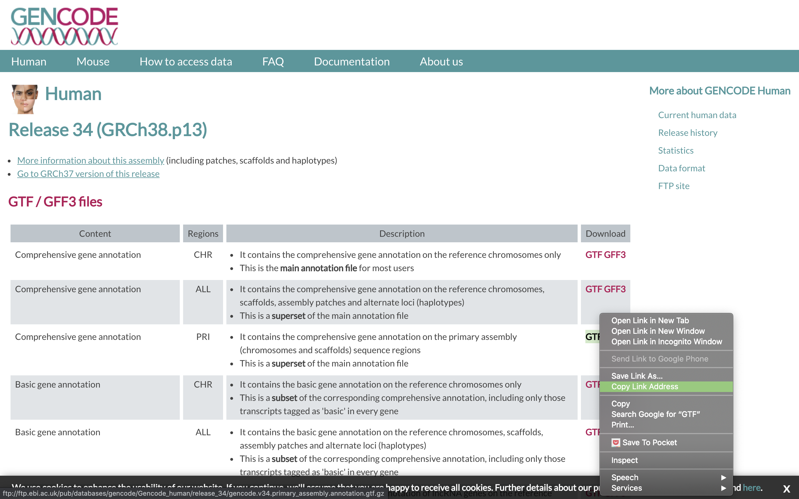
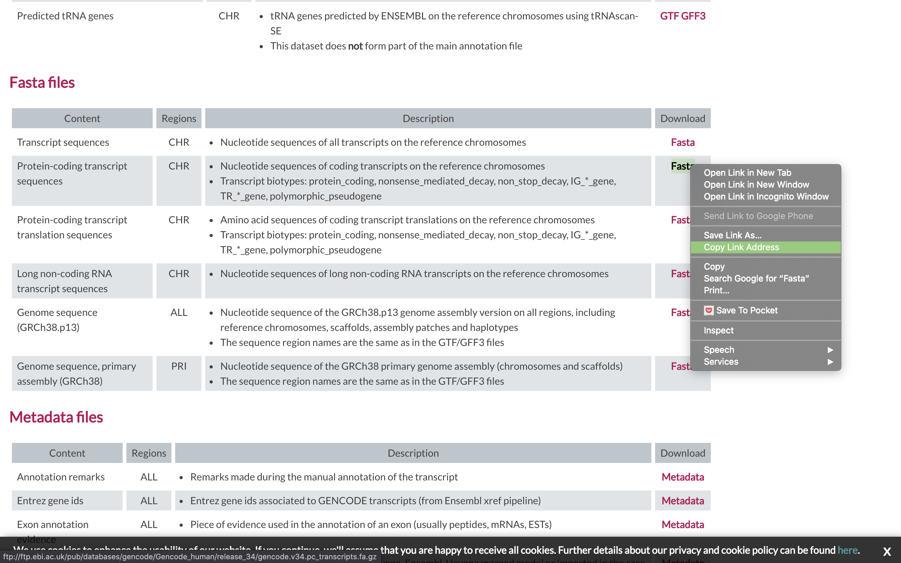

# Alignment using Salmon

## Salmon Aligner

[Salmon](https://salmon.readthedocs.io/en/latest/salmon.html) is a tool for quantifying the expression of transcripts using RNA-seq data. Salmon uses new algorithms (specifically, coupling the concept of quasi-mapping with a two-phase inference procedure) to provide accurate expression estimates very quickly (i.e. wicked-fast) and while using little memory. Salmon performs its inference using an expressive and realistic model of RNA-seq data that takes into account experimental attributes and biases commonly observed in real RNA-seq data.

## We first need to index the reference (In this case the transcriptome)

1. First lets make sure we are where we are supposed to be and that the References directory is available.

    ```bash
    cd /share/workshop/mrnaseq_workshop/$USER/rnaseq_example
    ```

1. To align our data we will need the transcriptome (fasta) and annotation (gtf) for human. There are many places to find them, but we are going to get it from the [GENCODE](https://www.gencodegenes.org/human/).

    We need to first get the urls for the and protein coding genes. For RNAseq we want to use the protein coding transcript sequences and basic gene annotation. At the time of this workshop the current version of GENCODE is *34*. You will want to update the scripts to use the current version.

    

    

1. Lets take a look at the help docs for salmon and its subcommands as well:

    ```bash
    module load salmon
    salamon -h
    salmon index -h
    ```

1. First we need to index the transcriptome for STAR. Lets pull down a slurm script to index the human GENCODE version of the transcriptome.

    ```bash
    wget https://raw.githubusercontent.com/ucdavis-bioinformatics-training/2020-mRNA_Seq_Workshop/master/software_scripts/scripts/salmon_index.slurm
    less salmon_index.slurm
    ```

    <div class="script">#!/bin/bash

    #SBATCH --job-name=salmon_index # Job name
    #SBATCH --nodes=1
    #SBATCH --ntasks=8
    #SBATCH --time=60
    #SBATCH --mem=15000 # Memory pool for all cores (see also --mem-per-cpu)
    #SBATCH --partition=production
    #SBATCH --reservation=mrnaseq_workshop
    #SBATCH --account=mrnaseq_workshop
    #SBATCH --output=slurmout/salmon-index_%A.out # File to which STDOUT will be written
    #SBATCH --error=slurmout/salmon-index_%A.err # File to which STDERR will be written
    #SBATCH --mail-type=ALL
    #SBATCH --mail-user=myemail@email.com

    start=`date +%s`
    echo $HOSTNAME

    outpath="References"
    mkdir -p ${outpath}
    cd ${outpath}

    wget ftp://ftp.ebi.ac.uk/pub/databases/gencode/Gencode_human/release_34/gencode.v34.pc_transcripts.fa.gz
    gunzip gencode.v34.pc_transcripts.fa.gz
    PC_FASTA="gencode.v34.pc_transcripts.fa"
    INDEX="salmon_gencode.v34.index"

    module load salmon
    call="salmon index -i ${INDEX} -k 31 --gencode -p 8 -t ${PC_FASTA}"
    echo $call
    eval $call

    end=`date +%s`
    runtime=$((end-start))
    echo $runtime
    </div>

    Press 'q' to exit.

    1. The script changes into the References directory.
    1. It uses wget to download the transcript fasta file from GENCODE.
    1. Uncompresses it using gunzip.
    1. Run Salmon indexing, using the "gencode" flag to parse the GENCODE file properly, and outputting to a new directory called "salmon_gencode.v34.index".

1. Run salmon indexing when ready.

    ```bash
    sbatch salmon_index.slurm
    ```

    This step does not take long, about 15 minutes. You can look at the [salmon documentation](https://salmon.readthedocs.io/en/latest/salmon.html) while you wait. All of the output files will be written to the salmon_gencode.v34.index directory.

    **IF** for some reason it didn't finish, is corrupted, or you missed the session, you can **link** over a completed copy.

    ```bash
    ln -s /share/biocore/workshops/2020_mRNAseq/References/salmon_gencode.v34.index /share/workshop/mrnaseq_workshop/$USER/rnaseq_example/References/.
    ```
## Alignments

1. We are now ready to try an alignment:

    ```bash
    cd /share/workshop/mrnaseq_workshop/$USER/rnaseq_example/HTS_testing
    ```

    Then run the salmon quant (quantify transcripts) command

    ```bash
    module load salmon
    salmon quant --help-reads
    ```

    ```bash
    salmon quant \
    --threads 8 \
    --index ../References/salmon_gencode.v34.index \
    	--libType A \
    	--validateMappings \
    	--geneMap ../References/gencode.v34.primary_assembly.annotation.gtf \
    	--output SampleAC1.salmon \
    -1 SampleAC1.streamed_R1.fastq.gz \
    	-2 SampleAC1.streamed_R2.fastq.gz
    ```

    In the command, we are telling salmon to quantify reads with libtype 'auto' ([libtype](https://salmon.readthedocs.io/en/latest/salmon.html#what-s-this-libtype)) on a gene level ('--geneMap'), the folder for all the output files will be SampleAC1.salmon, and finally, the input file pair.

## Running Salmon on the experiment

1. We can now run Salmon across all samples on the real data using a SLURM script, [salmon.slurm](../scripts/salmon.slurm), that we should take a look at now.

    ```bash
    cd /share/workshop/mrnaseq_workshop/$USER/rnaseq_example  # We'll run this from the main directory
    wget https://raw.githubusercontent.com/ucdavis-bioinformatics-training/2020-mRNA_Seq_Workshop/master/software_scripts/scripts/salmon.slurm
    less salmon.slurm
    ```

    <div class="script">#!/bin/bash

    #SBATCH --array=1-16
    #SBATCH --job-name=salmon # Job name
    #SBATCH --nodes=1
    #SBATCH --ntasks=8
    #SBATCH --time=1440
    #SBATCH --mem=20000 # Memory pool for all cores (see also --mem-per-cpu)
    #SBATCH --partition=production
    #SBATCH --reservation=mrnaseq_workshop
    #SBATCH --account=mrnaseq_workshop
    #SBATCH --output=slurmout/salmon_%A_%a.out # File to which STDOUT will be written
    #SBATCH --error=slurmout/salmon_%A_%a.err # File to which STDERR will be written


    start=`date +%s`
    hostname

    outdir="02-Salmon_alignment"
    sampfile="samples.txt"
    REF="References/salmon_gencode.v34.index"
    GTF="References/gencode.v34.primary_assembly.annotation.gtf"

    SAMPLE=`head -n ${SLURM_ARRAY_TASK_ID} $sampfile | tail -1`
    R1="01-HTS_Preproc/$SAMPLE/${SAMPLE}_R1.fastq.gz"
    R2="01-HTS_Preproc/$SAMPLE/${SAMPLE}_R2.fastq.gz"

    echo $SAMPLE

    if [ ! -e $outdir ]; then
        mkdir $outdir
    fi

    module load salmon

    call="salmon quant \
          --threads 8 \
          --index ${REF} \
          --libType A \
          --validateMappings \
          --geneMap ${GTF} \
          --output $outdir/$SAMPLE \
          -1 $R1 \
          -2 $R2"

    echo $call
    eval $call

    end=`date +%s`
    runtime=$((end-start))
    echo Runtime: $runtime seconds
    </div>

    When you are done, type "q" to exit.

    1. Loads the salmon module and then runs salmon in "quant" mode to quantify (i.e. count) the reads aligning to transcripts. Salmon uses the annotation GTF file to roll up the transcript counts into gene-level counts.
    1. The script specifies the output directory (02-Salmon_alignment), the samples file (samples.txt), the reference that we just indexed, and the annotation that we downloaded.
    1. Creates the output directory.
    1. It then defines the filenames for the forward and reverse reads (R1 and R2).

1. After looking at the script, lets run it.

    ```bash
    sbatch salmon.slurm  # moment of truth!
    ```

    We can watch the progress of our task array using the 'squeue' command. Takes about 30 minutes to process each sample.

    ```bash
    squeue -u msettles  # use your username
    ```

1. Once the jobs finish, take a look at one of the output files:

    ```bash
    cd /share/workshop/mrnaseq_workshop/$USER/rnaseq_example/02-Salmon_alignment/SampleAC1
    head quant.sf
    ```

    <div class="script">Name	Length	EffectiveLength	TPM	NumReads
    ENST00000641515.2	2618	2404.721	0.000000	0.000
    ENST00000335137.4	1054	840.721	0.000000	0.000
    ENST00000426406.3	995	781.725	1.640828	2.000
    ENST00000420190.6	1578	1364.721	0.000000	0.000
    ENST00000437963.5	387	185.880	0.000000	0.000
    ENST00000342066.8	2557	2343.721	0.000000	0.000
    ENST00000618181.4	2179	1965.721	0.000000	0.000
    ENST00000622503.4	2557	2343.721	0.000000	0.000
    ENST00000618323.4	2159	1945.721	0.000000	0.000
    </div>

    These are the transcript-level counts. Each row describes a single quantification record. The columns have the following interpretation.

    *	Name — This is the name of the target transcript provided in the input transcript database (FASTA file).
    *	Length — This is the length of the target transcript in nucleotides.
    *	EffectiveLength — This is the computed effective length of the target transcript. It takes into account all factors being modeled that will effect the probability of sampling fragments from this transcript, including the fragment length distribution and sequence-specific and gc-fragment bias (if they are being modeled).
    *	TPM — This is salmon’s estimate of the relative abundance of this transcript in units of Transcripts Per Million (TPM). TPM is the recommended relative abundance measure to use for downstream analysis.
    *	NumReads — This is salmon’s estimate of the number of reads mapping to each transcript that was quantified. It is an “estimate” insofar as it is the expected number of reads that have originated from each transcript given the structure of the uniquely mapping and multi-mapping reads and the relative abundance estimates for each transcript.

    Gene level quantification can be found in the quant.genes.sf file.

## Quality Assurance - Mapping statistics as QA/QC.

1. Once your jobs have finished successfully (check the error and out logs like we did in the previous exercise), use a script of ours, [salmon_stats.sh](../scripts/salmon_stats.sh) to collect the alignment stats. Don't worry about the script's contents at the moment; you'll use very similar commands to create a counts table in the next section. For now:

    ```bash
    cd /share/workshop/mrnaseq_workshop/$USER/rnaseq_example  # We'll run this from the main directory
    wget https://raw.githubusercontent.com/ucdavis-bioinformatics-training/2020-mRNA_Seq_Workshop/master/software_scripts/scripts/salmon_stats.R
	module load R
	R CMD BATCH salmon_stats.R
    ```

1. Transfer summary_salmon_alignments.txt to your computer using scp or winSCP, or copy/paste from cat [sometimes doesn't work],  

    In Mac/Linux, Windows users use WinSCP. In a new shell session on my laptop. **NOT logged into tadpole**. Replace my [your_username] with your username

    ```bash
    mkdir ~/rnaseq_workshop
    cd ~/rnaseq_workshop
    scp [your_username]@tadpole.genomecenter.ucdavis.edu:/share/workshop/mrnaseq_workshop/[your_username]/rnaseq_example/summary_salmon_alignments.txt .
    ```

    Its ok of the mkdir command fails ("File exists") because we aleady created the directory earlier.

    Open in excel (or excel like application), and lets review.

    The table that this script creates ("summary_salmon_alignments.txt") can be pulled to your laptop via 'scp', or WinSCP, etc., and imported into a spreadsheet. Are all samples behaving similarly? Discuss ...

## Generating gene level read counts table

1. Similar to STAR, we want to do these steps for ALL of the read count files... and to do that we will be using a 'for loop' directly on the command line. First, just run a simple 'for loop' that will print out the names of all the files we want to use:

    ```bash
    for sample in `cat samples.txt`; do echo ${sample}; done
    ```

    This command takes all the files that we listed in samples.txt and loops through them, one by one, and for every iteration, assigns the filename to the '${sample}' variable. Also, for every iteration, it runs whatever commands are between the 'do' and 'done'.... and every iteration the value of '${sample}' changes. The semi-colons separate the parts of the loop. The 'echo' command just prints the value of $x to the screen... in this case just the filename. For salmon we want to pull the TPM column (column 4) as the best estimate for transcript abundance:

    ```bash
    cd /share/workshop/mrnaseq_workshop/$USER/rnaseq_example
    mkdir 03-Counts
    mkdir 03-Counts/tmp
    for sample in `cat samples.txt`; do \
        echo ${sample}
        tail -n +2 02-Salmon_alignment/${sample}/quant.genes.sf | cut -f4 > 03-Counts/tmp/${sample}.count
    done
    ```

    After this command, there should be a counts file for every sample, in 03-Counts/tmp.

1. Next, we need to get the columns for the final table. Because all of these files are sorted in the exact same order (by gene ID), we can just use the columns from any of the files:


    ```bash
    tail -n +2 02-Salmon_alignment/SampleAC1/quant.genes.sf | cut -f1 > 03-Counts/tmp/geneids.txt
    head 03-Counts/tmp/geneids.txt
    ```

    Finally, we want to combine all of these columns together using the 'paste' command, and put it in a temporary file:

    ```bash
    paste 03-Counts/tmp/geneids.txt 03-Counts/tmp/*.count > 03-Counts/tmp/tmp.out
    ```

1. The final step is to create a header of sample names and combine it with the temp file. The header is just all of the sample names separated by tabs. And again, since we pasted the columns in sorted order (wildcards automatically sort in order), the columns just need to be in that same order.

    We take the samples.txt file and pipe that to the sort (to ensure they are in the same order) and then 'paste' command with the '-s' option, which takes a column of values and transposes them into a row, separated by the tab character. And finally, let's put everything together:

    ```bash
    cat <(cat samples.txt | sort | paste -s) 03-Counts/tmp/tmp.out > 03-Counts/rnaseq_salmon_workshop_counts.txt
    rm -rf 03-Counts/tmp
    head 03-Counts/rnaseq_salmon_workshop_counts.txt
    ```

1. Copy to your computer

    In Mac/Linux, Windows users use WinSCP. In a new shell session on my laptop. **NOT logged into tadpole**. Replace my [your_username] with your username

    ```bash
    mkdir ~/rnaseq_workshop
    cd ~/rnaseq_workshop
    scp [your_username]@tadpole.genomecenter.ucdavis.edu:/share/workshop/mrnaseq_workshop/[your_username]/rnaseq_example/03-Counts/rnaseq_salmon_workshop_counts.txt .
    ```

    Its ok of the mkdir command fails ("File exists") because we aleady created the directory earlier.

    Open in excel (or excel like application), and review.

    The table that this script creates ("summary_star_alignments.txt") can be pulled to your laptop via 'scp', or WinSCP, etc., and imported into a spreadsheet. Are all samples behaving similarly? Discuss ...
