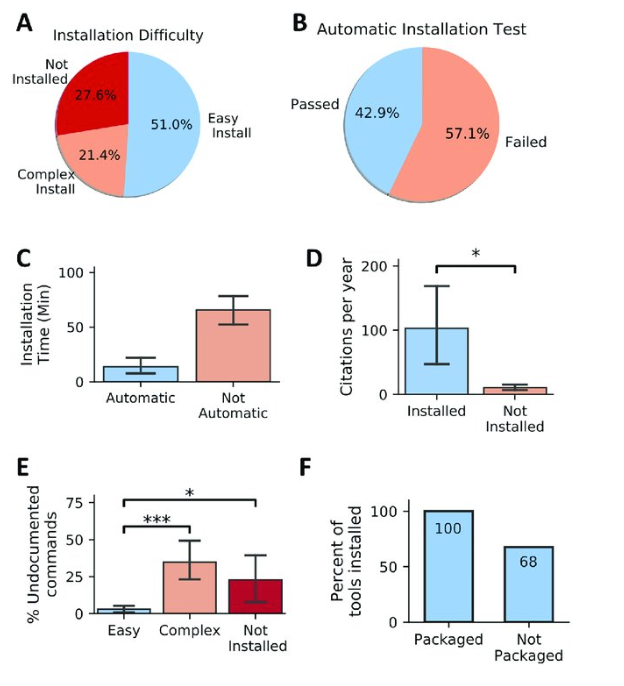
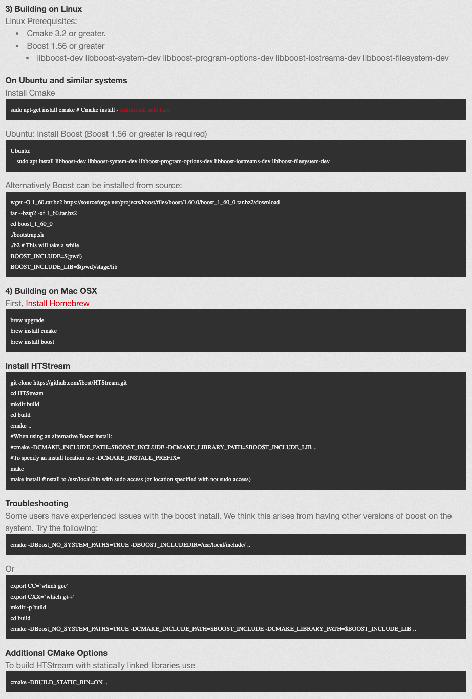

# Controlling Environments with Conda

## What is conda and why do we care about it?
- Conda is a cross platform (Windows, Linux, MacOSx) environment management software. 
- Works for any language, version, and library as specified by the user. 
- Allows for easy control and maintenance of multiple environments with different specifications.
- Allows for software packages and their dependencies to be easily loaded "automatically" via channels such as Bioconda, which specifically hosts a variety of bioinformatics software.  

    

     - Installability of 98 randomly selected published software tools across 22 life-science journals over a span of 15 years. Error bars, where present, indicate SEM. (A) Pie chart showing the percentage of tools with various levels of installability. (B) A pie chart showing the proportion of evaluated tools that required no deviation from the documented installation procedure. (C) Tools that require no manual intervention (pass automatic installation test) exhibit decreased installation time. (D) Tools installed exhibit increased citation per year compared with tools that were not installed (Kruskal-Wallis, p-value = 0.035). (E) Tools that are easy to install include a decreased portion of undocumented commands (Not Installed versus Easy Install: Mann-Whitney U test, p-value = 0.01, Easy Install versus Complex Install: Mann-Whitney U test, p-value = 8.3 × 10 −8 ). (F) Tools available in well-maintained package managers such as Bioconda were always installable, whereas tools not shipped via package managers were prone to problems in 32% of the studied cases. SEM, standard error of the mean. https://doi.org/10.1371/journal.pbio.3000333.g002

## What are some of the main components of the conda CLI?
https://bioconda.github.io/recipes/htstream/README.html

First lets load the module for anaconda. Anaconda is the a set of packages, including conda, typically needed for a given environment.  
```
module load anaconda3
```

Now lets create an environment in a specific path of interest. Here we want to download HTStream a tool for High Throughput Sequencing Read Processing.

[HTSream Homepage](https://ibest.github.io/HTStream/)

[HTStream Bioconda Documentation](https://bioconda.github.io/recipes/htstream/README.html)

```
conda create -p /share/workshop/$USER/htstream
```
   - Type 'y' when prompted
 
 
Some initial conda setup (if you have not already done so)
```
conda init bash
source ~/.bashrc
```
Lets activate the environment that we just created
```
source activate /share/workshop/$USER/htstream
```

Now we should see that the environment at the start of our terminal is set to the path of our newly created environment. 
```
(/home/keithgmitchell/htstream) keithgmitchell@tadpole:$
```

Finally lets modify this environment with a software of interest.
```
conda install -c bioconda htstream
```

Lets see what our environment looks like after running this.

```
conda list
```

<div class="output">
# packages in environment at /home/keithgmitchell/htstream:
#
# Name                    Version                   Build  Channel
_libgcc_mutex             0.1                        main  
blas                      1.0                         mkl  
boost                     1.70.0           py38h9de70de_1    conda-forge
boost-cpp                 1.70.0               ha2d47e9_1    conda-forge
bzip2                     1.0.8                h7b6447c_0  
ca-certificates           2019.11.27                    0  
certifi                   2019.11.28               py38_0  
htstream                  1.1.0                h5ca1c16_0    bioconda
icu                       58.2                 h9c2bf20_1  
intel-openmp              2019.4                      243  
libedit                   3.1.20181209         hc058e9b_0  
libffi                    3.2.1                hd88cf55_4  
libgcc-ng                 9.1.0                hdf63c60_0  
libgfortran-ng            7.3.0                hdf63c60_0  
libstdcxx-ng              9.1.0                hdf63c60_0  
mkl                       2019.4                      243  
mkl-service               2.3.0            py38he904b0f_0  
mkl_fft                   1.0.15           py38ha843d7b_0  
mkl_random                1.1.0            py38h962f231_0  
ncurses                   6.1                  he6710b0_1  
numpy                     1.17.4           py38hc1035e2_0  
numpy-base                1.17.4           py38hde5b4d6_0  
openssl                   1.1.1d               h7b6447c_3  
pip                       19.3.1                   py38_0  
python                    3.8.0                h0371630_2  
readline                  7.0                  h7b6447c_5  
setuptools                42.0.2                   py38_0  
six                       1.13.0                   py38_0  
sqlite                    3.30.1               h7b6447c_0  
tk                        8.6.8                hbc83047_0  
wheel                     0.33.6                   py38_0  
xz                        5.2.4                h14c3975_4  
zlib                      1.2.11               h7b6447c_3  
</div>


### Now lets say we created some software in python/R on top of htstream and we want to be able to distribute the environment to someone else or load if off of the cluster. 

```
conda list -e > htstream_requirments.txt
``` 

### We can now create and distribute our environment by supplying others with the requirements text file. 
*DON'T RUN THIS LINE*
```
conda create --name new_environement --file htstream_requirements.txt -p ~/path_for_new_env
```

## How does this compare with how the software HTStream would typically be installed?

*DON'T RUN THESE LINEs*




Compared to typical installations such as the one shown above, conda installs only requires one command. Conda is quicker, more user friendly, and more commonly results in success. 
    
---
# A few things for your future Conda usage:

<object data="https://docs.conda.io/projects/conda/en/4.6.0/_downloads/52a95608c49671267e40c689e0bc00ca/conda-cheatsheet.pdf" type="application/pdf" width="700px" height="700px">
    <embed src="https://docs.conda.io/projects/conda/en/4.6.0/_downloads/52a95608c49671267e40c689e0bc00ca/conda-cheatsheet.pdf">
        <p>This browser does not support PDFs. Please download the PDF to view it: <a href="http://yoursite.com/the.pdf">Download PDF</a>.</p>
    </embed>
</object>

### When running conda on your own computer you will need to add channels, which is where conda will look when performing package installs

```
conda config --add channels defaults
conda config --add channels bioconda
conda config --add channels conda-forge
```