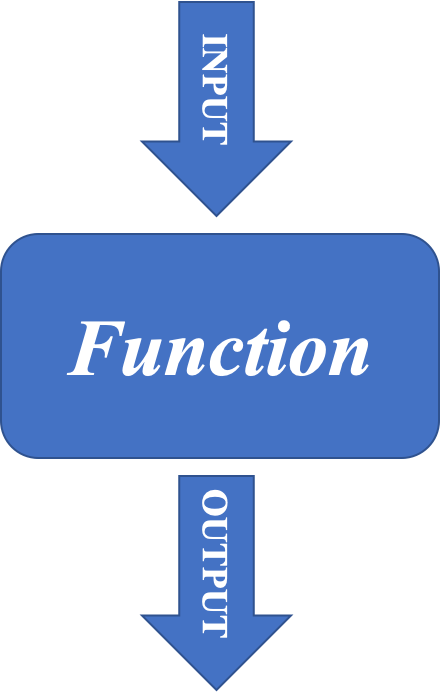

```{css echo=FALSE}
.colsel {
background-color: lightyellow;
}
```

```{r echo=FALSE}
library(knitr)
colFmt = function(x,color){
  outputFormat = opts_knit$get("rmarkdown.pandoc.to")
  if(outputFormat == 'latex')
    paste("\\textcolor{",color,"}{",x,"}",sep="")
  else if(outputFormat == 'html')
    paste("<font color='",color,"'>",x,"</font>",sep="")
  else
    x
}
```


```{r setup, include=FALSE}
knitr::opts_chunk$set(class.source = "colsel")
```

R and RStudio
========================================================

### What is R?
[R](http://r-project.org/) is a language and environment for statistical computing and graphics developed in 1993. It provides a wide variety of statistical and graphical techniques (linear and nonlinear modeling, statistical tests, time series analysis, classification, clustering, ...), and is highly extensible, meaning that the user community can write new R tools. It is a GNU project (Free and Open Source).

The R language has its roots in the S language and environment which was developed at Bell Laboratories (formerly AT&T, now Lucent Technologies) by John Chambers and colleagues. R was created by Ross Ihaka and Robert Gentleman at the University of Auckland, New Zealand, and now, R is developed by the R Development Core Team, of which Chambers is a member. R is named partly after the first names of the first two R authors (Robert Gentleman and Ross Ihaka), and partly as a play on the name of S. R can be considered as a different implementation of S. There are some important differences, but much code written for S runs unaltered under R.

Some of R's strengths:

* The ease with which well-designed publication-quality plots can be produced, including mathematical symbols and formulae where needed. Great care has been taken over the defaults for the minor design choices in graphics, but the user retains full control. Such as examples like the following (extracted from http://web.stanford.edu/class/bios221/book/Chap-Graphics.html):

```{r echo=FALSE, message=FALSE, error=FALSE, out.width="32%", fig.align='default'}
library(knitr)
include_graphics(c("chap3-rgraphics-heatmap-1.png", "chap3-rgraphics-darned1-1.png", "chap3-rgraphics-twodsp4-1.png"))
```

* It compiles and runs on a wide variety of UNIX platforms and similar systems (including FreeBSD and Linux), Windows and MacOS.
* R can be extended (easily) via packages.
* R has its own LaTeX-like documentation format, which is used to supply comprehensive documentation, both on-line in a number of formats and in hardcopy.
* It has a vast community both in academia and in business.
* It's FREE!   

### The R environment
R is an integrated suite of software facilities for data manipulation, calculation and graphical display. It includes

* an effective data handling and storage facility,
* a suite of operators for calculations on arrays, in particular matrices,
* a large, coherent, integrated collection of intermediate tools for data analysis,
* graphical facilities for data analysis and display either on-screen or on hardcopy, and
* a well-developed, and effective programming language which includes conditionals, loops, user-defined recursive functions and input and output facilities.

The term "environment" is intended to characterize it as a fully planned and coherent system, rather than an incremental accretion of very specific and inflexible tools, as is frequently the case with other data analysis software.

R, like S, is designed around a true computer language, and it allows users to add additional functionality by defining new functions. Much of the system is itself written in the R dialect of S, which makes it easy for users to follow the algorithmic choices made. For computationally-intensive tasks, C, C++ and Fortran code can be linked and called at run time. Advanced users can write C code to manipulate R objects directly.

Many users think of R as a statistics system. The R group prefers to think of it of an environment within which statistical techniques are implemented.   

### The R Homepage
The R homepage has a wealth of information on it,

[R-project.org](http://r-project.org/)

On the homepage you can:

* Learn more about R
* Download R
* Get Documentation (official and user supplied)
* Get access to CRAN 'Comprehensive R archival network'

### Interface for R

There are many ways one can interface with R language. Here are a few popular ones:

* [RStudio](https://raw.githubusercontent.com/ucdavis-bioinformatics-training/2019-March-Bioinformatics-Prerequisites/master/wednesday/Intro2R/rstudio.png)
* [RGui](https://raw.githubusercontent.com/ucdavis-bioinformatics-training/2019-March-Bioinformatics-Prerequisites/master/wednesday/Intro2R/rgui.png)
* Jupyter and R notebooks
* text editors, such as vi(m), Emacs...


### RStudio

[RStudio](http://rstudio.com/) started in 2010, to offer R a more full featured integrated development environment (IDE) and modeled after matlab's IDE.

RStudio has many features:

* syntax highlighting
* code completion
* smart indentation
* "Projects"
* workspace browser and data viewer
* embedded plots
* Markdown notebooks, Sweave authoring and knitr with one click pdf or html
* runs on all platforms and over the web
* etc. etc. etc.

RStudio and its team have contributed to many R packages.[13] These include:

* Tidyverse – R packages for data science, including ggplot2, dplyr, tidyr, and purrr
* Shiny – An interactive web technology
* RMarkdown – Insert R code into markdown documents
* knitr – Dynamic reports combining R, TeX, Markdown & HTML
* packrat – Package dependency tool
* devtools – Package development tool

RStudio Cheat Sheets: [rstudio-ide.pdf](https://github.com/rstudio/cheatsheets/raw/master/rstudio-ide.pdf)

---

Programming fundamentals
====================================================


There are three concepts that are essential in any programming language:

* `r colFmt("VARIABLES", 'purple')`

A variable is a named storage. Creating a variable is to reserve some space in memory. In R, the name of a variable can have letters, numbers, dot and underscore. However, a valid variable name cannot start with a underscore or a number, or start with a dot that is followed by a number.


* `r colFmt("FUNCTIONS", 'purple')`

A function is a block of organized, reusable code that is used to perform a set of predefined operations. A function may take zero or more parameters and return a result.

```{r out.width="15%", fig.align='center', echo=FALSE, message=F}

```


The way to use a function in R is:

**function.name(parameter1=value1, ...)**

In R, to get help information on a funciton, one may use the command: 

**?function.name**


* `r colFmt("OPERATIONS", 'purple')`

```{r echo=FALSE, results= 'asis'}
library(knitr)
library(kableExtra)
kable(data.frame(Operator=paste("<-", " =", sep=","), Description="Assignment", stringsAsFactors=F), align='c', caption="Assignment Operators in R") %>% kable_styling(bootstrap_options="striped", full_width=F, position="center")

kable(data.frame(Operator=c("+", "-", "*", "/", "^", "%%", "%/%"), Description=c("Addition", "Subtraction", "Multiplication", "Division", "Exponent", "Modulus", "Integer Division"), stringsAsFactors=F), align='c', caption="Arithmetic Operators in R") %>% kable_styling(bootstrap_options="striped", full_width=F, position="center")

kable(data.frame(Operator=c("<", ">", "<=", ">=", "==", "!="), Description=c("Less than", "Greater than", "Less than or equal to", "Greater than or equal to", "Equal to", "Not equal to"), stringsAsFactors=F), align='c', caption="Relational Operators in R") %>% kable_styling(bootstrap_options="striped", full_width=F, position="center")

kable(data.frame(Operator=c("!", "&", "&&", "|", "||"), Description=c("Logical NOT", "Element-wise logical AND", "Logical AND", "Element-wise logical OR", "Logical OR"), stringsAsFactors=F), align='c', caption="Logical Operators in R") %>% kable_styling(bootstrap_options="striped", full_width=F, position="center")
```

<P style="page-break-before: always">


```{r, echo=FALSE}
htmltools::includeHTML("embed.html")
```


